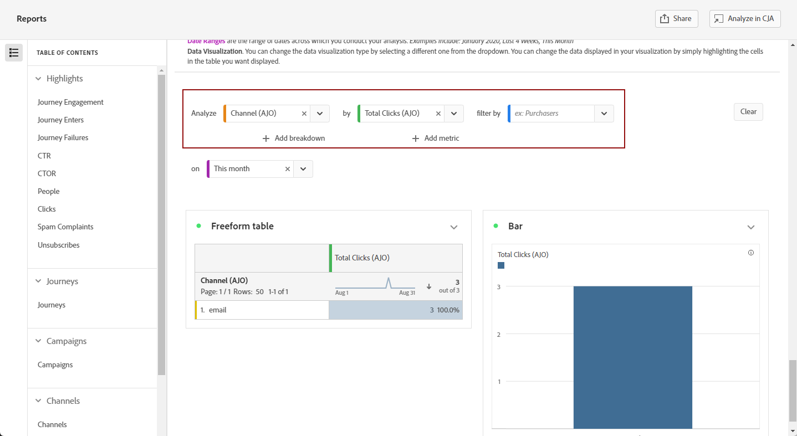

# Manage your reports {#channel-cja-manage}

## Analyze in Customer Journey Analytics {#analyze}

Enhance your data analysis experience with your **[!DNL Customer Journey Analytics]** license by leveraging the **[!UICONTROL Analyze in CJA]** feature available in all reports.

This powerful option seamlessly redirects you to your **[!DNL Customer Journey Analytics]** environment, empowering you to personalize your reports extensively. You can enrich your widgets with specialized Customer Journey Analytics metrics, taking your insights to a whole new level.

[Learn more on the Customer Journey Analytics interface.](https://experienceleague.adobe.com/en/docs/analytics-platform/using/cja-overview/cja-getting-started)

## Define the report period {#report-period}

When accessing a report, you can apply a time period filter, located at the top right corner of the report.

By default, the filter period for a campaign or journey is set to its start and end dates. If there is no end date, the filter will default to the current date.

To modify the filter, you can select a custom start date and duration, or choose from preset options such as last week or two months ago.

The report will automatically update once the filter is applied or modified.

## Export your reports {#export-reports}

You can easily export your different reports to PDF or CSV formats, which enables you to share or print them. Steps to export reports are detailed in the tabs below.

>[!BEGINTABS]

>[!TAB Export your report as a CSV file]

1. From your report, click **[!UICONTROL Export]** and select **[!UICONTROL CSV file]** to generate a CSV file at overall report-level. 

   

1. Your file is automatically downloaded and can be located in your local files.

    If you generated the file at the report level, it contains detailed information for each widget, including its title and data.

>[!TAB Export your report as a PDF file]

1. From your report, click **[!UICONTROL Export]** and select **[!UICONTROL PDF file]**.

   

1. After download has been requested, click **[!UICONTROL Download]**.

   

1. Your file will automatically open in your browser.

Your report is now available to view, download or share in a pdf file.

>[!ENDTABS]

## Create a simple metric {#create-simple-metric}

You can create custom calculated metrics directly within your reports. You can generate more tailored insights and better analyze your data by combining two existing metrics in ways that suit your specific reporting needs.

1. Start by accessing the report where you want to add a new metric.

1. In the table within your report, select the metrics you want by holding down the `Shift` or `CTRL/CMD` keys while clicking on them. Then, right-click and select **[!UICONTROL Create metric from selection]**.

   If you select more than two metrics, only the first two will be used in the metric builder.

   

1. From the Calculated metric builder, name your new metric by typing in the **[!UICONTROL Title]** field. You can also add a **[!UICONTROL Description]**.
   
   >[!NOTE]
   >
   >If you own Customer Journey Analytics, you can further personalize your metrics with additional options. [Learn more](https://experienceleague.adobe.com/en/docs/analytics-platform/using/cja-components/cja-calcmetrics/cm-workflow/cm-build-metrics#areas-of-the-calculated-metrics-builder)

1. Choose the appropriate **[!UICONTROL Decimal Places]** and select a **[!UICONTROL Format]** (Decimal, Time, Percent, or Currency) based on how you want your metric to be displayed. 

1. Select the operator, such as addition, subtraction, multiplication, or division, that will determine how the metric is calculated.

   

1. You can reorder the components if needed.

1. When you're satisfied with your settings, click **[!UICONTROL Apply]** to finalize your new metric.

1. Your new metric will appear next to the original metrics in your report.

   

Your newly created metric will be included when you export the report as a PDF or CSV. However, it will be removed from the report once you exit it.

## Explore data with the Exploratory Analysis {#exploratory}

Use the Exploratory Analysis tool to easily create tables and visualizations from your selected **[!UICONTROL Dimensions]** and **[!UICONTROL Metrics]**. This tool streamlines data exploration, allowing you to automatically customize and analyze information with ease. Learn more in [this documentation](https://experienceleague.adobe.com/en/docs/analytics/analyze/analysis-workspace/panels/quickinsight).

1. Start by accessing the report where you want to use the Exploratory Analysis.

1. Select the Exploratory Analysis menu from the left-rail menu.

   

1. Build a query by choosing a **[!UICONTROL Dimension]** and a **[!UICONTROL Metric]** using the drop-down menus. You can also select a **[!UICONTROL Segment]** if needed.

   

1. Define the date range for your analysis to specify the period you wish to focus on. By default, the date range will be set to the one used in the report panel.

1. Use the **[!UICONTROL Add breakdown]** or **[!UICONTROL Add metric]** options to include additional dimensions, allowing for a more detailed data breakdown.

    Note that you can only add up to three **[!UICONTROL Dimensions]**, **[!UICONTROL Metrics]** and **[!UICONTROL Segments]**.

You can now analyze your data using your customized table and visualization tools.

<!--## Create a down-funnel metric {#down-funnel}

1. Create a new journey or open an existing one. [Learn more on journey creation](../building-journeys/journey-gs.md)

1. On the canvas editor, select the option to "add a metric".

c. In the metric selector, choose whichever conversion metric seems appropriate and publish your journey

d. Open the report for the journey that you added the metric to and ensure that the metric has been added to the table alongside all the other pre-configured metrics.
-->

## Create an Audience from reporting data {#create-audience}

>[!IMPORTANT]
>
>Each organization is limited to publishing 25 audiences. Additionally, users can publish a maximum of 5 audiences per hour and 20 per day.
> One-time audiences have a lifespan of 48 hours. Therefore, if 25 audiences are published within that timeframe, additional audiences can only be published once the 48-hour period has elapsed.

You can now select specific data within the table and directly create an audience from these selections, streamlining and simplifying the audience creation process.

1. Begin by navigating to the report table that contains the data you wish to transform into an audience.

1. Right-click on the desired cell and select **[!UICONTROL Create audience]**.

   Alternatively, you can start audience creation from the **[!UICONTROL Journey canvas]** widget by selecting a node and right-clicking it.

1. In the **[!UICONTROL Create audience]** window, enter a **[!UICONTROL Name]** and set a **[!UICONTROL One-time date range]** for the audience you plan to publish.

   >[!NOTE]
   >
   >If you own Customer Journey Analytics, you can further personalize your metrics with additional options. [Learn more](https://experienceleague.adobe.com/en/docs/analytics-platform/using/cja-components/audiences/publish)
   
   

1. Click the **[!UICONTROL Create]** button to finalize the audience creation. Note that this process may require some time to complete.

You can now proceed to use the newly created audience with a Journey or Campaign.

