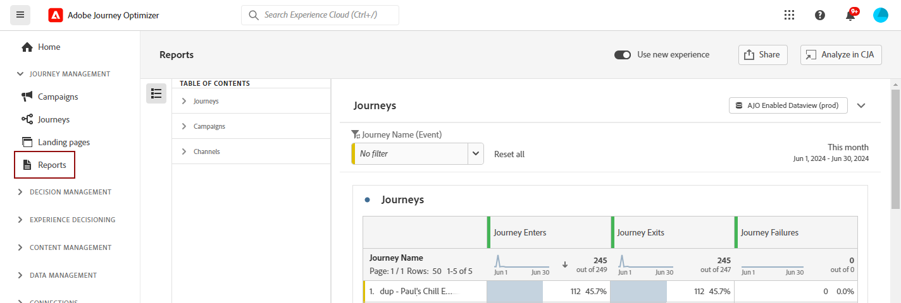

# Get started with new Reporting interface {#channel-report-gs-cja}

>[!NOTE]
>
> To revert to Journey Optimizer's traditional reporting, simply toggle the **[!UICONTROL Use new Experience]** option.

Journey Optimizer reporting is now fully integrated with Customer Journey Analytics capabilities, standardizing reporting across both platforms and improving data consistency and reliability. This seamless integration between Journey Optimizer and Customer Journey Analytics provides a clearer view of performance metrics, enabling users to make more informed decisions.

* If you want to target a journey or deliveries in the context of a journey, from the **[!UICONTROL Journeys]** menu, access your journey and click the **[!UICONTROL View report]** button. 

    From the list of existing journey, you can also select **[!UICONTROL Report]** from the advanced menu of your selected journey. [Learn more on the Journey report](journey-global-report-cja.md)

    

* If you want to target a campaign, from the **[!UICONTROL Campaigns]** menu, access your campaign and click the **[!UICONTROL Reports]** button.

    From the list of existing campaigns, you can also select **[!UICONTROL Report]** from the advanced menu of your selected campaign. [Learn more on the Campaign report](campaign-global-report-cja.md)

    

* If you want to target metrics for all campaigns and journeys within your environment, access the **Overview** report by navigating to the **[!UICONTROL Reports]** menu within the **[!UICONTROL Journey Management]** section. [Learn more on the Overview report](channel-report-cja.md)

    

## Prerequisites {#prerequisites}

* If you do **not** own Customer Journey Analytics, or if you own it but do **not** have access to any Customer Journey Analytics product profile, permissions are managed in Journey Optimizer. In this case, you will only need the **[!UICONTROL View channel reports]** permission or related roles. [Learn more on Journey Optimizer permissions](../administration/permissions.md)
* If you own Customer Journey Analytics and have access to a Customer Journey Analytics product profile, then standard Customer Journey Analytics permissions apply. The Customer Journey Analytics administrator is responsible for maintaining proper user access. [Learn more on Customer Journey Analytics permissions](https://experienceleague.adobe.com/en/docs/analytics-platform/using/technotes/access-control)
* Your Customer Journey Analytics dataviews need to be configured with the following setting: **Set as default data view in Adobe Journey Optimizer**. [Learn more on data views](https://experienceleague.adobe.com/en/docs/analytics-platform/using/cja-dataviews/create-dataview)
* To access the Customer Journey Analytics dashboard within Journey Optimizer, just enable the **[!UICONTROL Use new Experience]** toggle in your report.

    

