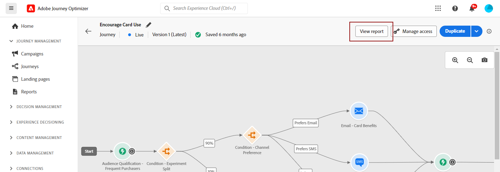
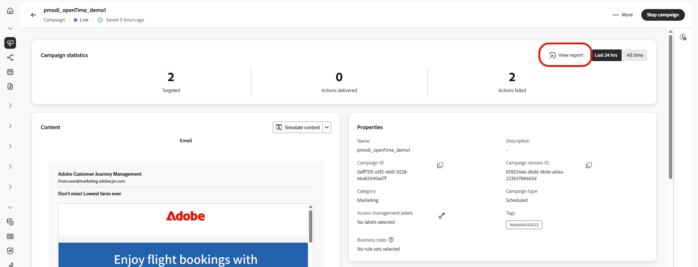

# Get started with all time report {#channel-report-gs-cja}

>[!CONTEXTUALHELP]
>id="cja_connections_enable_cja"
>title="Enable Customer Journey Analytics"
>abstract="To analyze this report in Customer Journey Analytics, contact your administrator to make sure your organization has purchased Customer Journey Analytics and that the integration is properly configured."
>additional-url="https://experienceleague.adobe.com/en/docs/journey-optimizer/using/channels/email/design-email/add-content/content-components#add-content-components" text="Customer Journey Analytics"

Journey Optimizer reporting comes with an improved interoperability with Customer Journey Analytics capabilities, standardizing reporting across both platforms and improving data consistency and reliability. This seamless integration between Journey Optimizer and Customer Journey Analytics provides a clearer view of performance metrics, enabling users to make more informed decisions.

Access to these reporting capabilities depends on the context and product areas: 

* **Journeys** - If you want to target a journey or deliveries in the context of a journey, from the **[!UICONTROL Journeys]** menu, access your journey and click the **[!UICONTROL View report]** button. 

    From the list of existing journey, you can also select **[!UICONTROL Report]** from the advanced menu of your selected journey. [Learn more about the Journey report](journey-global-report-cja.md)

    

* **Campaigns** - If you want to target a campaign, from the **[!UICONTROL Campaigns]** menu, access your campaign and click the **[!UICONTROL Reports]** button then **[!UICONTROL View all time report]**.

    From the list of existing campaigns, you can also select **[!UICONTROL Report]** from the advanced menu of your selected campaign. [Learn more about the Campaign report](campaign-global-report-cja.md)

    

* **Global** - If you want to target metrics for all campaigns and journeys within your environment, access the **Overview** report by navigating to the **[!UICONTROL Reports]** menu within the **[!UICONTROL Journey Management]** section. [Learn more about the Overview report](channel-report-cja.md)

    

>[!IMPORTANT]
>
>Reporting in Adobe Journey Optimizer is currently standardized to UTC. The ability to customize the reporting timezone will be introduced in a future release.

## Prerequisites {#prerequisites}

* If you do **not** own Customer Journey Analytics, or if you own it but do **not** have access to any Customer Journey Analytics product profile, permissions are managed in Journey Optimizer. In this case, you need the **[!UICONTROL View channel reports]** permission or related roles. [Learn more](../administration/permissions.md)

* If you **own** Customer Journey Analytics and have access to a Customer Journey Analytics product profile, you need:

    * **[!UICONTROL Audience Creation]** and **[!UICONTROL Audience View]** permissions for Customer Journey Analytics. [Learn more](https://experienceleague.adobe.com/en/docs/analytics-platform/using/technotes/access-control){target="_blank"}

    * **[!UICONTROL Manage profiles]** permission for Adobe Journey Optimizer. [Learn more](../administration/permissions.md)

* Your Customer Journey Analytics dataviews need to be configured with the following setting: **Set as default data view in Adobe Journey Optimizer**. [Learn more about data views](https://experienceleague.adobe.com/en/docs/analytics-platform/using/cja-dataviews/create-dataview){target="_blank"}

## All time reports per channel

All time global reports are available for all your channels. Select the report for the channel you need to get more details.

### Outbound channels

Select an outbound channel to discover associated **global all-time reports**.

<table style="table-layout:fixed"><tr style="border: 0;">
<td>

<strong>Email channel</strong>

<a href="campaign-global-report-cja-email.md"><strong>Campaign report</strong></a>

<a href="journey-global-report-cja-email.md"><strong>Journey report</strong></a>

</td>
<td>

<strong>SMS channel</strong>

<a href="campaign-global-report-cja-sms.md"><strong>Campaign report</strong></a>

<a href="journey-global-report-cja-sms.md"><strong>Journey report</strong></a>

</td>
<td>

<strong>Push channel</strong>

<a href="campaign-global-report-cja-push.md"><strong>Campaign report</strong></a>

<a href="journey-global-report-cja-push.md"><strong>Journey report</strong></a>

</td>
<td>

<strong>Direct mail channel</strong>

<a href="campaign-global-report-cja-direct.md"><strong>Campaign report</strong></a>

<a href="journey-global-report-cja-direct.md"><strong>Journey report</strong></a>

</td>
</tr></table>

### Inbound experiences

Select an inbound experience to discover associated **global all-time reports**.

<table style="table-layout:fixed"><tr style="border: 0;">
<td>

<strong>In-app channel</strong>

<a href="campaign-global-report-cja-inapp.md"><strong>Campaign report</strong></a>

<a href="journey-global-report-cja-inapp.md"><strong>Journey report</strong></a>

</td>
<td>

<strong>Web channel</strong>

<a href="campaign-global-report-cja-web.md"><strong>Campaign report</strong></a>

<a href="journey-global-report-cja-web.md"><strong>Journey report</strong></a>

</td>
<td>

<strong>Code-based experiences</strong>

<a href="campaign-global-report-cja-code.md"><strong>Campaign report</strong></a>

<a href="campaign-global-report-cja-code.md"><strong>Journey report</strong></a>

</td>
<td>

<strong>Content cards</strong>

<a href="campaign-global-report-cja-content.md"><strong>Campaign report</strong></a>

<a href="journey-global-report-cja-content.md"><strong>Journey report</strong></a>

</td>
</tr></table>

## How-to video{#video}

The video below shows how to use the enhanced Journey Optimizer reporting with Customer Journey Analytics.

>[!VIDEO](https://video.tv.adobe.com/v/3430413)