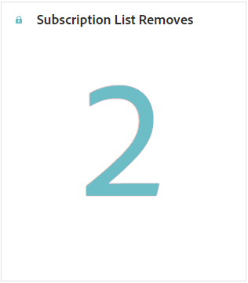

# Subscription report {#subscription-report-global-cja}

The **Subscription report** offers essential insights into profiles' subscriptions and unsubscriptions associated with particular lists, helping you understand the effectiveness of different subscription campaigns and initiatives in driving engagement and conversions.

To access your reports, click the **[!UICONTROL Report]** icon of your selected subscription list from the advanced menu.

To learn more on Customer Journey Analytics workspace and how to filter and analyze data, refer to [this page](https://experienceleague.adobe.com/en/docs/analytics-platform/using/cja-workspace/home).

## Subscription list adds

The **[!UICONTROL Subscription list adds]** KPI provides a comprehensive overview of the total number of subscriptions acquired during the specified period. This metric highlights the growth and acquisition of new subscribers, offering valuable insights into the effectiveness of your subscription campaigns or initiatives.

## Subscription list removes

The **[!UICONTROL Subscription list removes]** KPI provides a breakdown of the total number of unsubscriptions that occurred during the specified period. This metric offers valuable insights into subscriber disengagement.

## Subscription growth over time

The **[!UICONTROL Subscription growth over time]** graph visually depicts the progression of subscriptions over the specified period, providing a clear understanding of how your subscriber base has evolved.

* **[!UICONTROL Subscription list adds]**: Total number of subscriptions for the concerned period.

* **[!UICONTROL Subscription list removes]**: Total number of unsubscriptions for the concerned period.

* **[!UICONTROL Subscription list growth]**: Rate at which the subscriber list is growing over a specific period of time.

## Subscription lists

The **[!UICONTROL Subscription lists]** table provides essential insights into your profiles' subscriptions and unsubscriptions that are associated with particular subscription lists. This information helps you understand the effectiveness of different subscription lists in driving engagement and conversions.

* **[!UICONTROL Subscription list adds]**: Total number of subscriptions for the concerned period.

* **[!UICONTROL Subscription list removes]**: Total number of unsubscriptions for the concerned period.

## Journeys

The **[!UICONTROL Journey]** table offers an extensive view, presenting intricate details of your visitors' subscriptions as part of their user journey.

* **[!UICONTROL Subscription list adds]**: Total number of subscriptions for the concerned period.

* **[!UICONTROL Subscription list removes]**: Total number of unsubscriptions for the concerned period.

## Campaigns 

The **[!UICONTROL Campaigns]** table offers valuable insights into your profiles' subscriptions and unsubscriptions triggered by specific campaigns. This comprehensive view enables you to gauge the effectiveness of your campaigns and track engagement with your landing page content effectively.

* **[!UICONTROL Subscription list adds]**: Total number of subscriptions for the concerned period.

* **[!UICONTROL Subscription list removes]**: Total number of unsubscriptions for the concerned period.

## Channel

The **[!UICONTROL Channel]** table displays the number of profiles subscriptions and unsubscriptions categorized by each channel.

* **[!UICONTROL Subscription list adds]**: Total number of subscriptions for the concerned period.

* **[!UICONTROL Subscription list removes]**: Total number of unsubscriptions for the concerned period.
