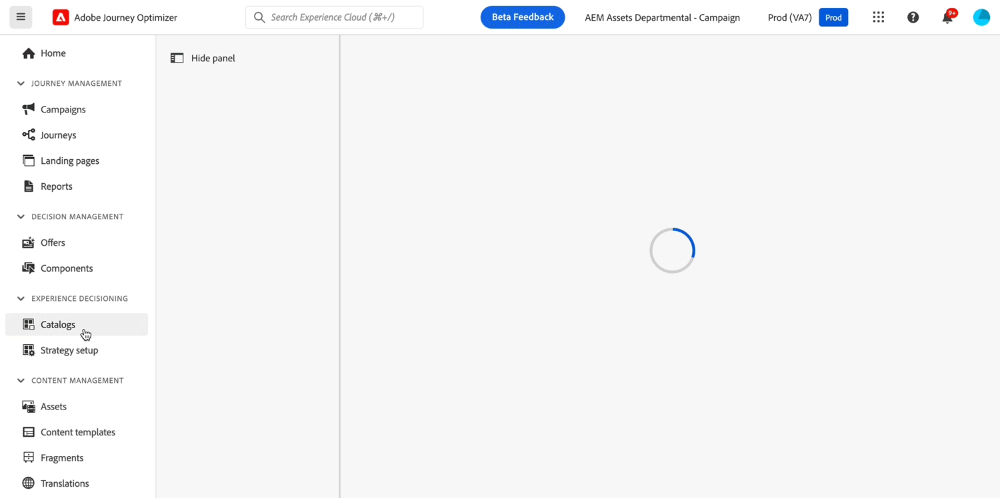

# Early release notes {#e-release-notes}

[!DNL Adobe Journey Optimizer] continuously delivers new features, enhancements to existing features, and bug fixes. All changes are consolidated at the end of each month in the [release notes](release-notes.md). 

Early release notes below are subject to change without prior notice until the release availability date. Links, screens and updated documentation are published in the [release notes](release-notes.md), at the release date.

## May 2024 early release notes {#e-2024}

**Release date**: May 21-22, 2024

### New capabilities {#e-features}

This release brings the new capabilities detailed below.

<table>
<thead>
<tr>
<th><strong>Experience Decisioning - Limited Availability</strong> </th>
</tr>
</thead>
<tbody>
<tr>
<td>

Experience Decisioning simplifies personalization by offering a centralized catalog of marketing offers known as 'decision items' and a sophisticated decision engine. This engine leverages rules and ranking criteria to select and present the most relevant decision items to each individual.

These decision items are seamlessly integrated into a wide range of inbound surfaces through the new code-based experience channel, now accessible within Journey Optimizer campaigns. Experience Decisioning decision policies are available for use in code-based experience campaigns only.

Experience Decisioning is currently only available for a set of organizations (Limited Availability). To gain access, contact your Adobe representative.

For more information, refer to the <a href="../experience-decisioning/gs-experience-decisioning.md">detailed documentation</a>.

</td>
</tr>
</tbody>
</table>

<table>
<thead>
<tr>
<th><strong>IP Warmup Workflow</strong> </th>
</tr>
</thead>
<tbody>
<tr>
<td>

If you are sending email on a brand new IP address, you can now easily perform IP warmup workflows directly from the user interface. Adobe Journey Optimizer offers a standardized and efficient way to warm up your IP adresses that follows the best practices for optimal deliverability.

For more information, refer to the <a href="../configuration/ip-warmup-gs.md">detailed documentation</a>.

</td>
</tr>
</tbody>
</table>

<table>
<thead>
<tr>
<th><strong>Business rules - Beta</strong> </th>
</tr>
</thead>
<tbody>
<tr>
<td>

You can now create granular frequency capping rules and apply them to different types of marketing communications through rule sets. 

</td>
</tr>
</tbody>
</table>

<table>
<thead>
<tr>
<th><strong>Extended personalization data - Beta</strong> </th>
</tr>
</thead>
<tbody>
<tr>
<td>

You can now lookup and fetch data values within Adobe Experience Platform datasets, and use these values to build conditions in Adobe Journey Optimizer. You can leverage data from a lookup dataset when a relationship has been defined using an attribute inside of an array of objects. The lookup values will be available in your journeys' conditions, custom actions, and in message personalization.

</td>
</tr>
</tbody>
</table>

### Improvements {#e-improvements}

This release comes with the improvements listed below.

**Experience Decisioning**

From beta to LA, the following improvements have been added:

* **Experience Decisioning + Code-based experiences (LA)**: You can now leverage the Experience decisioning feature to use decision items in your code-based campaigns. Note: The Code-based experience channel and Experience decisioning are not available for organizations that have purchased the Adobe Healthcare Shield and Privacy and Security Shield add-on offerings. [Read more](../code-based/get-started-code-based.md)
* You can now leverage context data from Adobe Experience Platform in your decision rules and rankign formulas. [Read more](../experience-decisioning/context-data.md)
* A new "Manage Experience decisions" permission is now available for the Decision Management resource. It allows you to manage rights related to Experience Decisioning. [Read more](../experience-decisioning/gs-experience-decisioning.md)
* You can now add multiple capping rules for a given decision item in Experience Decisioning. This allows you to increase the level of control over the way offers are sent. [Read more](../experience-decisioning/items.md#capping)
* You can now create custom reporting dashboards of Experience Decisioning campaigns using [!DNL Customer Journey Analytics]. [Read more](../experience-decisioning/cja-reporting.md)

**Offer Decisioning**

* **Multi-rule support** - You can now add up to 10 capping rules for a given offer in Decision Management. This allows you to increase the level of control over the way offers are sent.
* **Audits** - The **Change log** tab allowing you to see all the changes that have been made to an offer or a decision has been removed. Changes related to offers and decisions can now be seen in the **Audits** menu. 

**Email channel**

* **List-unsubscribe** - Following on the recent Gmail and Yahoo announcements for bulk senders, Journey Optimizer supports the "post/1-click" List-Unsubscribe option.
* **Spam scoring** - You can now check your content spam scoring in a dedicated Spam report. Using SpamAssassin, Adobe Journey Optimizer can now test your email content and give it a score to indicate if ISP providers will considered it as a spam or not. [Read more](../content-management/spam-report.md)

**Audiences**

* The use of audiences and attributes from audience composition and custom upload (CSV file) is now available for use with Healthcare Shield or Privacy and Security Shield.

**Personalization**

* **Expression fragment** - Expression fragments are now available for the **In-app channel**. [Read more](../personalization/use-expression-fragments.md)

**Journeys**

* **Merge policies** - Merge policies can now be configured and used in your journeys.
* **mTLS support** - The mTLS protocol is now supported in Journey Optimizer APIs and custom actions.
* **Lookup tables in events** - You can now leverage data from a lookup dataset when a relationship has been defined using an attribute inside of an array of objects. The lookup values will be available in journeys (conditions, custom actions, etc.) and message personalization.
