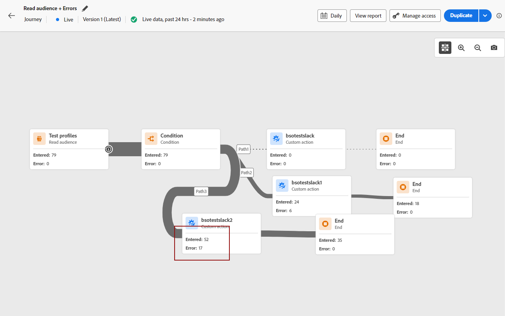

# Welcome to the Improved Journey Designer {#new-canvas}

>[!CONTEXTUALHELP]
>id="ajo_new_canvas"
>title="What's new?"
>abstract="New canvas"

Welcome to the improved journey designer!

We have developed a **simplified journey model** that aims to improve internal processes. Although this new model is a backend improvement, our team took the opportunity to add features that are visible and beneficial to Journey Optimizer users:

* A **re-designed journey canvas** made for a modernized UI experience
* A **live reporting** UI directly available in the journey canvas

>[!AVAILABILITY]
>
>Be aware that the rollout for this feature will be progressive. You might not see the changes right away.

## Updates on the journey model

The new journey model will live alongside the existing one, meaning that there will be journeys using **two different models**:

* The old one, called "v1"
* And the new one, called "v2"

All journeys in v1 will stay in v1. You will still be able to edit, test or publish them. Any new version created from a v1 will also stay in v1. There are **no functional changes** around v1 journeys.

As you see in the below screenshot, the nodes are round-shaped, which is the old UI for journeys on the v1 model.

However, when you c**reate a new journey** or **duplicate an existing one**, it will be a v2 journey.  We plan on continuing to support v1 journeys until a majority of customers are transitioned to v2 journeys.

There is one limitation to the new journey model; it will **not be possible to copy and paste activities from a v1 journey to a v2 and vice versa**. If you want to do this, we advise you to duplicate your v1 journey to make it a v2 and then copy your activities.

In the below screenshot, you can see the redesigned UI for the journey canvas (only available with the v2 model):

**Any new feature added to the journey designer (including live reporting) will only be available for v2 journeys from this point forward.**

## Improved journey canvas design

With the new journey model we're introducing a new-and-improved **journey canvas UI**, which fits seamlessly within the Adobe Experience Cloud solutions & app ecosystem, making for an intuitive and efficient user experience. Any journey in the v2 stack will be on that new design.

Activities will now be represented by square boxes with the following capabilities:

* The first line representing the activity type which will often be overwritten by more contextual information (eg: on Read Audiences, it will contain the name of the selected audience), or by a custom label if you define one. 
* The second line always representing the activity type.

This new UI improves the readability of the journey canvas by providing **clearer activity labels and types**.

It also allows the product team to add more information on the canvas with fewer clicks. One example of "more information" would be the inclusion of live reporting in the journey canvas, where you can see profiles entering and exiting your activities because of errors. 

## Live reporting in the journey canvas

Alongside the improved journey canvas design, we're introducing the ability to see **last 24 hours reporting metrics** (called "live reporting") directly in the journey canvas.

With every live journey on the new model, you will be able to see, **on each activity**, the number of profiles who entered that activity and the number who exited because of an error:

<!--`
With every live journey on the new model, you will be able to see two types of "last 24 hours" reporting information:

* On a **new insert**, you will see:
    * The number of profiles that have been exported for audience-triggered journeys. You will see the number of profiles available in the last export job alongside the time when that export has been made.
    * The number of profiles who exited the journey
    * The percentage of errors
    
* **On each activity**, you will see the number of profiles who entered that activity and the number who exited because of an error:
    
-->

The user interface is automatically refreshed every minute.

<!--
Please note that you may see differences between the number of exported profiles and the number of profiles flowing through the journey. The exported profiles count only provides information about the last export job being made while the number of profiles entering an activity only contains profiles who did it in the last 24 hours. This can especially be visible on recurring daily journeys as there could be a data overlap between two days.
-->
