# Release Notes 2025 {#release-notes-2025}

This page lists all the features and improvements for [!DNL Journey Optimizer] released in 2025. 

## October '25 release notes {#25-10-rn}

### New capabilities {#oct-25-10-features}

<table>
<thead>
<tr>
<th><strong>Image to HTML converter</strong> </th>
</tr>
</thead>
<tbody>
<tr>
<td>

The image to HTML converter is an AI-powered feature that converts static image designs into fully customizable, modular HTML email content templates. This no-code tool enables marketers to transform visual designs into responsive, editable email templates without requiring technical expertise—perfect for platform migration, rapid template creation, and building reusable template libraries.

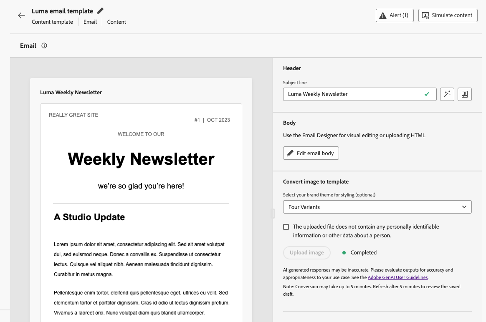

This capability is available in Limited Availability. Contact your Adobe representative to gain access.

For more information, refer to the <a href="../content-management/image-to-html.md">detailed documentation</a>.

Availability date: Oct 30, 2025

</td>
</tr>
</tbody>
</table>

<table>
<thead>
<tr>
<th><strong>Custom action monitoring and reporting</strong> </th>
</tr>
</thead>
<tbody>
<tr>
<td>

This capability provides better visibility into custom action endpoint health and performance. A new custom action monitoring dashboard and corresponding fields in journey step event dataset will help you monitor successful calls, errors, throughput, response time and queue waiting time for your custom action endpoints. You can now quickly understand when, where, and why an anomalous situation is occurring in a custom action.

This capability is currently in Limited Availability for customers.

For more information, refer to the <a href="../action/reporting.md">detailed documentation</a>.

Availability date: October 28, 2025

</td>
</tr>
</tbody>
</table>

<table>
<thead>
<tr>
<th><strong>Landing page custom forms</strong> </th>
</tr>
</thead>
<tbody>
<tr>
<td>

With [!DNL Journey Optimizer], you can now capture profile attributes though your landing pages.

Create, design and manage custom forms tailored to your needs based on a specific dataset. You can then leverage these forms in landing pages to add the profile attributes of your choice into the dataset defined for each form.

This capability is currently in Limited Availability for customers in the United States and Australia. Contact your Adobe representative to gain access.

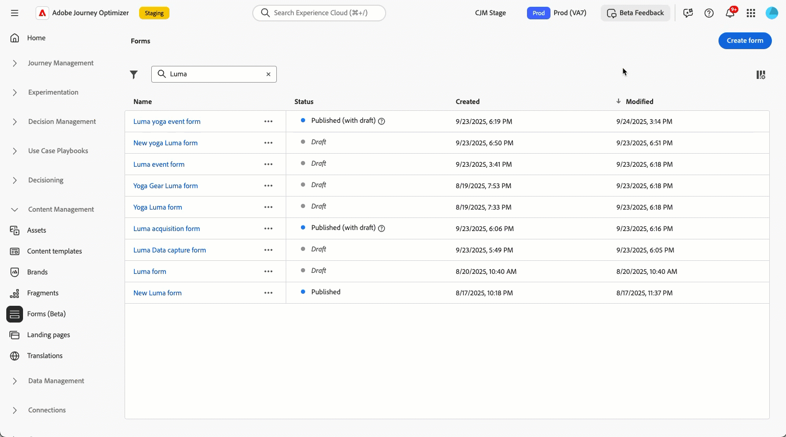

For more information, refer to the <a href="../landing-pages/lp-forms.md">detailed documentation</a>.

Availability date: October 23, 2025

</td>
</tr>
</tbody>
</table>

<table>
<thead>
<tr>
<th><strong>Quiet Hours / Time Based Exclusions</strong> </th>
</tr>
</thead>
<tbody>
<tr>
<td>

Quiet hours let you define time-based exclusions for Email, SMS, Push, and WhatsApp channels. They ensure that no messages are sent during specific periods of time, helping you respect customer preferences and compliance requirements.

You can apply quiet hours through rule sets, which can be assigned to individual actions in campaigns or journeys for precise control.

Quiet hours rules are currently only available for a set of organizations (Limited Availability).  They will be progressively available to all customers in future releases.

For more information, refer to the <a href="../conflict-prioritization/quiet-hours.md">detailed documentation</a>.

Availability date: October 22, 2025

</td>
</tr>
</tbody>
</table>

<!--table>
<thead>
<tr>
<th><strong>RCS Basic Messaging</strong> </th>
</tr>
</thead>
<tbody>
<tr>
<td>

With the new RCS Basic add-on offering, you can now deliver basic Rich Communication Services (RCS) messaging in Journey Optimizer, enabling the following enhanced messaging capabilities subject to provider and geographical support:

<ul>
<li><strong>Branded and verified sender support:</strong> Send messages using verified business profiles with branding elements (logo, sender name, etc.).</li>
<li><strong>Message delivery insights:</strong> Receive detailed delivery reports including message status updates (e.g., sent, delivered, read).</li>
<li><strong>Link tracking:</strong> Embed and track URLs within RCS messages for engagement analytics.</li>
<li><strong>Fallback to SMS:</strong> Automatic fallback to SMS when the recipient's device does not support RCS or is temporarily unreachable via RCS.</li>
<li><strong>Basic message composition:</strong> Send basic text-based RCS messages.</li>
</ul>
<!--img src="assets/do-not-localize/FILE.gif"-->
<!-- p>For more information, refer to the <a href="../FILE.md">detailed documentation</a>.

<!--/td>
</tr>
</tbody>
</table-->

<!--table>
<thead>
<tr>
<th><strong>Direct mail channel in Orchestrated campaigns</strong> </th>
</tr>
</thead>
<tbody>
<tr>
<td>

Direct mail channel is now available in orchestrated campaigns. The Direct mail activity facilitates direct mail sending within your Orchestrated campaign, for both one-time and recurring messages. It serves to automate the process of generating the extraction file required by direct mail providers. You can combine channel activities into the Orchestrated campaign canvas to create cross-channel campaigns that can trigger actions based on customer behavior and data.

<!--img src="assets/do-not-localize/FILE.gif"-->
<!-- p>For more information, refer to the <a href="../FILE.md">detailed documentation</a>.

<!--/td>
</tr>
</tbody>
</table-->

<!--table>
<thead>
<tr>
<th><strong>Direct Mail channel in journeys</strong> </th>
</tr>
</thead>
<tbody>
<tr>
<td>

Previously limited to Campaigns, Direct Mail channel is now available on the journey canvas, enabling you to incorporate Direct Mail into your journeys. Direct Mail can now be used in both batch and 1:1 journey scenarios, with support for file extraction configuration and time-based frequency settings.

 Previously released in Limited Availability, this capability is now available to all environments (General Availability).

<!--img src="assets/do-not-localize/FILE.gif"-->
<!-- p>For more information, refer to the <a href="../FILE.md">detailed documentation</a>.

<!--/td>
</tr>
</tbody>
</table-->

<!--<table>
<thead>
<tr>
<th><strong>New source connectors for loyalty apps</strong> </th>
</tr>
</thead>
<tbody>
<tr>
<td>

New source connectors are now available in Adobe Experience Platform for the Talon.One, Capillary and Kobie loyalty Apps. These connectors let you seamlessly stream loyalty data into Adobe Experience Platform and leverage these data in Journey Optimizer.

For more information, refer to the <a href="../start/get-started-sources.md">detailed documentation</a>.

Availability date: October 22, 2025

</td>
</tr>
</tbody>
</table>-->

<!--table>
<thead>
<tr>
<th><strong>Decisioning support in email channel</strong> </th>
</tr>
</thead>
<tbody>
<tr>
<td>

You can now add Decision policies into email journeys and campaigns. Decision policies are containers for your offers that leverage the Decisioning engine to dynamically return the best content to deliver for each audience member.

Previously released in Limited Availability, this capability is now available to all environments (General Availability).

For more information, refer to the <a href="../FILE.md">detailed documentation</a>.

Availability date: October 22, 2025

</td>
</tr>
</tbody>
</table-->

<table>
<thead>
<tr>
<th><strong>High throughput messaging for API triggered email campaigns</strong> </th>
</tr>
</thead>
<tbody>
<tr>
<td>

A new high throughput transactional messaging mode is available in API triggered campaigns. This mode is designed for large-scale, real-time transactional messaging and supports up to 5,000 transactions per second with higher availability. This mode also supports transactional messages without referencing or creating customer profiles, such as guest checkout, order confirmation, password resets, security notifications, and other service/operational notications.

This capability is only available for the email channel, for organizations that have purchased the Adobe High Throughput Transactional Messaging add-on offering. Contact your Adobe representative for more details.

For more information, refer to the <a href="../campaigns/api-triggered-high-throughput.md">detailed documentation</a>.

Availability date: October 22, 2025

</td>
</tr>
</tbody>
</table>

<table>
<thead>
<tr>
<th><strong>Reusable targeting rules</strong> </th>
</tr>
</thead>
<tbody>
<tr>
<td>

To save you time and effort, Journey Optimizer now allows you to create reusable rules from a dedicated UI menu and leverage them when building targeting, either as part of content Optimization in a campaign or a journey, either in the Optimize journey activity.

Targeting rules are currently in Limited Availability. Contact your Adobe representative to gain access. Please note this capability is only available to organizations that have purchased the Decisioning add-on offering. It will be progressively rolled out to all customers.

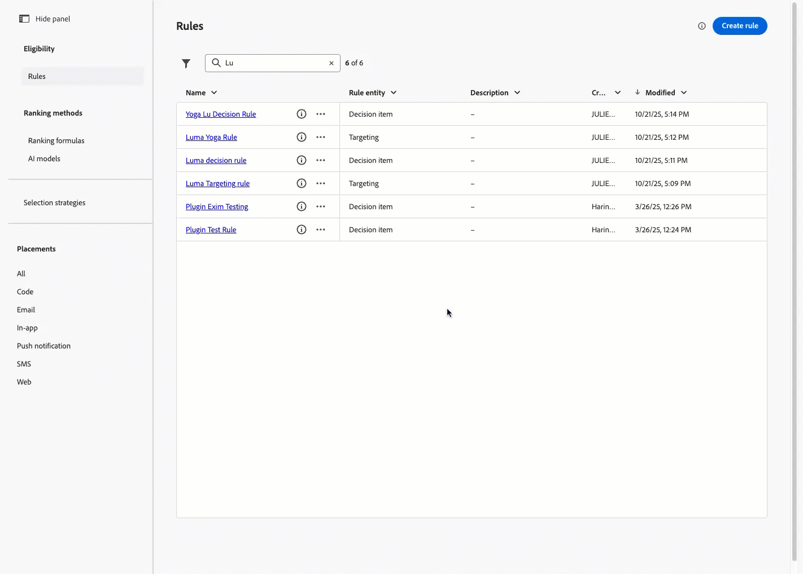

For more information, refer to the <a href="../experience-decisioning/rules.md">detailed documentation</a>.

Availability date: October 22, 2025

</td>
</tr>
</tbody>
</table>

<table>
<thead>
<tr>
<th><strong>New Journey Alerts</strong> </th>
</tr>
</thead>
<tbody>
<tr>
<td>

New pre-configured alerts are available to monitor your journey execution:

<ul><li><a href="../reports/alerts.md#alert-discard-rate">Profile Discard Rate Exceeded</a>: Ratio of profile discards to entered profiles over the last 5 mins exceeded threshold</li>
<li><a href="../reports/alerts.md#alert-custom-action-error-rate">Custom Action Error Rate Exceeded</a>: Ratio of custom action errors to successful HTTP calls over the last 5 mins exceeded threshold</li>
<li><a href="../reports/alerts.md#alert-profile-error-rate">Profile Error Rate Exceeded</a>: Ratio of profiles-in-error to entered profiles over the last 5 mins exceeded threshold.</li></ul> 
You can modify threshold values and subscribe to individual journey-level alerts vs globally.

For more information, refer to the <a href="../reports/alerts.md">detailed documentation</a>.

Availability date: October 14, 2025

</td>
</tr>
</tbody>
</table>

<table>
<thead>
<tr>
<th><strong>Execution Metadata helper</strong> </th>
</tr>
</thead>
<tbody>
<tr>
<td>

A new `executionMetadata` helper function is available in the personalization editor. It allows you to append contextual information to any native action and capture it in a dataset for export to external systems.

This capability is available in Limited Availability. Contact your Adobe representative to gain access.

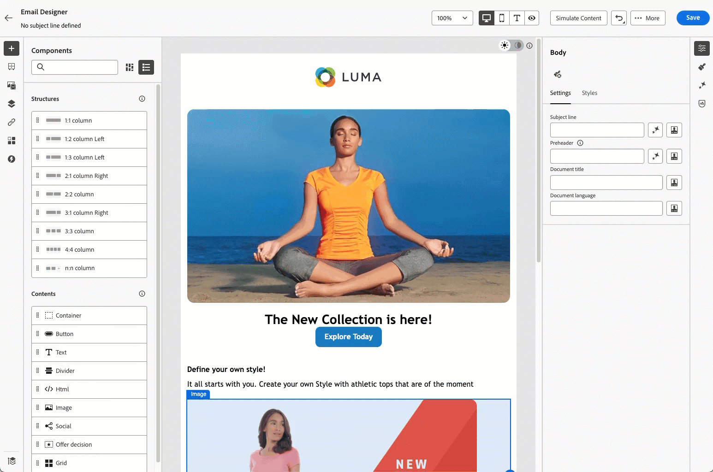

For more information, refer to the <a href="../personalization/functions/helpers.md#execution-metadata">detailed documentation</a>.

Availability date: October 13, 2025

</td>
</tr>
</tbody>
</table>

<table>
<thead>
<tr>
<th><strong>Experimentation Accelerator with Experimentation Agent</strong> </th>
</tr>
</thead>
<tbody>
<tr>
<td>

Journey Optimizer Experimentation Accelerator now includes the Experimentation Agent, an AI-powered, conversational tool that lets you interact with your experiments, insights, and opportunities. It enhances Journey Optimizer Experimentation Accelerator experience, helping you run experiments more efficiently, uncover what works, and discover where to optimize next.

For more information, refer to the <a href="https://experienceleague.adobe.com/docs/experience-cloud-ai/experience-cloud-ai/agents/agent-experiment.html" target="_blank">detailed documentation</a>.

Availability date: October 10, 2025

</td>
</tr>
</tbody>
</table>

<table>
<thead>
<tr>
<th><strong>PDF attachments to emails</strong> </th>
</tr>
</thead>
<tbody>
<tr>
<td>

You can now attach a static PDF file to an email message sent with Journey Optimizer.

<ul>
<li>You can send up to 6 messages with a PDF attachement per profile per year.</li>
<li>The maximum allowed file size for each attachment is 5 MB.</li>
<li>For any additional size or volume, you can purchase the PDF Attachments add-on. For more details, contact your Adobe representative.</li>
</ul>

Previously released in Limited Availability, this capability is now available to all environments (General Availability).

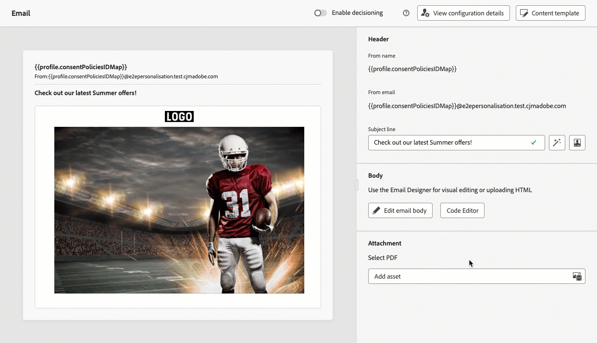

For more information, refer to the <a href="../email/pdf-attachments.md">detailed documentation</a>.

Availability date: Sept 30, 2025

</td>
</tr>
</tbody>
</table>

<table>
<thead>
<tr>
<th><strong>Public API to retrieve journeys</strong> </th>
</tr>
</thead>
<tbody>
<tr>
<td>

A new Journey Optimizer API is now available to retrieve journeys and their associated objects such as campaigns and surfaces.

For more information, refer to the <a href="https://developer.adobe.com/journey-optimizer-apis/references/journeys-retrieve/">detailed documentation</a>

Availability date: Sept 25, 2025

</td>
</tr>
</tbody>
</table>

### Improvements {#oct-25-10-improvements}

**Execution field for WhatsApp Channel**  

In addition to Email and SMS, you can know update the default execution field for your WhatsApp deliveries at the sandbox level. It is also possible to override the execution field set globally by changing it in the WhatsApp journey activity advanced parameters or in the WhatsApp channel configuration. [Read more](../configuration/primary-email-addresses.md)

Availability date: October 22, 2025

**Custom attributes support for Mailto (unsubscribe) address**

With Journey Optimizer, if you are managing consent outside of Adobe, you can set external custom endpoints by defining your own one-click unsubscribe link and a custom unsubscribe email address in the email configuration. When your recipients click the unsubscribe link, Journey Optimizer appends some default profile-specific parameters to the consent update event. 

To further personalize your custom endpoints, you can now define custom attributes that will be also appended to the consent event. [Read more](../email/list-unsubscribe.md#custom-attributes)

>[!AVAILABILITY]
>
>This capability has already been available for the custom **[!UICONTROL One-click Unsubscribe URL]** since August '25 and is now released for the **[!UICONTROL Mailto (unsubscribe)]** option in Limited Availability. Contact your Adobe representative to gain access.

Availability date: October 6, 2025

<!--
### Coming soon {#oct-25-10-soon}

In the next few days, the following capabilities and enhancements are scheduled for release. **Information is subject to change**. Updated links, screens, and documentation will be shared once these updates are live in production.

#### New capabilities {#oct-25-10-soon-features}

<table>
<thead>
<tr>
<th><strong>Themes in the Email Designer</strong> </th>
</tr>
</thead>
<tbody>
<tr>
<td>

You can now quickly apply pre-approved themes to ensure brand consistency across all emails, speed up your campaign creation process, and independently produce high-quality emails while reducing dependency on design teams.

Previously released in beta version, this capability is now available for a set of organizations (Limited Availability). To gain access, contact your Adobe representative.

For more information, refer to the <a href="../email/apply-email-themes.md">detailed documentation</a>.

Availability date: November 4, 2025

</td>
</tr>
</tbody>
</table>

#### Improvements {#oct-25-10-soon-improvements}

**Decisioning in emails through AI models**

You can now use AI models to optimize the best content in your email through the use of Decisioning. For example, this capability allows you to offer the best content based on custom events such as Purchases, Button Clicks, Add to Cart, etc.
-->

<!--
<table>
<thead>
<tr>
<th><strong>New Web Push notifications channel</strong> </th>
</tr>
</thead>
<tbody>
<tr>
<td>

Adobe Journey Optimizer now supports Web Push notifications, expanding the push channel beyond mobile. You can seamlessly deliver notifications to both mobile and desktop browsers, enabling you to reach customers directly on their devices without requiring an app.

This enhancement allows you to engage users with timely, personalized messages in real time, leveraging the same authoring workflows and targeting capabilities already available for mobile push.

For more information, refer to the <a href="../FILE.md">detailed documentation</a>

Availability date: Sept XX, 2025

</td>
</tr>
</tbody>
</table>

<table>
<thead>
<tr>
<th><strong>Custom action monitoring and reporting</strong> </th>
</tr>
</thead>
<tbody>
<tr>
<td>

Custom action monitoring and reporting is now available. This capability provides better visibility into journey health and execution, including lifecycle status and performance alerts. You can now quickly understand when, where, and why an anomalous situation is occurring in a custom action.

For more information, refer to the <a href="../FILE.md">detailed documentation</a>

Availability date: Sept XX, 2025

</td>
</td>
</tr>
</tbody>
</table>

<table>
<thead>
<tr>
<th><strong>New source connectors for loyalty apps</strong> </th>
</tr>
</thead>
<tbody>
<tr>
<td>

New source connectors are now available in Adobe Experience Platform for the Talon.One, Capillary, and Kobie loyalty apps. These connectors let you seamlessly stream loyalty data into Adobe Experience Platform and leverage these data in Journey Optimizer.

</td>
</tr>
</tbody>
</table>

-->

## September '25 release notes {#25-9-rn}

**Release date**: September 23-24, 2025

### New capabilities {#sept-25-9-features}

<table>
<thead>
<tr>
<th><strong>Journey Optimizer Experimentation Accelerator</strong> </th>
</tr>
</thead>
<tbody>
<tr>
<td>

Journey Optimizer Experimentation Accelerator is an AI-first product designed to take your experimentation to the next level. Built for Adobe Journey Optimizer and Adobe Target users, it unifies experiment management, delivers AI-powered insights and opportunities, and introduces a new experimentation agent.

You can look forward to:

<ul>
<li><strong>Unified Experiment Inventory:</strong> Quickly view, filter, and manage all experiments from Adobe Journey Optimizer and Adobe Target in one central workspace.</li>
<li><strong>AI Experiment Insights & Opportunities:</strong> Go beyond statistical readouts with GenAI-driven insights and recommendations. Each experiment now surfaces actionable opportunities, complete with supporting rationale, so teams can more confidently decide what to test next.</li>
<li><strong>Multi-Armed Bandit (MAB) Support in Journey Optimizer:</strong> Maximize impact while reducing wasted traffic with Multi-Armed Bandit experiments. Instead of splitting audiences evenly, MAB automatically allocates more visitors to the best-performing variations in real time so you can deliver better experiences to more customers while still learning what works.</li></ul>

For more information, refer to the <a href="https://experienceleague.adobe.com/en/docs/experimentation-accelerator/using/overview">detailed documentation</a>

Availability date: Oct 3, 2025

</td>
</tr>
</tbody>
</table>

<table>
<thead>
<tr>
<th><strong>Journey Agent is here!</strong> </th>
</tr>
</thead>
<tbody>
<tr>
<td>

Powered by <a href="https://experienceleague.adobe.com/en/docs/experience-cloud-ai/experience-cloud-ai/agents/agent-orchestrator" target="_blank">Adobe Experience Platform Agent Orchestrator</a>, Journey Agent is available in Journey Optimizer. It enables you to analyze journeys through a natural language interface. The agent will detect audience or schedule conflicts and profile drop-offs in a journey to help you take steps to resolve them. Soon, you will be able to create journeys with agentic support.

For more information, refer to the <a href="https://experienceleague.adobe.com/en/docs/experience-cloud-ai/experience-cloud-ai/agents/ajo-agent#journey-create-agent-skill-overview-and-user-guide" target="_blank">detailed documentation</a>

Availability date: Sept 24, 2025

</td>
</tr>
</tbody>
</table>

<table>
<thead>
<tr>
<th><strong>Dark mode in the Email Designer</strong> </th>
</tr>
</thead>
<tbody>
<tr>
<td>

The Journey Optimizer Email Designer now offers the ability to switch to dark mode view, where you can additionally define specific custom settings that will display only for recipients reading their emails in dark mode.

Note the following:

<ul>
<li>The dark mode final rendering may vary and depends on the recipient's email client.</li>
<li>Not all email clients support custom dark mode. Moreover, some email clients only apply their own default dark mode for all emails that are received. In both cases, the custom settings that you defined in the Email Designer cannot be rendered.</li>
</ul>

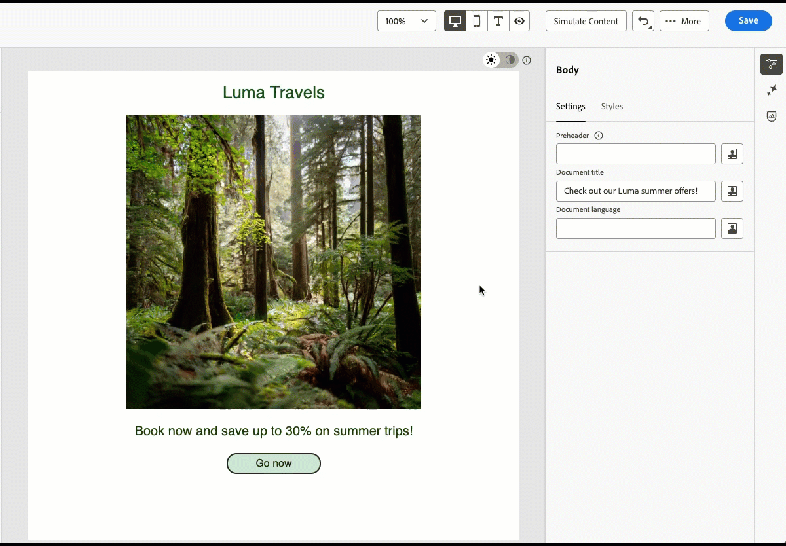

For more information, refer to the <a href="../email/dark-mode.md">detailed documentation</a>

 
Availability date: Sept 16, 2025

</td>
</tr>
</tbody>
</table>

<table>
<thead>
<tr>
<th><strong>Journey path optimization</strong> </th>
</tr>
</thead>
<tbody>
<tr>
<td>

Use the new Optimize node to target specific audiences or run A/B tests to determine the best path to meet your business-centric KPIs.

This tool allows you to test and vary, and customize communications, sequencing, and timing to best reach your customers.

This capability is available in Limited Availability. Contact your Adobe representative to gain access.

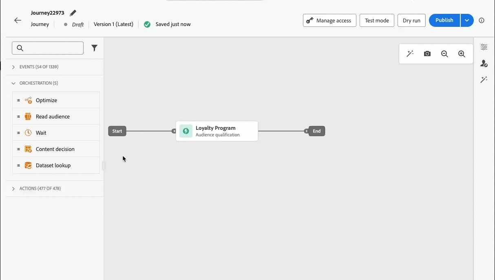

For more information, refer to the <a href="../building-journeys/optimize.md">detailed documentation</a>

Availability date: Sept 4, 2025

</td>
</tr>
</tbody>
</table>

<table>
<thead>
<tr>
<th><strong>Custom delegation method for subdomains</strong> </th>
</tr>
</thead>
<tbody>
<tr>
<td>

In addition to the full delegation and the CNAME method, a new subdomain configuration method is now available: the Custom delegation method, which enables you to fully own controlling and maintaining all aspects of DNS that are required for delivering, rendering and tracking messages.

This capability is available in Limited Availability. Contact your Adobe representative to gain access.

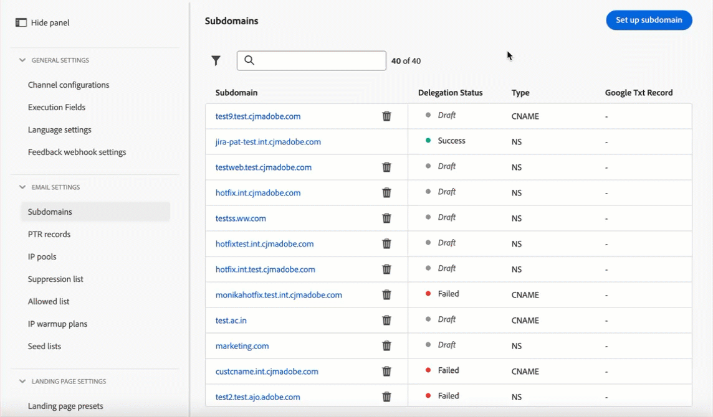

For more information, refer to the <a href="../configuration/delegate-custom-subdomain.md">detailed documentation</a>

Availability date: Sept 4, 2025

</td>
</tr>
</tbody>
</table>

<table>
<thead>
<tr>
<th><strong>Use Adobe Experience Platform data for personalization and decisioning</strong> </th>
</tr>
</thead>
<tbody>
<tr>
<td>

Previously released in public beta, this capability is now available to all environments. With this release, the following enhancements have been introduced:

<ul><li>Support for dataset lookup personalization in inbound channels.</li>
<li>The "datasetLookup" helper function can now be used within expression fragments. For now, this capability is available for a limited set of customers. To gain access, contact your Adobe representative.</li>
<li>An option in the dataset management interface now allows you to enable record-based datasets for lookup personalization, without having to perform an API call.</li>
<li>Enhanced monitoring to track data ingestion status and know when datasets are ready for lookup.</li>
<li>Updated usage guidelines and guardrails to ensure optimal performance and reliability.</li>
<li>Adobe Experience Platform Datasets can now be leveraged in Decisioning capping rules.</li></ul>

For more information, refer to the <a href="../data/lookup-aep-data.md">detailed documentation</a>

Availability date: Sept 1, 2025

</td>
</tr>
</tbody>
</table>

### Improvements {#sept-25-9-improvements}

* **Webhook support for API triggered campaigns**  
  API triggered campaigns now support webhooks. Configure a webhook URL to receive real-time status updates for every message, improving observability and enabling seamless monitoring and automation. [Read more](../configuration/feedback-webhooks.md)

  Availability date: Sept 29, 2025

* **mTLS Support for SMS Channel**
  When setting up a custom SMS provider, you now have the option to enable mutual TLS (mTLS) authentication, which requires both the client and the server to confirm each other's identities before a secure connection is established. [Read more](../sms/sms-configuration-custom.md) - Availability date: Sept 23, 2025 

* **Relational Schemas**  
Relational schemas can now be used by to support your relational modeling needs in Orchestrated campaigns. [Read more](../orchestrated/gs-schemas.md) - Availability date: Sept 23,2025 

* **Dataset lookup support in journeys**  
  A new activity in journeys, **Dataset lookup**, allows you to dynamically retrieve data from Adobe Experience Platform record datasets during runtime. By leveraging this capability, you can access data that may not reside in the profile or event payload, ensuring your customer interactions are both relevant and timely. [Read more](../building-journeys/dataset-lookup.md) - Availability date: Sept 23,2025 

  This activity is only available for a set of organizations (Limited Availability). To gain access, contact your Adobe representative.

* **Redirect Support in Journey Custom Actions**  
  Redirects (302) are now supported in Journey Custom Actions. - Availability date: Sept 23,2025 

* **Channel configuration monitoring alerts** - You can now subscribe to receive system alerts, either by email or in the Journey Optimizer notification center, in case an email channel configuration error using the custom subdomain delegation type happens. [Read more](../reports/alerts.md#alert-channel-config-failure) - Availability date: Sept 23, 2025

* **One-click unsubscribe requests** - We have introduced improvements that further strengthen the handling of one-click unsubscribe requests configured under Adobe Managed, ensuring reliable and consistent processing. - Availability date: Sept 23,2025 

* **Nested JSON body params now supported in custom authentication**  
  When configuring custom authentication for a custom action, nested JSON objects (e.g., sub-objects within `bodyParams`) are now supported. [Read more](../datasource/external-data-sources.md#custom-authentication-mode) - Availability date: Sept 18, 2025 

* **Hourly reset capping frequency** - You can now apply capping on an hourly basis for channel rule sets. Previously available in Limited Availability, this capability is now available to all environments and allows you to choose 1 hour (previously 3 hours). [Read more](../conflict-prioritization/channel-capping.md) - Availability date: Sept 17,2025 

* **Simulating content variations for all inbound channels**  
  Previously only available for the Email, SMS, and Push notification channels, simulating content variations now also applies to all inbound channels. [Read more](../test-approve/simulate-sample-input.md) - Availability date: Sept 17,2025 

* **Expression for Decisioning capping rules** - You can now build your own expressions to define the threshold of a capping rule for a decision item. [Read more](../experience-decisioning/items.md#capping) - Availability date: Sept 16, 2025

* **Dynamic domain support** - Journey Optimizer now supports complete/base URL personalization for predefined domains accepted by Adobe. [Read more](../personalization/personalization-build-expressions.md#where) - Availability date: Sept 12, 2025

  This capability is available in Limited Availability for a set of customers.

* **Webhooks** - This release introduces the following enhancements for Webhooks when configuring a custom SMS provider:

  * You can now define your webhook's purpose, either Inbound or Feedback, depending on the type of data you want to capture. [Read more](../sms/sms-configuration-custom.md#webhook) - Availability date: Sept 23, 2025

  * The interface for configuring keywords has been improved for easier setup. [Read more](../sms/sms-configuration-custom.md#webhook) - Availability date: Sept 23, 2025

* **SMS**

  * When setting up a custom SMS provider, you can now define a **Default** keyword used when an incoming SMS contains an unrecognized keyword. You can also create **Custom** keywords for specific actions. [Read more](../sms/sms-configuration-custom.md) - Availability date: Sept 23, 2025

  * You can now access undefined inbound keywords responses that are sent via an SMS messag, including typos, words, or sentences that are not explicitly defined in the configuration. They are stored in the **AJO Email Tracking Experience Event** dataset, under **InboundMessage** for 13 months. Only available with Sinch, Infobip, and custom SMS provider. - Availability date: Sept 23, 2025

## August '25 release notes {#25-8-rn}

**Release date**: August 19, 2025

### New capabilities {#Aug-25-8-features}

New capabilities coming with this release are detailed below.

<table>
<thead>
<tr>
<th><strong>Pause and resume journeys</strong> </th>
</tr>
</thead>
<tbody>
<tr>
<td>

You can now pause and resume your journeys. This capability gives journey practitioners greater control and flexibility by allowing live journeys to be temporarily suspended without disrupting customer experience. When paused, no communications are sent, and profiles remain in a suspended state until the journey is resumed.

You can pause and resume one journey only, or perform bulk pause and resume operations to a group of journeys.

In addition, you can apply profile attribute-based exit criteria (previously named "global filter") to paused journeys to exclude profiles based on their attributes.

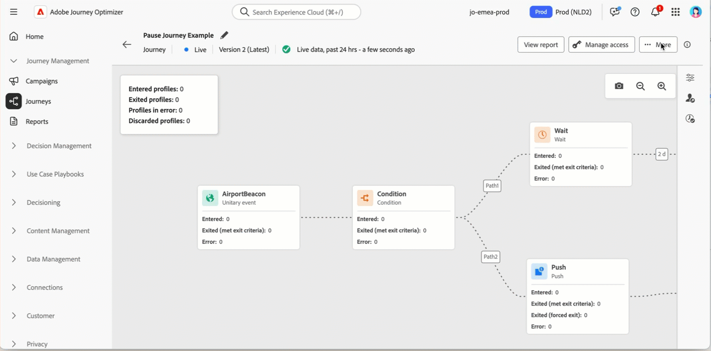

Previously released in Limited Availability, this capability is now available to all environments (General Availability).

For more information, refer to the <a href="../building-journeys/journey-pause.md">detailed documentation</a>

</td>
</tr>
</tbody>
</table>

<table>
<thead>
<tr>
<th><strong>Calendar view</strong> </th>
</tr>
</thead>
<tbody>
<tr>
<td>

A calendar view is now available in the journeys and campaigns lists. It allows you to visualize all journeys and campaigns activations in the respective lists.

Previously available in Limited Availability, this feature is now available to all environments. With this General Availability release, the feature includes:

<ul>
<li>Design improvements for the navigation in dates,</li>
<li>The ability to see draft campaigns if you have set a start and end date,</li>
<li>A new setting to hide and show calendar items running for a long time.</li>
</ul>

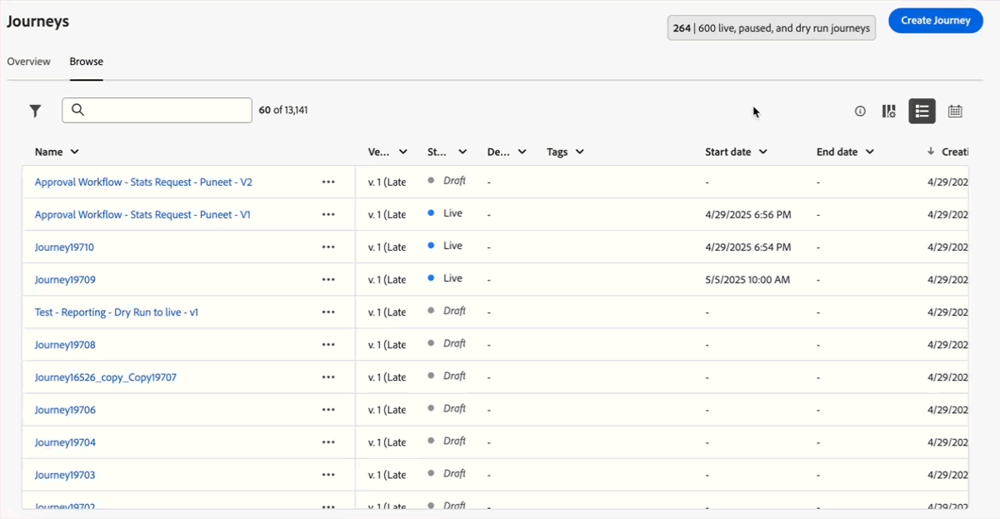

For more information, refer to the <a href="../building-journeys/journey-ui.md#calendar">detailed documentation</a>

</td>
</tr>
</tbody>
</table>

<!--table>
<thead>
<tr>
<th><strong>Use Adobe Experience Platform data for personalization</strong> </th>
</tr>
</thead>
<tbody>
<tr>
<td>

Leverage data from [!DNL Adobe Experience Platform] in the personalization editor to personalize your content and decision attributes. In particular, this allows you to extend the definition of your attributes to additional data in datasets for bulk updates that change periodically without having to manually update the attributes one at a time.

With this release, the following enhancements have been introduced:

<ul>
<li>Support of inbound channels,</li>
<li>The "datasetLookup" helper function can now be used within expression and visual fragments to personalize content using data from Adobe Experience Platform datasets,</li>
<li>An option in the dataset now allows you to enable datasets for lookup personalization, without having to perform an API call.</li>
</ul>

This capability is available in Limited Availability. Contact your Adobe representative to gain access.

For more information, refer to the <a href="../personalization/aep-data-perso.md">detailed documentation</a>

</td>
</tr>
</tbody>
</table-->

<!--table>
<thead>
<tr>
<th><strong>Use Decisioning in email channel</strong> </th>
</tr>
</thead>
<tbody>
<tr>
<td>

You can now add Decision policies into email journeys and campaigns. Decision policies are containers for your offers that leverage the Decisioning engine to dynamically return the best content to deliver for each audience member.

Previously released in Limited Availability, this capability is now available to all environments (General Availability).

<For more information, refer to the <a href="../FILE.md">detailed documentation</a>

</td>
</tr>
</tbody>
</table-->

<table>
<thead>
<tr>
<th><strong>Action activity in journeys</strong> </th>
</tr>
</thead>
<tbody>
<tr>
<td>

Journey Optimizer supports a new generic Action activity that enables you to configure both single actions and multi-action inbound action groups, allowing for streamlined action configuration within the journey canvas. In particular, this new feature allows for:

<ul>
<li>A simplified native action configuration within the journey canvas.</li>
<li>The capacity to create multi-action inbound action groups.</li>
<li>The ability to add optimization to any built-in channel action.</li>
<li>The ability to add both experimentation and multi-lingual options to any action.</li>
</ul>

This capability is available in Limited Availability. Contact your Adobe representative to gain access.

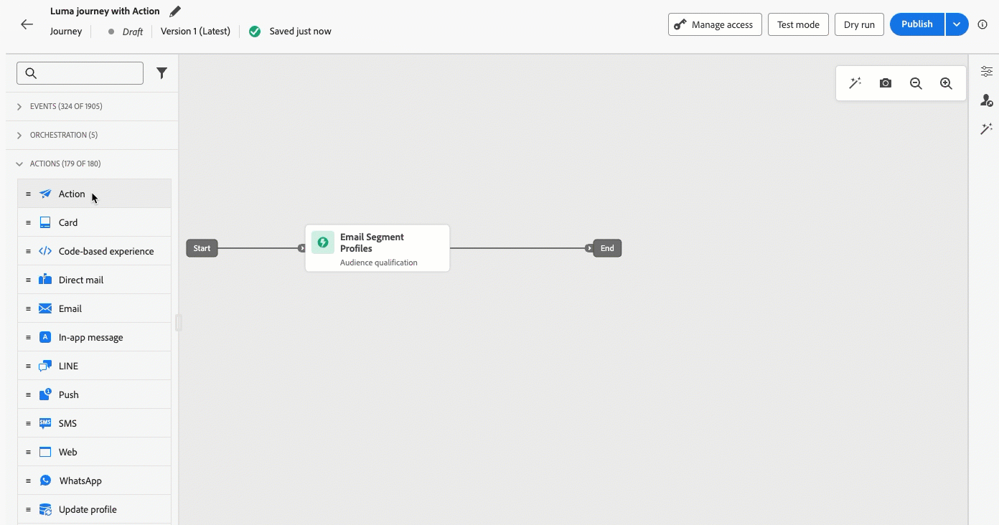

For more information, refer to the <a href="../building-journeys/journey-action.md">detailed documentation</a>

</td>
</tr>
</tbody>
</table>

<table>
<thead>
<tr>
<th><strong>PDF attachments to emails</strong> </th>
</tr>
</thead>
<tbody>
<tr>
<td>

You can now attach a static PDF file to an email message sent with Journey Optimizer.

<ul>
<li>You can send up to 6 messages with a PDF attachement per profile per year.</li>
<li>The maximum allowed file size for each attachment is 5 MB.</li>
<li>For any additional size or volume, you can purchase an attachment pack add-on. For more details, contact your Adobe representative.</li>
</ul>

This capability is available in Limited Availability. Contact your Adobe representative to gain access.

For more information, refer to the <a href="../email/pdf-attachments.md">detailed documentation</a>

</td>
</tr>
</tbody>
</table>

<!--
<table>
<thead>
<tr>
<th><strong>Landing page custom forms</strong> </th>
</tr>
</thead>
<tbody>
<tr>
<td>

With [!DNL Journey Optimizer], you can now capture profile attributes though your landing pages.

Create, design and manage custom forms tailored to your needs based on a specific dataset. You can then leverage these forms in landing pages to add the profile attributes of your choice into the dataset defined for each form.

This capability is currently in beta version and only available to beta customers. To join the beta program, contact your Adobe representative.

For more information, refer to the <a href="../FILE.md">detailed documentation</a>

</td>
</tr>
</tbody>
</table>
-->

<table>
<thead>
<tr>
<th><strong>Optimization in campaigns</strong> </th>
</tr>
</thead>
<tbody>
<tr>
<td>

Journey Optimizer now empowers you with the tools to deliver personalized and optimized content to your audience, allowing you to run content experiments, create rule-based targeting, and use advanced combinations of both, to maximize the effectiveness of your campaigns and journeys.

With Optimization, you can:

<ul>
<li>Test multiple content variations to identify the most effective messaging.</li>
<li>Deliver personalized content based on user attributes and contextual data.</li>
<li>Combine targeting and experimentation for advanced strategies.</li>
<li>Filter out users that do not match variant criteria.</li>
<li>Ensure fallback mechanisms to maintain user engagement.</li>
</ul>

Once the journey or campaign is live, profiles are evaluated against the defined criteria, and based on matching criteria, they are delivered with the appropriate experience or content.

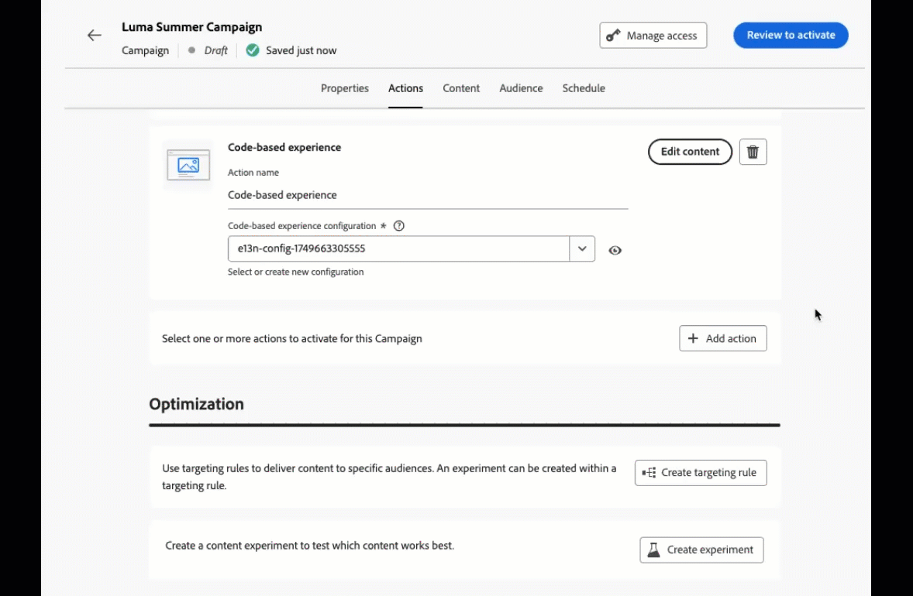

Previously released on August 8 in campaigns only, this capacity is now also available in journeys starting from August 22.

For more information, refer to the <a href="../content-management/gs-message-optimization.md">detailed documentation</a>

</td>
</tr>
</tbody>
</table>

### Improvements {#Aug-25-8-improv}

Improvements coming with this release are listed below.

* **Administration**

  * **Channel configuration monitoring alerts** - You can now subscribe to receive system alerts, either by email or in the Journey Optimizer notification center, in case <!--a channel configuration failure happens or if -->a DNS record is missing. [Read more](../reports/alerts.md#alert-dns-record-missing)

* **AI Assistant**

  * **Content generation in multiple languages** – Content can now be generated in French, Spanish, German, Italian, Japanese, Swedish, Dutch, and Norwegian. [Read more](../content-management/generative-uc.md#languages)

    Availability date: August 25th

* **Campaigns**

  * **Rate control in outbound campaigns** - You can now enable rate control for outbound campaigns (Email, SMS, Push notifications), allowing you to prevent overload on downstream systems, such as landing pages or customer care platforms. [Read more](../campaigns/campaign-schedule.md#set-rate-control)

  * **Action campaign scheduling** - The campaign daily, weekly, and monthly schedulers have been updated to provide more detailed control over recurring schedules:

    * **Weekly recurrence**: You can now choose to repeat the campaign every week or every two weeks, and select the day(s) of the week on which it should run.

    * **Monthly recurrence**: You can now choose to repeat the campaign every month or every other month, and select the day of the month on which it should run.

    * **Daily, weekly, or monthly schedules**: You can specify if the recurring schedule should stop on a specific date or after a certain number of occurrences.

  * **Scheduled transactional action campaigns** - Scheduled transactional action campaigns are now available for sending batch, audience-based transactional communications via Email, SMS, and Push channels.

* **Channel - Content cards**

  * **Content card layout templates** - The Content card channel now provides OOTB message layouts that will streamline your authoring experience. This release includes Small Image, Large Image, and Image Only layout templates. [Read more](../content-card/design-content-card.md)

* **Channel - Push**

  * **Push notification expiration date** - You can now specify an expiration date for each Push notification, which prevents time-sensitive messages (such as Black Friday Sale) from being sent after a certain date, thus avoids delivering poor experience to your customers.

* **Channel - SMS**

  * **Fuzzy Opt-out** - When enabled, the **Fuzzy Opt-out** option detects inbound messages that closely resemble defined opt-out keywords (e.g., 'CANCIL') and automatically sends a confirmation reply to verify the user's unsubscribe intent. If the user confirms via the defined prompt, they are unsubscribed. [Read more](../sms/sms-configuration-sinch.md)

    >[!NOTE]
    >
    >**Fuzzy Opt-out** is only available with Sinch and Infobip.

  * **Verify SMS Connection** -  You can now easily test and verify your SMS API credentials within Adobe Journey Optimizer by sending a sample message to a designated device. [Read more](../sms/sms-configuration-sinch.md)

* **Configuration**

  * **Custom attributes support with One-click unsubscribe URL** - With Journey Optimizer, if you are managing consent outside of Adobe, you can set an external custom endpoint by defining your own one-click unsubscribe link in the email configuration. When your recipients click the unsubscribe link, Journey Optimizer appends some default profile-specific parameters to the consent update event.
  
    To further personalize your one-click unsubscribe link, you can now define custom attributes that will be also appended to the consent event. This capability is available in Limited Availability. [Read more](../email/list-unsubscribe.md#custom-attributes)

* **Datasets**

  * **Experience Decisioning Object Repository - Personalized Offer Items** - Built-in export dataset now captures all offer attributes and lifecycle status, enabling complete personalization and reporting. [Read more](../data/export-datasets.md)

  * Introduced version checking via the `etag` field to improve consistency and track changes to offer items more reliably.

* **Decisioning**

  * **Attach fragments to decision items** - Journey Optimizer now provides the ability to attach fragments to decision items which can be leveraged in code-based experience campaigns through decision policies. This capability is available in Limited Availability for a set of customers. [Read more](../experience-decisioning/create-decision.md#fragments)

* **Journeys**

  * **Journey bulk operations** - From the list of your journeys, you can now select multiple items. Once selected, you can pause or resume up to 10 journeys at a time.

  * **Redirect (302) Support in Custom Actions** - Custom actions can now handle HTTP 302 redirects on a per-request basis. This allows journeys to integrate with APIs that redirect requests to localized or region-specific URLs. Redirects are followed automatically, ensuring the correct content is delivered without extra configuration.

  * **Multiple inbound actions in journeys** - To simplify your journey orchestration, you can now define several inbound actions in a single journey. Previously available in campaigns, this capability enables you to deliver multiple code-based experiences, In-app messages, Content Cards or web actions to different locations at the same time, each action containing a specific content. [Read more](../building-journeys/journey-action.md#multi-action)

## Campaign Orchestration 

**Availability date**: August 4, 2025

Journey Optimizer now includes **Campaign Orchestration**, a new capability purpose-built for brand-initiated, batch campaigns. This release introduces a campaign orchestration canvas and enhanced data modeling, working together to let marketers plan, target, and deliver personalized cross-channel campaigns.

>[!IMPORTANT]
>
>To access Campaign Orchestration, your license must include either the **Journey Optimizer – Campaigns & Journeys** or the **Journey Optimizer - Campaigns** package. Contact your Adobe representative to confirm your license and update if needed.

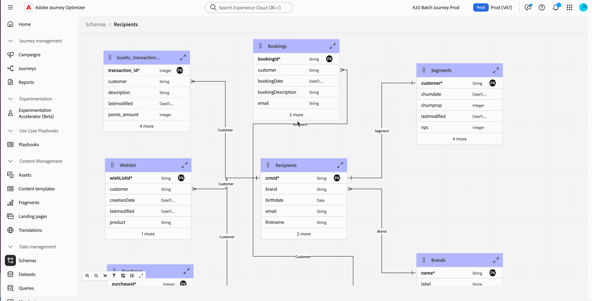

It includes [Relational Schemas & Datasets](#oc-relational) and [Campaign Canvas](#oc-canvas). Together, these two innovations unlock a new standard for orchestrating batch campaigns in Journey Optimizer. Key capabilities are listed below.

### Key Capabilities {#oc-capabilities}

* **Multi-step workflows**

  Drive sophisticated multi-channel batch campaigns with the new, purpose-built campaign orchestration canvas. 

* **On-demand audiences**

  Segment audiences on-demand for immediate activation.  

* **Multi-entity segmentation**

  Build audiences using business context (non-people dimensions) such as product, stores, renewals, reservations, and more.  

* **Pre-send visibility** 

  Review, refine, and optimize audiences and campaigns prior to launch and while campaigns are running  

### Campaign Canvas {#oc-canvas}

A brand-new visual orchestration interface purpose-built for batch campaigns. This canvas enables: 

* Visual planning of multi-step, multi-channel campaign flows 

* Support for on-demand audiences built from relational queries 

* Advanced audience splitting, waits, and conditional logic 

* Precise pre-send counts after applying business rules and filters 

### Relational Schemas & Datasets {#oc-relational}

Adobe Journey Optimizer now supports relational entities (e.g., products, stores, bookings, contracts) linked to people-based profiles. This allows segmentation and personalization across multi-dimensional data structures, enabling use cases like: 

* One message per booking, subscription, or contract 

* Segmentation based on related entity attributes (e.g., product category or store location) 

* Enhanced addressability (e.g., send to all known contacts tied to an entity) 

### Why it matters 

This release gives marketers full control over brand-initiated, audience-based batch marketing, combining flexible data modeling with a purpose-built orchestration experience. It is specifically designed for batch campaign orchestration from real-time journeys, while offering advanced personalization and scalability. 

### Learn more

Learn more in the [Campaign orchestration documentation](../orchestrated/gs-orchestrated-campaigns.md).

## July '25 release notes {#25-7-rn}

**Release date**: July 29, 2025

### New capabilities {#features-25-7}

New capabilities coming with this release are detailed below.

#### Features

<table>
<thead>
<tr>
<th><strong>Brands</strong> </th>
</tr>
</thead>
<tbody>
<tr>
<td>

You can now create and customize your own Brands to clearly define your visual and verbal identity across communications. With the Brand alignment score, you can receive real-time feedback on how well your content reflects your brand's tone, style, and guidelines, helping you stay consistently on-brand with every message you send.

Previously released in Beta, this capability is now available to all environments (General Availability).

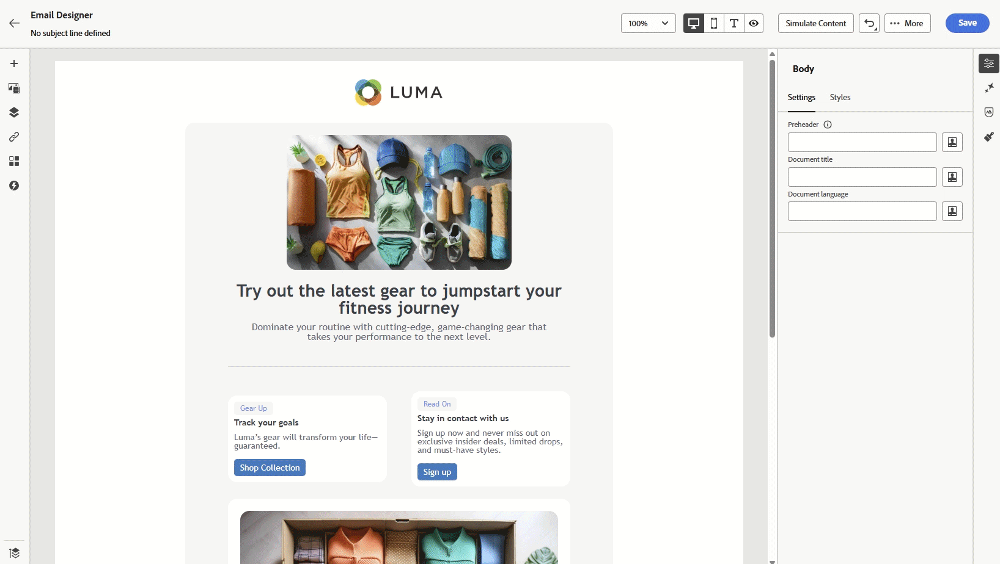

For more information, refer to the <a href="../content-management/brands.md">detailed documentation</a>.

</td>
</tr>
</tbody>
</table>

<table>
<thead>
<tr>
<th><strong>Use Decisioning in email channel</strong> </th>
</tr>
</thead>
<tbody>
<tr>
<td>

You can now add Decision policies into email journeys and campaigns. Decision policies are containers for your offers that leverage the Decisioning engine to dynamically return the best content to deliver for each audience member.

This capability is available in Limited Availability. Contact your Adobe representative to gain access.

For more information, refer to the <a href="../experience-decisioning/create-decision.md">detailed documentation</a>

</td>
</tr>
</tbody>
</table>

<table>
<thead>
<tr>
<th><strong>LINE channel</strong> </th>
</tr>
</thead>
<tbody>
<tr>
<td>

Adobe Journey Optimizer has expanded its cross-channel capabilities to include support for the LINE channel. This enhancement allows you to create, edit, and preview LINE experiences enabling more personalized and engaging interactions. With LINE, you can connect with more customers, send relevant content, and improve your engagement.

Previously available only request, LINE channel is now available to all users (General Availability).

For more information, refer to the <a href="../../rp_landing_pages/line-landing-page.md">detailed documentation</a>.
</td>
</tr>
</tbody>
</table>

<table>
<thead>
<tr>
<th><strong>Journey Dry Run</strong> </th>
</tr>
</thead>
<tbody>
<tr>
<td>

Journey Dry run is a special journey publication mode in Adobe Journey Optimizer that allows journey practitioners to test a journey using real production data without contacting real customers or updating profile information. This feature helps journey practitioners gain confidence in their journey design and audience targeting before publishing it live.

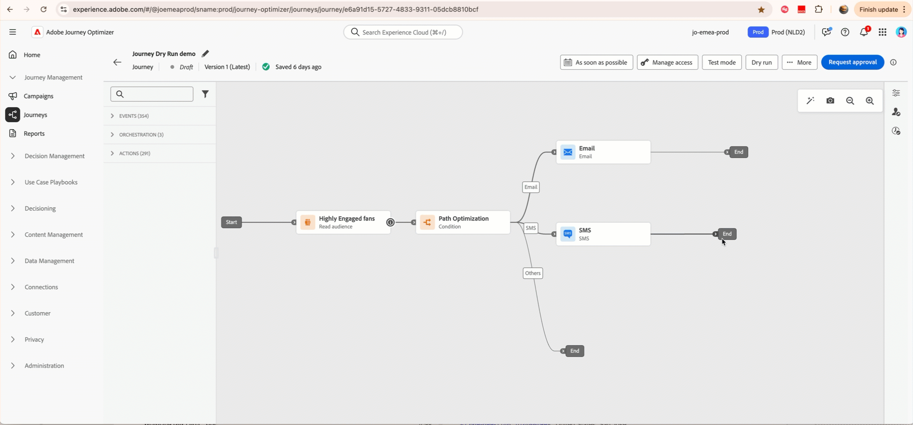

Previously released in Limited Availability, this capability is now available to all environments (General Availability).

For more information, refer to the <a href="../building-journeys/journey-dry-run.md">detailed documentation</a>

</td>
</tr>
</tbody>
</table>

<table>
<thead>
<tr>
<th><strong>Supplemental ID for journeys</strong> </th>
</tr>
</thead>
<tbody>
<tr>
<td>

You can now trigger journeys using a profile ID along with another identifier, such as an order ID, subscription ID, or prescription ID, allowing the same profile to be in the same journey multiple times at once. This enables scenarios like managing multiple orders or subscriptions in parallel, with each instance following its own path through the journey.

Previously released in Limited Availability, the use of supplemental IDs in journeys is now available to all environments. With this General Availability release, the feature now includes support for Read audience journeys.

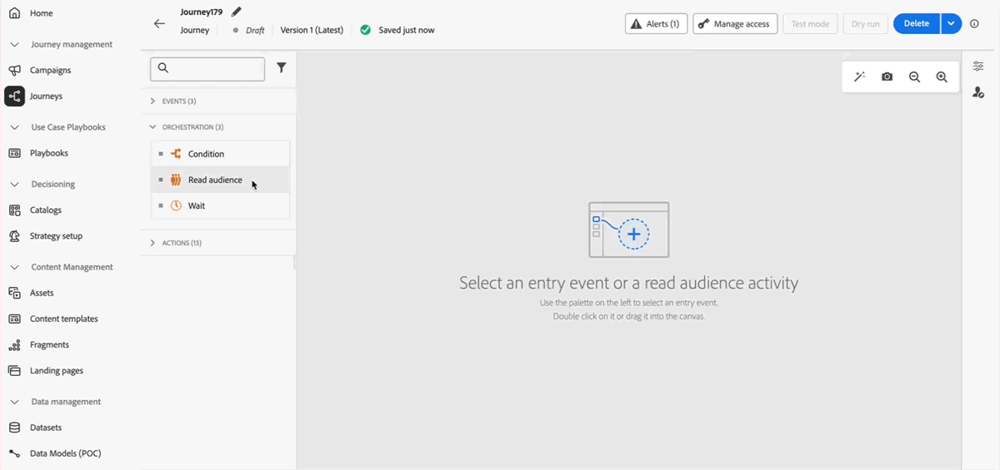

For more information, refer to the <a href="../building-journeys/supplemental-identifier.md">detailed documentation</a>

</td>
</tr>
</tbody>
</table>

### In-product alerts 

You can now subscribe to **email and in-product alerts** for Journey Optimizer product releases. 

To subscribe:

* Navigate to **Adobe Experience Cloud Preferences**
* Under **Notifications**, find **Journey Optimizer New releases**
* Enable In-app and email notifications

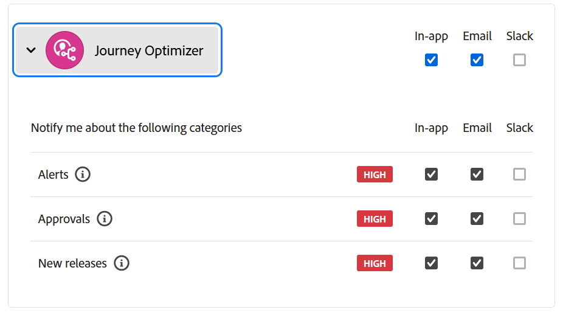{width="70%" align="left"}

### Change in journey conditions {#ee-change@}

Starting July 8th, in new customer organizations, creating expressions using experience events is no longer supported in the expression editor used in journey conditions. As a result, experience events in the [Experience Platform data source](../datasource/adobe-experience-platform-data-source.md) cannot be used for creating expressions. Alternative approaches and best practices for creating expressions/logic with experience events are referenced [here](../building-journeys/exp-event-lookup.md).

There is no change to how journey context event data is accessed in unitary journeys. In the expression and personalization editors, users can continue to access data passed in with the initial journey event. 

Learn more [in this FAQ](../building-journeys/exp-event-lookup.md#faq-ee).

### Improvements {#25-7-improv}

Improvements coming with this release are listed below.

* **Campaigns**

  * **Multiple inbound actions in campaigns** - To simplify your campaign orchestration, you can now define several inbound actions in a single campaign. This capability enables you to deliver multiple code-based experiences, In-app messages, Content Cards or web actions to different locations at the same time, each action containing a specific content.
  [Read more](../campaigns/campaign-action.md#multi-action)

  * **Campaign inventory reorganization** - Scheduled and API-triggered campaigns are now split into separate tabs in the campaigns inventory for easier navigation and management.
 
  [Read more](../campaigns/manage-campaigns.md)

* **Data Management**
  * **Decision Management system datasets update** - The deleted Personalised and Fallback offers are now marked as archived in the "decision_object_repository_personalized_offers" and "decision_object_repository_fallback_offers" datasets. The existing records in the dataset are not changed.

  [Read more](../offers/export-catalog/access-dataset.md)

* **Journeys**
  * **Journey Sandbox Tooling Enhancements** - When copying journeys across multiple sandboxes using the package export and import capabilities, the following capabilities are now also available:
    * Selecting an existing event at the destination
    * Copying over an event independently of a journey
    * Detecting field group / data source relationships, linking to them at the destination if they exist, creating them if they don't.
  
  [Read more](../configuration/copy-objects-to-sandbox.md)

* **Channel - In-app**
  * **In-app Key/Value pairs** - With In-app messages, you can define Key and Value pairs to include custom variables in the message payload. These key-value pairs enable you to pass additional data based on your specific configuration and use case. [Read more](../in-app/design-in-app.md)

* **Channel - Content Card**

  * **Rule-Based Campaign Disqualification** - When editing additional delivery rules, the previous Delivery rules option has been replaced with three distinct rule types to better control message timing and visibility:
    * Show message if: Conditions that determine when the content card is shown.
    * Dismiss message if: Conditions that temporarily hide the content card. It can reappear if show conditions are met again.
    * Disqualify message if: Conditions that permanently prevent the content card from being shown again.
  
    [Read more](../content-card/design-content-card.md)
  
* **Decisioning**
  * **Migration tooling APIs** - The Journey Optimizer team is currently working on migration tooling APIs to migrate Decision management entities to Decisioning. This tooling enables seamless migration between sandboxes with dependency resolution and rollback capabilities. If interested, reach out to your Adobe representative.

* **Personalization**
  * A new helper function, "SHA256", has been added to the personalization editor. This function is used to calculate and return the sha256 hash of a string.

  [Read more](../personalization/functions/string.md#sha256)

## June '25 release notes {#25-6-rn}

**Release date**: June 18, 2025

### New capabilities {#25-06-features}

New capabilities coming with this release are detailed below.

<table>
<thead>
<tr>
<th><strong>Adobe Experience Platform datasets in decisioning (beta)</strong> </th>
</tr>
</thead>
<tbody>
<tr>
<td>

Previously available for personalization, Adobe Experience Platform datasets can now be leveraged for decisioning. This allows you to extend the definition of your decision attributes to additional data in datasets for bulk updates that change periodically without having to manually update the attributes one at a time. For example, availability, wait times, etc.

This capability is currently available to all customers as a public beta. Please contact your account representative if you would like access.

For more information, refer to the <a href="../experience-decisioning/aep-data-exd.md">detailed documentation</a>.

Availability date: June 20th, 2025

</td>
</tr>
</tbody>
</table>

<table>
<thead>
<tr>
<th><strong>RCS Messaging</strong> </th>
</tr>
</thead>
<tbody>
<tr>
<td>

You can now configure, customize, and deliver Rich Communication Services (RCS) messages through a third-party provider by integrating with custom SMS provider solution.

For more information, refer to the <a href="../sms/sms-configuration-custom.md">detailed documentation</a>.

</td>
</tr>
</tbody>
</table>

<table>
<thead>
<tr>
<th><strong>Form fields in code-based experience content</strong> </th>
</tr>
</thead>
<tbody>
<tr>
<td>

You can now define specific editable fields in JSON or HTML content templates which enable non-technical users to easily edit content in a form-view within the code-based experience channel authoring, without the need to manipulate any code. More than that, when defining the code-based experience content templates you can now insert decision policies in the template, increasing reusability and ease of use.

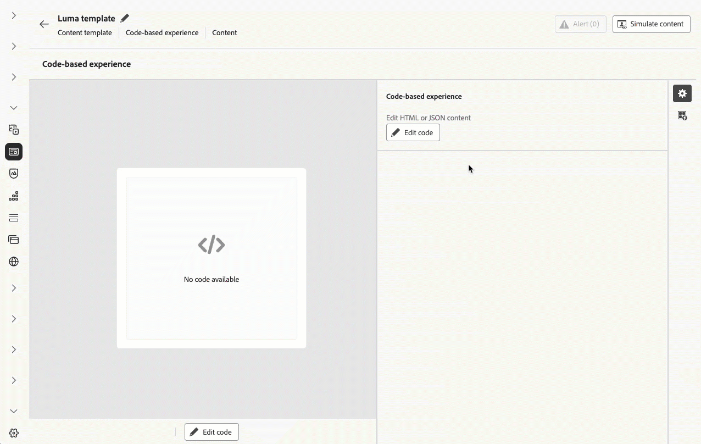

For more information, refer to the <a href="../code-based/code-based-form-fields.md">detailed documentation</a>.

</td>
</tr>
</tbody>
</table>

<!--
<table>
<thead>
<tr>
<th><strong>Custom delegation method for subdomains</strong> </th>
</tr>
</thead>
<tbody>
<tr>
<td>

In addition to the full delegation and the CNAME method, a new subdomain configuration method is now available: the Custom delegation method, which enables you to fully own controlling and maintaining all aspects of DNS that are required for delivering, rendering and tracking messages.

</td>
</tr>
</tbody>
</table>
-->

<table>
<thead>
<tr>
<th><strong>Content Decision activity in journeys</strong> </th>
</tr>
</thead>
<tbody>
<tr>
<td>

You can now include personalized offers in your journeys through a dedicated Content Decision activity in the journey canvas, and use them in journey activities, including conditions and custom actions.

This capability is only available for a set of organizations (Limited Availability), and will be rolled out globally in a future release.

For more information, refer to the <a href="../building-journeys/content-decision.md">detailed documentation</a>.

</td>
</tr>
</tbody>
</table>

<table>
<thead>
<tr>
<th><strong>Journey Dry run</strong> </th>
</tr>
</thead>
<tbody>
<tr>
<td>

Journey Dry run is a special journey publication mode in Adobe Journey Optimizer that allows journey practitioners to test a journey using real production data without contacting real customers or updating profile information. This feature helps journey practitioners gain confidence in their journey design and audience targeting before publishing it live.

This capability is only available for a set of organizations (Limited Availability), and will be rolled out globally in a future release.

For more information, refer to the <a href="../building-journeys/journey-dry-run.md">detailed documentation</a>.

</td>
</tr>
</tbody>
</table>

<table>
<thead>
<tr>
<th><strong>Pause and resume journeys</strong> </th>
</tr>
</thead>
<tbody>
<tr>
<td>

You can now pause and resume your journeys. This capability gives journey practitioners greater control and flexibility by allowing live journeys to be temporarily suspended without disrupting customer experience. When paused, no communications are sent, and profiles remain in a suspended state until the journey is resumed.

You can pause and resume one journey only, or perform bulk pause and resume operations to a group of journeys.

In addition, you can apply global filters to paused journeys to exclude profiles based on their attributes.

This capability is only available for a set of organizations (Limited Availability), and will be rolled out globally in a future release.

For more information, refer to the <a href="../building-journeys/journey-pause.md">detailed documentation</a>.

</td>
</tr>
</tbody>
</table>

<table>
<thead>
<tr>
<th><strong>Scale your Experimentation winner</strong> </th>
</tr>
</thead>
<tbody>
<tr>
<td>

Scale your Experimentation winner enables you to automatically or manually roll out the winning variation of an experiment to your full audience. This feature ensures that, once a top performer is identified, you can maximize its reach and effectiveness without constant manual oversight.

For more information, refer to the <a href="../content-management/content-experiment.md">detailed documentation</a>.

Availability date: June 2nd, 2025
</td>
</tr>
</tbody>
</table>

<table>
<thead>
<tr>
<th><strong>Conflict & prioritization</strong> </th>
</tr>
</thead>
<tbody>
<tr>
<td>

In Journey Optimizer, managing the volume and timing of campaigns and journeys is essential to avoid overwhelming customers with too many interactions. Journey Optimizer now offers several tools for conflict management and prioritization - previously available only to limited-access (LA) organizations - that are now generally available (GA).

Previously released in Limited Availability, this capability is now available to all environments. With this General Availability release, the following enhancements have been introduced:

<ul>
<li>Expanded Support: Conflict management tools now support both Unitary Journeys and Audience Qualification Journeys, in addition to Read audience journeys.</li>
<li>Improved Troubleshooting: Two new step event fields are now available in the Query Service, enabling you to analyze why a profile was rejected from a journey or campaign.</li>
<li>Enhanced Reporting: Reports now indicate which specific rule excluded a profile from a journey or campaign, providing greater transparency and actionable insights.</li></ul>
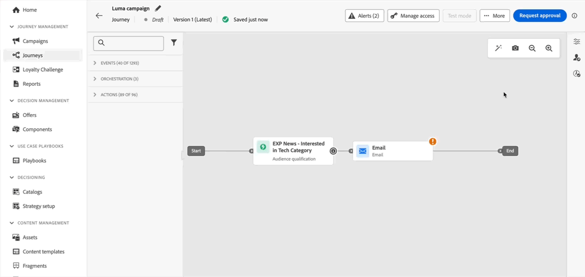

For more information, refer to the <a href="../conflict-prioritization/gs-conflict-prioritization.md">detailed documentation</a>.

Availability date: June 3rd, 2025

</td>
</tr>
</tbody>
</table>

### Improvements {#25-06-improv}

Improvements coming with this release are listed below.

* **Channel rule sets**

  * **Custom duration window** for capping -  A new **Every** field is now available in the channel rule sets configuration screen, allowing you to apply frequency capping rules over multiple days, weeks, or months, depending on the specified duration.

  * **Hourly reset capping frequency** - You can now apply capping on an hourly basis for channel rule sets. This capability is only available for a set of organizations (Limited Availability). Please contact your customer care to get it enabled. 

  * **Daily duration** - Previously available in Limited Availability, "Daily" frequency capping in channel rule sets is now available to all customers.

  For more information, refer to the [detailed documentation](../conflict-prioritization/channel-capping.md).

* **Code-based experiences**

  * Adding a decision policy is now available in code-based experience content templates, where it can be used to leverage offers in editable form fields. [Read more](../code-based/code-based-form-fields.md)

  * From the code-based experience journey or campaign edition screen, you can now directly add a decision policy, without opening the personalization editor. [Read more](../code-based/create-code-based.md#edit-code)

* **Custom CSS support in the Email Designer**

  Journey Optimizer now allows you to add custom CSS to your email content directly within the Email Designer. [Read more](../email/custom-css.md)

* **New tabbed navigation for campaigns**

  A new navigation pattern allows for quicker access to content authoring and supports further expansion of settings across campaigns. [Read more](../campaigns/create-campaign.md)

* **Decisioning**

  * **Sandbox copy & Decisioning** (availability date: June 3rd, 2025) - Decisioning objects can now be copied between sandboxes, streamlining testing and deployment workflows. [Read more](../configuration/copy-objects-to-sandbox.md#decisioning)

  * **Decision item attribute support for decisioning rules** (availability date: June 4th, 2025) - You can now leverage decision item attributes to create decisioning rules. [Read more](../experience-decisioning/rules.md#create)

* **Interactive Message Execution API update** - Availability date: June 6th, 2025 

  The Interactive Message Execution API now allows you to delete the schedule of upcoming campaigns execution. [Read more](https://developer.adobe.com/journey-optimizer-apis/references/messaging/){target="_blank"}

## May '25 release notes {#25-5-rn}

<!--**Release date**: May 20-21, 2025-->

### New capabilities {#25-05-features}

New capabilities coming with this release are detailed below.

<table>
<thead>
<tr>
<th><strong>Calendar View for Campaign and Journey inventory</strong> </th>
</tr>
</thead>
<tbody>
<tr>
<td>

A calendar view is now available in the journeys and campaigns lists. It allows you to visualize all journeys and campaigns activations in the respective lists.

This change is currently only available for a set of organizations (Limited Availability). To request access, use <a href="https://forms.cloud.microsoft/r/FC49afuJVi" target="_blank">this form</a>.

For more information, refer to these sections: <a href="../building-journeys/journey-ui.md">Browse & filter your journeys</a>, <a href="../campaigns/manage-campaigns.md">Access campaigns</a>.

Availability date: May 28, 2025

</td>
</tr>
</tbody>
</table>

<table>
<thead>
<tr>
<th><strong>Adobe Experience Manager Content fragment integration</strong> </th>
</tr>
</thead>
<tbody>
<tr>
<td>

With the integration of Adobe Experience Manager and Adobe Journey Optimizer, you can now effortlessly use Adobe Experience Manager Content Fragments within your Journey Optimizer content. This seamless connection makes it easier to access and use your AEM content directly in Journey Optimizer.

Previously available for a limited set of organizations (LA), this capability is now GA with the following enhancement: you can now define placeholders and map personalization values within the fragment signature using the Editor mode.

<ul>
<!--li>Create offers by directly selecting an AEM Content Fragment.</li>
<li>Define placeholders and map personalization values within the fragment signature using the Editor mode.</li-->
</ul>
 
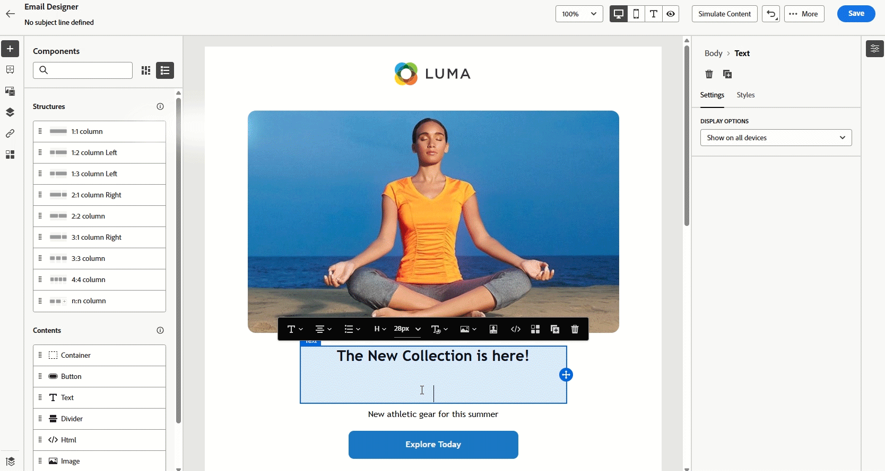

For more information, refer to the <a href="../integrations/aem-fragments.md">detailed documentation</a>.

Availability date: May 23, 2025

</td>
</tr>
</tbody>
</table>

<table>
<thead>
<tr>
<th><strong>Adobe Experience Manager Dynamic media integration</strong> </th>
</tr>
</thead>
<tbody>
<tr>
<td>

Dynamic media assets are now directly available and accessible in Journey Optimizer. This integration enables you to:

<ul>
<li>Centrally manage assets with real-time updates.</li>
<li>Modify your assets settings such as width and height instantly.</li>
<li>Customize Dynamic Media templates by updating your content and adding personalization fields.</li>
</ul>
 
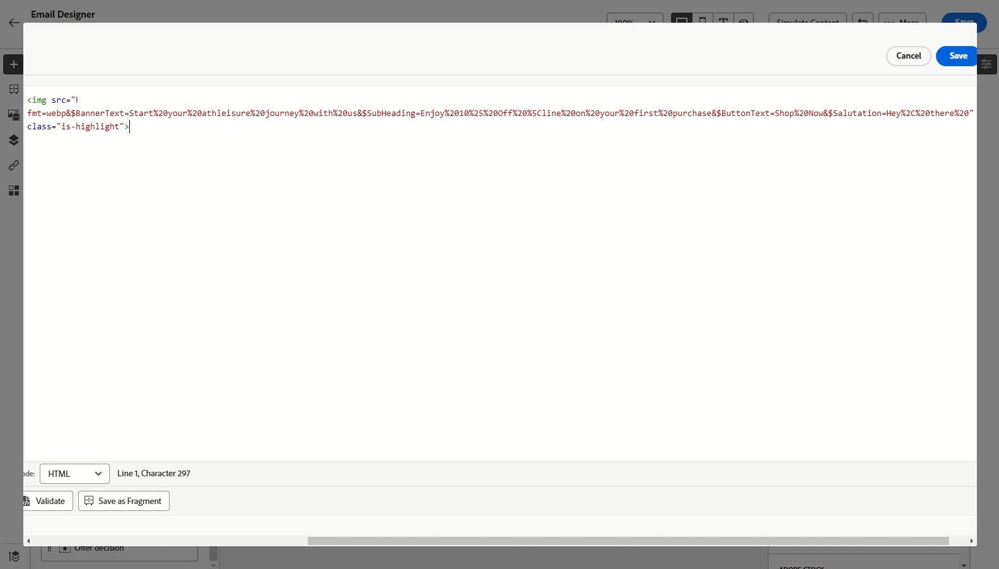

Previously released in Limited Availability, this capability is now available to all environments (General Availability).

For more information, refer to the <a href="../integrations/aem-dynamic.md">detailed documentation</a>.

Availability date: May 23, 2025

</td>
</tr>
</tbody>
</table>

<table>
<thead>
<tr>
<th><strong>Supplemental ID for event-triggered journeys</strong> </th>
</tr>
</thead>
<tbody>
<tr>
<td>

You can now trigger journeys using a profile ID along with another identifier, such as an order ID, subscription ID, or prescription ID, allowing the same profile to be in the same journey multiple times at once. This enables scenarios like managing multiple orders or subscriptions in parallel, with each instance following its own path through the journey.

For more information, refer to the <a href="../building-journeys/supplemental-identifier.md">detailed documentation</a>.

This capability is only available for a set of organizations (Limited Availability). To gain access, contact your Adobe representative.

Availability date: May 23, 2025

</td>
</tr>
</tbody>
</table>

<table>
<thead>
<tr>
<th><strong>Simulate content variations</strong> </th>
</tr>
</thead>
<tbody>
<tr>
<td>
<!--p>Previously available in beta, content variations simulation is now generally available (GA). It allows you to preview different variations of your content using sample input data uploaded from a CSV or JSON file or added manually. All the attributes used in your content for personalization are automatically detected by the system and can be used for your tests to create multiple variants.</p-->

Previously released in Limited Availability, this capability is now available to all environments. With this General Availability release, the feature now includes support for multilingual content and content experiments, enabling you to test variations across different languages and treatments. Additionally, it now supports contextual attributes (in addition to profile attributes), allowing for even more dynamic and situational content testing.

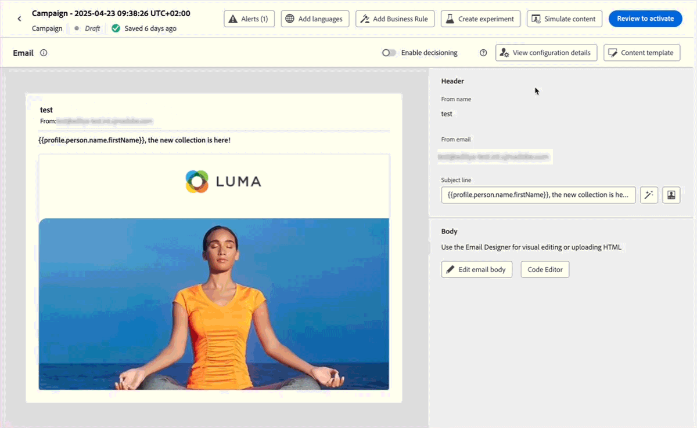

For more information, refer to the <a href="../test-approve/simulate-sample-input.md">detailed documentation</a>.

Availability date: May 23, 2025

</td>
</tr>
</tbody>
</table>

<table>
<thead>
<tr>
<th><strong>Synchronize read audience schedule with batch segmentation job</strong> </th>
</tr>
</thead>
<tbody>
<tr>
<td>

You can now trigger daily journey runs after batch segmentation completion. This option is now available in daily-scheduled journeys to all customers. It allows you to define for a time window of up to 6 hours to wait for audience data from batch segmentation jobs, ensuring journeys run with the most up-to-date data or are skipped if not ready.

Previously released in Limited Availability, this capability is now available to all environments (General Availability).

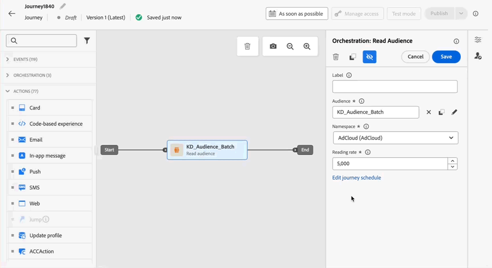

For more information, refer to the <a href="../building-journeys/read-audience.md#schedule">detailed documentation</a>.

Availability date: May 20, 2025

</td>
</tr>
</tbody>
</table>

<table>
<thead>
<tr>
<th><strong>Custom SMS provider</strong> </th>
</tr>
</thead>
<tbody>
<tr>
<td>

Journey Optimizer now allows you to configure additional SMS providers beyond the default options: Sinch, Infobip, and Twilio. With custom SMS provider configuration, you can integrate third-party providers directly, leverage advanced payload customization for dynamic messaging, and manage consent preferences (opt-in/opt-out) to ensure compliance.

For more information, refer to the <a href="../sms/sms-configuration-custom.md">detailed documentation</a>.

Previously released in Limited Availability, this capability is now available to all environments (General Availability).

Availability date: May 20, 2025

</td>
</td>
</tr>
</tbody>
</table>

<table>
<thead>
<tr>
<th><strong>Themes in the Email Designer</strong> </th>
</tr>
</thead>
<tbody>
<tr>
<td>

You can now quickly apply pre-approved themes to ensure brand consistency across all emails, speed up your campaign creation process, and independently produce high-quality emails while reducing dependency on design teams.

This capability is currently in beta version and only available to beta customers. To join the beta program, contact your Adobe representative.

For more information, refer to the <a href="../email/apply-email-themes.md">detailed documentation</a>.

Availability date: May 14, 2025

</td>
</tr>
</tbody>
</table>

<table>
<thead>
<tr>
<th><strong>Decisioning - New AI formula builder</strong> </th>
</tr>
</thead>
<tbody>
<tr>
<td>

You can now create specific Decisioning ranking formulas by defining and combining criteria from a new improved interface. Instead of relying only on a static offer priority, you can define custom ranking formulas that combine AI model scores, offer priorities, profile attributes, offer attributes, and contextual signals through a guided interface.

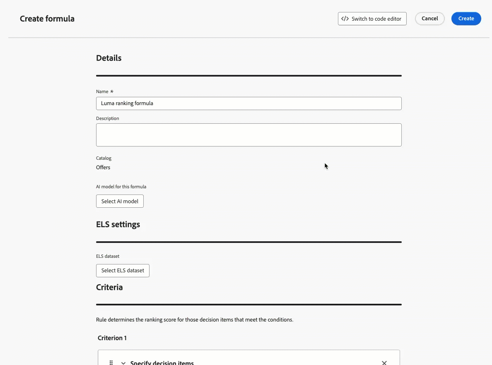

For more information, refer to the <a href="../experience-decisioning/ranking/ranking-formulas.md">detailed documentation</a>.

Availability date: May 14, 2025

</td>
</tr>
</tbody>
</table>

### Improvements {#25-05-improv}

Improvements coming with this release are listed below.

* **New campaign objects support for sandbox copy** - Availability date: May 15, 2025

  When copying campaigns across multiple sandboxes using the package export and import capabilities, the following dependencies are now also copied: channel configurations, experiment variants and settings, decision policies and items. [Read more](../configuration/copy-objects-to-sandbox.md)
  
* **Folders for landing pages**  - Availability date: May 9, 2025

  To easily manage your landing pages, you can now use folders to organize them more effectively into a structured hierarchy. [Read more](../landing-pages/manage-lp.md)

* **Direct Mail: SSH Key support for SFTP connections** - Availability date: May 5, 2025

  In the Direct Mail file routing configuration, in addition to the existing SFTP with password authentication type, you can now export your direct mail file to an SFTP server with SSH key authentication. [Read more](../direct-mail/direct-mail-configuration.md)

* **Pills activation for personalization** - Availability date: May 5, 2025

  A new "Pills" button has been added to the personalization editor. When enabled, profile and contextual attributes display as pills, enhancing the readability of your code. [Read more](../personalization/personalization-build-expressions.md#options)

  >[!AVAILABILITY]
  >
  >This capabilitity will be gradually rolled out to all environments over the next 30 days.

* **'Redirect to URL' support in Web channel** - Availability date: May 20, 2025

  The Journey Optimizer Web channel now enables you to redirect visitors to another existing URL rather than authoring a new variation in the visual editor. This capability can be used to run experiments comparing two completely different pages instead of just changing a few elements within a page. [Read more](../web/create-web.md#web-redirect-to-url)

* **Folders for templates and fragments** - Availability date: May 20, 2025

  Folders let you organize your objects more easily and effectively into a structured hierarchy. Previously available for a set of organizations (LA), folders are now available to all users (GA) to manage their content templates and fragments. Read more in the [Content templates](../content-management/access-content-templates.md#folders) and [Fragments](../content-management/manage-fragments.md#folders) sections. 

* **Click tracking in email templates** - Availability date: May 20, 2025

  Click tracking on `<area>` elements within image maps in email content is now natively supported in [!DNL Journey Optimizer]. This is to ensure that image map areas receive the same tracking wrapping, tracking data, and appended parameters as standard hyperlinks. [Learn more on message tracking](../email/message-tracking.md#manage-tracking)

<!--
* **Decisioning - Leverage Adobe Experience Platform datasets** 
  
  Journey Optimizer now allows you to leverage Adobe Experience Platform datasets in the following Decisioning objects: eligibility rules, ranking formulas, and capping rules.-->

* **Right rail in campaigns list** - Availability date: May 20, 2025

  In the campaign list, selecting a campaign now opens a pane displaying its details.

<!--* **Form fields in code-based experience content**

  In content templates, you can now define specific JSON or HTML fields which enable non-technical users to easily edit content in code-based experiences without the need to manipulate code.-->

<!--* **Subdomains - 'Custom delegation' method**  
  In addition to the full delegation and the CNAME method, a new subdomain configuration method is now available: the Custom delegation method, which enables you to fully own controlling and maintaining all aspects of DNS that are required for delivering, rendering, and tracking messages.
  -->

## April '25 release notes {#25-4-rn}

**Release date**: April 29-30, 2025

### New capabilities {#25-04-features}

New capabilities coming with this release are listed below.

<table>
<thead>
<tr>
<th><strong>Personalization Editor - Learn by Doing</strong> </th>
</tr>
</thead>
<tbody>
<tr>
<td>

A personalization playground is now available, where you can experiment with personalization expressions. It allows you to explore sample templates and payloads to help you get started and try out your own personalization expressions.

For more information, refer to the <a href="../personalization/personalize.md#playground">detailed documentation</a>.

Availability date: April 24, 2025

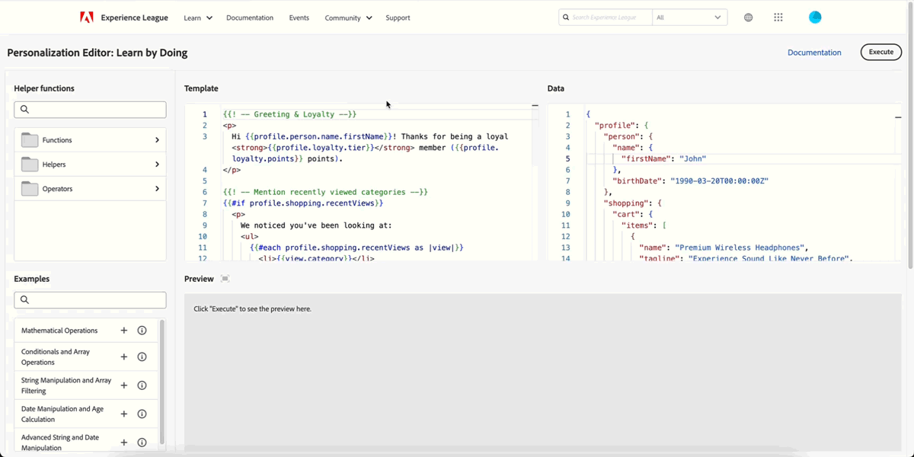
</td>
</tr>
</tbody>
</table>

<!--table>
<thead>
<tr>
<th><strong>Adobe Experience Manager as a Cloud Service integration</strong> </th>
</tr>
</thead>
<tbody>
<tr>
<td>

The integration between Adobe Journey Optimizer and Adobe Experience Manager as a Cloud Service is now released in General Availability (GA). This integration enables seamless content sourcing and management for personalized customer journeys.

For more information, refer to the <a href="../integrations/aem-templates.md">detailed documentation</a>.

</td>
</tr>
</tbody>
</table-->

<!--<table>
<thead>
<tr>
<th><strong>Simulate content variations (General Availability)</strong> </th>
</tr>
</thead>
<tbody>
<tr>
<td>

Previously available in beta, content variations simulation is now generally available (GA). It allows you to preview different variations of your content using sample input data uploaded from a CSV or JSON file or added manually. All the attributes used in your content for personalization are automatically detected by the system and can be used for your tests to create multiple variants.

With the General Availability release, the feature now includes support for multilingual content and content experiments, enabling you to test variations across different languages and treatments. Additionally, it now supports contextual attributes (in addition to profile attributes), allowing for even more dynamic and situational content testing.

</td>
</tr>
</tbody>
</table>-->

<table>
<thead>
<tr>
<th><strong>LINE channel</strong> </th>
</tr>
</thead>
<tbody>
<tr>
<td>

Adobe Journey Optimizer has expanded its cross-channel capabilities to include support for the LINE channel. This enhancement allows you to create, edit, and preview LINE experiences enabling more personalized and engaging interactions. With LINE, you can connect with more customers, send relevant content, and improve your engagement.

The LINE channel is enabled for Adobe Journey Optimizer customers upon request. Contact Adobe Customer Care or your Adobe representative to activate the feature for your organization.

For more information, refer to the <a href="../../rp_landing_pages/line-landing-page.md">detailed documentation</a>.
</td>
</tr>
</tbody>
</table>

<!--table>
<thead>
<tr>
<th><strong>Custom SMS provider (General Availability)</strong> </th>
</tr>
</thead>
<tbody>
<tr>
<td>

Adobe Journey Optimizer now supports custom SMS providers, allowing you to integrate your preferred SMS services for enhanced communication flexibility.

For more information, refer to the <a href="../sms/sms-configuration-custom.md">detailed documentation</a>.
</td>
</tr>
</tbody>
</table-->

<table>
<thead>
<tr>
<th><strong>Journey metrics</strong> </th>
</tr>
</thead>
<tbody>
<tr>
<td>

Journey metrics are now available, allowing you to measure the impact of your activities across the key metrics of your business and to provide clearer insights into your performance.

 
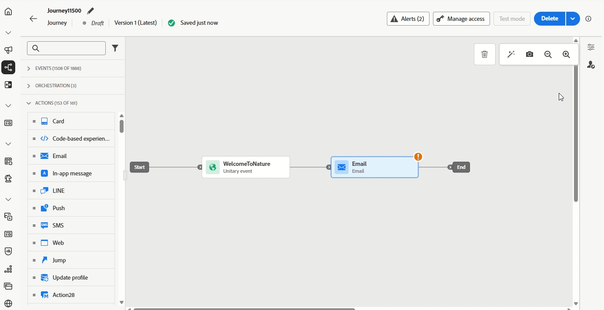

For more information, refer to the <a href="../building-journeys/success-metrics.md">detailed documentation</a>.

Availability date: April 9, 2025

</td>
</tr>
</tbody>
</table>

<!--<table>
<thead>
<tr>
<th><strong>Calendar view for campaign and journey inventory (Limited Availability)</strong> </th>
</tr>
</thead>
<tbody>
<tr>
<td>

A new calendar view is now available for campaigns and journey activations. This feature provides a visual representation of scheduled activities, allowing you to view and manage your campaigns and journeys more effectively. Selecting a calendar item opens a right rail with detailed information. This feature is currently in Limited Availability.

</td>
</tr>
</tbody>
</table>-->

<table>
<thead>
<tr>
<th><strong>Adobe Express integration (Limited Availability)</strong> </th>
</tr>
</thead>
<tbody>
<tr>
<td>

Adobe Journey Optimizer now integrates with Adobe Express, enabling you to seamlessly connect your creative assets with journey orchestration. This integration simplifies the process of designing and deploying personalized content across campaigns. 

This integration is currently unavailable for use with Healthcare Shield or Privacy and Security Shield.

For more information, refer to the <a href="../integrations/express.md">detailed documentation</a>.

</td>
</tr>
</tbody>
</table>

<table>
<thead>
<tr>
<th><strong>Trigger daily journey runs after batch segmentation completion (Limited Availability)</strong> </th>
</tr>
</thead>
<tbody>
<tr>
<td>

For daily-scheduled journeys, a new option allows you to define a time window of up to 6 hours to wait for audience data from batch segmentation jobs, ensuring journeys run with the most up-to-date data or are skipped if not ready. The Trigger after batch audience evaluation option is only available for a set of organizations (Limited Availability). To gain access, contact your Adobe representative.

For more information, refer to the <a href="../building-journeys/read-audience.md#schedule">detailed documentation</a>.

</td>
</tr>
</tbody>
</table>

<!--table>
<thead>
<tr>
<th><strong>Themes in the Email Designer (Beta)</strong> </th>
</tr>
</thead>
<tbody>
<tr>
<td>

You can now quickly apply pre-approved styling themes to your email content to ensure brand consistency across all emails, speed up your campaign creation process and independently produce hight-quality emails while reducing dependency on design teams.

This capability is currently in beta version and only available to beta customers. To join the beta program, contact your Adobe representative.

For more information, refer to the <a href="../content-management/brands-score.md">detailed documentation</a>.

Availability date: May 5, 2025

</td>
</tr>
</tbody>
</table-->

<table>
<thead>
<tr>
<th><strong>Brand alignment score (Beta)</strong> </th>
</tr>
</thead>
<tbody>
<tr>
<td>

The Brand alignment score feature offers clear feedback directly in the Email Designer, helping you see whether your content aligns with your brand's tone, style, and guidelines. This feature is available in Beta.

For more information, refer to the <a href="../content-management/brands-score.md">detailed documentation</a>.

</td>
</tr>
</tbody>
</table>

<!--
<table>
<thead>
<tr>
<th><strong>Decisioning - New AI formula builder</strong> </th>
</tr>
</thead>
<tbody>
<tr>
<td>

You can now create specific Decisioning ranking formulas by defining and combining criteria from a new improved interface. Ranking formulas allow you to define rules that will determine which decision items should be presented first, rather than taking into account the priority scores.

For more information, refer to the <a href="../content-management/brands-score.md">detailed documentation</a>.

Availability date: May 5, 2025

</td>
</tr>
</tbody>
</table>
-->

### Improvements {#25-04-improv}

**Campaigns preview API**

  New APIs are available to preview campaigns, in addition to existing proof-sending capabilities. [Read more](https://developer.adobe.com/journey-optimizer-apis/references/simulations/#operation/createCampaignPreview){target="_blank"}.

**Sandbox Tooling**

* **Sandbox tooling for custom actions**  

  Custom actions are now included in the list of Adobe Journey Optimizer objects that can be copied using the sandbox tooling feature, streamlining testing and deployment. [Read more](../configuration/copy-objects-to-sandbox.md)

* **Sandbox tooling for campaigns** - Availability date: April 3, 2025

    You can now copy campaigns across multiple sandboxes by using package export and import capabilities. Campaigns are copied along with all items related to the profile, audience, schema, inline messages, and dependent objects. Some items are not copied, such as decision items, data usage labels, and language settings. [Read more](../configuration/copy-objects-to-sandbox.md#custom-actions)

**Personalization**

* **New contextual attribute**  

  A new contextual attribute, **Message Profile Id**, is now available to select from the personalization editor. This is a message-oriented attribute identifying uniquely each message sent to each targeted profile in a delivery. This unique identifier can be used for example as a URL tracking parameter to distinguish each link opened or clicked by recipients.

* **Populated attributes in attributes pane** - Availability date: April 2, 2025

    The attributes pane in the personalization editor now shows only populated attributes by default. To view all attributes, use the settings button to toggle off the **[!UICONTROL Show only populated attributes]** option. [Read more](../personalization/personalization-build-expressions.md)

**Email channel**

* **Personalized URL tracking** - Availability date: April 30, 2025

  For increased flexibility and control over your email settings, you can now personalize all your URL tracking parameters at once at the email channel configuration level, instead of doing it in the Email Designer for each link in your content. [Read more](../email/surface-personalization.md#personalize-url-tracking)

* **Email Designer** - Availability date: April 1, 2025

    To enhance accessibility in Journey Optimizer, two new fields are now available in the Email Designer: they correspond to the `<title>` element and `lang` attribute in the `<html>` element of your email content. You can define these settings in addition to the **[!UICONTROL Preheader]** field, in the email **[!UICONTROL Body]** section. [Read more](../email/email-metadata.md)

**Use case playbooks**

* **Playbooks authoring and sharing (Private beta)** - You can now create, manage, and share your own use case playbooks. This capability is currently only available for a set of organizations as a private beta. To gain access, contact your Adobe representative. [Read more](../start/ai-features.md#playbooks)

**Navigation**

* **Content management** - Availability date: April 2, 2025

    To easily manage your content templates and fragments, you can now use folders to organize them more effectively into a structured hierarchy. Learn more in the [Content templates](../content-management/access-content-templates.md#folders) and [Fragments](../content-management/manage-fragments.md#folders) sections.

    >[!AVAILABILITY]
    >
    >This improvement is only available for a set of organizations (Limited Availability).

<!--- **Folders for content templates and fragments** - Availability date: May 5, 2025

  Previously available for a set of organizations (LA), folders are now available to all users (GA) to manage their content templates and fragments. Folders let you organize your content templates and fragments more easily and effectively into a structured hierarchy.

<!--- **Right rail in campaigns list**  

  A right rail has been added to the campaigns list, providing detailed information when a campaign is selected.-->

<!--**Playbooks**

- **Create your own playbooks (Beta)**
  
  You can now create your own playbooks in Adobe Journey Optimizer, enabling greater customization and flexibility in journey planning.-->

## March '25 release notes {#25-3-rn}

### New capabilities {#25-03-features}

New capabilities coming with this release are detailed below.

<!--table>
<thead>
<tr>
<th><strong>Integration with Adobe Express (Limited Availability)</strong> </th>
</tr>
</thead>
<tbody>
<tr>
<td>

The Adobe Express integration in Adobe Journey Optimizer lets you use Adobe Express's editing tools directly during content creation, enabling you to resize, remove backgrounds, crop, and convert assets to JPEG or PNG.

Adobe Express integration in Adobe Journey Optimizer is currently only available for a set of organizations (Limited Availability). It cannot be deployed for use with Healthcare Shield or Privacy and Security Shield.

For more information, refer to the <a href="../integrations/express.md">detailed documentation</a>.

 

</td>
</tr>
</tbody>
</table-->

<!--table>
<thead>
<tr>
<th><strong>Journey metrics</strong> </th>
</tr>
</thead>
<tbody>
<tr>
<td>

Journey metrics are now available, allowing you to measure the impact of your activities across the key metrics of your business and to provide clearer insights into your performance.

For more information, refer to the <a href="../building-journeys/success-metrics.md">detailed documentation</a>.

</td>
</tr>
</tbody>
</table-->

<!-- table>
<thead>
<tr>
<th><strong>Calendar view for journeys (Limited Availability)</strong> </th>
</tr>
</thead>
<tbody>
<tr>
<td>

A calendar view is now available in Journey Optimizer to visualize all journeys activations. From this view, you can browse your journeys and check details and properties.

This change is only available for a set of organizations (Limited Availability). To gain access, contact your Adobe representative.

For more information, refer to the <a href="../conflict-prioritization/rule-sets.md">detailed documentation</a>.

</td>
</tr>
</tbody>
</table-->

<table>
<thead>
<tr>
<th><strong>Integration with Dynamic Media (Limited Availability)</strong> </th>
</tr>
</thead>
<tbody>
<tr>
<td>

Dynamic media assets are now directly available and accessible in Journey Optimizer. This integration enables you to:
<ul>
<li>Centrally manage assets with real-time updates</li>
<li>Modify your assets settings such as width and height instantly</li>
<li>Customize Dynamic Media templates by updating your content and adding personalization fields</li>
</ul>

This integration is only available for a set of organizations (Limited Availability). To gain access, contact your Adobe representative.

For more information, refer to the <a href="../integrations/aem-dynamic.md">detailed documentation</a>.

</td>
</tr>
</tbody>
</table>

<table>
<thead>
<tr>
<th><strong>Integration with Adobe GenStudio (Limited Availability)</strong> </th>
</tr>
</thead>
<tbody>
<tr>
<td>

To enhance marketing efficiency and to maintain brand consistency, you can now seamlessly integrate GenStudio for Performance Marketing experiences with Journey Optimizer. This enable you to leverage GenStudio's AI-power content creation alongside Journey Optimizer's advanced orchestration capabilities.

The use of the GenStudio integration in Journey Optimizer is currently unavailable for use with the Healthcare Shield or Privacy and Security Shield (Limited Availability).

For more information, refer to the <a href="../integrations/genstudio.md">detailed documentation</a>.

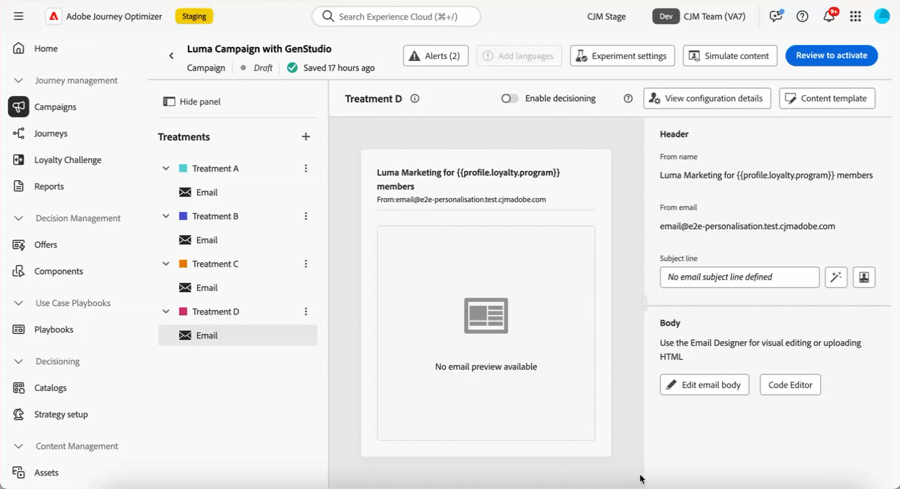
</td>
</tr>
</tbody>
</table>

<table>
<thead>
<tr>
<th><strong>Flexible audience evaluation (GA)</strong> </th>
</tr>
</thead>
<tbody>
<tr>
<td>

Previously available for a set of organizations (LA), Flexible audience evaluation is now available to all users (GA). This feature lets you run a segmentation job on demand for selected audiences, ensuring that you always have the most up-to-date audience data before targeting them into Journey Optimizer journeys and campaigns.

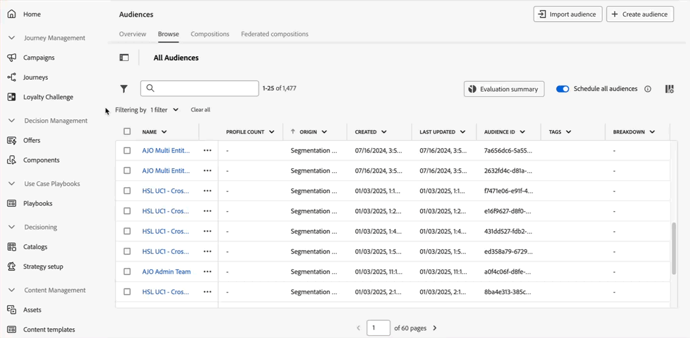

For more information, refer to the <a href="../audience/creating-a-segment-definition.md#flexible">detailed documentation</a>.

</tr>
</tbody>
</table>
</table>

<!--table>
<thead>
<tr>
<th><strong>LINE channel (Limited Availability)</strong> </th>
</tr>
</thead>
<tbody>
<tr>
<td>

Adobe Journey Optimizer has expanded its cross-channel capabilities to include support for the LINE channel. This enhancement allows you to create, edit, and preview LINE experiences enabling more personalized and engaging interactions. With LINE, you can connect with more customers, send relevant content, and improve your engagement.

This capability is only available for a set of organizations (Limited Availability). To gain access, contact your Adobe representative.

For more information, refer to the <a href="../conflict-prioritization/rule-sets.md">detailed documentation</a>.

</td>
</tr>
</tbody>
</table-->

### Improvements {#25-03-improv}

**Personalization editor** (availability date: March 12)

The Journey Optimizer personalization editor has been updated with new capabilities:

* **Updated Code Editor Design** – A cleaner, modern interface for improved usability and focus.
* **Search and Replace** – Added functionality to quickly find and replace content within the editor.
* **Undo and Redo Support** – Allows you to easily revert or reapply changes.
* **Customizable Font Size** – Enables adjustment of the editor's font size for better readability.
* **Inline JSON Validation** – Provides real-time client-side validation for JSON content to speed up error detection.
* **Auto-Complete for Profile and Context Attributes** – Offers smart suggestions to streamline content creation.
* **Enhanced Syntax Highlighting** – Improves readability by making code structure more visually distinct.

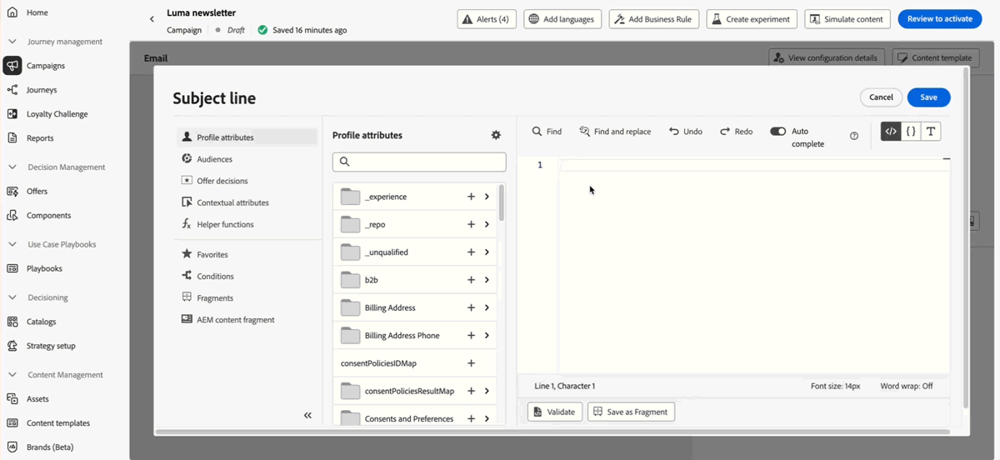

For more information, refer to the [detailed documentation](../personalization/personalization-build-expressions.md).

**Approvals**

When defining the conditions for an approval policy, you now have the option to filter by Tag and/or Object Category.

For more information, refer to the [detailed documentation](../test-approve/approval-policies.md).

**Configuration**

* You can now assign Adobe Experience Platform Unified Tags to channel configurations. This allows you to easily classify them, and improve search and navigation in all lists. [Learn more](../configuration/channel-surfaces.md#channel-config-tags)

* When setting up or editing an email subdomain in Journey Optimizer, you can now choose to manage the associated DMARC record on your own, if available on the parent domain. [Learn more](../configuration/dmarc-record.md#set-up-dmarc)

**Business rules**

You can now use daily frequency capping in journeys and campaigns with batch segmentation. To ensure accuracy for daily frequency capping rules, make sure you choose the highest priority namespace while authoring a campaign or journey. Learn more about namespace priority in the [Platform Identity Service guide](https://experienceleague.adobe.com/en/docs/experience-platform/identity/features/identity-graph-linking-rules/namespace-priority){target="_blank"}

As a reminder, daily frequency capping in rule sets is only available for a set of organizations (Limited Availability). To gain access, contact your Adobe representative.

For more information on business rules, refer to the [detailed documentation](../conflict-prioritization/rule-sets.md).

**Content templates**

HTML type content templates are now deprecated. Note that you can still use existing HTML content templates previously created in [!DNL Journey Optimizer]. [Learn more on content templates](../content-management/content-templates.md)

**Consent policies**

You can now leverage custom consent policies through marketing actions in transactional email channel configurations. [Learn more](../action/consent.md#surface-marketing-actions)

<!--**Deliverability**

You can now choose to have your emails relayed to your SMTP servers instead of being sent directly from Journey Optimizer to ISPs. This allows you to route final email deliveries through your own Mail Transfer Agents and IPs, or to perform final validations on the emails before sending them to your recipients. The SMTP relay capacity is available on demand - contact your Adobe representative.-->

## February '25 release notes {#25-02-rn}

**Release date**: February 18-19, 2025

### New capabilities {#25-02-features}

New capabilities coming with this release are detailed below.

<table>
<thead>
<tr>
<th><strong>Create & manage business rules</strong> </th>
</tr>
</thead>
<tbody>
<tr>
<td>

You can now create business rules using rule sets. Rule sets are groups of rule that help you limit sent messages within campaigns and journey actions across channels, and to control profiles entries into journeys.

<ul><li>Create channel rule sets to restrict the number of messages sent across one or multiple channels. Apply them to campaigns or journey actions to enforce the rules defined in the rule set. Channel rule set allows you to apply capping rules based on communication types. For example, set a rule set to limit "promotional messages" and another for "newsletters". Apply the appropriate rule set in your campaign or journey action depending on type of communication you are sending.</li>
<li> Create journey rule sets to control profile entries into journeys. Limit how often a profile can enter a journey within a given period or the number of journeys a profile can be enrolled in simultaneously. Apply these at the journey level to ensure proper entry management.</li></ul>

Previously available for a set of organizations (LA), business rules are now available to all users (GA). Journey domain business rules continue to be available only for a limited set of organizations (LA).

For more information, refer to the <a href="../conflict-prioritization/rule-sets.md">detailed documentation</a>.

</td>
</tr>
</tbody>
</table>

<table>
<thead>
<tr>
<th><strong>Generate landing pages with AI Assistant</strong> </th>
</tr>
</thead>
<tbody>
<tr>
<td>

You can now craft compelling content for your landing pages, including full-page designs, personalized text, and customized visuals, with the help of AI Assistant.

For more information, refer to the <a href="../content-management/generative-full-content.md">detailed documentation</a>.

</td>
</tr>
</tbody>
</table>

<table>
<thead>
<tr>
<th><strong>Brands with AI Assistant (Beta)</strong> </th>
</tr>
</thead>
<tbody>
<tr>
<td>

You can now set your own Brands to define your brand's visual and verbal identity. 

This capability is released as a private beta to a limited set of customers. It will be progressively available to all customers in future releases.

For more information, refer to the <a href="../content-management/brands.md">detailed documentation</a>.

</td>
</tr>
</tbody>
</table>

<table>
<thead>
<tr>
<th><strong>Troubleshoot your custom actions</strong> </th>
</tr>
</thead>
<tbody>
<tr>
<td>

You can now validate a custom action configuration by making real API calls directly from Adobe Journey Optimizer. This new capability helps you troubleshoot your custom actions before or after using them in a journey. 

For more information, refer to the <a href="../action/troubleshoot-custom-action.md">detailed documentation</a>.

<!--p> This capability is only available for a set of organizations (Limited Availability). To gain access, contact your Adobe representative.</p-->
</td>
</tr>
</tbody>
</table>

<table>
<thead>
<tr>
<th><strong>Flexible audience evaluation (Limited Availability)</strong> </th>
</tr>
</thead>
<tbody>
<tr>
<td>

Flexible audience evaluation lets you run a segmentation job on demand for selected audiences, ensuring that you always have the most up-to-date audience data before targeting them into Journey Optimizer journeys and campaigns.

For more information, refer to the <a href="../audience/creating-a-segment-definition.md#flexible">detailed documentation</a>.

This capability is only available for a set of organizations (Limited Availability). To gain access, contact your Adobe representative.

Availability date: Jan 28, 2025

</tr>
</tbody>
</table>
</table>

### Improvements {#25-02-improvements}

The improvements below come with the February update.

* **Dataset Time-to-live (TTL)** - Starting this month, a time-to-live (TTL) guardrail will be rolled out to Journey Optimizer system-generated datasets in new sandboxes and new orgs as follows:

    * 90 days for data in the profile store
    * 13 months for data in the data lake

    This change will be rolled out to existing customer sandboxes in a subsequent phase.

    Learn more about this update in [the dedicated FAQ](../data/datasets-ttl.md#frequently-asked-questions).

<!--* **Playbooks** - You can now create and publish your own Use Case Playbooks in Journey Optimizer.-->

* **Direct mail** - A new server type, Data landing zone, is now supported for file routing  in the direct mail channel configuration. [Read more](../direct-mail/direct-mail-configuration.md#file-routing-configuration)

* **SMS** - You can now manage SMS message delivery from multi-regional endpoints by overriding delivery, feedback, inbound, and callback URLs. To support this, a new field Override URL has been added to API Credentials configuration. This change is available with Sinch provider only. [Read more](../sms/sms-configuration-sinch.md)

* **Personalization** (Availability date: Jan 29, 2025) - New date/time helper functions are available for use in the personalization editor. [Read more](../personalization/functions/dates.md)

<!--
* The personalization editor has been enhanced with new capabilities such as Auto-complete, Search, and filtering options. You can also show or hide deprecated attributes.--> 

* **Email configuration** - If you are managing consent outside of Adobe, you can now set a custom unsubscribe email address and a custom one-click unsubscribe URL as part of your email channel configuration settings. [Read more](../email/list-unsubscribe.md#custom-managed)

    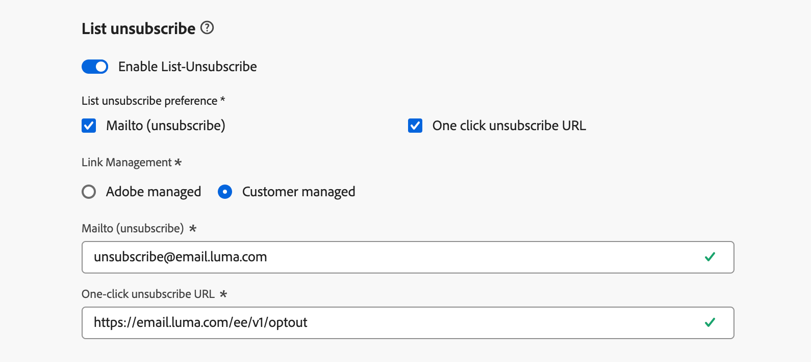{width="80%"}

* **Decisioning** (Availability date: Jan 28, 2025) - Decisioning now supports Object data types when editing the item catalog's schema. [Read more](../experience-decisioning/catalogs.md)
