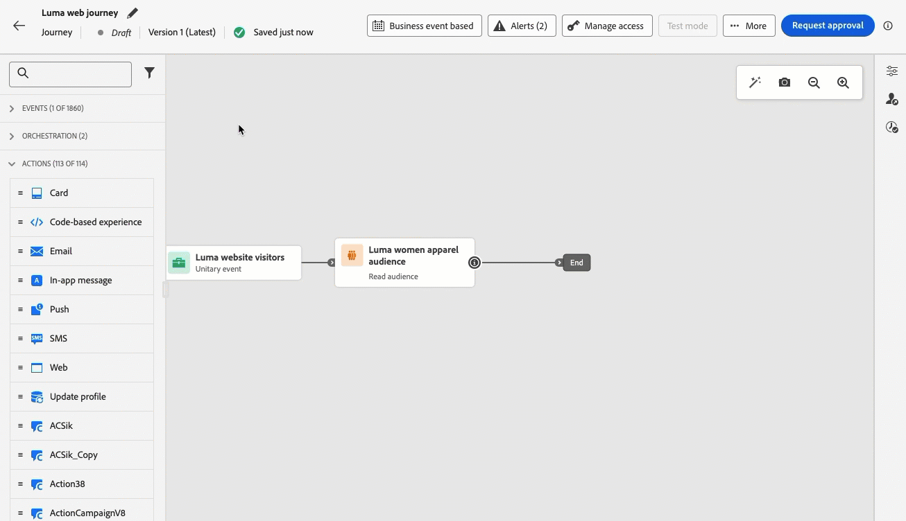

# Release notes {#release-notes}

>[!CONTEXTUALHELP]
>id="ajo_homepage_card1"
>title="What's new?"
>abstract="**Adobe Journey Optimizer** continuously delivers new features, enhancements to existing features, and bug fixes. All changes are consolidated on the last week of each month in these release notes."

[!DNL Adobe Journey Optimizer] continuously delivers new features, enhancements to existing features, and bug fixes. All changes are consolidated on the last week of each month in these release notes. [!DNL Adobe Journey Optimizer] is built natively on [!DNL Adobe Experience Platform] and inherits from its latest innovations and improvements. Learn more about these changes in [Adobe Experience Platform Release Notes](https://experienceleague.adobe.com/docs/experience-platform/release-notes/latest.html){target="_blank"}.

## October '24 early release notes {#24-10-rn}

>[!CAUTION]
>
>**Early release notes below are subject to change without prior notice until the release date**. Links, screens and updated documentation are published at the release date.

**Release date**: October 29-30, 2024

### New capabilities {#24-10-features}

This release brings the new capabilities detailed below.

<table>
<thead>
<tr>
<th><strong>Email Content Locking</strong> </th>
</tr>
</thead>
<tbody>
<tr>
<td>

Journey Optimizer now allows you to lock content in email templates, either by locking the entire template or specific structures and component. This allows you to prevent unintentional edits or deletions, giving you greater control over template customization, and improving the efficiency and reliability of your email campaigns.

For more information, refer to the <a href="../content-management/content-locking.md">detailed documentation</a>.

</td>
</tr>
</tbody>
</table>

<table>
<thead>
<tr>
<th><strong>Approvals in journeys and campaigns (General availability)</strong> </th>
</tr>
</thead>
<tbody>
<tr>
<td>

With approval policies, you can now set up an approval process within Journey Optimizer that allows marketing teams to ensure campaigns and journeys are reviewed and signed off by the appropriate stakeholders before they go live.

Previously available for a set of organizations (LA), approval policies are now available to all users (GA).

For more information, refer to the <a href="../test-approve/gs-approval.md">detailed documentation</a>.

</td>
</tr>
</tbody>
</table>

<table>
<thead>
<tr>
<th><strong>Email configuration personalization (General availability)</strong> </th>
</tr>
</thead>
<tbody>
<tr>
<td>

You can now define dynamic subdomains and personalized header parameters when creating email channel configurations, for increased flexibility and control over your email settings.

Using a personalized configuration in a campaign or a journey allows you to preview your email content to check for potential errors with the dynamic settings you defined.

Previously available for a set of organizations (LA), email configuration personalization is now available to all users (GA).

For more information, refer to the <a href="../email/surface-personalization.md">detailed documentation</a>.

</td>
</tr>
</tbody>
</table>

<table>
<thead>
<tr>
<th><strong>Test your content using sample input data (Beta)</strong> </th>
</tr>
</thead>
<tbody>
<tr>
<td>

Journey optimizer now allows you to test different variants of your email content by previewing it and sending proofs using sample input data uploaded from a CSV file or added manually. All the profiles attributes used in your content for personalization are automatically detected by the system and can be used for your tests to create multiple variants.

This capability is currently available as a beta.

<!--
For more information, refer to the <a href="../email/surface-personalization.md">detailed documentation</a>.
-->
</td>
</tr>
</tbody>
</table>

<table>
<thead>
<tr>
<th><strong>Conflict and priority management (Limited Availability)</strong> </th>
</tr>
</thead>
<tbody>
<tr>
<td>

In Journey Optimizer, managing the volume and timing of campaigns and journeys is essential to avoid overwhelming customers with too many interactions. Journey Optimizer now offers several tools for conflict management and prioritization.

<ul><li><b>Journey frequency capping</b>: You can now create rule sets to apply to your journeys, allowing you to limit the number of journeys for a profile per day, week, or month, as well as control the number of concurrent journeys running simultaneously.</li>
<li><b>Priority score</b>: You can now assign a priority score to a campaign or a journey, ranging from 0 to 100. A higher number indicates a higher priority. When two campaigns or journey actions use the same channel configuration, Journey Optimizer will select the one with the highest priority score. If the campaigns have the same score, the campaign that was least recently modified will be chosen.</li>
<li><b>View potential conflicts</b>: A new "View potential conflicts" button in journeys and campaigns now allows you to identify overlap with other journeys or campaigns such as the start date, the targeted audience, or the selected channel configuration.</li>
<li><b>Journey Arbitration</b>: This new capability enables you to prioritize the most important journeys for your customers. You can create a rule to suppress entry into a lower priority journey when a customer qualifies for an upcoming journey of higher priority.</li></ul>

<!--
For more information, refer to the <a href="../email/surface-personalization.md">detailed documentation</a>.
-->

Conflict and priority management capabilities are available in Limited Availability to a select group of customers. Please note that these features will be gradually rolled out to more users in the future. Reach out to your account team if interested in being added to the waitlist for these features.

</td>
</tr>
</tbody>
</table>

<table>
<thead>
<tr>
<th><strong>Non-visual editing mode for the web designer</strong> </th>
</tr>
</thead>
<tbody>
<tr>
<td>

As an alternative to the Journey Optimizer web designer, you can now add modifications to your website using a non-visual editor. It allows you to enter your changes manually without opening the pages in the visual editor.
This non-visual editing mode is useful if you cannot install browser extensions such as the Adobe Experience Cloud Visual Helper, which is required to load your pages in the web designer.

<!--p>For more information, refer to the <a href="../email/surface-personalization.md">detailed documentation</a>.</p-->
</td>
</tr>
</tbody>
</table>

<table>
<thead>
<tr>
<th><strong>Content experimentation in journeys (General Availability)</strong> </th>
</tr>
</thead>
<tbody>
<tr>
<td>

Already available in campaigns, Adobe Journey Optimizer now supports experiments in journeys. Experiments are randomized trials, which in the context of online testing, means that you expose some randomly selected users to a given variation of a message, and another randomly selected set of users to some other variation or treatment. After exposure, you can then measure the outcome metrics you are interested in, such as opens of emails, subscriptions, or purchases.

Previously available for a set of organizations (LA), experiments in journeys are now available to all users (GA).

</td>
</tr>
</tbody>
</table>

<table>
<thead>
<tr>
<th><strong>Decisioning (General Availability)</strong> </th>
</tr>
</thead>
<tbody>
<tr>
<td>

Decisioning, previously available for a set of organizations (LA) and known as Experience Decisioning, is now available to all users (GA). It simplifies personalization by offering a centralized catalog of marketing offers known as 'decision items' and a sophisticated decision engine. This engine leverages rules and ranking criteria to select and present the most relevant decision items to each individual. These decision items are seamlessly integrated into a wide range of inbound surfaces through the code-based experience channel.

For now, Decisioning is unavailable for customers who have purchased the Adobe Healthcare Shield and Privacy and Security Shield add-on offerings.

<!--p>For more information, refer to the <a href="../configuration/business-rules.md">detailed documentation</a>.</p-->
</td>
</tr>
</tbody>
</table>

<table>
<thead>
<tr>
<th><strong>Rule sets (Limited Availability)</strong> </th>
</tr>
</thead>
<tbody>
<tr>
<td>

You can now create granular frequency capping rules, and apply them to your messages or journeys through rule sets. This new capability lets you control how often your audiences receive a message by setting cross-channel rules, that automatically exclude over-solicited profiles from messages and actions.

It also allows you to limit the number of journeys per day, week, or month, as well as control the number of concurrent journeys running simultaneously.

Rule sets are available in Limited Availability to a select group of customers. Please note that these features will be gradually rolled out to more users in the future. Reach out to your account team if interested in being added to the waitlist for this feature.

<!--p>For more information, refer to the <a href="../configuration/business-rules.md">detailed documentation</a>.</p-->
</td>
</tr>
</tbody>
</table>

<table>
<thead>
<tr>
<th><strong>Multilingual messages in journeys and campaigns (General availability)</strong> </th>
</tr>
</thead>
<tbody>
<tr>
<td>

You can now effortlessly create content in multiple languages within a single campaign or journey. With this feature, you can switch between languages when editing your campaign or your journey, streamlining the entire editing process and improving your capability to efficiently manage multilingual content.

Previously available for a set of organizations (LA), multilingual messages are now available to all users (GA).

<!--p>For more information, refer to the <a href="../configuration/business-rules.md">detailed documentation</a>.</p-->
</td>
</tr>
</tbody>
</table>

<table>
<thead>
<tr>
<th><strong>Movable Ink and Adobe Journey Optimizer integration</strong> </th>
</tr>
</thead>
<tbody>
<tr>
<td>

You can now integrate Movable Ink Da Vinci and Adobe Journey Optimizer. With this new integration you can: 

<ul><li>Leverage powerful capabilities in Movable Ink's Da Vinci product to assemble and personalize email variations for batch campaigns</li>
<li>Accelerate practitioner workflows for Journey Optimizer customers using Da Vinci for authoring and AJO for optimization and delivery</li>
<li>Optimize Da Vinci models with Adobe data.</li></ul>

<!--p>For more information, refer to the <a href="../code-based/get-started-code-based.md">detailed documentation</a>.</p-->
</tr>
</tbody>
</table>

<table>
<thead>
<tr>
<th><strong>Updated reporting experience (General availability)</strong> </th>
</tr>
</thead>
<tbody>
<tr>
<td>

Available since Oct 16, 2024

Journey Optimizer reporting is now generally available (GA) and comes with an improved interoperability with Customer Journey Analytics capabilities, standardizing reporting across both platforms and improving data consistency and reliability. This seamless integration between Journey Optimizer and Customer Journey Analytics provides a clearer view of performance metrics, enabling users to make more informed decisions.

With general availability, four new features are introduced: the ability to create simple metrics, create and publish audiences, ask ad-hoc questions using Insight Builder, and schedule reports to be automatically emailed to key recipients.

For more information, refer to the <a href="../reports/report-cja-manage.md">detailed documentation</a>.

Important:The current reporting experience will be retired as of January 2025. After this date, the new reporting experience will become the standard. We recommend familiarizing yourself with the new features and functionalities to ensure a smooth transition. <a href="../reports/report-gs-cja.md">Learn how to get started with Journey Optimizer new Reporting interface</a>

</tr>
</tbody>
</table>

<table>
<thead>
<tr>
<th><strong>Code-based experiences in journeys</strong> </th>
</tr>
</thead>
<tbody>
<tr>
<td>

Available since Oct 1, 2024

With the Code-based experience channel, Adobe Journey Optimizer allows you to do advanced personalization and testing for any of your inbound properties, enabling seamless delivery of tailored experiences across diverse touchpoints such as web apps, mobile apps, desktop apps, video consoles, TV connected devices, smart TVs, kiosks, ATMs, IoT devices, and more. The Code-based experience channel is now available in the journey canvas.

For more information, refer to the <a href="../code-based/create-code-based.md">detailed documentation</a>.

</tr>
</tbody>
</table>

<table>
<thead>
<tr>
<th><strong>Web experiences in journeys</strong> </th>
</tr>
</thead>
<tbody>
<tr>
<td>

Available since Oct 1, 2024

With the Web channel, Adobe Journey Optimizer allows you to personalize the web experience you deliver to your customers through inbound web journeys. The Web channel is now available in the journey canvas.

For more information, refer to the <a href="../web/create-web.md">detailed documentation</a>.

</tr>
</tbody>
</table>

### Improvements {#24-10-improvements}

This release comes with the improvements listed below.

**SMS channel**

SMS enhancements have been introduced to improve your messaging capabilities:

* You can define and manage unique keywords for your SMS campaigns and journeys, enabling more personalized and efficient communication.

* You can create and deliver a default SMS message when a keyword is not recognized.

* You can now edit or delete an SMS API Channel Configuration.

<!--**Journeys**-->

<!--* **Path experiment in journeys** - With the journey path experiment, you can now define and track key metrics for your journey paths, allowing you to measure the impact of your activities and to provide clearer insights into your performance. -->

<!--* **Max number of Live journeys** - Journey Optimizer now has a guardrail of 500 live journeys on production sandboxes, instead of 100. The number of live journeys is visible in the journey canvas. <!-- DOCAC-10977-->

**Datasets**

* **Time-to-live guardrail** - Starting November 1st, 2024, a time-to-live (TTL) guardrail will be rolled out to Journey Optimizer system-generated datasets in new sandboxes and new orgs as follows:
 
    * 90 days for data in the profile store
    * 13 months for data in the data lake
 
    This change will be rolled out to existing customer sandboxes subsequently in a second phase.
 
    Additionally, starting November 1st, streaming segmentation will no longer support the use of send and open events from tracking and feedback datasets. This change will apply to all customer sandboxes and orgs at that time. [Learn more](../data/datasets-ttl.md)

* **Parameters in custom actions** (Availability date: Oct 3, 2024) - NULL and optional parameters are now supported in custom actions. [Learn more](../action/about-custom-action-configuration.md#define-the-message-parameters)

**Reporting**

* **Experience Decisioning reporting** is now available, offering essential insights into how your visitors interact with your experiences.

**Data governance & Consent policies** - Availability date: Oct 7, 2024
  
* **Data governance policies** enforcement now takes place across all channels in Journey Optimizer. For customers that have created  policies in Adobe Experience Platform, these are applied to marketing actions as part of the channel configurations setup. When you create content using a configuration, the system checks all the personalization fields for any data governance violations. If a violation is found, publishing a journey or campaign will not be possible. [Learn more](../action/action-privacy.md)

* **Custom consent policies** now apply to all Journey Optimizer channels. On enforcement before a message is sent or an inbound experience is delivered, the system checks that the user has given consent to use personalization fields in the content that they will receive. If no consent is given, the experience will not be displayed. [Learn more](../action/consent.md)

    >[!NOTE]
    >
    >Consent policies are currently only available for organizations that have purchased the Adobe **Healthcare Shield** or **Privacy and Security Shield** add-on offerings.

**Audiences** -  Availability date: Oct 8, 2024

* When targeting a CSV file audience, you can now use attributes from the file in the personalization editor and in journeys and campaigns rule builer. [Learn more](../audience/about-audiences.md)

* The use of audiences and attributes from custom upload (CSV file) is now available for use with Healthcare Shield or Privacy and Security Shield.

**Code-based channel**

* Content templates are now available. You can speed up authoring your code-based experiences starting from a content template built by your developers. Using a content template will allow the marketer to just modify some values or fields, instead of composing the whole HTML or JSON content payload.

**Decisioning**

* [Adobe Customer Journey Analytics](https://experienceleague.adobe.com/docs/analytics-platform/using/cja-overview/cja-overview.html) users can now choose custom models to optimize on when setting up an AI model in Decisioning (formerly known as Experience Decisioning). This allows you, for example, to optimize on a custom "purchases" table rather than defined constraints such as clickthrough rate."

* When adding a decision policy to a code-based campaign with Decisioning (previously known as Experience Decisioning), you can now manually select single decision items, in addition to selection strategies. In addition, you can now select more than one fallback offers. This guarantees that there are a certain number of decision items returned. [Learn more](../experience-decisioning/create-decision.md)

## September '24 release {#24-9-rn}

<!--
>[!CAUTION]
>
>**Early release notes below are subject to change without prior notice until the release date**. Links, screens and updated documentation are published at the release date.
>
-->

**Release date**: September 24-26, 2024

### New capabilities {#24-9-features}

This release brings the new capabilities detailed below.

<table>
<thead>
<tr>
<th><strong>Content Cards for mobile apps and websites</strong> </th>
</tr>
</thead>
<tbody>
<tr>
<td>

Content cards are a new digital messaging feature in Adobe Journey Optimizer that delivers personalized and engaging content directly within mobile apps and websites. Unlike traditional push notifications, Content Cards integrate seamlessly into the user interface, offering persistent, non-intrusive updates that enhance user interaction and experience.

This feature enables marketers to present relevant, rich media content to users, driving higher engagement and ensuring important messages are seen without disrupting the user journey.

For more information, refer to the <a href="../content-card/get-started-content-card.md">detailed documentation</a>.

</td>
</tr>
</tbody>
</table>

<table>
<thead>
<tr>
<th><strong>Approvals in journeys and campaigns (LA)</strong> </th>
</tr>
</thead>
<tbody>
<tr>
<td>

With approval policies, you can now set up an approval process within Journey Optimizer that allows marketing teams to ensure campaigns and journeys are reviewed and signed off by the appropriate stakeholders before they go live.

Approval policies are currently only available for a set of organizations (Limited Availability). To gain access, contact your Adobe representative.

For more information, refer to the <a href="../test-approve/gs-approval.md">detailed documentation</a>.

</td>
</tr>
</tbody>
</table>

<!--<table>
<thead>
<tr>
<th><strong>Email Content Locking</strong> </th>
</tr>
</thead>
<tbody>
<tr>
<td>

Journey Optimizer now allows you to lock content in email templates, either by locking the entire template or specific structures and component. This allows you to prevent unintentional edits or deletions, giving you greater control over template customization, and improving the efficiency and reliability of your email campaigns.

For more information, refer to the <a href="../content-management/gs-generative.md">detailed documentation</a>.

</td>
</tr>
</tbody>
</table>-->

<table>
<thead>
<tr>
<th><strong>Global Exit Criteria in journeys</strong> </th>
</tr>
</thead>
<tbody>
<tr>
<td>

Now you define exit criteria at a journey level. By adding exit criteria, you make the profiles exit the journey as soon as an event happen (eg: Purchase) or they qualify for an audience. This will prevent the user from getting any further communications from the journey.

For more information, refer to the <a href="../building-journeys/journey-properties.md#exit-criteria">detailed documentation</a>.

</td>
</tr>
</tbody>
</table>

<table>
<thead>
<tr>
<th><strong>AI Assistant Content Accelerator </strong> </th>
</tr>
</thead>
<tbody>
<tr>
<td>

Once you have created and personalized your message, take your content to the next level with the AI Assistant Content Accelerator in Journey Optimizer. You can now use the AI Assistant to optimize your message's impact by experimenting with different main titles, and images. Each variant is managed as a unique Treatment, to measure and compare which title effectively generates more clicks.

Immerse yourself in a hands-on experience with <a href="https://experienceleague.adobe.com/en/apps/journey-optimizer/ai-assistant-content-accelerator">our live feature preview</a>, designed to let you explore its features firsthand and fully understand its capabilities.</a>.

For more information, refer to the <a href="../content-management/gs-generative.md">detailed documentation</a>.

Availability date: Sept 12, 2024

</td>
</tr>
</tbody>
</table>

<table>
<thead>
<tr>
<th><strong>Guided Channel Setup</strong> </th>
</tr>
</thead>
<tbody>
<tr>
<td>

Guided Channel Setup enables you to automate and validate channel setup in a unified experience, speeding up the process of getting started with Journey Optimizer. This new guided setup streamlines rapid channel configuration, ensuring all necessary resources are readily installed and working within Experience Platform, Journey Optimizer, and Data Collection. This enables marketing, product and data engineering teams to quickly begin with campaign and journey creation.

For more information, refer to the <a href="../configuration/set-mobile-config.md">detailed documentation</a>.

Availability date: Sept 3, 2024

 
</td>
</tr>
</tbody>
</table>

### Improvements {#24-9-improvements}

This release comes with the improvements listed below.

**Audiences** - Availability date: Sept 17, 2024

**License usage** - The License usage dashboard now shows the Engageable Profiles, instead of Engageable Audiences. [Learn more](../audience/license-usage.md)

**Content management**

You can now export content templates and fragments between sandboxes. [Learn more](../configuration/copy-objects-to-sandbox.md)

**Journeys** 

* **Live reporting enhancements** - Live Reporting provides insights into the performance of your journeys over the past 24 hours. We've enhanced it by adding new metrics (entered, exited, discarded profiles and profiles in error) allowing you to gain a deeper understanding of user behavior and performance directly from the Journey canvas. [Learn more](../building-journeys/report-journey.md)

* (Availability date: Sept 10) **Automatic retries on Read Audience** - Retries are now applied by default on audience-triggered journeys (starting with a **Read Audience** or a **Business Event**) while retrieving the export job. If an error occurs during the export job creation, retries will be made every 10mn, for 1 hour max. After that, we will consider it as a failure. Those types of journeys can therefore be executed up to 1 hour after the scheduled time. [Learn more](../building-journeys/read-audience.md#retries)

**Email channel**

* **Message header in sent email and BCC copy** - A new header has been added to all email messages. This header's value is unique to each sent email and to its corresponding BCC email copy. This header is also stored in the message and BCC feedback datasets, which allows to reconcile the BCC copy and the corresponding sent email information. [Read more](../configuration/archiving-support.md#bcc-header)

* **Spam scoring** (GA)- You can now check your content spam scoring in a dedicated **Spam report**. Using SpamAssassin, Adobe Journey Optimizer can now test your email content and give it a score to indicate if ISPs or Mailbox providers will consider it as a spam or not. [Read more](../content-management/spam-report.md)

**SMS channel**

* **Edit API Credentials** - You can now edit settings in SMS API Credentials, including updates to opt-in/out keywords and replies.

**APIs**

* **Campaign Simulation API** - Use this API to trigger proof job of a Campaign. Sending Campaign proof is an async process, the API will return a proofJobId which can be used to check the status of the proof. [Learn more](https://developer.adobe.com/journey-optimizer-apis/references/simulations/){target="_blank"}

* (Availability date: Sept 10) The [Adobe Journey Optimizer API documentation](https://developer.adobe.com/journey-optimizer-apis/references/simulations/){target="_blank"} is now interactive. Explore the API endpoints directly from the documentation pages to get immediate feedback and speed up your technical implementation. 

    All the API reference pages now have a **Try it** functionality that you can use to test API calls directly on the documentation website page. [Get the required authentication credentials](https://developer.adobe.com/journey-optimizer-apis/references/authentication/){target="_blank"} and start using the functionality to explore the API endpoints. 

    Use this new functionality to explore the requests to and the responses from API endpoints, to get immediate feedback and speed up your technical implementation. 

    >[!CAUTION]
    >
    >Be aware that by using the interactive API functionality on the documentation pages, you are making real API calls to the endpoints. Keep this in mind when experimenting with production sandboxes.

**Configuration**

* **IP warmup plans** - This capability is now available to all customers, including organizations that have purchased the Adobe **Healthcare Shield** or **Privacy and Security Shield** add-on offerings. [Learn more](../configuration/ip-warmup-gs.md)

 Sign up for the [Adobe Journey Optimizer quarterly newsletter](https://www.adobe.com/subscription/Adobe_Journey_Optimizer_NL.html){target="_blank"} today, and receive the latest product updates, exciting stories, use cases, tips and more delivered directly to your inbox every quarter.