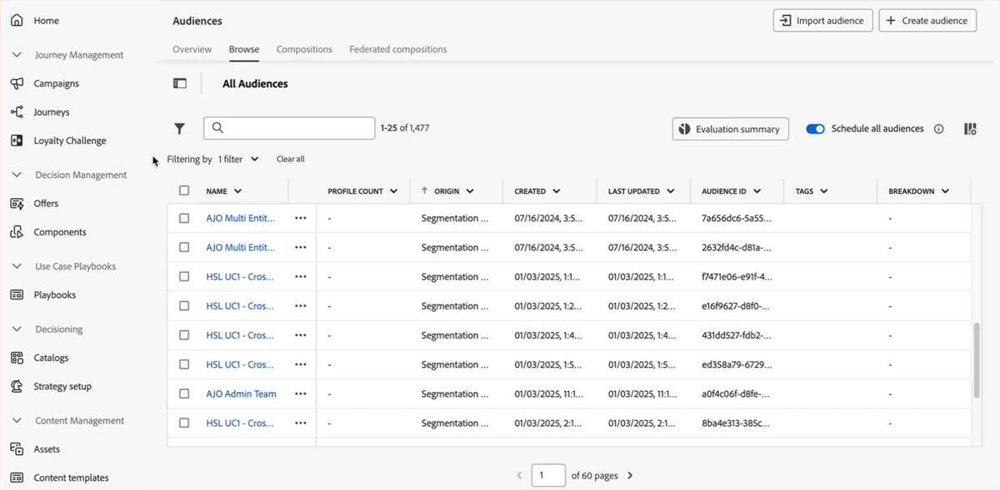

# Release notes {#release-notes}

>[!CONTEXTUALHELP]
>id="ajo_homepage_card1"
>title="What's new?"
>abstract="**Adobe Journey Optimizer** continuously delivers new features, enhancements to existing features, and bug fixes. All changes are consolidated on the last week of each month in these release notes."

[!DNL Adobe Journey Optimizer] continuously delivers new features, enhancements to existing features, and bug fixes. All changes are consolidated on the last week of each month in these release notes. [!DNL Adobe Journey Optimizer] is built natively on [!DNL Adobe Experience Platform] and inherits from its latest innovations and improvements. Learn more about these changes in [Adobe Experience Platform Release Notes](https://experienceleague.adobe.com/docs/experience-platform/release-notes/latest.html){target="_blank"}.

## March '25 early release notes {#25-3-rn}

**Early release notes below are subject to change without prior notice until the release availability date**. Links, screens and updated documentation are published at the release date.

**Release date**: March 26-27, 2025

### New capabilities {#25-03-features}

New capabilities coming with this release are detailed below.

<table>
<thead>
<tr>
<th><strong>Integration with Adobe Express</strong> </th>
</tr>
</thead>
<tbody>
<tr>
<td>

The Adobe Express integration in Adobe Journey Optimizer lets you use Adobe Express's editing tools directly during content creation, enabling you to resize, remove backgrounds, crop, and convert assets to JPEG or PNG.

<!--p>For more information, refer to the <a href="../configuration/rule-sets.md">detailed documentation</a>.</p-->
</td>
</tr>
</tbody>
</table>

<table>
<thead>
<tr>
<th><strong>Calendar view for journeys (Limited Availability)</strong> </th>
</tr>
</thead>
<tbody>
<tr>
<td>

A calendar view is now allows you to visualize all journeys activations. This capability is released as a Limited Availability to a select group of customers.

This change is only available for a set of organizations (Limited Availability). To gain access, contact your Adobe representative.

<!--p>For more information, refer to the <a href="../configuration/rule-sets.md">detailed documentation</a>.</p-->
</td>
</tr>
</tbody>
</table>

<table>
<thead>
<tr>
<th><strong>Integration with Dynamic Media (Limited Availability)</strong> </th>
</tr>
</thead>
<tbody>
<tr>
<td>

Dynamic media assets are now directly available and accessible in Journey Optimizer. This integration enables you to:
<ul>
<li>Centrally manage assets with real-time updates</li>
<li>Modify your assets settings such as width and height instantly</li>
<li>Customize Dynamic Media templates by updating your content and adding personalization fields</li>
</ul>

This integration is only available for a set of organizations (Limited Availability). To gain access, contact your Adobe representative.

<!--p>For more information, refer to the <a href="../configuration/rule-sets.md">detailed documentation</a>.</p-->
</td>
</tr>
</tbody>
</table>

<table>
<thead>
<tr>
<th><strong>Integration with Adobe GenStudio (Limited Availability)</strong> </th>
</tr>
</thead>
<tbody>
<tr>
<td>

To enhance marketing efficiency and to maintain brand consistency, you can now seamlessly integrate GenStudio for Performance Marketing experiences with Journey Optimizer. This enable you to leverage GenStudio's AI-power content creation alongside Journey Optimizer's advanced orchestration capabilities.

The use of the GenStudio integration in Journey Optimizer is currently unavailable for use with the Healthcare Shield or Privacy and Security Shield (Limited Availability).

<!--p>For more information, refer to the <a href="../configuration/rule-sets.md">detailed documentation</a>.</p-->
</td>
</tr>
</tbody>
</table>

<table>
<thead>
<tr>
<th><strong>LINE channel (Limited Availability)</strong> </th>
</tr>
</thead>
<tbody>
<tr>
<td>

Adobe Journey Optimizer has expanded its cross-channel capabilities to include support for the LINE channel. This enhancement allows you to create, edit, and preview LINE experiences enabling more personalized and engaging interactions. With LINE, you can connect with more customers, send relevant content, and improve your engagement.

This capability is only available for a set of organizations (Limited Availability). To gain access, contact your Adobe representative.

<!--p>For more information, refer to the <a href="../configuration/rule-sets.md">detailed documentation</a>.</p-->
</td>
</tr>
</tbody>
</table>

### Improvements {#25-03-improv}

**Personalization editor** (availability date: March 12)

The Journey Optimizer personalization editor has been updated with new capabilities: 

* **Updated Code Editor Design** – A cleaner, modern interface for improved usability and focus.
* **Search and Replace** – Added functionality to quickly find and replace content within the editor.
* **Undo and Redo Support** – Allows you to easily revert or reapply changes.
* **Customizable Font Size** – Enables adjustment of the editor's font size for better readability.
* **Inline JSON Validation** – Provides real-time client-side validation for JSON content to speed up error detection.
* **Auto-Complete for Profile and Context Attributes** – Offers smart suggestions to streamline content creation.
* **Enhanced Syntax Highlighting** – Improves readability by making code structure more visually distinct.

For more information, refer to the [detailed documentation](../personalization/personalization-build-expressions.md).

**Campaigns**

* In the campaign list, selecting a campaign now opens a pane displaying its details.
* You can now copy your campaigns from a sandbox to another.

**Personalization**

A new "Pills" button has been to the personalization editor. When enabled, profile and contextual attributes display as pills, enhancing the readability of your code.

**Approvals**

When defining the conditions for an approval policy, you now have the option to filter by Tag and/or Object Category.

**Configuration**

* You can now assign Adobe Experience Platform Unified Tags to channel configurations. This allows you to easily classify them, and improve search and navigation in all lists.

* When setting up or editing an email subdomain in Journey Optimizer, you can now choose to manage the associated DMARC record on your own, if available on the parent domain.

**Business rules**

You can now use daily frequency capping in journeys and campaigns with batch segmentation. To ensure accuracy for daily frequency capping rules, make sure you choose the highest priority namespace while authoring a campaign or journey. Learn more on namespace priority in the [Platform Identity Service guide](https://experienceleague.adobe.com/en/docs/experience-platform/identity/features/identity-graph-linking-rules/namespace-priority){target="_blank"}

**Content management**

To easily manage your fragments and your content templates, you can now use folders to organize them more effectively into a structured hierarchy. This improvement is only available for a set of organizations (Limited Availability). To gain access, contact your Adobe representative.

## February '25 release notes {#25-02-rn}

<!--
**Early release notes below are subject to change without prior notice until the release availability date**. Links, screens and updated documentation are published at the release date.-->

**Release date**: February 18-19, 2025

### New capabilities {#25-02-features}

New capabilities coming with this release are detailed below.

<table>
<thead>
<tr>
<th><strong>Create & manage business rules</strong> </th>
</tr>
</thead>
<tbody>
<tr>
<td>

You can now create business rules using rule sets. Rule sets are groups of rule that help you limit sent messages within campaigns and journey actions across channels, and to control profiles entries into journeys.

<ul><li>Create channel rule sets to restrict the number of messages sent across one or multiple channels. Apply them to campaigns or journey actions to enforce the rules defined in the rule set. Channel rule set allows you to apply capping rules based on communication types. For example, set a rule set to limit "promotional messages" and another for "newsletters". Apply the appropriate rule set in your campaign or journey action depending on type of communication you are sending.</li>
<li> Create journey rule sets to control profile entries into journeys. Limit how often a profile can enter a journey within a given period or the number of journeys a profile can be enrolled in simultaneously. Apply these at the journey level to ensure proper entry management.</li></ul>

Previously available for a set of organizations (LA), business rules are now available to all users (GA). Journey domain business rules continue to be available only for a limited set of organizations (LA).

For more information, refer to the <a href="../configuration/rule-sets.md">detailed documentation</a>.

</td>
</tr>
</tbody>
</table>

<table>
<thead>
<tr>
<th><strong>Generate landing pages with the AI Assistant</strong> </th>
</tr>
</thead>
<tbody>
<tr>
<td>

You can now craft compelling content for your landing pages, including full-page designs, personalized text, and customized visuals, with the help of the AI assistant.

For more information, refer to the <a href="../content-management/generative-lp.md">detailed documentation</a>.

</td>
</tr>
</tbody>
</table>

<table>
<thead>
<tr>
<th><strong>Brands with the AI Assistant (Beta)</strong> </th>
</tr>
</thead>
<tbody>
<tr>
<td>

You can now set your own Brands to define your brand's visual and verbal identity. 

This capability is released as a private beta to a limited set of customers. It will be progressively available to all customers in future releases.

For more information, refer to the <a href="../content-management/brands.md">detailed documentation</a>.

</td>
</tr>
</tbody>
</table>

<table>
<thead>
<tr>
<th><strong>Troubleshoot your custom actions</strong> </th>
</tr>
</thead>
<tbody>
<tr>
<td>

You can now validate a custom action configuration by making real API calls directly from Adobe Journey Optimizer. This new capability helps you troubleshoot your custom actions before or after using them in a journey. 

For more information, refer to the <a href="../action/troubleshoot-custom-action.md">detailed documentation</a>.

<!--p> This capability is only available for a set of organizations (Limited Availability). To gain access, contact your Adobe representative.</p-->
</td>
</tr>
</tbody>
</table>

<table>
<thead>
<tr>
<th><strong>Flexible audience evaluation (Limited Availability)</strong> </th>
</tr>
</thead>
<tbody>
<tr>
<td>

Flexible audience evaluation lets you run a segmentation job on demand for selected audiences, ensuring that you always have the most up-to-date audience data before targeting them into Journey Optimizer journeys and campaigns.

For more information, refer to the <a href="../audience/creating-a-segment-definition.md#flexible">detailed documentation</a>.

This capability is only available for a set of organizations (Limited Availability). To gain access, contact your Adobe representative.

Availability date: Jan 28, 2025

</tr>
</tbody>
</table>
</table>

### Improvements {#25-02-improvements}

The improvements below come with the February update.

* **Dataset Time-to-live (TTL)** - Starting this month, a time-to-live (TTL) guardrail will be rolled out to Journey Optimizer system-generated datasets in new sandboxes and new orgs as follows:

    * 90 days for data in the profile store
    * 13 months for data in the data lake

    This change will be rolled out to existing customer sandboxes in a subsequent phase.

    Learn more about this update in [the dedicated FAQ](../data/datasets-ttl.md#frequently-asked-questions).

<!--* **Playbooks** - You can now create and publish your own Use Case Playbooks in Journey Optimizer.-->

* **Direct mail** - A new server type, Data landing zone, is now supported for file routing  in the direct mail channel configuration. [Read more](../direct-mail/direct-mail-configuration.md#file-routing-configuration)

* **SMS** - You can now manage SMS message delivery from multi-regional endpoints by overriding delivery, feedback, inbound, and callback URLs. To support this, a new field Override URL has been added to API Credentials configuration. This change is available with Sinch provider only. [Read more](../sms/sms-configuration-sinch.md)

* **Personalization** (Availability date: Jan 29, 2025) - New date/time helper functions are available for use in the personalization editor. [Read more](../personalization/functions/dates.md)

<!--
* The personalization editor has been enhanced with new capabilities such as Auto-complete, Search, and filtering options. You can also show or hide deprecated attributes.--> 

* **Email configuration** - If you are managing consent outside of Adobe, you can now set a custom unsubscribe email address and a custom one-click unsubscribe URL as part of your email channel configuration settings. [Read more](../email/list-unsubscribe.md#custom-managed)

    {width="80%"}

* **Decisioning** (Availability date: Jan 28, 2025) - Decisioning now supports Object data types when editing the item catalog's schema. [Read more](../experience-decisioning/catalogs.md)

