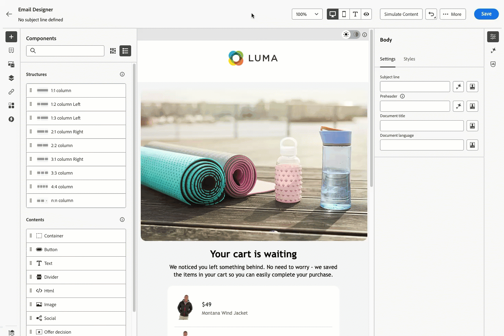
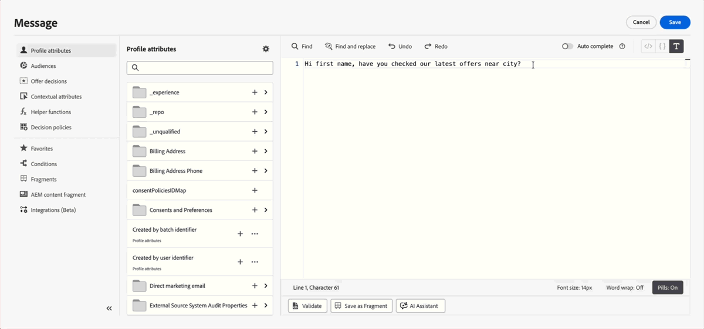
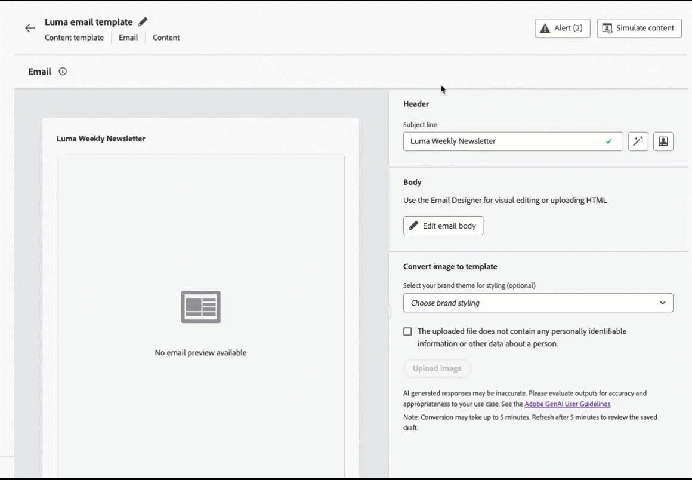
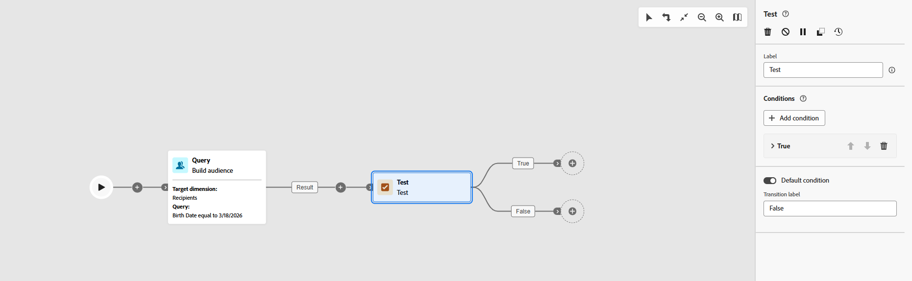

# Release notes {#release-notes}

>[!CONTEXTUALHELP]
>id="ajo_homepage_card1"
>title="What's new?"
>abstract="**Adobe Journey Optimizer** continuously delivers new capabilities, enhancements to existing capabilities, and bug fixes. All changes are consolidated on the last week of each month in these release notes."

[!DNL Adobe Journey Optimizer] follows a continuous delivery model, allowing Adobe to deliver new capabilities, enhancements, and fixes on an ongoing basis. This approach enables a scalable, phased rollout of capabilities to ensure performance and stability across all environments.

Because of this model, release notes are updated between monthly releases. For full details about the release cycle and availability phases, see [Journey Optimizer release cycle](releases.md).

[!DNL Adobe Journey Optimizer] is built natively on [!DNL Adobe Experience Platform] and inherits from its latest innovations and improvements. Learn more about these changes in [Adobe Experience Platform Release Notes](https://experienceleague.adobe.com/docs/experience-platform/release-notes/latest.html){target="_blank"}.

## April '26 updates {#april-26-rn}

### New capabilities {#april-26-features}

<!--
<table>
<thead>
<tr>
<th><strong>Optimize email for AI inboxes</strong> </th>
</tr>
</thead>
<tbody>
<tr>
<td>

Adobe Journey Optimizer now includes a new capability that ensures your emails are optimally structured for AI-powered inboxes such as Apple Intelligence and Google Gemini in Gmail.

As AI assistants increasingly control how recipients read and act on email, this feature helps you author content that performs well across downstream AI tasks including summarization, triage, prioritization, and intent extraction.

For more information, refer to <a href="../email/llm-email-optimizer.md">Optimize email text for AI inboxes</a>.

Availability date: April 17, 2026

</td>
</tr>
</tbody>
</table>
-->

<table>
<thead>
<tr>
<th><strong>Journey path experimentation</strong> </th>
</tr>
</thead>
<tbody>
<tr>
<td>

Use the new <strong>Optimize</strong> node to run A/B tests or multi-armed bandit experiments to determine the best path to meet your business-centric KPIs. This tool allows you to test and vary, and customize communications, sequencing, and timing to best reach your customers.

Previously released in Limited Availability, this capability is now available to all environments (General Availability).

As part of the General Availability, this release introduces <strong>experiment type</strong> selection (A/B or multi-armed bandit) and <strong>Scale the winner</strong> for unitary journeys.

For more information, refer to the <a href="../building-journeys/path-experimentation.md">detailed documentation</a>.

Availability date: April 7, 2026

</td>
</tr>
</tbody>
</table>

<table>
<thead>
<tr>
<th><strong>Inbox</strong> </th>
</tr>
</thead>
<tbody>
<tr>
<td>

<strong>Inbox</strong> is a mobile functionality, available with Content Cards, that enables customers to create a centralized location within their app or website to display messages sent to their users. This extends the lifetime of marketing communications by ensuring messages remain accessible even after they are dismissed.

For more information, refer to the <a href="../inbox/inbox-gs.md">detailed documentation</a>.

Availability date: April 7, 2026

</td>
</tr>
</tbody>
</table>

<!--
<table>
<thead>
<tr>
<th><strong>Optimize email text for AI inboxes</strong> </th>
</tr>
</thead>
<tbody>
<tr>
<td>

Adobe Journey Optimizer now includes a new capability that ensures your emails are optimally structured for AI-powered inboxes such as Apple Intelligence and Google Gemini in Gmail.

As AI assistants increasingly control how recipients read and act on email, this feature helps you author content that performs well across downstream AI tasks including summarization, triage, prioritization, and intent extraction.

For more information, refer to <a href="../email/llm-email-optimizer.md">Optimize email text for AI inboxes</a>.

Availability date: April 3, 2026

</td>
</tr>
</tbody>
</table>
--> 

<table>
<thead>
<tr>
<th><strong>Decisioning support in email channel</strong> </th>
</tr>
</thead>
<tbody>
<tr>
<td>

You can now use <strong>Decisioning</strong> to personalize and optimize the content of your email messages. Leverage Priority Scores, Formulas, or AI Models to display the most relevant offers and content to each recipient.

Previously released in Limited Availability, this capability is now available to all environments (General Availability). With this General Availability release, mirror pages are now supported.

For more information, refer to the <a href="../experience-decisioning/create-decision-policy.md">detailed documentation</a>.

Availability date: April 6, 2026

</td>
</tr>
</tbody>
</table>

<table>
<thead>
<tr>
<th><strong>AI Assistant for Personalization Expressions</strong> </th>
</tr>
</thead>
<tbody>
<tr>
<td>

[!DNL Adobe Journey Optimizer] now includes an AI Assistant in the Personalization Editor. Describe what you want to personalize in plain language and the assistant produces a personalization expression you can use as-is or refine in a short follow-up conversation.

You can also select existing personalization code and ask the assistant to explain it, fix it, or suggest improvements. After you generate an expression, <strong>Show previews for sample profiles</strong> runs a quick check against a limited set of synthetic sample profiles.

For more information, refer to <a href="../content-management/generative-personalization-expressions.md">AI Assistant for Personalization Expressions</a>.

Availability date: April 13, 2026

</td>
</tr>
</tbody>
</table>

### Improvements {#april-26-improv}

#### Decisioning

* **Temporarily unavailable fragments are skipped** - When using fragments in decision items, if a fragment is temporarily unavailable on Edge, it is skipped and the journey or campaign continues rendering instead of failing. [Read more](../experience-decisioning/fragments-decision-policies.md#temporary-unavailable-fragments)

  Availability date: April 14, 2026 

#### Email design

* **AI Assistant for personalization expressions in the Email Designer** - In the Email Designer, select a component and use **Add expression** in the contextual toolbar to describe the personalization you need in plain language, review the generated expression, and insert it without leaving the designer. [Learn more](../content-management/generative-personalization-expressions.md#generate-email-designer)

  Availability date: April 15, 2026

* **Advanced HTML editor for email content** - Advanced HTML mode lets you edit the HTML source of your content in the Email Designer, add advanced expressions (such as conditions) in the source, and toggle between HTML view and Desktop view without losing your changes.

  Previously available for email content templates only, this capability is now deployed to **email** content in the Email Designer (for example, emails authored in journeys and campaigns), in addition to email content templates. It is currently in Limited Availability — contact your Adobe representative to gain access. [Read more](../email/email-expert-mode.md)

  Availability date: April 9, 2026

#### Journey Path Optimization

* **Experiment type** - You can now choose between A/B experiment (fixed split at the start) or Multi-armed bandit (automatic split with weekly weight updates) when configuring a path experiment. [Read more](../building-journeys/path-experimentation.md)

  Availability date: April 7, 2026

* **Path experimentation: Scale the Winner** - You can now automatically or manually roll out the winning path of an experiment to your full audience. Once a winner is determined, you can amplify its reach and effectiveness without constantly monitoring the experiment. [Read more](../building-journeys/path-experimentation.md#scale-winner)

  This capability is available only in unitary journeys (event-triggered and Audience qualifications). It is not available for Read audience journeys.

  Availability date: April 7, 2026

* **Conditions** - The [Optimize](../building-journeys/optimize.md) activity is the new vehicle for creating conditional paths in journeys. It replaces the former **Condition** activity, which has been removed from the UI. All conditional logic is retained and is now handled through the **Optimize** activity's conditions. [Read more](../building-journeys/conditions.md)

  Previously released in Limited Availability, this capability is now available to all environments (General Availability).

  Availability date: April 7, 2026

* **Adobe Experience Manager Content Fragment context while authoring** - Your Content Fragment selection stays active as you move between text fields and content blocks, so you can add more fragment fields without reopening **Open AEM Content advisor** each time. [Read more](../integrations/aem-fragments.md)

  This capability is only available for a set of organizations (Limited Availability). To gain access, contact your Adobe representative.

  Availability date: April 1, 2026

#### Adobe Experience Manager Integrations

* **Adobe Experience Manager Content fragment Varition Support** - You can select **Content Fragment variations** (for example language or channel variants) when inserting Adobe Experience Manager Content Fragments, with improved handling for locale and multilingual scenarios. [Read more](../integrations/aem-fragments.md#aem-variations)
  
  This capability is only available for a set of organizations (Limited Availability). To gain access, contact your Adobe representative.

  Availability date: April 3, 2026

## March '26 release notes {#march-26-rn}

The [New capabilities](#march-26-features) and [Improvements](#march-26-improv) sections cover capabilities already available. The [Coming soon](#coming-soon) section lists features and improvements scheduled for release later in March.

<!--
**The pre-release notes below are subject to change without prior notice until the release availability date**. Links, screens and updated documentation are published in the release notes, at the release date.

See also [Adobe Experience Platform pre-release notes](https://experienceleague.adobe.com/en/docs/experience-platform/release-notes/pre-release-notes){target="_blank"}.
-->

**Release date**: March 24-25, 2026

### New capabilities {#march-26-features}

<table>
<thead>
<tr>
<th><strong>URL parameter encryption</strong> </th>
</tr>
</thead>
<tbody>
<tr>
<td>

URL parameters in tracking and landing page links added to your email messages can now be encrypted, providing an additional layer of security for sensitive parameter data.

<ul>
<li>Register and manage encryption keys in the dedicated <strong>Administration</strong> registry.</li>
<li>Use the new `Encrypt` helper function in expressions to encrypt sensitive data in URLs for the query parameters you want to protect at render time.</li>
</ul>

This capability is only available for a set of organizations (Limited Availability). To gain access, contact your Adobe representative.

For more information, refer to the <a href="../personalization/url-parameter-encryption.md">detailed documentation</a>.

Availability date: March 31, 2026

</td>
</tr>
</tbody>
</table>

<table>
<thead>
<tr>
<th><strong>Convert images to email content templates</strong> </th>
</tr>
</thead>
<tbody>
<tr>
<td>

You can now convert images into email content templates directly in Journey Optimizer. Use AI-powered analysis to automatically generate structured HTML templates from visual references, significantly reducing email design time.

Previously released in Limited Availability, this capability is now available to all environments (General Availability).

For more information, refer to the <a href="../content-management/image-to-html.md">detailed documentation</a>.

Availability date: March 31, 2026

</td>
</tr>
</tbody>
</table>

<table>
<thead>
<tr>
<th><strong>Landing page custom forms</strong> </th>
</tr>
</thead>
<tbody>
<tr>
<td>

With [!DNL Journey Optimizer], you can capture profile attributes through your landing pages.

Create, design and manage custom forms tailored to your needs based on a specific dataset. You can then leverage these forms in landing pages to add the profile attributes of your choice into the dataset defined for each form.

Previously released in Limited Availability for customers in the United States and Australia, this capability is now available to all environments (General Availability).

For more information, refer to the <a href="../landing-pages/lp-forms.md">detailed documentation</a>.

Availability date: March 26, 2026.

</td>
</tr>
</tbody>
</table>

<table>
<thead>
<tr>
<th><strong>Test activity in Orchestrated Campaigns</strong> </th>
</tr>
</thead>
<tbody>
<tr>
<td>

A new <strong>Test</strong> activity is now available in Orchestrated Campaigns. This activity routes workflow execution to different branches based on defined conditions, enabling you to validate campaign logic and configurations before activating live deliveries.

For more information, refer to the <a href="../orchestrated/activities/test.md">detailed documentation</a>.

</td>
</tr>
</tbody>
</table>

<table>
<thead>
<tr>
<th><strong>Dataset lookup support in journeys</strong> </th>
</tr>
</thead>
<tbody>
<tr>
<td>

A new <strong>Dataset lookup</strong> activity in journeys lets you dynamically retrieve data from Adobe Experience Platform record datasets at runtime — giving you access to information that is not part of the profile or event payload, so customer interactions stay relevant and timely.

Previously released in Limited Availability to a restricted set of organizations, the Dataset lookup activity in journeys is now available to all customers entitled to [dataset lookup](../data/lookup-aep-data.md), while remaining in Limited Availability.

For more information, refer to the <a href="../building-journeys/dataset-lookup.md">detailed documentation</a>.

</td>
</tr>
</tbody>
</table>

<table>
<thead>
<tr>
<th><strong>Action activity replaces channel-specific journey activities</strong> </th>
</tr>
</thead>
<tbody>
<tr>
<td>

Following the General Availability of the <strong>Action activity</strong> in February 2026, legacy native channel activities (Email, Push, SMS, In-app, Web, Code-based experience, and Content Card) in the journey canvas are now deprecated.

You must now use the single Action activity to configure all channel actions, replacing the need for separate channel-specific nodes.

Existing journeys using legacy channel activities continue to function without any changes or migration required.

For more information, refer to the <a href="../building-journeys/journey-action.md">detailed documentation</a>.

</td>
</tr>
</tbody>
</table>

<table>
<thead>
<tr>
<th><strong>Advanced HTML editor for email templates</strong> </th>
</tr>
</thead>
<tbody>
<tr>
<td>

Advanced HTML mode for email content templates lets you edit the HTML source of your content in the Email Designer, add advanced expressions (such as conditions) in the source, and toggle between HTML view and Desktop view without losing your changes.

This capability is available in content templates for the Email channel only. It is currently in Limited Availability — contact your Adobe representative to gain access.

For more information, refer to the <a href="../email/email-expert-mode.md">detailed documentation</a>.

Availability date: March 10, 2026

</td>
</tr>
</tbody>
</table>

<table>
<thead>
<tr>
<th><strong>Integration of custom Firefly models and third-party image generation models</strong> </th>
</tr>
</thead>
<tbody>
<tr>
<td>

Enable seamless integration of standard and custom Firefly models, along with approved third-party image models, to provide greater flexibility, control, and brand alignment when generating images.

Choose the right model for your needs:

<ul><li> <strong>Adobe model</strong> (powered by Firefly Image Model 4) for immediate image generation without additional setup</li><li> <strong>Partner model</strong> (powered by Gemini 2.5 Flash) for specialized capabilities</li><li><strong>Custom models</strong> (brand-specific models trained on your own assets) for on-brand generation that aligns precisely with your brand identity, style, and visual guidelines.</li></ul>

For more information, refer to the <a href="../content-management/generative-models.md">detailed documentation</a>.

Availability date: March 2, 2026

</td>
</tr>
</tbody>
</table>

<table>
<thead>
<tr>
<th><strong>Live Activity for iOS</strong> </th>
</tr>
</thead>
<tbody>
<tr>
<td>

Bring real-time experiences directly to your customers' Lock Screens and Dynamic Island with <strong>iOS Live Activity</strong> in Adobe Journey Optimizer. Deliver live updates, from order tracking and flight status to event countdowns, live scores and delivery progress, without requiring users to open your app. Keep your audience informed and engaged at exactly the right moment, right where they are.

Previously released in beta, this capability is now available to all environments (General Availability).

For more information, refer to the <a href="../mobile-live/get-started-mobile-live.md">detailed documentation</a>.

Availability date: March 3, 2026

</td>
</tr>
</tbody>
</table>

<table>
<thead>
<tr>
<th><strong>Journey Agent: Channel content create</strong> </th>
</tr>
</thead>
<tbody>
<tr>
<td>

Powered by <strong>Adobe Experience Platform Agent Orchestrator</strong>, <strong>Journey Agent</strong> is available in Journey Optimizer and enables you to analyze journeys through a natural language interface. You can now also generate and manage channel-specific content directly in Journey Agent, creating content for channels such as email and push, applying and previewing templates, refining tone and style through prompts, and opening content in <strong>Content Designer</strong> for in-context editing.

This capability is only available for a set of organizations (Limited Availability). To gain access, contact your Adobe representative.

For more information, refer to the <a href="https://experienceleague.adobe.com/docs/experience-cloud-ai/experience-cloud-ai/agents/ajo-agent.html" target="_blank">detailed documentation</a>.

Availability date: March 4, 2026

</td>
</tr>
</tbody>
</table>

<table>
<thead>
<tr>
<th><strong>AI model monitoring</strong> </th>
</tr>
</thead>
<tbody>
<tr>
<td>

Journey Optimizer now allows you to monitor the health, training status, and performance of your Decisioning AI models. This allows you to verify training success, troubleshoot failures, and understand impact on your outcomes in order to select the best offers for each customer using AI. Note that this capability is available for <strong>Decisioning</strong> only (not for legacy Decision Management models).

This capability is currently available for <strong>personalized optimization</strong> models only (not auto-optimization).

For more information, refer to the <a href="../experience-decisioning/ranking/ai-model-observability.md">detailed documentation</a>.

Availability date: March 9, 2026

</td>
</tr>
</tbody>
</table>

<table>
<thead>
<tr>
<th><strong>Trigger Orchestrated campaigns using a signal</strong> </th>
</tr>
</thead>
<tbody>
<tr>
<td>

Orchestrated campaigns can now be triggered via an <strong>API signal</strong>. To set this up, configure the target campaign as <strong>Triggered by a signal</strong>, publish it, then fire it using an API call. Any parameters included in the API call are available as variables within the running campaign. Note that signal-triggered orchestrated campaigns remain <strong>batch</strong> campaigns and are distinct from API-triggered campaigns.

For more information, refer to the <a href="../orchestrated/trigger-orchestrated-campaign.md">detailed documentation</a>.

</td>
</tr>
</tbody>
</table>

<table>
<thead>
<tr>
<th><strong>Transactional category in Orchestrated campaigns</strong> </th>
</tr>
</thead>
<tbody>
<tr>
<td>

In Orchestrated campaigns, you can now set a channel activity to the <strong>Transactional</strong> category. This applies transactional channel configurations to that activity and is useful when business rules should not apply or when customers' opt-in is not required.

For more information, refer to the <a href="../orchestrated/activities/channels.md#add">detailed documentation</a>.

This capability will be gradually rolled out to all regions over the next few days.

</td>
</tr>
</tbody>
</table>

### Improvements {#march-26-improv}

Improvements coming with this release are listed below.

#### Personalization

* **Complete/base URL personalization** - You can personalize destination URLs using profile attributes (for example, for the domain or path). To enable this capability, provide Adobe with your list of accepted domains. [Read more](../personalization/personalization-build-expressions.md#where)

  Previously released in Limited Availability for use in journeys, this capability is now available to all environments (General Availability).

  Availability date: April 1, 2026

#### Reporting

* **Send-Time Optimization: updated controls location and new lift report** - Send-Time Optimization (STO) controls have been relocated to the Action configuration menu. Additionally, a new lift report is now available in Journeys reports to measure the impact of STO on your campaign performance metrics. [Read more](../reports/channel-report-cja.md#optimization-models)
  
  Availability date: March 27, 2026

<!--
* **Exclude bot clicks for email and SMS reporting** - Email and SMS reporting now automatically filters out bot clicks from click metrics, providing more accurate engagement data and preventing automated traffic from inflating your performance figures.

#### Email Designer

* **Email Designer displayed in Unified Shell** - The Email Designer is now displayed within the Unified Shell experience, providing a consistent navigation and header experience that aligns with other Adobe applications.

* **Text mode support in fragments** - To support text-based email workflows, you can now create and manage text versions of your visual fragments for optimal use in the plain text version of emails that include that fragment.

  **Caution:** When using a fragment that was created before the current release, the fragment text version may be incorrectly rendered—both in the Email Designer and in the final email delivered to your recipients. For best results with older fragments, edit, save and republish each fragment.
-->

#### Configuration

<!--* **Folders for journeys and campaigns** - You can now organize your journeys and campaigns into folders, enabling structured navigation and easier management for teams working with large volumes of content. This capability is only available for a set of organizations (Limited Availability). To gain access, contact your Adobe representative.-->

* **AJO domain certificates renewal unsuccessful** - You can now subscribe to receive system alerts, either by email or in the Journey Optimizer notification center, when a domain certificate used for email deliverability is nearing expiration or has already expired. [Read more](../reports/alerts.md#alert-certificates-renewal-unsuccessful)

  Availability date: March 26, 2026

* **AJO Secondary Recipient Feedback Event Dataset rename** - The `AJO Email BCC Feedback Event` Dataset has been renamed to `AJO Secondary Recipient Feedback Event` Dataset. The impact varies depending on your situation:

  * **Existing users**: Only the display name is updated. The underlying table name remains unchanged.
  * **New users and sandboxes**: Both the display name and the table name reflect the new name.
  * **Existing users with new sandboxes**: Both the display name and the table name are updated to the new name.

  >[!NOTE]
  >
  >New datasets show the new name immediately. For older dataset names, backfill and reconciliation proceed gradually and may take several weeks to complete.

  Availability date: March 2, 2026

#### Journeys

* **Update Profile action: support for multiple profile attributes** - The **Update Profile** action activity now supports updating up to five profile attributes in a single node. Previously, each action could only update one attribute at a time, requiring multiple nodes to update several attributes. Use the new **Update another field** button to add additional field/value pairs, reducing canvas complexity and improving performance. [Learn more](../building-journeys/update-profiles.md)

* **Wave sending of outbound messages in journeys** - You can now schedule messages from Journey Optimizer journeys to be delivered in controlled batches over time. [Learn more](../building-journeys/send-using-waves.md)

  Previously released in Limited Availability for use in journeys, this capability is now available to all environments (General Availability).

  Availability date: March 16, 2026

* **Pause and resume details in journey technical details** - The journey **technical details** now include additional pause and resume information: the date and time of the last pause and resume, the display name and internal identifier of the user who performed each action, and a full set of paused journey settings such as pause behavior, maximum pause duration, and auto-resume state. [Learn more](../building-journeys/journey-properties.md)

  Availability date: March 2, 2026

#### Decisioning

* **Decisioning migration — offer and context attributes** - The Migration API entity mapping now lists **offer attributes** (`migratedofferattributes` on the Personalized offer item schema) and **context attributes** (`migratedcontextattributes` on the migration dataset schema). [Read more](../experience-decisioning/decisioning-migration-api.md#entity-mapping)

  Availability date: March 31, 2026
  
<!--
## Coming soon {#coming-soon}

The features and improvements below are planned for release later in March/early April. Release dates and scope are **subject to change without prior notice**.

WAITING RELEASE DATE CONFIRMATION * **Target dimension simplification in Orchestrated Campaigns** - The active targeting dimension is now shown on the workflow canvas, so you can see which dimension is used by a channel activity. The multi-entity segmentation flow is simpler as you no longer need a separate "Change dimension" activity. Moreover, you can now choose explicitly whether messages are sent at the profile level or at a secondary dimension level.

WAITING RELEASE DATE CONFIRMATION
* **Target dimension simplification in Orchestrated Campaigns** - The active targeting dimension is now shown on the workflow canvas, so you can see which dimension is used by a channel activity. The multi-entity segmentation flow is simpler as you no longer need a separate "Change dimension" activity. Moreover, you can now choose explicitly whether messages are sent at the profile level or at a secondary dimension level.
-->
