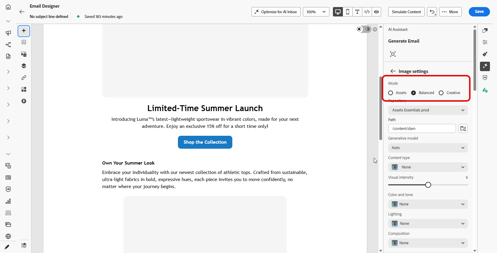

# Release notes {#release-notes}

>[!CONTEXTUALHELP]
>id="ajo_homepage_card1"
>title="What's new?"
>abstract="**Adobe Journey Optimizer** continuously delivers new capabilities, enhancements to existing capabilities, and bug fixes. All changes are consolidated on the last week of each month in these release notes."
 
[!DNL Adobe Journey Optimizer] follows a continuous delivery model, allowing Adobe to deliver new capabilities, enhancements, and fixes on an ongoing basis. This approach enables a scalable, phased rollout of capabilities to ensure performance and stability across all environments. Because of this model, release notes are updated between monthly releases. For full details about the release cycle and availability phases, see [Journey Optimizer release cycle](releases.md).

[!DNL Adobe Journey Optimizer] is built natively on [!DNL Adobe Experience Platform] and inherits from its latest innovations and improvements. Learn more about these changes in [Adobe Experience Platform Release Notes](https://experienceleague.adobe.com/docs/experience-platform/release-notes/latest.html){target="_blank"}.

>[!NOTE]
>
>Capabilities listed in these release notes include an **Availability date** indicating when each change becomes accessible in your environment. Entries in the **Coming soon** accordions are expected in the upcoming days or weeks. Information in these sections is subject to change. 

## September '26 updates {#sep-26-updates}

<table>
<thead>
<tr>
<th><strong>Generate expressions with AI in journeys</strong> </th>
</tr>
</thead>
<tbody>
<tr>
<td>

The journey advanced expression editor now integrates AI-powered expression generation: describe the expression you want to build in natural language, and the editor generates ready-to-use code you can apply immediately or refine through follow-up prompts.

Previously released in Limited Availability, this capability is now available to all environments (General Availability).

For more information, refer to the <a href="../building-journeys/expression/generate-expression.md">detailed documentation</a>.

Availability date: September 1, 2026

</td>
</tr>
</tbody>
</table>

* **New dateDiff function in journey expression editor** - The journey expression editor now includes the `dateDiff` function, which calculates the difference between two dates in number of days. This function is useful for time-based logic such as creating deadlines, calculating customer lifecycle durations, or building countdown timers in journey conditions.  [Learn more](../building-journeys/functions/date-functions.md#dateDiff)

  Availability date: September 1, 2026

+++ Coming soon — **Information below is subject to change.**

<table>
<thead>
<tr>
<th><strong>Inbound experience simulation in Action Campaigns</strong> </th>
</tr>
</thead>
<tbody>
<tr>
<td>

You can now simulate inbound channel actions in Action Campaigns before going live. Use simulation mode to test your configuration with simulated users and preview the rendered experience, including a generated URL and QR code, so you can validate rules, decisioning, and content rendering end-to-end.

This capability is currently in private beta and available to a limited set of organizations. Contact your Adobe representative for more information.

Availability date: September 4, 2026

</td>
</tr>
</tbody>
</table>

+++

## August '26 release notes {#aug-26-updates}

<!--
### Loyalty {#aug-26-loyalty}

<table>
<thead>
<tr>
<th><strong>Loyalty Insights skill</strong> </th>
</tr>
</thead>
<tbody>
<tr>
<td>

Journey Optimizer introduces <strong>Loyalty Insights</strong>, a new CX Coworker skill for asking questions about challenge performance and other loyalty program data ingested into the Loyalty field groups in Adobe Experience Platform.

For more information, refer to the <a href="../start/ajo-coworker-skills.md">detailed documentation</a>.

Availability date: August 12, 2026

</td>
</tr>
</tbody>
</table>
-->

### Content Management

The following capabilities and improvements have been introduced to Content management in this release.

<table>
<thead>
<tr>
<th><strong>Flexible Image Sourcing for AI Content Generation</strong> </th>
</tr>
</thead>
<tbody>
<tr>
<td>

Generating content in Journey Optimizer now sources brand-approved images directly from Adobe Experience Manager Assets Essentials and up. Three modes control the balance: Balanced (Digital Asset Management-first, AI fills gaps, default), Assets (Digital Asset Management-sourced), and Creative (AI).

For more information, refer to the <a href="../content-management/generative-uc.md#image-mode">detailed documentation</a>.

 Availability date: August 5, 2026

</td>
</tr>
</tbody>
</table>

* **Content variant size warning** - Journey Optimizer now surfaces a soft-limit warning when a content variant exceeds its recommended size threshold — 1200 KB for templates and messages, 700 KB for fragments, and 1000 KB for landing pages. Saving and publishing are not blocked. [Learn more](../start/guardrails.md#content-authoring)

  Availability date: August 25, 2026

* **Fragment count limits in content** - Journey Optimizer now validates the number of unique fragments used within a piece of content: up to 60 per variant and up to 120 across all variants of a single message. Warnings appear at 75% of each limit; publishing is blocked once the hard limit is reached. [Learn more](../start/guardrails.md#fragments-guardrails)

  Availability date: August 25, 2026

### Journeys {#aug-26-journeys}

* **Start and end dates in the journey header** - When start and/or end dates are configured on a journey, they are now surfaced in the journey header next to the status badge. The displayed label adapts based on whether each date is upcoming or has already passed. [Read more](../building-journeys/journey-properties.md#dates)

Availability date: August 20, 2026

* **New list functions in the advanced expression editor** - Two new functions are available in the advanced expression editor: `mergeLists` combines two lists, with or without deduplication, and `differenceLists` returns the items of one list that are not present in another. [Learn more](../building-journeys/functions/list-functions.md)

    Availability date: August 13, 2026

* **Send-Time Optimization in the Wait activity** - Send-Time Optimization is now available in the Wait activity, letting Adobe's AI determine the optimal time to continue to any downstream activity. [Learn more](../building-journeys/wait-activity.md#sto-wait)

    Availability date: August 13, 2026

+++ Coming soon — **Information below is subject to change.**

<table>
<thead>
<tr>
<th><strong>Journey-level holdout (Limited availability)</strong> </th>
</tr>
</thead>
<tbody>
<tr>
<td>

You can now configure a holdout group for your journeys directly from journey properties. A holdout is a configurable percentage of your target audience that is excluded from entering the journey and receives no communication. By comparing holdout profiles against active profiles in Customer Journey Analytics reporting, you can measure the incremental lift - the true impact - that your journey delivers.

This capability is only available for a set of organizations (Limited Availability). To gain access, contact your Adobe representative.

</td>
</tr>
</tbody>
</table>

+++

### Campaigns {#aug-26-campaigns}

The following capabilities and improvements have been introduced to Campaigns in this release.

<table>
<thead>
<tr>
<th><strong>Personalized PDF attachments in API-triggered emails</strong> </th>
</tr>
</thead>
<tbody>
<tr>
<td>

Journey Optimizer now supports up to <b>five PDF attachments</b> total per email in API-triggered campaigns, including both static and recipient-specific PDFs. Recipient-specific PDF files are fetched securely from Data Landing Zone and attached at send time, with each file's location passed directly in the API payload. This allows existing upstream document generation systems to remain in place, with Journey Optimizer handling delivery.

Supported use cases include invoices, statements, tickets, contracts, shipping labels, and similar documents that vary per recipient. Personalized PDF attachments are available only for transactional API-triggered email campaigns and are not supported in journeys or orchestrated campaigns.

Larger attachment volumes and sizes are supported via the PDF attachment add-on; for information, contact your Adobe representative.

For more information, refer to the <a href="../email/pdf-attachments.md#personalized-attachments">detailed documentation</a>.

Availability date: August 12, 2026

</td>
</tr>
</tbody>
</table>

* **Per-campaign lifecycle alert subscriptions** - You can now subscribe to supported campaign lifecycle alerts for a single campaign, in addition to the existing sandbox-level subscription. This lets you monitor individual high-priority campaigns without receiving the same alert for every campaign in the sandbox. [Learn more](../reports/alerts.md#subscribe-alerts)
    Availability date: August 13, 2026

+++ Coming soon — **Information below is subject to change.**

* **Action Campaign authoring flow redesign** - Adobe Journey Optimizer Action Campaign authoring flow has been redesigned to deliver a significantly more intuitive, efficient, and seamless user experience.

* **Folders for Action Campaigns** - You can now organize your Action Campaigns into folders to improve navigation and management in the interface.

* **Override the default execution fields in Action Campaigns** - Previously available at the journey level, you can now override the default execution fields configured globally for your Email, SMS, and WhatsApp deliveries in the Action Campaign parameters.

+++

### Orchestrated Campaigns {#august-26-oc}

The following capabilities and improvements have been introduced to Orchestrated Campaigns in this release.

<table>
<thead>
<tr>
<th><strong>Quiet Hours support</strong> </th>
</tr>
</thead>
<tbody>
<tr>
<td>

You can now apply Quiet Hours. Quiet Hours let you define time-based exclusions to prevent messages from being sent during specific periods, helping you respect customer preferences and compliance requirements across campaign orchestration use cases.

For more information, refer to the <a href="../conflict-prioritization/quiet-hours.md">detailed documentation</a>.

Availability date: August 18, 2026

</td>
</tr>
</tbody>
</table>

<table>
<thead>
<tr>
<th><strong>Send using waves</strong> </th>
</tr>
</thead>
<tbody>
<tr>
<td>

You can now schedule outbound messages to be delivered in controlled batches over time. Ideal for high-volume or time-sensitive campaigns, wave sending also supports better deliverability and helps maintain a strong sender reputation by reducing the risk of being flagged as spam. 

For more information, refer to the <a href="../delivery/send-using-waves.md">detailed documentation</a>.

Availability date: August 18, 2026

</td>
</tr>
</tbody>
</table>

<table>
<thead>
<tr>
<th><strong>LINE channel support (Limited Availability)</strong> </th>
</tr>
</thead>
<tbody>
<tr>
<td>

You can now add LINE actions into your Orchestrated campaigns. This new activity allows you to build and deliver highly personalized content, including text, stickers, images, videos, location data, and rich Flex Messages, to engage your customers seamlessly on the LINE platform. This capability is only available for a set of organizations (Limited Availability). To gain access, contact your Adobe representative.

For more information, refer to the <a href="../orchestrated/activities/channels.md">detailed documentation</a>.

Availability date: August 12, 2026

</td>
</tr>
</tbody>
</table>

* **Ability to Manage Profile Target Dimensions** - You can now delete a Profile Target Dimension or edit and swap its configured identity namespace, providing greater control and flexibility over your data setups. [Learn more](../orchestrated/target-dimension.md)

  Availability date: August 18, 2026

<!-- * **New public APIs** - New API specifications are now available. These APIs allow you to programmatically create, manage, and trigger orchestrated campaigns, enabling deeper integration with external systems and automation pipelines. Documentation link: TBD -->

* **Personalize email sender details per recipient and campaign (Limited availability)** - Orchestrated campaigns now support personalization of email header fields, including From name, From email prefix, Reply-to name, and Reply-to email, as well as the execution address, using profile attributes or relational data. This allows sender details to reflect the relevant advisor, location, or branch for each recipient, rather than routing all sends through a single corporate address. Header values can be set at the channel level and overridden per campaign using contextual data for more precise control. [Learn more](../orchestrated/activities/channels.md#configuration)

  This capability is only available for a set of organizations (Limited Availability). 

  Availability date: August 18, 2026

* **Target dimension simplification** - The active targeting dimension is now shown on the workflow canvas, so you can see which dimension is used by a channel activity. The multi-entity segmentation flow is simpler as you no longer need a separate "Change dimension" activity. Moreover, you can now choose explicitly whether messages are sent at the profile level or at a secondary dimension level. [Learn more](../orchestrated/activities/channels.md#add)

  Availability date: August 18, 2026

### Channels {#august-26-channels}

* **Live activity execution metadata (executionMetadata)** - API-triggered Live activity campaigns (Transactional and Marketing) now support an optional executionMetadata field on each recipient. This lets you attach custom key/value data, such as an order ID, loyalty tier, or region code, to an execution. [Learn more](../mobile-live/create-mobile-live.md#metadata)

  Availability date: August 19, 2026

* **Performance Add-on for throughput - Push** - A new high throughput transactional messaging mode is available in API-triggered campaigns. This mode is designed for large-scale, real-time transactional messaging and supports up to 5,000 transactions per second with higher availability. Previously only available for the email channel, this capability is now also available for the push channel, for organizations that have purchased the Adobe High Throughput Transactional Messaging add-on offering. Contact your Adobe representative for more details. [Learn more](../campaigns/api-triggered-high-throughput.md)

  Availability date: August 11, 2026

### Configuration {#august-26-configuration}

* **Multi-SAN support in CSR generation for custom subdomain setup** - When setting up or migrating a custom subdomain using the Custom delegation method, the Certificate Signing Request (CSR) is now automatically generated with both `data.{subdomain}` and `cdn.{subdomain}` as Subject Alternative Names (SANs). Previously, the generated CSR only included `data.{subdomain}`, requiring manual addition of `cdn.{subdomain}` before submission to the Certificate Authority. [Learn more](../configuration/custom-subdomain-migration.md#send-csr-to-ca)

  Availability date: August 20, 2026

### Decisioning {#decisioning-august}

* **Placement-level frequency capping in Decisioning** - Frequency capping rules in Decisioning can now be scoped to individual placements, giving you finer control over how often an offer is shown in a given surface. Two modes are available: **placement-specific capping**, which defines a cap that applies only when the offer is displayed in a selected placement, and **per-placement capping**, which applies a cap independently across every placement where the offer appears, so each placement maintains its own capping counter. Note that placement-related capping does not apply to offers capped using rules based on Adobe Experience Platform data. [Learn more](../experience-decisioning/items.md#capping)

  Availability date: August 24, 2026

* **Mirror pages in visual fragments** - You can now insert mirror pages into a visual fragment. Decisioning attributes render correctly on the mirror page link, even when the fragment is used in an email campaign that leverages Decisioning. The mirror page must be added to the visual fragment before the fragment is published in order for decisioning attributes to display. [Learn more](../email/message-tracking.md#decisioning-mirror-page)

  Availability date: August 11, 2026

+++ Coming soon — **Information below is subject to change.**

<table>
<thead>
<tr>
<th><strong>Decisioning support in Web Channel</strong> </th>
</tr>
</thead>
<tbody>
<tr>
<td>

Decisioning is now available for the Web channel. You can use decision policies directly in the web visual editor to deliver the most relevant offers to each visitor.

</td>
</tr>
</tbody>
</table>

+++

### Usability improvements {#august-26-usability}

* **Bulk operations in journey inventory** - You can now perform new bulk actions directly from the journey inventory list, making it faster to manage multiple journeys at once. Select several journeys and apply any of the following new actions in a single step: **add to package**, **delete**, **move to folder**, **edit tags**, or **manage access**. This reduces the need to repeat the same action one journey at a time, streamlining journey management for teams working with large numbers of journeys. [Learn more](../building-journeys/journey-ui.md)

  Availability date: August 12, 2026

* **New Content Simulation experience for content testing** - The **Simulate content** workflow introduces a redesigned experience: all variants now render together in a single scrollable grid (side-by-side, stacked, or wrapped layouts), replacing the one-variant-at-a-time view. A single bottom action bar consolidates navigating between test variants, zoom, viewport switching (desktop/mobile), locale switching, adding sample inputs, generating variants with AI, picking and saving simulated users, and importing or exporting variants. Removing the left rail and collapsing extra header layers gives previews significantly more room. A **Switch to classic experience** option in the bottom action bar lets you revert to the previous experience at any time. [Learn more](../test-approve/simulate-content-variations.md)

  Availability date: August 11, 2026

* **Multi-selection in the new journey canvas** - The new journey canvas experience introduces simplified multi-node selection: hold Shift and drag to select multiple nodes at once, rather than selecting them individually. This enables bulk actions, such as copy, delete, or save as a journey fragment, to be performed efficiently across several nodes. [Learn more](../building-journeys/using-the-journey-designer.md#canvas-capabilities)

  Availability date: August 17, 2026
