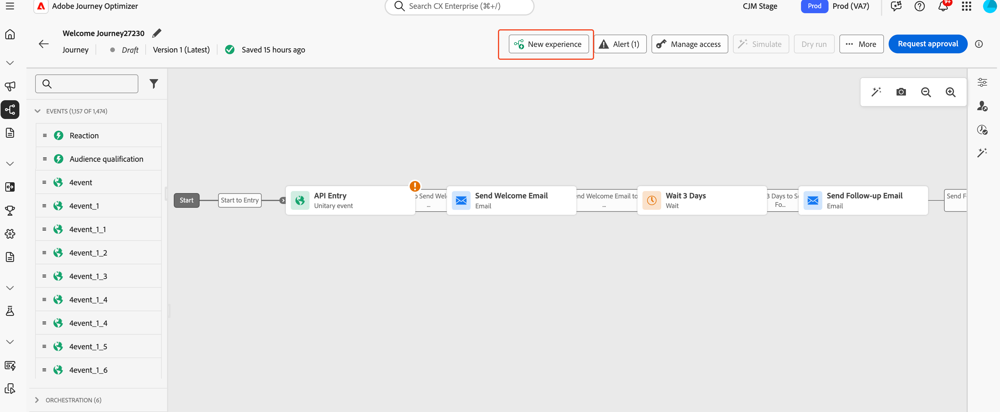
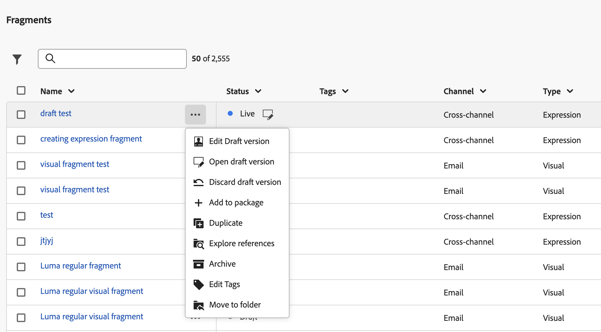

# Release notes {#release-notes}

>[!CONTEXTUALHELP]
>id="ajo_homepage_card1"
>title="What's new?"
>abstract="**Adobe Journey Optimizer** continuously delivers new capabilities, enhancements to existing capabilities, and bug fixes. All changes are consolidated on the last week of each month in these release notes."
 
[!DNL Adobe Journey Optimizer] follows a continuous delivery model, allowing Adobe to deliver new capabilities, enhancements, and fixes on an ongoing basis. This approach enables a scalable, phased rollout of capabilities to ensure performance and stability across all environments. Because of this model, release notes are updated between monthly releases. For full details about the release cycle and availability phases, see [Journey Optimizer release cycle](releases.md).

[!DNL Adobe Journey Optimizer] is built natively on [!DNL Adobe Experience Platform] and inherits from its latest innovations and improvements. Learn more about these changes in [Adobe Experience Platform Release Notes](https://experienceleague.adobe.com/docs/experience-platform/release-notes/latest.html){target="_blank"}.

>[!NOTE]
>
>Capabilities listed in these release notes include an **Availability date** indicating when each change becomes accessible in your environment. Entries in the **Coming soon** accordions are expected in the upcoming days or weeks. Information in these sections is subject to change. 

## July '26 release notes {#july-26-updates}

### Loyalty Challenges {#july-26-loyalty}

Journey Optimizer introduces Loyalty Challenges, a new capability in this release.

<table>
<thead>
<tr>
<th><strong>Loyalty Challenges</strong> </th>
</tr>
</thead>
<tbody>
<tr>
<td>

Loyalty Challenges turn loyalty initiatives into engaging, gamified experiences that motivate customers to take valuable actions, such as making purchases, writing reviews, or any desired behavior.

Administrators can use the Loyalty admin menu to connect Journey Optimizer with your loyalty ecosystem, including reward fulfillment APIs, event definitions, product inventory, exclusions, and identity settings. Marketers can then design standard, streak, or sequential challenges, define tasks and rewards, deliver branded content cards and messages, and monitor performance with AI-powered reporting dashboards. Journey Optimizer generates the journeys that orchestrate each challenge in the background, so teams can focus on the customer experience and business goals.

Loyalty also introduces Coworker skills that let teams perform key challenge operations more efficiently, including creating challenges, setting challenge properties, managing audiences and related configuration, and reviewing insights to monitor challenge participation and reward performance.

This capability is only available for organizations licensed for Journey Optimizer Loyalty. To gain access, contact your Adobe representative.

For more information, refer to the <a href="../loyalty-challenges/get-started.md">detailed documentation</a>.

 Availability date: July 28, 2026

</td>
</tr>
</tbody>
</table>

### Outbound channels {#july-26-outbound-channels}

The following capability has been introduced in this release.

<table>
<thead>
<tr>
<th><strong>Channel optimization</strong> </th>
</tr>
</thead>
<tbody>
<tr>
<td>

You can now configure a journey or campaign action to include multiple outbound channels (Email, Push, SMS) and let Journey Optimizer automatically deliver through the best channel for each customer. Three optimization modes are available:

<ul>
<li>Manual ranking: specify your preferred channel order.</li>
<li>Customer preference: use the customer's preferred channel from their profile (Experience Data Model Consents & Preferences attribute).</li>
<li>AI model-based ranking: use machine learning propensity scores to infer the most effective channel per customer.</li>
</ul>

When the top-ranked channel is unavailable (not opted-in, frequency-capped, or not configured), the system falls back to the next available channel.

This capability is only available for a set of organizations (Limited Availability). To gain access, contact your Adobe representative.

For more information, refer to the <a href="../building-journeys/channel-optimization.md">detailed documentation</a>.

Availability date: July 22, 2026

</td>
</tr>
</tbody>
</table>

+++ Coming soon

* **WhatsApp Channel: Support WhatsApp Flow templates** - You can now send WhatsApp Flow templates in Adobe Journey Optimizer to deliver interactive multi-screen experiences like surveys and lead capture. Responses are captured upon submission and stored as raw JSON payloads in the new Journey Optimizer Channel Tracking Event Dataset. 

* **Enhanced Custom Provider Integrations - Mobile** - Custom provider integrations now offer expanded flexibility with key messaging and header updates:

  * Header Customization: You can now edit the default Content-Type header value and add up to 10 custom header parameters.

  * SMS Payload Support: Added support for Adobe Journey Optimizer helper functions within the SMS payload, including encode64.

+++

### Journeys {#july-26-journeys}

The following capabilities and improvements have been added to journeys in this release.
<table>
<thead>
<tr>
<th><strong>New user interface</strong> </th>
</tr>
</thead>
<tbody>
<tr>
<td>

A <b>new user interface</b> has been introduced for the journey canvas, delivering improved performance for large journeys, automatic layout for better readability, and a guided authoring experience.

To switch to the new UI, click the <b>New experience</b> button. This setting is saved at the journey level, so the journey reopens in the new experience by default. To revert, click <b>Old experience</b>. <a href="../building-journeys/using-the-journey-designer.md#canvas-capabilities">Learn more</a>.

 Availability date: July 16, 2026

</td>
</tr>
</tbody>
</table>

* * [!BADGE Deprecation]{type=Negative} **Batch audiences no longer supported in Audience Qualification node and Exit Criteria** - Starting September 2026, Journey Optimizer will block publication for any journey using a batch audience in an Audience Qualification node or in Exit Criteria. A validation warning is already surfaced in the journey canvas.  Existing live journeys are not affected. New, draft, and duplicated journeys that include this configuration must be updated before September 2026. Use a streaming audience in the Audience Qualification node, or switch to a Read Audience activity. For Exit Criteria, use a streaming audience. [Learn how to migrate your journeys](../building-journeys/aq-batch-audiences-migration.md)

+++ Coming soon

* **External audiences in Journey Simulation** - Journey Simulation now supports External Audiences. When simulating journeys targeting CSV or Federated Audience Composition audiences, you can mock enrichment attributes from those audiences directly through the UI form or a JSON import. The UI dynamically displays only the specific enrichment attributes used in your journey logic, enabling precise validation of decision branches and personalization rules prior to going live.

+++

### Email Designer {#july-26-email}

The following capability has been added to the email channel in this release.

<table>
<thead>
<tr>
<th><strong>Content check in the Email Designer (General Availability)</strong> </th>
</tr>
</thead>
<tbody>
<tr>
<td>

Journey Optimizer now includes automated technical validation directly in the Email Designer, helping you catch HTML and CSS issues before sending.

Checks cover unsupported elements such as <code>&lt;script&gt;</code> and <code>&lt;base&gt;</code> tags, empty divs that can break layout in Microsoft Outlook, HTML meta refresh tags, and CSS or HTML size thresholds that trigger rendering failures in Gmail.

Results are surfaced as errors, warnings, or informational notices directly in the authoring panel, with contextual details and one-click fixes where available, so issues can be resolved without leaving the editor.

Previously available in Limited Availability, this capability is now generally available to all customers.

For more information, refer to the <a href="../email/content-check.md">detailed documentation</a>.

Availability date: July 16, 2026

</td>
</tr>
</tbody>
</table>

### Campaigns {#campaigns}

+++ Coming soon

* **Folders for Campaigns** - You can now organize your campaigns into folders to improve navigation and management in the interface. This capability is available for Action and API-triggered campaigns only.

+++

### Orchestrated campaigns {#july-26-oc}

The following capabilities and improvements are coming to orchestrated campaigns in this release.

<table>
<thead>
<tr>
<th><strong>File-based targeting in Orchestrated campaigns</strong> </th>
</tr>
</thead>
<tbody>
<tr>
<td>

Orchestrated campaigns now support loading a <strong>CSV or TXT file</strong> directly into the campaign canvas as the targeting audience, without first ingesting the file into Adobe Experience Platform. The file data is consumed at execution time and is not persisted as an Adobe Experience Platform dataset. During file setup, you can define column mappings, data types, NULL handling, and per-column error policies. Rows that fail validation are rejected and logged before the campaign runs, keeping the audience clean without manual pre-processing. This is particularly suited for ad-hoc sends or partner list campaigns where building a full ingestion pipeline is not practical.

For more information, refer to the <a href="../orchestrated/activities/load-file.md">detailed documentation</a>.

 Availability date: July, 6 2026

</td>
</tr>
</tbody>
</table>

+++ Coming soon

* **View Orchestrated Campaign Transitions permission** - Added a new **View Orchestrated Campaign Transitions** permission to replace the legacy **View File in Orchestrated Campaigns** option. This change allows you to hide preview results within campaign transitions to support personally identifiable information compliance.

+++

### Decisioning {#decisioning}

* **Decisioning rules creation from natural language expression** - You can now describe the Decisioning rule you want to create in plain language and let AI generate it for you. This capability is available to customers with access to Adobe AI capabilities.

  This capability is available to organizations with access to Adobe AI capabilities. It is only available for a set of organizations (Limited Availability). To gain access, contact your Adobe representative.

  Availability date: July 29, 2026

  [Learn more](../experience-decisioning/rules.md#build-rule-with-ai)

* **Decisioning rules and ranking formulas simulation** - You can now simulate your Decisioning rules and ranking formulas directly from the rule or formula editor. Add manual test variants or generate them using AI, then run the expression against your test data to validate eligibility and review ranked results, all before deploying to production. Variants generation is available to customers with access to Adobe AI capabilities.

  This capability is only available for a set of organizations (Limited Availability). To gain access, contact your Adobe representative.

  Availability date: July 29, 2026

  [Learn more about rules simulation](../experience-decisioning/rules.md) | [Learn more about ranking formulas simulation](../experience-decisioning/ranking/ranking-formulas.md)

### Content management {#july-26-content}

The following capabilities and improvements have been added to content management in this release.

* **Quick launch shortcuts in Fragments inventory** - You can now quickly access common actions from the Fragments list using the **[!UICONTROL More actions]** button. Available shortcuts include editing the fragment, opening its details, and discarding the draft version. [Learn more](../content-management/manage-fragments.md#quick-launch-fragments)

  

* **Quick launch shortcuts in Templates inventory** - The **[!UICONTROL More actions]** button in the Content Templates list now provides quick access to common actions: editing template details, simulating content, and deleting a template. For email templates, additional shortcuts let you edit the subject line and email body, view or send a proof, run a spam report, and render the email. [Learn more](../content-management/access-content-templates.md#quick-launch-templates)

  

* **New helper functions in personalization expressions** - New helper functions are now available in personalization expressions:

  * `appendQueryParams`: Appends a query parameter to a URL, or replaces it if the key already exists.
  * `dateBetween`: Checks whether a date falls within a start and end date range (inclusive).
  * `equalsAnyIgnoreCase`: Returns true when a string matches any provided value, ignoring case.
  * `getUrlFragment`: Extracts the fragment portion of a URL (the part after #).
  * `join`: Concatenates array elements into a single string using a separator.
  * `decode64`: Decodes a Base64-encoded string. If the input is not valid Base64, the original input string is returned unchanged.
  * `parseJson`: Parses a JSON string into a structured variable that can be used in the template.
  * `valueAtPath`: Assigns a value from a data path to a template variable, with optional indexing to extract a specific element from arrays or collections.
  * `abort`: Stops message delivery when reached during rendering.

  The `concat` function has also been enhanced and now supports two or more arguments.

  In addition, the following Template Migration Functions are now available to assist with migrating existing templates to Journey Optimizer:

  * `ampCompare`: Compares two values using the specified comparison operator.
  * `ampSubstr`: Returns a portion of a string between the specified start and end indices.
  * `compareTo`: Compares two strings lexicographically.

  [Learn more about helper functions](../personalization/functions/functions.md)

  Availability date: July 28, 2026

+++ Coming soon

* **Flexible Image Sourcing for AI Content Generation** - Generating content in Journey Optimizer now sources brand-approved images directly from Adobe Experience Manager Assets Essentials and up. Three modes control the balance: Assets (Digital Asset Management-sourced, default), Balanced (Digital Asset Management-first, AI fills gaps), and Creative (AI-first). This ensures every visual is accurate, brand-compliant, and production-ready for journeys and campaigns.

* **Multilingual improvements** - Language Settings can now be duplicated from an existing active setting, so you no longer need to fully rebuild a configuration to make changes. You can also copy a condition from one locale to another while authoring Language Settings, streamlining setup for sites with many languages.

* **"AI Assistant" renamed to "Generate content"** - AI Assistant has been renamed to Generate Content throughout Adobe Journey Optimizer. This update is limited to naming and terminology; no functional changes have been introduced. Navigation labels, buttons, menus, and dialogs for content generation, image generation, personalization expressions, and content experimentation have been renamed from "AI Assistant" to "Generate Content."

+++

### Content & Integrations {#july-26-integration}

The following capabilities and improvements are coming to content management and integrations in this release.

* **Decision items' dynamic custom attributes** - Decision item custom attributes can now be personalized at delivery time using profile, contextual, and audience data. This removes the need to maintain duplicate offers for minor content variations, allowing marketers to manage fewer, more flexible decision items. [Read more](../experience-decisioning/items.md#attributes)

  Availability date: July 27, 2026

* **AJO MCP server new tools** - The [!DNL Adobe Journey Optimizer] MCP server now exposes five additional read-only **channel configuration tools**, enabling you to query channel configurations, supporting resources, and marketing actions directly from your AI assistant. You can now use **List Channel Configurations** (across all AJO channels), **Get Channel Configuration**, **List Configuration Resources**, **Get Configuration Resource**, and **List Marketing Actions**. [Read more](../integrations/ajo-mcp.md#mcp-tools)

  Availability date: July 9, 2026

### Reporting {#july-26-reporting}

The following improvement is coming to reporting in this release.

* **New Estimated Click Metrics for Email Reporting** - To provide a more accurate view of real customer engagement, new estimated metric are now available across Journeys, Campaigns, and Channel Live reports.

  * Estimated CTR (Click-through rate): Calculated as estimated clicks relative to the total number of delivered messages.

  * Estimated CTOR (Click-to-open rate): Calculated as estimated clicks relative to the total number of estimated opens.

    Availability date: July 29, 2026

### Administration {#july-26-administration}

The following improvements have been added to administration and data management in this release.

* **Dataset Time-to-live (TTL) guardrail — existing sandboxes** - The time-to-live (TTL) guardrail for Journey Optimizer system-generated datasets (90 days in the profile store, 13 months in the data lake) will be enforced on **existing customer sandboxes and organizations** starting **October 1, 2026**. [Learn more](../data/datasets-ttl.md#ttl-guardrail)
