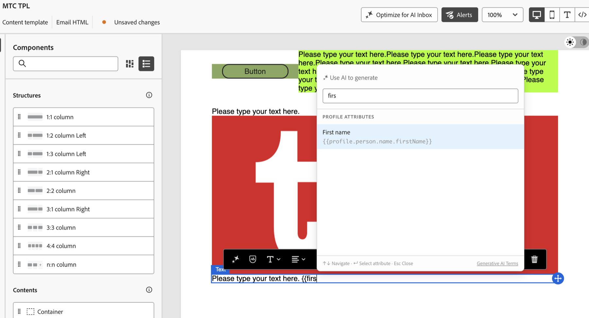

# Release notes {#release-notes}

>[!CONTEXTUALHELP]
>id="ajo_homepage_card1"
>title="What's new?"
>abstract="**Adobe Journey Optimizer** continuously delivers new capabilities, enhancements to existing capabilities, and bug fixes. All changes are consolidated on the last week of each month in these release notes."

[!DNL Adobe Journey Optimizer] follows a continuous delivery model, allowing Adobe to deliver new capabilities, enhancements, and fixes on an ongoing basis. This approach enables a scalable, phased rollout of capabilities to ensure performance and stability across all environments. Because of this model, release notes are updated between monthly releases. For full details about the release cycle and availability phases, see [Journey Optimizer release cycle](releases.md).

[!DNL Adobe Journey Optimizer] is built natively on [!DNL Adobe Experience Platform] and inherits from its latest innovations and improvements. Learn more about these changes in [Adobe Experience Platform Release Notes](https://experienceleague.adobe.com/docs/experience-platform/release-notes/latest.html){target="_blank"}.

>[!NOTE]
>
>Capabilities listed in these release notes include an **Availability date** indicating when each change becomes accessible in your environment. The **Coming Soon** section at the bottom of this page lists capabilities and enhancements scheduled for release in the next few days. Information is subject to change.

## May '26 release notes {#may-26-rn}

### New capabilities {#may-26-features}

The following capabilities were released in May 2026.

<table>
<thead>
<tr>
<th><strong>New Mobile Message channel and Enhanced RCS messaging</strong> </th>
</tr>
</thead>
<tbody>
<tr>
<td>

SMS, MMS, and RCS are now unified under a single <strong>Mobile Message</strong> action in Adobe Journey Optimizer, making it easier to manage all mobile message types from one place. As part of this update, you can now author rich media RCS messages, including images, carousels, and suggested actions, directly in Journey Optimizer through a new native authoring experience.

For more information, refer to the <a href="../mobile/get-started-mobile.md">detailed documentation</a>.

Availability date: May 20, 2026

</td>
</tr>
</tbody>
</table>

<table>
<thead>
<tr>
<th><strong>Chained orchestrated campaigns</strong> </th>
</tr>
</thead>
<tbody>
<tr>
<td>

Orchestrated campaigns can now be linked together by triggering an orchestrated campaign directly from another orchestrated campaign's <strong>End activity</strong>.

This makes it possible to break complex orchestration logic into smaller, reusable flows that can be called from multiple parent campaigns rather than rebuilt each time. The payload passed at runtime is available for segmentation and personalization in the downstream campaign, so each linked campaign can behave based on the context it receives.

For more information, refer to the <a href="../orchestrated/trigger-orchestrated-campaign.md#signal-end">detailed documentation</a>.

Availability date: May 20, 2026

</td>
</tr>
</tbody>
</table>

<table>
<thead>
<tr>
<th><strong>Content Advisor Selector</strong> </th>
</tr>
</thead>
<tbody>
<tr>
<td>

Journey Optimizer now uses the <strong>Content Advisor selector</strong>, a unified modal for selecting both Experience Manager Assets and Content Fragments. The new selector includes:

<ul>
<li><strong>Browsing, searching, and filtering</strong> across all assets and fragments.</li>
<li><strong>AI semantic search</strong>: describe what you need in plain language, e.g. "coffee in the mountains", to surface contextually relevant assets based on meaning and content, not just text matches. Multi-lingual queries are also supported.</li>
<li><strong>Brief upload</strong>: upload a marketing brief to automatically surface assets that align with your campaign context based on its content and requirements.</li>
<li><strong>Dynamic Media renditions</strong>: pick and apply image renditions for dynamic assets without leaving the selector.</li>
</ul>

For more information, refer to the <a href="../integrations/aem-content-advisor.md">detailed documentation</a>.

Availability date: May 19, 2026

</td>
</tr>
</tbody>
</table>

<table>
<thead>
<tr>
<th><strong>Journey Fragments</strong> </th>
</tr>
</thead>
<tbody>
<tr>
<td>

You can now create <strong>Journey Fragments</strong> in Adobe Journey Optimizer. Journey Fragments are reusable sets of journey nodes that you can build once and drop into any journey across your sandbox. Whether it's an eligibility check, a preferred channel routing logic, or a welcome sequence, fragments help teams move faster and stay consistent — without rebuilding the same logic from scratch every time.

Once created, fragments are stored in a dedicated <strong>Fragment Inventory</strong> and can be inserted into any journey using the <strong>Journey fragments</strong> activity.

<!--

-->

This capability is only available for a set of organizations (Limited Availability). To gain access, contact your Adobe representative.

For more information, refer to the <a href="../building-journeys/journey-fragments.md">detailed documentation</a>.

Availability date: May 13, 2026

</td>
</tr>
</tbody>
</table>

<table>
<thead>
<tr>
<th><strong>Deeplinks in the Email Designer</strong> </th>
</tr>
</thead>
<tbody>
<tr>
<td>

It is now possible to add deeplinks to your email contents through a dedicated option in the Email Designer.

This ensures users are taken directly to the right in-app content instead of being redirected to browsers or app stores, preserving context and engagement.

For more information, refer to the <a href="../email/deeplinks.md">detailed documentation</a>.

Availability date: May 12, 2026

</td>
</tr>
</tbody>
</table>
 
<table>
<thead>
<tr>
<th><strong>Journey simulation</strong> </th>
</tr>
</thead>
<tbody>
<tr>
<td>

You can now set your journey to <strong>Simulation</strong>. This mode allows you to validate your logic using <strong>simulated users</strong>. These are temporary profiles created specifically for the simulation, allowing you to test freely without needing to manage persistent test profiles in Adobe Experience Platform.

This capability is available to all customers as a Limited Availability with essential capabilities.

For more information, refer to the <a href="../building-journeys/simulate-journey.md">detailed documentation</a>.

Availability date: May 5, 2026

</td>
</tr>
</tbody>
</table>

<table>
<thead>
<tr>
<th><strong>Decisioning rules and ranking formula AI optimization</strong> </th>
</tr>
</thead>
<tbody>
<tr>
<td>

[!DNL Adobe Journey Optimizer] now uses AI to detect Decisioning rules and ranking formulas that can be simplified. In the inventory, a red indicator appears on any rule for which the AI has identified an optimization opportunity. Clicking the indicator displays the original expression alongside the AI-suggested version. From there, you can download a file to review how simulated profiles are evaluated by each version and confirm they behave identically, then replace the expression with the optimized one.

For more information, refer to the <a href="../start/ai-features.md#decisioning-optimization">detailed documentation</a>.

Availability date: May 5, 2026

</td>
</tr>
</tbody>
</table>
 
<table>
<thead>
<tr>
<th><strong>Integrations</strong> </th>
</tr>
</thead>
<tbody>
<tr>
<td>

The <b>Integrations</b> feature allows you to connect third-party data sources directly to Adobe Journey Optimizer. By simplifying how you pull in external data and <b>composable content</b>, this feature makes it easier to deliver personalized, dynamic messaging across all your channels.

Previously released in Beta, this capability is now available to all environments (General Availability).

For more information, refer to the <a href="../integrations/integrations.md">detailed documentation</a>.

Availability date: May 4, 2026

</td>
</tr>
</tbody>
</table>

### Improvements {#may-26-improv}

The following improvements were also released in May 2026.

#### Email Designer

* **Restrict inheritance breaking in fragments** - When creating or editing a fragment, you can now choose whether it can be modified when used in emails. Locking a fragment ensures it stays synchronized everywhere it appears, preventing local edits that could break brand standards or compliance requirements. This setting can be updated later, applying to future usages. [Read more](../content-management/create-fragments.md#lock-visual-fragment)

  Availability date: May 21, 2026

#### Orchestrated campaigns

* **Add links in Enrichment activity** - The Add Link functionality is now available in the Enrichment Activity for Orchestrated Campaigns. This allows you to create a direct relationship between your working table data and your existing database tables. 

  Availability date: May 20, 2026

#### Decisioning

* **Decisioning migration workflow APIs** - The API contract for creating dependency analysis and migration workflows has been updated: pass **`request-level`** as a **query parameter** on the request URL (`sandbox`, `offer`, or `decision`). Request level must no longer be sent in the JSON body. [Read more](../experience-decisioning/decisioning-migration-api.md)

  Availability date: May 6, 2026

* **Adobe Experience Manager content fragments in Decisioning** - You can now map Adobe Experience Manager content fragments to decision items in Decisioning and leverage them inside decision policies to deliver the right fragment to the right customer at the right time. [Read more](../integrations/aem-fragments.md#aem-decisioning)

  This capability is only available for a set of organizations (Limited Availability). To gain access, contact your Adobe representative.

  Availability date: May 20, 2026

#### Integrations

* **Cross-organization repository access in the Assets Selector** - You can now seamlessly select assets from repositories across multiple organizations directly within the Adobe Experience Manager Asset Selector.

#### SMS

<!--
* **Opt-out and consent at phone number and sender** - For SMS, Journey Optimizer now records marketing consent and opt-out at the level of both the profile's phone number and short code. 

  This capability is currently only available for Sinch SMS configurations. [Read more](../mobile/mobile-configuration-sinch.md)
-->
 
* **Character Count** - In Adobe Journey Optimizer, you can now use the Character Count to monitor the length of your SMS messages in real time. It helps you see when a message will be split into multiple segments to better manage formatting and avoid unexpected increases in sending costs. [Read more](../mobile/create-mobile-message.md)

* **SMS inbounds to a custom dataset** - In **SMS API credentials**, route **inbound SMS** to a **custom, profile-enabled Experience Event dataset** you select instead of only the default tracking dataset. [Read more](../mobile/mobile-webhook.md)

* **Webhook interface enhancement** - When configuring SMS webhooks, the user interface now includes a built-in setup guide with practical examples, making it easier to align provider payloads and troubleshoot issues without leaving the configuration flow. [Read more](../mobile/mobile-webhook.md)

#### WhatsApp

* **WhatsApp button support and tracking** - WhatsApp templates now support **Quick reply**, **Call to action – URL**, and **Call to action – phone**, **Copy code** is not supported. Journey Optimizer sends supported buttons and tracks interactions alongside your other channel reporting.

* **WhatsApp channel context data** - Journey Optimizer now captures additional interaction data returned from the WhatsApp channel and stores it in the **AJO EmailTrackingExperienceEvent Dataset** under the `whatsAppChannelContext` field group. 

  +++ The following fields are captured and can be used to build audiences and analyze WhatsApp engagement

  * **`messageType`** – WhatsApp message type (e.g. `templateBased`, `response`)
  * **`inboundMessage`** – Inbound reply content (e.g. `stop`, `start`, `subscribe`)
  * **`inboundNumber`** – Sender ID where the inbound message was received
  * **`channelType`** – Channel category (`Utility`, `Marketing`, or `Promotional`)
  * **`profileNumber`** – Phone number from which the inbound message was received
  * **`origTimestamp`** – Original timestamp from Meta / WhatsApp
  * **`status`** – Delivery status including standardized provider feedback (`sent`, `delivered`, `bounce`, `error`, `delay`, `duplicate`, `denylist`, `exclude`, or `unknown`) and the raw provider status message
  * **`reactionEvent`** – Content of the user response: emoji for reactions, or message text for replies to a specific message
  * **`reactionMessageID`** – ID of the original message being responded to
  * **`reactionActionName`** – Type of response action (`react`, `unreact`, or `reply`)
  * **`interactiveSelectedTitle`** – User-selected title from a WhatsApp interactive message
  * **`interactiveType`** – Interactive message type (`list reply`, `button reply`, or `button`)
  * **`interactiveSelectedDescription`** – Description of the selected WhatsApp interactive option
  * **`interactiveSelectedID`** – ID of the selected option from WhatsApp
  
  +++

### Usability improvements {#may-26-usability}

The following usability improvements were also released in May 2026.

#### Lists

* **Bulk actions** - You can now select multiple items at once in the **Campaigns**, **Fragments**, and **Templates** lists and perform bulk operations from a single action bar, including adding items to a package, moving them to a folder, editing tags, managing access, and archiving or deleting them. [Learn more](../start/search-filter-categorize.md#bulk-actions)

  

* **Sorting and column resizing** - The **Campaigns**, **Fragments**, and **Templates** lists now support sorting by clicking any column header. In the Campaigns folders view, sorting and filtering by **[!UICONTROL Priority]** and **[!UICONTROL Channel configuration]** is also available. Column widths in the **Fragments** and **Templates** lists are also resizable — drag the column border to fit the data you care about most. [Learn more](../start/search-filter-categorize.md#filter-lists)

#### Content authoring

* **Inline profile attribute editing** - You can now insert profile attribute expressions directly in the Email Designer without opening the full personalization editor. Type `{{` in any text field to open an inline autocomplete dropdown, then browse and select the attribute you need — it is inserted at the cursor position instantly. This capability is also available in the Push channel editor. [Learn more](../personalization/personalize.md#inline-personalization)

  

* **Link URL tooltip in Push channel editor** - When a URL in any link or media field is too long to display, a tooltip icon is always visible next to the field — hover over it to see the complete URL. [Learn more](../push/design-push.md#on-click-behavior)

  

<!--
#### Simulation & Preview

* **Redesigned preview experience** - The content preview screen has been redesigned with a side-by-side layout that lets you compare how your content renders across multiple profiles at a glance, enabling quicker and more confident reviews before sending. [Learn more](../test-approve/simulate-sample-input.md#preview)

  
-->

## Coming soon {#coming-soon}

The following capabilities and enhancements are scheduled for release later in May. **Information is subject to change**. Updated links, screens, and documentation will be shared once these updates are live in production.

### New capabilities {#coming-soon-features}

<table>
<thead>
<tr>
<th><strong>AI Assistant for Journey Expressions</strong> </th>
</tr>
</thead>
<tbody>
<tr>
<td>

AI Assistant now operates in the journey advanced expression editor to convert natural-language prompts into valid expressions and conditional logic. Describe the expression you want to build, and AI Assistant generates ready-to-use code you can apply immediately or refine through follow-up prompts.

This capability is available to all customers as a Public Beta.

<!--

-->

Availability date: May 22, 2026

</td>
</tr>
</tbody>
</table>

<table>
<thead>
<tr>
<th><strong>Automatic completion for non-recurring Read Audience journeys</strong> </th>
</tr>
</thead>
<tbody>
<tr>
<td>

Non-recurring <strong>Read Audience</strong> journeys now automatically transition to <strong>Stopped</strong> status once the last active profile exits. Previously, these journeys remained <strong>Live</strong> until the 91-day global timeout expired — even when no profiles were flowing through them anymore. With this improvement, journey status reflects actual execution state as soon as it completes, keeping your journey inventory accurate without manual intervention.

Note that this behavior does not apply to journeys that include nodes causing waiting periods, such as Wait nodes, Reaction nodes, or event-triggered transitions. These journeys remain subject to the standard 91-day global timeout.

Availability date: May 21, 2026

</tr>
</tbody>
</table>

<table>
<thead>
<tr>
<th><strong>Decisioning support in Direct Mail channel</strong> </th>
</tr>
</thead>
<tbody>
<tr>
<td>

You can now add Decision policies into Direct Mail journeys and campaigns. Decision policies are containers for your offers that leverage the Decisioning engine to dynamically return the best content for each audience member. Direct Mail decisioning also supports batch decisioning use cases, enabling you to export the corresponding offer items for every profile in a given Adobe Experience Platform audience.

<!--

-->

Availability date: June, 1 2026

</td>
</tr>
</tbody>
</table>

<table>
<thead>
<tr>
<th><strong>Journey path optimization – Targeting</strong> </th>
</tr>
</thead>
<tbody>
<tr>
<td>

Use the new <strong>Optimize</strong> node to target specific audiences to determine the best path to meet your business-centric KPIs.

This tool allows you to develop more effective marketing campaigns that are more likely to resonate at the 1:1 level, improve marketing personalization efforts for customers and enhance critical customer engagement KPIs, such as conversions and revenue.

Previously available in Limited Availability, this capability is now available to all environments (General Availability).

Availability date: May 21, 2026

</td>
</tr>
</tbody>
</table>

<table>
<thead>
<tr>
<th><strong>Journey Arbitration – ranking formulas</strong> </th>
</tr>
</thead>
<tbody>
<tr>
<td>

You can now use formulas to automatically boost journey priority scores based on customer profile attributes and contextual factors, ensuring customers enter the most relevant journeys.

Previously available in Limited Availability, this capability is now available to all environments (General Availability).

Availability date: May 21, 2026

</td>
</tr>
</tbody>
</table>

<table>
<thead>
<tr>
<th><strong>Journey Simulation</strong> </th>
</tr>
</thead>
<tbody>
<tr>
<td>

You can now set your journey to <strong>Simulation</strong>. This mode allows you to validate your logic using <strong>simulated users</strong>. These are temporary profiles created specifically for the simulation, allowing you to test freely without needing to manage persistent test profiles in Adobe Experience Platform.

Previously released in Limited Availability, this capability is now available to all environments (General Availability). With General Availability release, you can now use Journey Agent to generate simulated users and events directly in the Simulation menu.

Availability date: early June, 2026

</td>
</tr>
</tbody>
</table>

<table>
<thead>
<tr>
<th><strong>File-based targeting for orchestrated campaigns</strong> </th>
</tr>
</thead>
<tbody>
<tr>
<td>

Orchestrated campaigns now support loading a CSV or TXT file directly into the campaign canvas as the targeting audience, without first ingesting the file into Adobe Experience Platform. The file data is consumed at execution time and is not persisted as an Adobe Experience Platform dataset. During file setup, you can define column mappings, data types, NULL handling, and per-column error policies. This supports ad-hoc sends or partner list campaigns where building a full ingestion pipeline is not practical. 

This capability is only available for a set of organizations (Limited Availability). To gain access, contact your Adobe representative.

Availability date: June, 1 2026

</td>
</tr>
</tbody>
</table>

<table>
<thead>
<tr>
<th><strong>Journey path optimization – Targeting</strong> </th>
</tr>
</thead>
<tbody>
<tr>
<td>

Use the new <strong>Optimize</strong> node to target specific audiences to determine the best path to meet your business-centric KPIs.

This tool allows you to develop more effective marketing campaigns that are more likely to resonate at the 1:1 level, improve marketing personalization efforts for customers and enhance critical customer engagement KPIs, such as conversions and revenue.

Previously available in Limited Availability, this capability is now available to all environments (General Availability).

Availability date: May 21, 2026

</td>
</tr>
</tbody>
</table>

<table>
<thead>
<tr>
<th><strong>Journey Arbitration – Ranking formulas</strong> </th>
</tr>
</thead>
<tbody>
<tr>
<td>

You can now use formulas to automatically boost journey priority scores based on customer profile attributes and contextual factors, ensuring customers enter the most relevant journeys.

Previously available in Limited Availability, this capability is now available to all environments (General Availability).

Availability date: May 21, 2026

</td>
</tr>
</tbody>
</table>

### Improvements {#coming-soon-improvements}

#### Navigation

* **Folders for journeys and campaigns** - You can now organize your journeys and campaigns into folders to improve navigation and management in the interface.

  Availability date: June 2, 2026

#### Journeys

* **Certificate-Based Custom Authentication in custom actions** - Custom actions now support Certificate-Based Custom Authentication. By adding subType: "certificateCredential" to a custom authorization configuration, Journey Optimizer uses Adobe's managed certificate to sign a JWT client assertion and exchange it for an access token — no client secret required. Designed for enterprise APIs that enforce certificate-based identity verification, such as Azure Entra ID.

  Availability date: May 21, 2026

* **Supplemental identifier support for external audiences** - Supplemental identifiers in journeys are now supported for external audiences, including audiences imported from a CSV file and audiences created with Federated Audience Composition. You can designate any non-identity attribute or non-person identity attribute from the audience as the supplemental ID, no schema labeling is required.

  Availability date: June, 1 2026

#### Orchestrated campaigns

* **Loop-based personalization for relational data** - The personalization editor now supports a Loop block that iterates over relational collections, such as orders, accounts, or bookings, and renders one content block per record inside a single email or SMS. Collections are configured through the data picker using personalization tokens, with no expression writing required.

  Availability date: June, 1 2026

#### Email Designer

* **Rich text in editable fragment fields** - You can now add rich text to customizable fragments that are used in your email content. For example, when using the Text component as an editable field in the Email Designer, you can directly format the content (for example, bold and italics) and insert hyperlinks.

  Availability date: June 1, 2026

#### Campaigns

* **Customer alerts for campaign lifecycle events** - New system alerts now notify you of key lifecycle events for Action and API-triggered campaigns. Subscribe at the sandbox level.

  Availability date: June, 1 2026

* **Override the default execution field in campaigns** - Previously available at the journey level, you can now override the default execution field set globally for your Email, SMS and WhatsApp deliveries in the campaign parameters.

  Availability date: June 1, 2026

#### Email

* **Personalize email sender details per recipient and campaign** - Orchestrated campaigns now support personalization of email header fields, including From name, From address, and Reply-To, using profile attributes or relational data. This allows sender details to reflect the relevant advisor, location, or branch for each recipient, rather than routing all sends through a single corporate address. 

  Header values can be set at the channel level and overridden per campaign using contextual data for more precise control.

  Availability date: June 1, 2026

#### Configuration

* **Message Feedback Event Dataset moving to batch ingestion** - The `AJO Message Feedback Event Dataset` is transitioning from streaming to batch ingestion mode. This change ensures that data ingestion does not exceed streaming ingestion limits. If you use this dataset in Customer Journey Analytics reports or run queries against it, expect an increase in data latency of up to 2 hours going forward.

  Availability date: June 1, 2026

#### Reporting

* **Exclude bot clicks for email and SMS reporting** - New estimated metrics are now available to help filter out non-human (bot) interactions from email and SMS reporting. These include estimated clicks, click-through rates (CTR), and click-to-open rates (CTOR), providing a more accurate view of real customer engagement. Existing metrics remain unchanged, and these new metrics can be used alongside current reporting for improved analysis.

  Availability date: June 1, 2026
