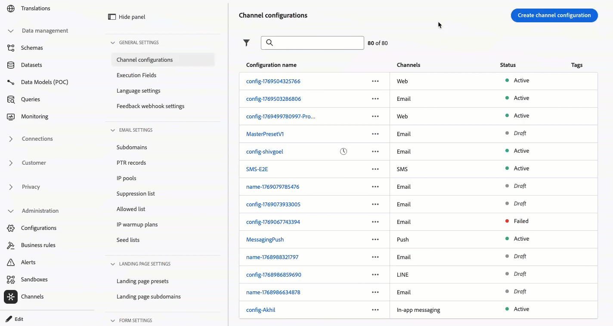

# Release notes {#release-notes}

>[!CONTEXTUALHELP]
>id="ajo_homepage_card1"
>title="What's new?"
>abstract="**Adobe Journey Optimizer** continuously delivers new features, enhancements to existing features, and bug fixes. All changes are consolidated on the last week of each month in these release notes."

[!DNL Adobe Journey Optimizer] follows a continuous delivery model, allowing Adobe to deliver new features, enhancements, and fixes on an ongoing basis. This approach enables a scalable, phased rollout of capabilities to ensure performance and stability across all environments.

Because of this model, release notes are updated between monthly releases. For full details about the release cycle and availability phases, see [Journey Optimizer release cycle](releases.md).

[!DNL Adobe Journey Optimizer] is built natively on [!DNL Adobe Experience Platform] and inherits from its latest innovations and improvements. Learn more about these changes in [Adobe Experience Platform Release Notes](https://experienceleague.adobe.com/docs/experience-platform/release-notes/latest.html){target="_blank"}.

## January '26 release notes {#latest-rn}

**Release date**: January 27-28, 2026

The [Features](#jan-26-01-features) and [Improvements](#jan-26-01-improv) sections cover capabilities already available, while [Coming soon](#jan-26-01-coming-soon) lists items scheduled for a later availability date.

<!-- **The pre-release notes below are subject to change without prior notice until the release availability date**. Links, screens and updated documentation are published in the release notes, at the release date. 

See also [Adobe Experience Platform Pre-release notes](https://experienceleague.adobe.com/en/docs/experience-platform/release-notes/pre-release-notes){target="_blank"}.-->

### New capabilities {#jan-26-01-features}

<table>
<thead>
<tr>
<th><strong>Message export</strong> </th>
</tr>
</thead>
<tbody>
<tr>
<td>

A new <strong>Message Export</strong> capability is now available for email and SMS channels. This feature allows you to automatically export sent message content to a dedicated Experience Platform dataset, enabling you to:

<ul>
<li>Meet regulatory compliance requirements (such as HIPAA)</li>
<li>Archive messages for legal claims and customer care inquiries</li>
<li>Retain copies of personalized content sent to individuals</li>
</ul>

Records are retained in the AJO Message Export Dataset for 7 calendar days from ingestion. During this retention period, you can export them to your own storage via Experience Platform destinations. The feature is enabled at the channel configuration level, giving you <strong>granular control</strong> over which messages are exported.

This capability is only available for the email and SMS channel, for organizations that have purchased the Message Export add-on offering. For more information, contact your Adobe representative.

For more information, refer to the <a href="../configuration/message-export.md#message-export">detailed documentation</a>.

</td>
</tr>
</tbody>
</table>

<table>
<thead>
<tr>
<th><strong>Web Push notifications channel</strong> </th>
</tr>
</thead>
<tbody>
<tr>
<td>

Adobe Journey Optimizer now supports <strong>Web Push notifications</strong>, expanding the push channel beyond mobile. You can seamlessly deliver notifications to both <strong>mobile and desktop browsers</strong>, enabling you to reach customers directly on their devices without requiring an app. This enhancement allows you to engage users with timely, personalized messages in real time, leveraging the same authoring workflows and targeting capabilities already available for mobile push.

Previously released in Beta, this capability is now available to all environments (General Availability).

For more information, refer to the <a href="../push/push-configuration-web.md">detailed documentation</a>.

</td>
</tr>
</tbody>
</table>

<table>
<thead>
<tr>
<th><strong>Direct mail channel in orchestrated campaigns</strong> </th>
</tr>
</thead>
<tbody>
<tr>
<td>

Direct mail channel is now available in orchestrated campaigns. The <strong>Direct mail activity</strong> facilitates direct mail sending within your Orchestrated campaign, for both one-time and recurring messages. It serves to automate the process of generating the <strong>extraction file</strong> required by direct mail providers. You can combine channel activities into the Orchestrated campaign canvas to create cross-channel campaigns that can trigger actions based on customer behavior and data.

For more information, refer to the <a href="../orchestrated/activities/channels.md#channel">detailed documentation</a>.

</td>
</tr>
</tbody>
</table>

<table>
<thead>
<tr>
<th><strong>Journey Agent - Create a Journey</strong> </th>
</tr>
</thead>
<tbody>
<tr>
<td>

Journey Agent now offers creation capabilities, enabling Journey Optimizer users to build and configure marketing journeys through a <strong>natural language interface</strong>. With these new skills, practitioners can quickly create journeys by simply describing their requirements in <strong>conversational prompts</strong>. This innovation streamlines the journey creation process, allowing marketers to concentrate on strategy rather than technical configuration.

For more information, refer to the <a href="../start/ai-features.md#journey-agent">detailed documentation</a>.

Availability date: January 12, 2026

</td>
</tr>
</tbody>
</table>

<table>
<thead>
<tr>
<th><strong>Action campaign retrieval API</strong> </th>
</tr>
</thead>
<tbody>
<tr>
<td>

A new Journey Optimizer API is now available, enabling you to programmatically retrieve and inspect <strong>campaign-related data</strong> such as details, versions, and configurations.

For more information, refer to the <a href="https://developer.adobe.com/journey-optimizer-apis/references/campaigns-retrieve/" target="_blank">detailed documentation</a>.

Availability date: November 24, 2025

</td>
</tr>
</tbody>
</table>

<table>
<thead>
<tr>
<th><strong>Email Designer themes</strong> </th>
</tr>
</thead>
<tbody>
<tr>
<td>

You can now quickly apply <strong>pre-approved themes</strong> to ensure <strong>brand consistency</strong> across all emails, speed up your campaign creation process, and independently produce high-quality emails while reducing dependency on design teams.

Previously released in beta version, this capability is now available for a set of organizations (Limited Availability). To gain access, contact your Adobe representative.

For more information, refer to the <a href="../email/apply-email-themes.md">detailed documentation</a>.

Availability date: November 5, 2025

</td>
</tr>
</tbody>
</table>

### Improvements {#jan-26-01-improv}

#### AI

* **AI Assistant Content Quality Checks** - In addition to brand alignment, you can now evaluate overall <strong>content quality</strong> to uncover potential issues with <strong>readability</strong>, cohesiveness, and effectiveness, independent of your brand guidelines. These automated checks help identify unclear messaging, inconsistent tone, or structural gaps. [Read more](../content-management/brands-score.md#validate-quality). [Discover this feature in video](https://video.tv.adobe.com/v/3470544/?learn=on).

#### Experience Decisioning

#### Journeys

* **Combine native and Adobe Campaign message actions** - Journey Optimizer now lets you combine <strong>Adobe Campaign v7/v8</strong> message actions with <strong>native channel actions</strong> in the same journey. [Read more](../building-journeys/using-adobe-campaign-v7-v8.md)

* **Custom action error response payload** - You can now define an optional <strong>error response payload</strong> for custom actions. When a call fails, the error payload is exposed in the journey context (under the action's errorResponse node) and is available in the <strong>timeout/error branch</strong>, alongside `jo_status_code`, to support richer fallback logic and debugging. [Read more](../action/action-response.md)

* **Journey payload size validation in journeys** - Journey Optimizer now validates <strong>payload sizes</strong> to help ensure optimal performance and system stability. When building or publishing journeys, you receive clear <strong>warnings and errors</strong> if payload sizes approach or exceed recommended limits, along with actionable guidance to optimize your journey configuration. This proactive validation helps you identify potential issues early and maintain journey performance. [Read more](../start/guardrails.md#journey-payload-size)

* **Journey alerts** - New <strong>pre-configured alerts</strong> are available for journeys.
  * <strong>Profile Discard Rate Exceeded</strong> - Ratio of profile discards to entered profiles over the last 5 mins exceeded threshold
  * <strong>Custom Action Error Rate Exceeded</strong> - Ratio of custom action errors to successful HTTP calls over the last 5 mins exceeded threshold
  * <strong>Profile Error Rate Exceeded</strong> - Ratio of profiles-in-error to entered profiles over the last 5 mins exceeded threshold

  For more information, refer to the [detailed documentation](../reports/alerts.md).

  Availability date: October 14, 2025.

#### Orchestrated campaigns

* **Data usage label inheritance for audiences** - Labels applied in Adobe Experience Platform now automatically carry over when saving <strong>audiences</strong> in orchestrated campaigns, reducing manual <strong>DULE tagging</strong>. [Read more](../orchestrated/activities/save-audience.md)

* **Predefined filters with parameters** - You can now create <strong>predefined filters</strong> with <strong>parameters</strong> in orchestrated campaigns for reusable, editable rules. [Read more](../orchestrated/predefined-filters.md)

* **Select attributes and copy distribution values** - You can now <strong>select or copy values</strong> directly from the <strong>distribution of values</strong> view in orchestrated campaigns. [Read more](../orchestrated/build-query.md)

* **Message confirmation before send** - A <strong>confirmation step</strong> is now enabled by default before sending orchestrated campaigns to reduce accidental sends. [Read more](../orchestrated/activities/channels.md#confirm-message-sending)

* **Predefined retargeting filters** - To support easier retargeting for orchestrated campaign use cases, this release introduces new <strong>campaign feedback filters</strong>. These filters let you directly target audiences based on <strong>message engagement</strong>, such as sent, opened only, opened or clicked, or opened and clicked, and select the specific campaign or in-transition campaign you want to retarget. [Read more](../orchestrated/retarget.md)

* **Rate control support** - Orchestrated campaigns now support <strong>rate control</strong> to help you pace deliveries and align with <strong>volume constraints</strong>. [Read more](../orchestrated/activities/channels.md#rate-control)

* **Restart button** - Orchestrated campaigns now include a <strong>restart button</strong> so you can quickly <strong>re-launch runs</strong> when needed before publishing the campaign. [Read more](../orchestrated/start-monitor-campaigns.md)

* **User-generated metadata support** - The <strong>executionMetadata helper function</strong> is now available in the personalization editor for Orchestrated campaigns, enabling you to attach contextual information to any native action and store it in a dataset for export to external systems. [Read more](../personalization/functions/helpers.md#execution-metadata)

#### Campaigns

* **Schedule Campaign using Profile Time Zone** - Campaign scheduling can now use each profile's <strong>time zone</strong> to deliver messages at the intended local time. [Read more](../campaigns/campaign-schedule.md)

  **Note**: This improvement will only be available for a set of organizations (Limited Availability).

#### Permissions

* **Prevent self-approval for journeys and campaigns** - Added an option when creating or setting <strong>Approval Policy</strong> to prevent journey or campaign creators from <strong>approving their own objects</strong>. [Read more](../test-approve/approval-policies.md)

## Coming soon {#jan-26-01-coming-soon}

In the next few days, the following capabilities and enhancements are scheduled for release. **Information is subject to change**. Updated links, screens, and documentation will be shared once these updates are live in production.

### Features

<table>
<thead>
<tr>
<th><strong>Direct mail channel in journeys</strong> </th>
</tr>
</thead>
<tbody>
<tr>
<td>

Previously limited to Campaigns, <strong>Direct Mail</strong> channel is now available on the journey canvas, enabling you to incorporate Direct Mail into your journeys. Direct Mail can now be used in both <strong>batch and 1:1 journey scenarios</strong>, with support for file extraction configuration and time-based frequency settings.

Previously released in Limited Availability, this capability will be available to all environments (General Availability).

Availability date: January 28, 2026

</td>
</tr>
</tbody>
</table>

<table>
<thead>
<tr>
<th><strong>Quiet hours (time-based exclusions)</strong> </th>
</tr>
</thead>
<tbody>
<tr>
<td>

<strong>Quiet hours</strong> let you define time-based exclusions for Email, SMS, Push, and WhatsApp channels. They ensure that no messages are sent during specific periods of time, helping you respect customer preferences and compliance requirements. You can apply quiet hours through <strong>rule sets</strong>, which can be assigned to individual actions in campaigns or journeys for precise control.

Previously released in Limited Availability, this feature is now available to all environments. With this General Availability release, the feature now includes the ability for customer to queue a campaign action until the completion of Quiet Hours, and the ability to preview the activated Quiet Hours rule.

Availability date: January 28, 2026

</td>
</tr>
</tbody>
</table>

<table>
<thead>
<tr>
<th><strong>Self-service migration tooling APIs</strong> </th>
</tr>
</thead>
<tbody>
<tr>
<td>

<strong>Migration tooling APIs</strong> are now available to programmatically migrate Decision management entities to Decisioning, featuring:

<ul>
<li>Flexible migration scopes (sandbox, offer, or decision level)</li>
<li>Automated dependency analysis and validation</li>
<li>Rollback support for completed migrations</li>
<li>Detailed migration reports with object mappings</li>
</ul>

Availability date: January 28, 2026

</td>
</tr>
</tbody>
</table>

<table>
<thead>
<tr>
<th><strong>Custom action monitoring</strong> </th>
</tr>
</thead>
<tbody>
<tr>
<td>

Gain deeper insight into the health and performance of your <strong>custom action endpoints</strong> with a new monitoring dashboard and enriched journey step event data. Track successful calls, errors, throughput, response times, and queue wait times to quickly understand when, where, and why anomalies occur.

Previously released in Limited Availability, this capability is now available to all environments (General Availability).

Availability date: January 28, 2026

</td>
</tr>
</tbody>
</table>

<table>
<thead>
<tr>
<th><strong>Content generation within Journey Agent</strong> </th>
</tr>
</thead>
<tbody>
<tr>
<td>

Powered by Adobe Experience Platform Agent Orchestrator, <strong>Journey Agent</strong> is available in Journey Optimizer and enables you to analyze journeys through a natural language interface. You can now also <strong>generate and manage content</strong> directly in Journey Agent, creating content for channels such as email and push, applying and previewing templates, refining tone and style through prompts, and opening content in Content Designer for in-context editing.

Availability date: February 2, 2026

</td>
</tr>
</tbody>
</table>

<table>
<thead>
<tr>
<th><strong>Decisioning support in Push and SMS channels</strong> </th>
</tr>
</thead>
<tbody>
<tr>
<td>

You can now personalize and optimize the content of your <strong>Push and SMS</strong> Messages with <strong>Decisioning</strong>. Use Priority Scores, Formulas, or AI Models to display the best content to your customers.

Availability date: February 3, 2026

</td>
</tr>
</tbody>
</table>

<table>
<thead>
<tr>
<th><strong>Content decision activity</strong> </th>
</tr>
</thead>
<tbody>
<tr>
<td>

A new <strong>Content decision activity</strong> is now available in the journey canvas for integrating <strong>personalized offers</strong> directly into your customer journeys. This activity enables you to deliver decision-based content and reference those offers throughout your journey - in conditions for creating eligibility-based branching, in custom actions for passing offer data to external systems, and in other activities for building fully personalized customer experiences.

This capability will be available to all environments (General Availability).

Availability date: February 3, 2026

</td>
</tr>
</tbody>
</table>

### Improvements

* **SMS Webhooks** - <strong>Webhooks</strong> are now supported across all SMS providers. You can configure each webhook based on its intended purpose, Inbound webhooks to capture incoming messages and Feedback webhooks to receive delivery receipts, status updates, and other message-related events.

  Availability date: January 29, 2026.

* **Attach fragments to decision items** - Journey Optimizer now provides the ability to attach <strong>fragments</strong> to <strong>decision items</strong> which can be leveraged in code-based experience campaigns through decision policies.

  Availability date: January 30, 2026.
