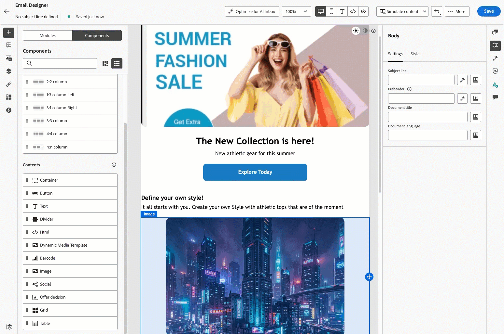

# Release notes {#release-notes}

>[!CONTEXTUALHELP]
>id="ajo_homepage_card1"
>title="What's new?"
>abstract="**Adobe Journey Optimizer** continuously delivers new capabilities, enhancements to existing capabilities, and bug fixes. All changes are consolidated on the last week of each month in these release notes."
 
[!DNL Adobe Journey Optimizer] follows a continuous delivery model, allowing Adobe to deliver new capabilities, enhancements, and fixes on an ongoing basis. This approach enables a scalable, phased rollout of capabilities to ensure performance and stability across all environments. Because of this model, release notes are updated between monthly releases. For full details about the release cycle and availability phases, see [Journey Optimizer release cycle](releases.md).

[!DNL Adobe Journey Optimizer] is built natively on [!DNL Adobe Experience Platform] and inherits from its latest innovations and improvements. Learn more about these changes in [Adobe Experience Platform Release Notes](https://experienceleague.adobe.com/docs/experience-platform/release-notes/latest.html){target="_blank"}.

>[!NOTE]
>
>Capabilities listed in these release notes include an **Availability date** indicating when each change becomes accessible in your environment. Entries in the **Coming soon** accordions are expected in the upcoming days or weeks. Information in these sections is subject to change. 

## September '26 release notes {#sep-26-updates}

>[!BEGINSHADEBOX]

**New in CX Enterprise Coworker this month**

This release brings several new and improved [Coworker](../start/ai-features.md#cx-coworker) features and skills, listed here for visibility. Each one is also detailed in its relevant section below.

* [CE Channel Content plugin](#sep-26-content-management) - A new plugin that brings campaign copy, image, and email HTML skills together in Coworker, from campaign brief to production-ready copy and HTML.
* [Content Management MCP tools](#sep-26-content-management) - Discover and manage content templates, fragments, landing pages, and inline message content through natural language prompts in Coworker.
* [Journey Simulation](#sep-26-journeys) - Automate end-to-end journey validation and interpret the results directly in Coworker.
* [Compare journey versions](#sep-26-journeys) - Get a full-fidelity, structured diff between any two versions of a journey through Coworker Chat.
* [Analyze Journey Anomalies skill](#sep-26-journeys) - Detect unexpected spikes, drops, or flatlines in a journey's entry, exit, or message-send counts, with root-cause diagnostics.
* [Decisioning Explainer skill](#sep-26-decisioning) - Ask Coworker why a specific offer was or wasn't shown to a profile, or to a segment, and get a full trace of eligibility, ranking, and rule exclusions.
* [Rules & Ranking skill](#sep-26-decisioning) - Create, explain, simulate, and optimize Decisioning eligibility rules and ranking formulas in natural language, without writing or validating PQL syntax by hand.

+++ Coming soon — **Information below is subject to change.**

* [Journey creation from the Coworker rail](#sep-26-journeys) - Generate journeys with AI directly from the Coworker right rail, replacing the previous AI Assistant experience.
* [Loyalty recommendation skill](#sep-26-loyalty) - Request challenge opportunities directly in Coworker's conversational interface and turn them into live challenges without leaving the chat.
* [Hygiene Analysis skill](#sep-26-journeys) - Scan active and draft journeys for broken configurations, silent failures, and decaying or unused assets, with recommended fixes.
* [Business Performance Analysis skill](#sep-26-journeys) - Analyze journey performance and get concrete optimization recommendations, right from the chat.

+++

>[!ENDSHADEBOX]

### Content Management {#sep-26-content-management}

The following capability is coming to content management in this release.

<table>
<thead>
<tr>
<th><strong>Channel Content plugin in Coworker</strong> </th>
</tr>
</thead>
<tbody>
<tr>
<td>

A new <strong>Channel Content</strong> plugin is now available in Coworker, bringing campaign copy, image, and assembled email HTML skills together under one plugin from strategy to deployment. The following skills are available under the <b>Channel Content</b> plugin:

<ul>
<li><strong>Orchestrate Content Authoring</strong>.</li>
<li><strong>Explore Content Strategy</strong></li>
<li><strong>Content Brief</strong></li>
<li><strong>Generate Content</strong></li>
<li><strong>Check Content Readiness</strong></li>
<li><strong>Revise and Regenerate Content</strong></li>
<li><strong>Generate Image</strong></li>
<li><strong>Assess Content Design</strong></li>
<li><strong>Save Channel Content</strong></li>
<li><strong>Build Email from Figma</strong></li>
<li><strong>Brand Lookup</strong> </li>
</ul>

For more information, refer to the <a href="../content-management/content-management-coworker-skills.md#content-management#ce-channel-content">detailed documentation</a>.

Availability date: September 24, 2026

</td>
</tr>
</tbody>
</table>

<table>
<thead>
<tr>
<th><strong>Content Management MCP tools in CX Coworker</strong> </th>
</tr>
</thead>
<tbody>
<tr>
<td>

CX Coworker now has a new set of <strong>Content Management MCP tools</strong>, letting you discover and manage Journey Optimizer content assets through natural language prompts. Ask it to list or retrieve content templates, fragments, landing pages, and journey/campaign inline message content. It can also create content, update templates, and create, update, clone, and publish fragments — plus update inline channel action content directly in journey and campaign.

For more information, refer to the <a href="../content-management/content-management-coworker-skills.md#content-management">detailed documentation</a>.

Availability date: September 3, 2026

</td>
</tr>
</tbody>
</table>

* **Mandatory consent checkbox for landing pages** - You can now make a checkbox mandatory in the landing page form component, requiring visitors to select it (for example, to give consent) before they can submit the form. [Learn more](../landing-pages/lp-content.md#use-form-component)

  Availability date: September 4, 2026 

* **Additional reserved keywords in personalization syntax** - The list of reserved keywords in Profile Query Language (PQL) has been expanded to include general keywords, time units, and boolean/logical operators. If your XDM schema contains a field name that matches one of these keywords, wrap it in backticks to reference it in a personalization expression. [Learn more](../personalization/personalization-syntax.md#reserved-keywords)

  Availability date: September 1, 2026

### Loyalty {#sep-26-loyalty}

<table>
<thead>
<tr>
<th><strong>Loyalty event mapping updates</strong> </th>
</tr>
</thead>
<tbody>
<tr>
<td>

Creating or editing an Event Mapping now uses a new **visual mapping builder**: select a schema, pick fields from a searchable field selector, map each field to a loyalty event field with per-row connection status, and preview the auto-generated JSONata expression, with the option to switch to manual JSONata editing at any time.

In addition, "Event Definitions" in Loyalty admin have been renamed to "Event Mappings", with a refreshed list view that shows the human-readable Experience event schema name.

For more information, refer to the <a href="../loyalty-challenges/loyalty-admin.md#event-mappings">detailed documentation</a>.

Availability date: September 22, 2026

</td>
</tr>
</tbody>
</table>

* **"Forever" Loyalty challenges** - Loyalty challenges can now run indefinitely. Set **Challenge end** to **No end date** when configuring the schedule, and the challenge never expires. [Learn more](../loyalty-challenges/create-challenges.md#schedule)

  Availability date: September 1, 2026

* **Loyalty available for Healthcare Shield and Privacy and Security Shield customers** - Journey Optimizer Loyalty is now available to Healthcare Shield and Privacy and Security Shield customers. [Learn more](../loyalty-challenges/get-started.md)

  Availability date: September 15, 2026

+++ Coming soon — **Information below is subject to change.**

<table>
<thead>
<tr>
<th><strong>Challenge Recommendations</strong> </th>
</tr>
</thead>
<tbody>
<tr>
<td>

The Loyalty Performance menu now includes **Opportunities** and **Trend** tabs, which surface AI-detected trends and gaps such as tier progression friction or challenge task drop-off, each with a projected impact and a one-click "Create with AI" action to generate a challenge that addresses it.

In addition, marketers can request **challenge opportunities** directly in Coworker's conversational interface, getting grounded challenge ideas based on real loyalty program trends and turning them into live challenges without leaving the chat.

</td>
</tr>
</tbody>
</table>

* **Per-member Loyalty challenge completion deadlines** - Loyalty challenges now support per-member completion deadlines: choose "Within a number of days after opt-in" under Completion requirements so each member's deadline is calculated from their own opt-in date rather than a fixed program-wide end date. If both a challenge end date and this opt-in window are set, each member's deadline is whichever comes first. <!-- Documentation link: TBD -->

* **Challenges domain in the Content Card personalization editor** - The Content Card personalization editor now supports **Challenges** as a domain, letting you access challenge metadata when authoring content card personalization. This makes it easier to create tailored content for each stage of a challenge — Launch, In progress, and End — without custom code. 

+++

### Journeys {#sep-26-journeys}

<table>
<thead>
<tr>
<th><strong>Compare journey versions with Coworker</strong> </th>
</tr>
</thead>
<tbody>
<tr>
<td>

Today, reviewing what changed between two versions of a journey requires manually comparing them inside Journey Optimizer node by node. There's no structured diff, which makes change-review, audit, and pre-publish checks slow and error-prone, especially as journeys grow more complex. This capability lets a customer or AI agent compare any two versions of a journey through Coworker Chat and get back a full-fidelity, **structured diff** - added/removed/modified/moved nodes with field-level detail, changed connections, journey-level property changes, and roll-up counts, without opening Journey Optimizer. 

For more information, refer to the <a href="../building-journeys/journeys-coworker-skills.md#journey-analyze">detailed documentation</a>.

Availability date: September 24, 2026

</td>
</tr>
</tbody>
</table>

<table>
<thead>
<tr>
<th><strong>Journey Simulation in Coworker</strong> </th>
</tr>
</thead>
<tbody>
<tr>
<td>

The <strong>Journey Simulation skill</strong> in Coworker automates end-to-end journey validation and lets you easily interpret the results. Note that this feature currently supports only the Quick Simulation flow and does not fully replace the Journey Optimizer manual simulation experience.

For more information, refer to the <a href="../building-journeys/journeys-coworker-skills.md#journey-simulation">detailed documentation</a>.

Availability date: September 23, 2026

</td>
</tr>
</tbody>
</table>

<table>
<thead>
<tr>
<th><strong>Journey-level holdout (Limited availability)</strong> </th>
</tr>
</thead>
<tbody>
<tr>
<td>

You can now configure a holdout group for your journeys directly from journey properties. A holdout is a configurable percentage of your target audience that is excluded from entering the journey and receives no communication. By comparing holdout profiles against active profiles in Customer Journey Analytics reporting, you can measure the incremental lift - the true impact - that your journey delivers.

This capability is only available for a set of organizations (Limited Availability). To gain access, contact your Adobe representative. For full details about the release cycle and availability phases, see <a href="releases.md">Journey Optimizer release cycle</a>.

For more information, refer to the <a href="../building-journeys/journey-properties.md#performance-management">detailed documentation</a>.

Availability date: September 1, 2026

</td>
</tr>
</tbody>
</table>

<table>
<thead>
<tr>
<th><strong>Generate expressions with AI in journeys</strong> </th>
</tr>
</thead>
<tbody>
<tr>
<td>

The journey advanced expression editor now integrates AI-powered expression generation: describe the expression you want to build in natural language, and the editor generates ready-to-use code you can apply immediately or refine through follow-up prompts.

Previously released in Limited Availability, this capability is now available to all environments (General Availability).

For more information, refer to the <a href="../building-journeys/expression/generate-expression.md">detailed documentation</a>.

Availability date: September 1, 2026

</td>
</tr>
</tbody>
</table>

* **Support for Jump activities in Audience Qualification journeys** - You can now use Jump activities in journeys that start with an Audience Qualification node to jump to event-based journeys. This capability is being progressively rolled out to organizations. If you don't see this in your environment, it may be because you're still using batch audiences in Audience Qualifications. [Learn more](../building-journeys/jump.md)

  Availability date: September 22, 2026.

* **Trigger after batch audience evaluation** - For recurring journeys that target batch audiences, you can configure a wait window of up to 6 hours for a fresh batch evaluation before the journey runs. If an evaluation is in progress, the journey waits for it to complete; if the latest snapshot was used by the previous run, it waits for a newer batch. If no fresh audience is available by the end of the wait window, that occurrence is skipped. [Learn more](../building-journeys/read-audience.md)

  Availability date: September 18, 2026

* **Decisioning in Journey simulation** - Path Experimentation, as part of the **Optimize** activity, is now supported in Simulation. Routing is handled by Decisioning and is random and non-deterministic per simulated user.

  [Learn more](../building-journeys/simulate-journey-gs.md)

  Availability date: September 15, 2026

* **New Journey Anomaly Detected alert** - A new system alert now warns you when a live journey's daily traffic deviates from its own historical baseline, or drops to zero unexpectedly, across Journey Entries, Journey Exits, and Event Sends. This alert is currently available in production sandboxes only.

  [Learn more](../reports/alerts.md)

  Availability date: September 15, 2026

* **Decisioning in Journey simulation** - You can now simulate journeys that rely on Decisioning, with the following newly supported:

  * Content Decision nodes are now supported in Simulation.
  * The Optimize activity's Targeting rule method is now supported in Simulation.
  * Actions with Adobe Journey Optimizer–decisioned content (e.g., email using a decision policy) are now supported in Simulation.
  * Decision policies using Offer eligibility and ranking by rule, audience, priority, or formula are fully supported. Ranking by AI Model - Personalization is also supported, though returned offers may vary between runs.

  [Learn more](../building-journeys/simulate-journey-gs.md)

  Availability date: September 8, 2026

* **Analyze Journey Anomalies skill** - CX Coworker can now detect unexpected spikes, drops, or flatlines in a journey's entry, exit, or message-send counts against historical baselines using the **Analyze Journey Anomalies** skill. Once a real anomaly is confirmed, the skill runs read-only diagnostics to surface a likely root cause and recommendation. [Learn more](../building-journeys/journeys-coworker-skills.md#journey-analyze)

  Availability date: September 2, 2026

* **New dateDiff function in journey expression editor** - The journey expression editor now includes the `dateDiff` function, which calculates the difference between two dates in number of days. This function is useful for time-based logic such as creating deadlines, calculating customer lifecycle durations, or building countdown timers in journey conditions.  [Learn more](../building-journeys/functions/date-functions.md#dateDiff)

  Availability date: September 1, 2026

+++ Coming soon — **Information below is subject to change.**

<table>
<thead>
<tr>
<th><strong>AI recommendation cards for journey alerts</strong> </th>
</tr>
</thead>
<tbody>
<tr>
<td>

The Journey Optimizer home page now surfaces an <strong>AI recommendation card</strong> when a journey alert fires, covering <strong>Journey Custom Action failure</strong> and <strong>Journey Anomaly Detected</strong> alerts. Selecting the card opens the journey with the right rail pre-populated with the analysis already performed.

<!-- GIF placeholder: to be added -->
<!-- Documentation link: TBD -->
</td>
</tr>
</tbody>
</table>

<table>
<thead>
<tr>
<th><strong>Inbound Activity Deactivation journey activity</strong> </th>
</tr>
</thead>
<tbody>
<tr>
<td>

A new <strong>Inbound Activity Deactivation</strong> activity in the journey canvas lets you remove a profile from up to five inbound activities or experiences directly from a journey, decoupling inbound disqualification from journey exit for more advanced cross-channel orchestration.

</td>
</tr>
</tbody>
</table>

<table>
<thead>
<tr>
<th><strong>Content preview in the journey canvas</strong> </th>
</tr>
</thead>
<tbody>
<tr>
<td>

Reviewing channel content today requires opening each activity individually, one at a time — slow and error-prone on journeys with many channel activities, especially where personalization means checking multiple treatments or variants per activity. <strong>Content preview</strong> removes that friction by surfacing a content thumbnail for every channel activity directly in the canvas, with a fullscreen modal to inspect and switch between treatments and variants.

Target availability date: September 28, 2026

</td>
</tr>
</tbody>
</table>

<table>
<thead>
<tr>
<th><strong>Journey creation from Coworker rail</strong> </th>
</tr>
</thead>
<tbody>
<tr>
<td>

<strong>Journey creation with AI</strong> is now available directly from the Coworker right rail, replacing the previous AI Assistant experience with a re-branded, integrated entry point for generating journeys.

</td>
</tr>
</tbody>
</table>

* **Hygiene Analysis skill** - CX Coworker can now scan your active and draft journeys for broken configurations, silent failures, and decaying or unused assets — such as stale draft journeys, orphaned data sources, and persistent custom action errors — and surface recommended fixes directly in chat. <!-- Documentation link: TBD -->

* **Supplemental ID support in Journey simulation** - **Supplemental ID** is now supported in Journey simulation, allowing you to test complex user scenarios for both read-audience and event-triggered journeys. 

* **Dry run step-event suppression for custom reports** - As part of step-event optimization, Journey Optimizer now stops generating certain non-reportable step events during Journey Dry Runs. This only affects custom reports built on these dry-run step-event types. If you're impacted, re-trigger the dry run to regenerate data.

* **Automatic event recovery timeout in Journey Properties** - Journey Properties now includes a **Set event recovery timeout** setting: by default, impacted journey events are automatically replayed for up to 72 hours after a service interruption with no action needed. You can turn this setting on to control the replay window (0–72 hours) for time-sensitive journeys. The existing **Timeout or error** field has also been renamed to **Custom Action / Data source timeout** to avoid confusion between the two settings. 

* **Reduced step events for wait and event activities** - Step events are no longer generated for **wait** activities and **event** activities when the profile was not actually processed at that activity.

+++

### Campaigns {#sep-26-campaigns}

+++ Coming soon — **Information below is subject to change.**

* **Folders for Action Campaigns** - You can now organize your Action Campaigns into folders to improve navigation and management in the interface.

* **Override the default execution fields in Action Campaigns** - Previously available at the journey level, you can now override the default execution fields configured globally for your Email, SMS, and WhatsApp deliveries in the Action Campaign parameters.

+++

### Channels {#sep-26-channels}

The following capabilities and improvements are coming to channels in this release.

+++ Coming soon — **Information below is subject to change.**

<table>
<thead>
<tr>
<th><strong>Custom outbound channel (General Availability)</strong> </th>
</tr>
</thead>
<tbody>
<tr>
<td>

<strong>Custom outbound channels</strong> let administrators bring any outbound HTTP-based messaging channel — such as WeChat, Kakao Talk, Messenger, or a proprietary provider — directly into Journey Optimizer through a no-code Channel Builder. Once configured, custom channels are available across campaigns, journeys, and orchestrated campaigns, with the same full set of capabilities as native channels: personalization with the expression editor, content experimentation, preview and proof, out-of-the-box reporting, and consent and governance enforcement.

With this release, custom outbound channels also gain several new capabilities:

<ul>
<li>Use Journey Optimizer Decisioning in the custom channel payload through the Personalization Editor, the same way as in code-based experiences.</li>
<li>Apply business rules to custom channels, the same way you already can on native channels.</li>
<li>Select custom channels in the channel list for API-triggered campaigns, which was not previously possible.</li>
<!--<li>Define a reporting webhook for a custom channel and attach it to a channel configuration, so you can enrich your Journey Optimizer reports with interaction events.</li>-->
</ul>

Previously available in Limited Availability, this capability is now available to all environments (General Availability), with the enhancements described above.

For more information, refer to the <a href="../custom-channel/get-started-custom-channel.md">detailed documentation</a>.

</td>
</tr>
</tbody>
</table>

<table>
<thead>
<tr>
<th><strong>Live Activities for Android Live Updates</strong> </th>
</tr>
</thead>
<tbody>
<tr>
<td>

Journey Optimizer now expands its real-time mobile personalization capabilities by extending <strong>Live Activity support to Android</strong>. You can deliver real-time progress updates directly to users, such as order tracking, flight statuses, live event updates, and real-time sports scores.

Beyond supporting iOS Live Activities, Journey Optimizer now manages temporary push tokens for Android Live Updates across its platform configurations. It supports both broadcast and transactional update flows using API-triggered campaigns and headless APIs.

</td>
</tr>
</tbody>
</table>

<table>
<thead>
<tr>
<th><strong>Android push notifications templates improvements</strong> </th>
</tr>
</thead>
<tbody>
<tr>
<td>

Android push notifications previously rendered with a single, fixed layout: images were always center-cropped, and long body text was truncated. This release introduces a template picker at authoring time, allowing marketers to control the layout of Android push notifications.

Following improvements are available:

<ul>
<li><b>Layout selection</b>: New Push Notification Layout picker (Standard / Expanded) when authoring an Android push.</li>
<li><b>Standard layout with "Show entire image"</b>: Choose cropped-to-fill vs. scaled-to-fit.</li>
<li><b>Expanded layout</b>: Multi-line body text with no truncation, plus optional large-icon thumbnail.</li>
<li><b>Collapsed body (Expanded layout)</b>: Set a separate, shorter body text for the collapsed state.</li>
</ul>
</td>
</tr>
</tbody>
</table>

* **Custom SMS BYOP auth flexibility** - You can now configure **custom authentication headers** when connecting your SMS provider's OAuth setup, including where the token is placed on outgoing messages and how the token request itself is formatted.

* **Direct mail - Split large files automatically** - Direct Mail files can now be split into multiple parts automatically when they exceed roughly 20 GB, or manually by choosing a target file size in the file routing configuration.

* **Direct mail - Increased audience limit** - The Direct Mail channel audience limit has been increased from 3 million to 100 million profiles, letting you target much larger audiences without hitting file-creation errors.

+++

### Orchestrated campaigns {#sep-26-orchestrated-campaigns}

<table>
<thead>
<tr>
<th><strong>Alerting for orchestrated campaigns</strong> </th>
</tr>
</thead>
<tbody>
<tr>
<td>

Orchestrated campaigns now support <strong>automated alerting</strong> through the same alerting framework used across journeys and campaigns. Alerts are triggered when a campaign execution fails, times out, and each alert includes what happened, when, where, and a direct link to the Canvas to check further details in the logs.

For more information, refer to the <a href="../orchestrated/start-monitor-campaigns.md#alerting">detailed documentation</a>.

Availability date: September 22, 2026

</td>
</tr>
</tbody>
</table>

* **Conditional content with relational data in orchestrated campaigns** - When building conditional content in the Email Designer for orchestrated campaigns, you can now build conditions directly on relational data — such as related records associated with a profile — not just standard profile attributes. [Learn more](../orchestrated/activities/channels.md#add-personalization)

  Availability date: September 22, 2026

* **Direct joins on collections in Orchestrated Campaigns** - When adding an attribute from a related collection, you can now choose between three join modes — a new default that warns you about potential performance impact from cartesian products, plus the existing Aggregate and Advanced modes — making it easier to understand the tradeoffs of your query before you build it. [Learn more](../orchestrated/build-query.md#links)

  Availability date: September 22, 2026

+++ Coming soon — **Information below is subject to change.**

<table>
<thead>
<tr>
<th><strong>OR join activity for orchestrated campaigns</strong> </th>
</tr>
</thead>
<tbody>
<tr>
<td>

The <strong>Join activity</strong> in orchestrated campaigns now supports both AND and OR join conditions. With OR logic, a profile that completes any one upstream branch, rather than all of them, continues along a single shared downstream path. This makes it possible to model "if A or B or C, then do this" patterns directly on the canvas without duplicating downstream steps across separate branches.

</td>
</tr>
</tbody>
</table>

* **LINE channel for orchestrated campaigns** - LINE is now available as a native outbound channel in orchestrated campaigns, alongside email, SMS, and push. You can build and deliver LINE messages directly from the campaign canvas, including text, stickers, images, videos, location data, and Flex Messages, supporting promotional, transactional, and ongoing engagement use cases in LINE-dominant markets such as Japan and APAC. Previously released in Limited Availability, this capability is now generally available. 

* **Campaign Orchestration monitoring** — A new user interface is now available for tracking the ingestion status and freshness of relational store data used by Orchestrated Campaign Segmentation. It gives you direct visibility into the health of the data feeding your batch audiences. A new Campaign Orchestration tab in the Adobe Experience Platform's Monitoring dashboard surfaces the health of relational store dataflows (records ingested/updated/deleted/failed/skipped), with drill-down graphs and a per-dataflow/dataset breakdown including lineage.

* **New Orchestrated Campaigns monitoring APIs** - New **API specifications** are now available for orchestrated campaigns, allowing you to programmatically create, manage, and trigger orchestrated campaigns, enabling deeper integration with external systems and automation pipelines.

+++

### Email channel {#sep-26-email-channel}

The following capabilities and improvements are coming to the Email channel in this release.

+++ Coming soon — **Information below is subject to change.**

<table>
<thead>
<tr>
<th><strong>Override email channel configuration settings</strong> </th>
</tr>
</thead>
<tbody>
<tr>
<td>

When building your journeys and campaigns, you can now override the email parameters derived from the selected channel configuration directly at the journey or campaign action level.

This lets you personalize the email header fields (<strong>From name</strong>, <strong>From email prefix</strong>, <strong>Reply to name</strong>, and <strong>Reply to email</strong>), the execution address, and the list-unsubscribe values, using profile attributes or contextual data for more precise control. In particular, this allows sender details to reflect the relevant advisor, location, or branch for each recipient, rather than routing all sends through a single corporate address.

</td>
</tr>
</tbody>
</table>

* **Suppression list override at email action level** - Journey Optimizer now lets you override suppression list behavior directly at the email action level in journeys and campaigns. This gives teams more flexibility for operational or compliance-critical communications that require a dedicated sending configuration, while preserving existing global suppression list controls for all other sends. This enhancement helps organizations handle exception scenarios with precision without changing their broader suppression governance model.

* **URL syntax validation in email authoring** - Journey Optimizer now validates URLs earlier in the email authoring flow and surfaces clearer guidance when malformed syntax is detected. This helps authors catch issues before finalization, reduce publishing errors, and improve delivery confidence.

+++

### Email Designer {#sep-26-email-designer}

The following capabilities and improvements are coming to the Email Designer in this release.

<table>
<thead>
<tr>
<th><strong>New table component in the Email Designer</strong> </th>
</tr>
</thead>
<tbody>
<tr>
<td>

The Email Designer now includes a built-in <strong>Table component</strong>, allowing you to structure content in rows and columns directly within your email. Drag and drop the component onto your canvas, customize the number of rows and columns, and style each cell independently to create clear, organized layouts without relying on custom HTML.

For more information, refer to the <a href="../email/content-components.md#table">detailed documentation</a>.

Availability date: September 24, 2024.

</td>
</tr>
</tbody>
</table>

<table>
<thead>
<tr>
<th><strong>Dark mode support for email theme variants</strong> </th>
</tr>
</thead>
<tbody>
<tr>
<td>

Email themes now support dark mode, so each color variant can render with a look tailored to recipients viewing your email in a dark mode-enabled client.

When enabled, a default dark palette is generated automatically for every variant, and you can further customize it with a different palette or your own custom colors — independently from the light mode design, so changes made in one mode do not affect the other.

For more information, refer to the <a href="../email/apply-email-themes.md">detailed documentation</a>.

Availability date: September 24, 2024.

</td>
</tr>
</tbody>
</table>

+++ Coming soon — **Information below is subject to change.**

<table>
<thead>
<tr>
<th><strong>Import Dynamic Media templates directly from PSD files in the Email Designer</strong> </th>
</tr>
</thead>
<tbody>
<tr>
<td>

The Email Designer's Dynamic Media component now lets you import a Photoshop (PSD) file directly as a new template, in addition to browsing existing Dynamic Media templates. Drag and drop a PSD file into the component, and Adobe Journey Optimizer automatically converts it into a Dynamic Media template — no manual conversion or round-trip through Adobe Experience Manager needed. Once imported, edit the template using the built-in Dynamic Media editor.

</td>
</tr>
</tbody>
</table>

+++

### Onboarding {#sep-26-onboarding}

The following improvement is coming to onboarding in this release.

<table>
<thead>
<tr>
<th><strong>Guided capabilities for onboarding emails and journeys</strong> </th>
</tr>
</thead>
<tbody>
<tr>
<td>

Guided capabilities for onboarding emails and journeys now include the following improvements:

<ul>
<li>When you migrate an email, [!DNL Journey Optimizer] identifies the content blocks referenced by that email and surfaces them as action items, so you can migrate the content blocks alongside the email.</li>
<li>The interface has been improved to make guided onboarding more intuitive.</li></ul>

For more information, refer to the <a href="../start/onboarding-hub.md">detailed documentation</a>.

Availability date: September 23, 2026

</td>
</tr>
</tbody>
</table>

+++ Coming soon — **Information below is subject to change.**

<table>
<thead>
<tr>
<th><strong>Guided capabilities for onboarding emails and journeys (General Availability)</strong> </th>
</tr>
</thead>
<tbody>
<tr>
<td>

Transitioning to Adobe Journey Optimizer from another marketing platform is easier with guided capabilities that help you move existing email content and journeys into Journey Optimizer. A <strong>dedicated workspace</strong> lets you reuse what you have instead of rebuilding from scratch.

Previously released in Limited Availability, this capability is now available to all environments (General Availability).

</td>
</tr>
</tbody>
</table>

+++

### Reporting {#sep-26-reporting}

The following capability is coming to reporting in this release.

<table>
<thead>
<tr>
<th><strong>New inbound monitoring graphs in Data Management</strong> </th>
</tr>
</thead>
<tbody>
<tr>
<td>

You can now monitor inbound data health directly from <strong>Data Management &gt; Monitoring &gt; Edge</strong>, with six new graphs covering throughput, latency, and proposition events:

<ul>
<li><strong>AJO Inbound Throughput</strong> — overall inbound throughput (records per second) over time.</li>
<li><strong>AJO Inbound Throughput Breakdown</strong> — inbound throughput broken down by location.</li>
<li><strong>AJO Inbound Latency</strong> — inbound request latency (in milliseconds), broken down by distribution of values (P50, P90, and more).</li>
<li><strong>AJO Inbound Proposition Events Throughput</strong> — throughput of proposition events (tracking signals generated when a user interacts with, views, or triggers personalized offers) over time.</li>
<li><strong>AJO Inbound Proposition Events Throughput by Channel</strong> — proposition events throughput broken down by inbound channel (CBE, in-app, content cards).</li>
<li><strong>AJO Inbound Proposition Events Throughput by Event Type</strong> — proposition events throughput broken down by event type (dismissed, suppressed, displayed, triggered, interacted, sent).</li>
</ul>

For more information, refer to the <a href="../data/monitoring.md">detailed documentation</a>.

Availability date: September 24, 2026

</td>
</tr>
</tbody>
</table>

### Integrations {#sep-26-integrations}

The following capabilities are coming to integrations in this release.

+++ Coming soon — **Information below is subject to change.**

* **Dynamic token substitution for Experience Manager fragments** - Experience Manager Content Fragment references now support a **tokenSubstitution** attribute. When set to `false`, personalization inside the fragment's fields resolves directly, without a token map in the reference. It defaults to `true`, which keeps the existing behavior.

  This capability is only available for a set of organizations (Limited Availability). To gain access, contact your Adobe representative. 

* **AEM Managed Services content fragments support in Decisioning** - AEM Managed Services content fragments are now supported in Decisioning when managing decision items.

+++

### Personalization {#sep-26-personalization}

* **Fix syntax with AI** - When validating an expression, if a PQL syntax error is detected, the Personalization Editor provides a "Fix with AI" option to help resolve the issue directly from the editor. [Read more](../personalization/personalization-build-expressions.md#validation-mechanisms).

  Availability date: September 22, 2026

### Decisioning {#sep-26-decisioning}

The following capabilities and improvements are coming to decisioning in this release.

<table>
<thead>
<tr>
<th><strong>Decisioning support in Web channel</strong> </th>
</tr>
</thead>
<tbody>
<tr>
<td>Decisioning is now available for the Web channel. You can use decision policies directly in the web visual editor to deliver the most relevant offers to each visitor.

For more information, refer to the <a href="../experience-decisioning/use-decision-policy.md">detailed documentation</a>.

Availability date: September 22, 2026

</td>
</tr>
</tbody>
</table>

<table>
<thead>
<tr>
<th><strong>Decisioning Explainer in Coworker</strong> </th>
</tr>
</thead>
<tbody>
<tr>
<td>

A new <strong>Decisioning Explainer</strong> skill in CX Coworker lets you ask, in natural language, why a specific offer was or wasn't shown to a profile or segment, tracing eligibility, capping, ranking, and the candidate pool involved in the decision.

For more information, refer to the <a href="../experience-decisioning/experience-decisioning-coworker-skills.md">detailed documentation</a>.

Availability date: September 16, 2026

</td>
</tr>
</tbody>
</table>

<table>
<thead>
<tr>
<th><strong>Rules &amp; Ranking in Coworker</strong> </th>
</tr>
</thead>
<tbody>
<tr>
<td>

A new <strong>Rules &amp; Ranking</strong> skill in CX Coworker lets you create, explain, simulate, and optimize eligibility rules and ranking formulas using natural language, without writing or validating PQL syntax by hand.

For more information, refer to the <a href="../experience-decisioning/experience-decisioning-coworker-skills.md#rules-ranking">detailed documentation</a>.

Availability date: September 16, 2026

</td>
</tr>
</tbody>
</table>

* **AEM Content Fragments in Decisioning available for Managed Services customers** - Previously, AEM Content Fragments in Decisioning were available only to customers using **Adobe Experience Manager as a Cloud Service** integration. This capability is now also available to customers using **Adobe Experience Manager Managed Services**. [Learn more](../experience-decisioning/items.md#attributes)

  Availability date: September 23, 2026

* **Support for Adobe Experience Platform profiles in Rule and Ranking formula simulation** - When simulating a Rule or Ranking Formula, you can now select an Adobe Experience Platform profile to automatically fill the attributes of a test-data variant, instead of entering them manually. [Learn more](../experience-decisioning/ranking/ranking-formulas.md#simulate-ranking-formula)

  Availability date: September 22, 2026

### Audiences {#sep-26-audiences}

The following reminder applies to audiences in this release.

* **Upcoming change to Audience Composition enrichment audiences** - During the October release (end of October), Journey Optimizer will stop journeys and campaigns that use or reference an Audience Composition audience whose source dataset does not have a **primary identity descriptor**. From that point forward, only Audience Composition audiences built with a primary identity descriptor are supported in journeys and campaigns. If you need these journeys or campaigns to remain active, contact your Adobe representative — our product team can help you migrate. <!-- Documentation link: TBD -->

### Administration {#sep-26-administration}

The following reminder applies to administration in this release.

* **Dataset Time-to-live (TTL) guardrail — existing sandboxes** - The time-to-live (TTL) guardrail for Journey Optimizer system-generated datasets (90 days in the profile store, 13 months in the data lake) will be enforced on existing customer sandboxes and organizations starting October 1, 2026. 

### Usability improvements {#sep-26-usability}

* **Easier detach and join branches in the new journey canvas** - You can now detach a branch from the rest of your journey without deleting it, and join it back later at a different point, either by selecting an eligible activity directly on the canvas or by picking it from a list of disconnected or already-used branches. [Learn more](../building-journeys/using-the-journey-designer.md#join-and-detach-branches)

  Availability date: September 1, 2026

+++ Coming soon — **Information below is subject to change.**

* **Usability improvements in the Content Simulation experience** - The new Content Simulation experience now lets you name and organize your variants for easy comparison, copy or delete variant details directly from each card, view full attribute paths and per-card channel configuration on demand, and upload your own CSV, JSON, or JSONL profiles from a more prominent upload button.

* **Unified calendar for Campaigns, Journeys, and Orchestrated campaigns** - The calendar view for journeys and campaigns now moves out of separate inventories into a unified, left-rail accessible menu that shows both in one combined view.

+++
