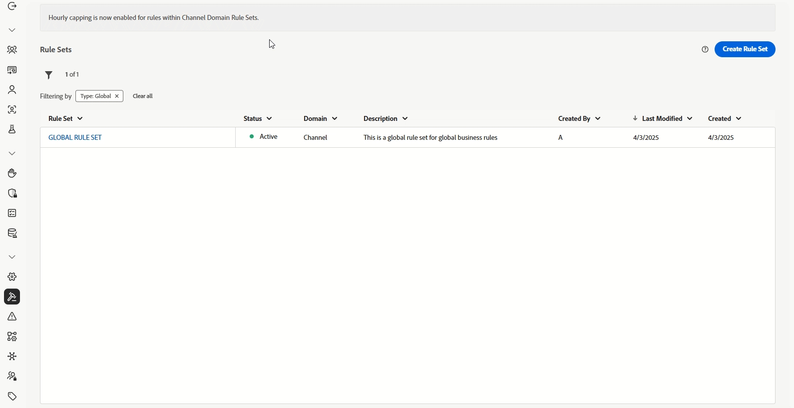

# Release notes {#release-notes}

>[!CONTEXTUALHELP]
>id="ajo_homepage_card1"
>title="What's new?"
>abstract="**Adobe Journey Optimizer** continuously delivers new features, enhancements to existing features, and bug fixes. All changes are consolidated on the last week of each month in these release notes."

[!DNL Adobe Journey Optimizer] follows a continuous delivery model, allowing Adobe to deliver new features, enhancements, and fixes on an ongoing basis. This approach enables a scalable, phased rollout of capabilities to ensure performance and stability across all environments.

Because of this model, release notes are updated between monthly releases.  A dedicated [Latest updates](#latest-updates) section highlights new capabilities and improvements as they are deployed to production—so you are always informed of all changes in real time. For full details about the release cycle and availability phases, see [Journey Optimizer release cycle](releases.md).

[!DNL Adobe Journey Optimizer] is built natively on [!DNL Adobe Experience Platform] and inherits from its latest innovations and improvements. Learn more about these changes in [Adobe Experience Platform Release Notes](https://experienceleague.adobe.com/docs/experience-platform/release-notes/latest.html){target="_blank"}.

## Latest updates {#latest-updates}

New capabilities and improvements released in the past weeks are listed below, with their availability date. They will be grouped with the next release notes content at the end of the month. See also the latest [release notes below](#latest-rn).

### New capabilities {#features}

<thead>
<tr>
<th><strong>New API to retrieve Action Campaigns</strong> </th>
</tr>
</thead>
<tbody>
<tr>
<td>

A new Journey Optimizer API is now available, enabling you to programmatically retrieve and inspect campaign-related data such as details, versions, and configurations.

For more information, refer to the <a href="https://developer.adobe.com/journey-optimizer-apis/references/campaigns-retrieve/">detailed documentation</a>.

Availability date: November 24, 2025

</td>
</tr>
</tbody>
</table>

<table>
<thead>
<tr>
<th><strong>New journey alerts</strong> </th>
</tr>
</thead>
<tbody>
<tr>
<td>

Three new journey alerts are now available to help you monitor and track journey lifecycle events and custom action performance:

<ul>
<li><strong>Journey Published</strong>: Receive notifications when a journey is published by a practitioner in the journey canvas.</li>
<li><strong>Journey Finished</strong>: Get alerts when a journey has finished, with specific definitions based on journey type (Read Audience or Event-triggered).</li>
<li><strong>Custom Action Capping Triggered</strong>: Be notified when capping is activated on a custom action endpoint.</li>
</ul>

These alerts can be subscribed to at the organization level or for specific journeys.

For more information, refer to the <a href="../reports/alerts.md#journey-alerts">detailed documentation</a>.

Availability date: November 5, 2025

</td>
</tr>
</tbody>
</table>

<table>
<thead>
<tr>
<th><strong>Themes in the Email Designer</strong> </th>
</tr>
</thead>
<tbody>
<tr>
<td>

You can now quickly apply pre-approved themes to ensure brand consistency across all emails, speed up your campaign creation process, and independently produce high-quality emails while reducing dependency on design teams.

Previously released in beta version, this capability is now available for a set of organizations (Limited Availability). To gain access, contact your Adobe representative.

For more information, refer to the <a href="../email/apply-email-themes.md">detailed documentation</a>.

Availability date: November 5, 2025

</td>
</tr>
</tbody>
</table>

## October '25 release notes {#latest-rn}

### New capabilities {#oct-25-10-features}

<table>
<thead>
<tr>
<th><strong>Image to HTML converter</strong> </th>
</tr>
</thead>
<tbody>
<tr>
<td>

The image to HTML converter is an AI-powered feature that converts static image designs into fully customizable, modular HTML email content templates. This no-code tool enables marketers to transform visual designs into responsive, editable email templates without requiring technical expertise—perfect for platform migration, rapid template creation, and building reusable template libraries.

This capability is available in Limited Availability. Contact your Adobe representative to gain access.

For more information, refer to the <a href="../email/image-to-html.md">detailed documentation</a>.

Availability date: Oct 30, 2025

</td>
</tr>
</tbody>
</table>

<table>
<thead>
<tr>
<th><strong>Custom action monitoring and reporting</strong> </th>
</tr>
</thead>
<tbody>
<tr>
<td>

This capability provides better visibility into custom action endpoint health and performance. A new custom action monitoring dashboard and corresponding fields in journey step event dataset will help you monitor successful calls, errors, throughput, response time and queue waiting time for your custom action endpoints. You can now quickly understand when, where, and why an anomalous situation is occurring in a custom action.

This capability is currently in Limited Availability for customers.

For more information, refer to the <a href="../action/reporting.md">detailed documentation</a>.

Availability date: October 28, 2025

</td>
</tr>
</tbody>
</table>

<table>
<thead>
<tr>
<th><strong>Landing page custom forms</strong> </th>
</tr>
</thead>
<tbody>
<tr>
<td>

With [!DNL Journey Optimizer], you can now capture profile attributes though your landing pages.

Create, design and manage custom forms tailored to your needs based on a specific dataset. You can then leverage these forms in landing pages to add the profile attributes of your choice into the dataset defined for each form.

This capability is currently in Limited Availability for customers in the United States and Australia. Contact your Adobe representative to gain access.

For more information, refer to the <a href="../landing-pages/lp-forms.md">detailed documentation</a>.

Availability date: October 23, 2025

</td>
</tr>
</tbody>
</table>

<table>
<thead>
<tr>
<th><strong>Quiet Hours / Time Based Exclusions</strong> </th>
</tr>
</thead>
<tbody>
<tr>
<td>

Quiet hours let you define time-based exclusions for Email, SMS, Push, and WhatsApp channels. They ensure that no messages are sent during specific periods of time, helping you respect customer preferences and compliance requirements.

You can apply quiet hours through rule sets, which can be assigned to individual actions in campaigns or journeys for precise control.

Quiet hours rules are currently only available for a set of organizations (Limited Availability).  They will be progressively available to all customers in future releases.

For more information, refer to the <a href="../conflict-prioritization/quiet-hours.md">detailed documentation</a>.

Availability date: October 22, 2025

</td>
</tr>
</tbody>
</table>

<!--table>
<thead>
<tr>
<th><strong>RCS Basic Messaging</strong> </th>
</tr>
</thead>
<tbody>
<tr>
<td>

With the new RCS Basic add-on offering, you can now deliver basic Rich Communication Services (RCS) messaging in Journey Optimizer, enabling the following enhanced messaging capabilities subject to provider and geographical support:

<ul>
<li><strong>Branded and verified sender support:</strong> Send messages using verified business profiles with branding elements (logo, sender name, etc.).</li>
<li><strong>Message delivery insights:</strong> Receive detailed delivery reports including message status updates (e.g., sent, delivered, read).</li>
<li><strong>Link tracking:</strong> Embed and track URLs within RCS messages for engagement analytics.</li>
<li><strong>Fallback to SMS:</strong> Automatic fallback to SMS when the recipient's device does not support RCS or is temporarily unreachable via RCS.</li>
<li><strong>Basic message composition:</strong> Send basic text-based RCS messages.</li>
</ul>
<!--img src="assets/do-not-localize/FILE.gif"-->
<!-- p>For more information, refer to the <a href="../FILE.md">detailed documentation</a>.

<!--/td>
</tr>
</tbody>
</table-->

<!--table>
<thead>
<tr>
<th><strong>Direct mail channel in Orchestrated campaigns</strong> </th>
</tr>
</thead>
<tbody>
<tr>
<td>

Direct mail channel is now available in orchestrated campaigns. The Direct mail activity facilitates direct mail sending within your Orchestrated campaign, for both one-time and recurring messages. It serves to automate the process of generating the extraction file required by direct mail providers. You can combine channel activities into the Orchestrated campaign canvas to create cross-channel campaigns that can trigger actions based on customer behavior and data.

<!--img src="assets/do-not-localize/FILE.gif"-->
<!-- p>For more information, refer to the <a href="../FILE.md">detailed documentation</a>.

<!--/td>
</tr>
</tbody>
</table-->

<!--table>
<thead>
<tr>
<th><strong>Direct Mail channel in journeys</strong> </th>
</tr>
</thead>
<tbody>
<tr>
<td>

Previously limited to Campaigns, Direct Mail channel is now available on the journey canvas, enabling you to incorporate Direct Mail into your journeys. Direct Mail can now be used in both batch and 1:1 journey scenarios, with support for file extraction configuration and time-based frequency settings.

 Previously released in Limited Availability, this capability is now available to all environments (General Availability).

<!--img src="assets/do-not-localize/FILE.gif"-->
<!-- p>For more information, refer to the <a href="../FILE.md">detailed documentation</a>.

<!--/td>
</tr>
</tbody>
</table-->

<!--<table>
<thead>
<tr>
<th><strong>New source connectors for loyalty apps</strong> </th>
</tr>
</thead>
<tbody>
<tr>
<td>

New source connectors are now available in Adobe Experience Platform for the Talon.One, Capillary and Kobie loyalty Apps. These connectors let you seamlessly stream loyalty data into Adobe Experience Platform and leverage these data in Journey Optimizer.

For more information, refer to the <a href="../start/get-started-sources.md">detailed documentation</a>.

Availability date: October 22, 2025

</td>
</tr>
</tbody>
</table>-->

<!--table>
<thead>
<tr>
<th><strong>Decisioning support in email channel</strong> </th>
</tr>
</thead>
<tbody>
<tr>
<td>

You can now add Decision policies into email journeys and campaigns. Decision policies are containers for your offers that leverage the Decisioning engine to dynamically return the best content to deliver for each audience member.

Previously released in Limited Availability, this capability is now available to all environments (General Availability).

For more information, refer to the <a href="../FILE.md">detailed documentation</a>.

Availability date: October 22, 2025

</td>
</tr>
</tbody>
</table-->

<table>
<thead>
<tr>
<th><strong>High throughput messaging for API triggered email campaigns</strong> </th>
</tr>
</thead>
<tbody>
<tr>
<td>

A new high throughput transactional messaging mode is available in API triggered campaigns. This mode is designed for large-scale, real-time transactional messaging and supports up to 5,000 transactions per second with higher availability. This mode also supports transactional messages without referencing or creating customer profiles, such as guest checkout, order confirmation, password resets, security notifications, and other service/operational notications.

This capability is only available for the email channel, for organizations that have purchased the Adobe High Throughput Transactional Messaging add-on offering. Contact your Adobe representative for more details.

For more information, refer to the <a href="../campaigns/api-triggered-high-throughput.md">detailed documentation</a>.

Availability date: October 22, 2025

</td>
</tr>
</tbody>
</table>

<table>
<thead>
<tr>
<th><strong>Reusable targeting rules</strong> </th>
</tr>
</thead>
<tbody>
<tr>
<td>

To save you time and effort, Journey Optimizer now allows you to create reusable rules from a dedicated UI menu and leverage them when building targeting, either as part of content Optimization in a campaign or a journey, either in the Optimize journey activity.

Targeting rules are currently in Limited Availability. Contact your Adobe representative to gain access. Please note this capability is only available to organizations that have purchased the Decisioning add-on offering. It will be progressively rolled out to all customers.

For more information, refer to the <a href="../experience-decisioning/rules.md">detailed documentation</a>.

Availability date: October 22, 2025

</td>
</tr>
</tbody>
</table>

<table>
<thead>
<tr>
<th><strong>New Journey Alerts</strong> </th>
</tr>
</thead>
<tbody>
<tr>
<td>

New pre-configured alerts are available to monitor your journey execution:

<ul><li><a href="../reports/alerts.md#alert-discard-rate">Profile Discard Rate Exceeded</a>: Ratio of profile discards to entered profiles over the last 5 mins exceeded threshold</li>
<li><a href="../reports/alerts.md#alert-custom-action-error-rate">Custom Action Error Rate Exceeded</a>: Ratio of custom action errors to successful HTTP calls over the last 5 mins exceeded threshold</li>
<li><a href="../reports/alerts.md#alert-profile-error-rate">Profile Error Rate Exceeded</a>: Ratio of profiles-in-error to entered profiles over the last 5 mins exceeded threshold.</li></ul> 
You can modify threshold values and subscribe to individual journey-level alerts vs globally.

For more information, refer to the <a href="../reports/alerts.md">detailed documentation</a>.

Availability date: October 14, 2025

</td>
</tr>
</tbody>
</table>

<table>
<thead>
<tr>
<th><strong>Execution Metadata helper</strong> </th>
</tr>
</thead>
<tbody>
<tr>
<td>

A new `executionMetadata` helper function is available in the personalization editor. It allows you to append contextual information to any native action and capture it in a dataset for export to external systems.

This capability is available in Limited Availability. Contact your Adobe representative to gain access.

For more information, refer to the <a href="../personalization/functions/helpers.md#execution-metadata">detailed documentation</a>.

Availability date: October 13, 2025

</td>
</tr>
</tbody>
</table>

<table>
<thead>
<tr>
<th><strong>Experimentation Accelerator with Experimentation Agent</strong> </th>
</tr>
</thead>
<tbody>
<tr>
<td>

Journey Optimizer Experimentation Accelerator now includes the Experimentation Agent, an AI-powered, conversational tool that lets you interact with your experiments, insights, and opportunities. It enhances Journey Optimizer Experimentation Accelerator experience, helping you run experiments more efficiently, uncover what works, and discover where to optimize next.

For more information, refer to the <a href="https://experienceleague.adobe.com/docs/experience-cloud-ai/experience-cloud-ai/agents/agent-experiment.html" target="_blank">detailed documentation</a>.

Availability date: October 10, 2025

</td>
</tr>
</tbody>
</table>

<table>
<thead>
<tr>
<th><strong>PDF attachments to emails</strong> </th>
</tr>
</thead>
<tbody>
<tr>
<td>

You can now attach a static PDF file to an email message sent with Journey Optimizer.

<ul>
<li>You can send up to 6 messages with a PDF attachement per profile per year.</li>
<li>The maximum allowed file size for each attachment is 5 MB.</li>
<li>For any additional size or volume, you can purchase the PDF Attachments add-on. For more details, contact your Adobe representative.</li>
</ul>

Previously released in Limited Availability, this capability is now available to all environments (General Availability).

For more information, refer to the <a href="../email/pdf-attachments.md">detailed documentation</a>.

Availability date: Sept 30, 2025

</td>
</tr>
</tbody>
</table>

<table>
<thead>
<tr>
<th><strong>Public API to retrieve journeys</strong> </th>
</tr>
</thead>
<tbody>
<tr>
<td>

A new Journey Optimizer API is now available to retrieve journeys and their associated objects such as campaigns and surfaces.

For more information, refer to the <a href="https://developer.adobe.com/journey-optimizer-apis/references/journeys-retrieve/">detailed documentation</a>

Availability date: Sept 25, 2025

</td>
</tr>
</tbody>
</table>

### Improvements {#updates-improvements}

**Execution field for WhatsApp Channel**  

In addition to Email and SMS, you can know update the default execution field for your WhatsApp deliveries at the sandbox level. It is also possible to override the execution field set globally by changing it in the WhatsApp journey activity advanced parameters or in the WhatsApp channel configuration. [Read more](../configuration/primary-email-addresses.md)

Availability date: October 22, 2025

**Custom attributes support for Mailto (unsubscribe) address**

With Journey Optimizer, if you are managing consent outside of Adobe, you can set external custom endpoints by defining your own one-click unsubscribe link and a custom unsubscribe email address in the email configuration. When your recipients click the unsubscribe link, Journey Optimizer appends some default profile-specific parameters to the consent update event. 

To further personalize your custom endpoints, you can now define custom attributes that will be also appended to the consent event. [Read more](../email/list-unsubscribe.md#custom-attributes)

>[!AVAILABILITY]
>
>This capability has already been available for the custom **[!UICONTROL One-click Unsubscribe URL]** since August '25 and is now released for the **[!UICONTROL Mailto (unsubscribe)]** option in Limited Availability. Contact your Adobe representative to gain access.

Availability date: October 6, 2025

<!--
### Coming soon {#oct-25-10-soon}

In the next few days, the following capabilities and enhancements are scheduled for release. **Information is subject to change**. Updated links, screens, and documentation will be shared once these updates are live in production.

#### New capabilities {#oct-25-10-soon-features}

<table>
<thead>
<tr>
<th><strong>Themes in the Email Designer</strong> </th>
</tr>
</thead>
<tbody>
<tr>
<td>

You can now quickly apply pre-approved themes to ensure brand consistency across all emails, speed up your campaign creation process, and independently produce high-quality emails while reducing dependency on design teams.

Previously released in beta version, this capability is now available for a set of organizations (Limited Availability). To gain access, contact your Adobe representative.

For more information, refer to the <a href="../email/apply-email-themes.md">detailed documentation</a>.

Availability date: November 4, 2025

</td>
</tr>
</tbody>
</table>

#### Improvements {#oct-25-10-soon-improvements}

**Decisioning in emails through AI models**

You can now use AI models to optimize the best content in your email through the use of Decisioning. For example, this capability allows you to offer the best content based on custom events such as Purchases, Button Clicks, Add to Cart, etc.
-->

<!--
<table>
<thead>
<tr>
<th><strong>New Web Push notifications channel</strong> </th>
</tr>
</thead>
<tbody>
<tr>
<td>

Adobe Journey Optimizer now supports Web Push notifications, expanding the push channel beyond mobile. You can seamlessly deliver notifications to both mobile and desktop browsers, enabling you to reach customers directly on their devices without requiring an app.

This enhancement allows you to engage users with timely, personalized messages in real time, leveraging the same authoring workflows and targeting capabilities already available for mobile push.

For more information, refer to the <a href="../FILE.md">detailed documentation</a>

Availability date: Sept XX, 2025

</td>
</tr>
</tbody>
</table>

<table>
<thead>
<tr>
<th><strong>Custom action monitoring and reporting</strong> </th>
</tr>
</thead>
<tbody>
<tr>
<td>

Custom action monitoring and reporting is now available. This capability provides better visibility into journey health and execution, including lifecycle status and performance alerts. You can now quickly understand when, where, and why an anomalous situation is occurring in a custom action.

For more information, refer to the <a href="../FILE.md">detailed documentation</a>

Availability date: Sept XX, 2025

</td>
</td>
</tr>
</tbody>
</table>

<table>
<thead>
<tr>
<th><strong>New source connectors for loyalty apps</strong> </th>
</tr>
</thead>
<tbody>
<tr>
<td>

New source connectors are now available in Adobe Experience Platform for the Talon.One, Capillary, and Kobie loyalty apps. These connectors let you seamlessly stream loyalty data into Adobe Experience Platform and leverage these data in Journey Optimizer.

</td>
</tr>
</tbody>
</table>

-->
