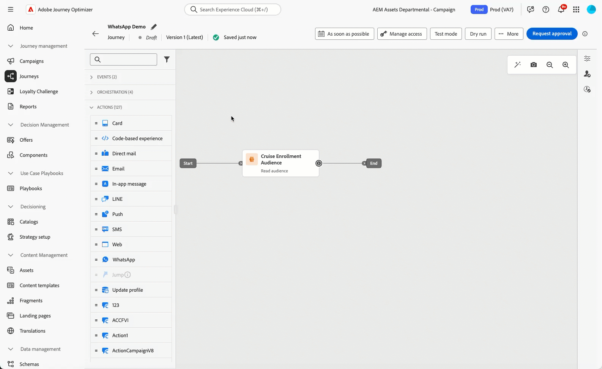

# Release notes {#release-notes}

>[!CONTEXTUALHELP]
>id="ajo_homepage_card1"
>title="What's new?"
>abstract="**Adobe Journey Optimizer** continuously delivers new features, enhancements to existing features, and bug fixes. All changes are consolidated on the last week of each month in these release notes."

[!DNL Adobe Journey Optimizer] continuously delivers new features, enhancements to existing features, and bug fixes. All changes are consolidated on the last week of each month in these release notes. [!DNL Adobe Journey Optimizer] is built natively on [!DNL Adobe Experience Platform] and inherits from its latest innovations and improvements. Learn more about these changes in [Adobe Experience Platform Release Notes](https://experienceleague.adobe.com/docs/experience-platform/release-notes/latest.html){target="_blank"}.

## July '25 release notes {#25-7-rn}

<!--
**Pre release notes below are subject to change without prior notice until the release availability date**. Links, screens and updated documentation are published at the release date.

See also [Adobe Experience Platform Pre-release notes](https://experienceleague.adobe.com/en/docs/experience-platform/release-notes/pre-release-notes){target="_blank"}.-->

**Release date**: July 29, 2025

### New capabilities {#features-25-7}

New capabilities coming with this release are detailed below.

#### Features

<table>
<thead>
<tr>
<th><strong>WhatsApp Channel</strong> </th>
</tr>
</thead>
<tbody>
<tr>
<td>

Journey Optimizer now supports direct WhatsApp messaging, enabling smooth integration into your journeys and campaigns for improved recipient communication and engagement. This native channel delivers out of the box WhatsApp template integration, message preview, personalization, delivery reporting, webhooks, opt-in and opt-out consent management, and more.

Previously released in Beta, this capability is now available to all environments (General Availability).

For more information, refer to the <a href="../whatsapp/get-started-whatsapp.md">detailed documentation</a>.

</td>
</tr>
</tbody>
</table>

<table>
<thead>
<tr>
<th><strong>Brands</strong> </th>
</tr>
</thead>
<tbody>
<tr>
<td>

You can now create and customize your own Brands to clearly define your visual and verbal identity across communications. With the Brand alignment score, you can receive real-time feedback on how well your content reflects your brand's tone, style, and guidelines, helping you stay consistently on-brand with every message you send.

Previously released in Beta, this capability is now available to all environments (General Availability).

For more information, refer to the <a href="../content-management/brands.md">detailed documentation</a>.

</td>
</tr>
</tbody>
</table>

<!--
<table>
<thead>
<tr>
<th><strong>Use Experience Decisioning in email channel</strong> </th>
</tr>
</thead>
<tbody>
<tr>
<td>

You can now add Decision policies into email journeys and campaigns. Decision policies are containers for your offers that leverage the Decisioning engine to dynamically return the best content to deliver for each audience member.

This capability is currently unavailable for use with the Healthcare Shield, and with the Privacy and Security Shield (Limited Availability).

img src="assets/do-not-localize/FILE.gif"/>

For more information, refer to the <a href="../FILE.md">detailed documentation</a>

</td>
</tr>
</tbody>
</table>
-->

<table>
<thead>
<tr>
<th><strong>Optimization in campaigns</strong> </th>
</tr>
</thead>
<tbody>
<tr>
<td>

Journey Optimizer now empowers you with the tools to deliver personalized and optimized content to your campaigns' audience, allowing you to run content experiments, create rule-based targeting, and use advanced combinations of both, to maximize the effectiveness of your campaigns.

With Optimization, you can:

<ul>
<li>Test multiple content variations to identify the most effective messaging.</li>
<li>Deliver personalized content based on user attributes and contextual data.</li>
<li>Combine targeting and experimentation for advanced campaign strategies.</li>
<li>Filter out users that do not match variant criteria.</li>
<li>Ensure fallback mechanisms to maintain user engagement.</li>
</ul>

Once the campaign is live, profiles are evaluated against the defined criteria, and based on matching criteria, they are delivered with the appropriate experience or content from the campaign.

>

<!--For more information, refer to the <a href="../FILE.md">detailed documentation</a>-->

</td>
</tr>
</tbody>
</table>

<!--table>
<thead>
<tr>
<th><strong>Dark mode in the Email Designer</strong> </th>
</tr>
</thead>
<tbody>
<tr>
<td>

The Journey Optimizer Email Designer now offers the ability to switch to dark mode view, where you can additionally define specific custom settings that will display only for recipients reading their emails in dark mode.

Note the following:

<ul>
<li>The dark mode final rendering may vary and depends on the recipient's email client.</li>
<li>Not all email clients support custom dark mode. Moreover, some email clients only apply their own default dark mode for all emails that are received. In both cases, the custom settings that you defined in the Email Designer cannot be rendered.</li>
</ul>

This capability is currently in beta version and only available to beta customers. To join the beta program, contact your Adobe representative.

<!--For more information, refer to the <a href="../FILE.md">detailed documentation</a>-->

</td>
</tr>
</tbody>
</table-->

<table>
<thead>
<tr>
<th><strong>Journey Dry Run</strong> </th>
</tr>
</thead>
<tbody>
<tr>
<td>

Journey Dry run is a special journey publication mode in Adobe Journey Optimizer that allows journey practitioners to test a journey using real production data without contacting real customers or updating profile information. This feature helps journey practitioners gain confidence in their journey design and audience targeting before publishing it live.

Previously released in Limited Availability, this capability is now available to all environments (General Availability).

For more information, refer to the <a href="../building-journeys/journey-dry-run.md">detailed documentation</a>

</td>
</tr>
</tbody>
</table>

<!--
<table>
<thead>
<tr>
<th><strong>Calendar view</strong> </th>
</tr>
</thead>
<tbody>
<tr>
<td>

A calendar view is now available in the journeys and campaigns lists. It allows you to visualize all journeys and campaigns activations in the respective lists.

Previously available in Limited Availability, this feature is now available to all environments. With this General Availability release, the feature includes:

<ul>
<li>Design improvements for the navigation in dates</li>
<li>The ability to see draft campaigns if you have set a start and end date</li>
<li>A new setting to hide and show calendar items running for a long time</li>
</ul>

For more information, refer to the <a href="../FILE.md">detailed documentation</a>

</td>
</tr>
</tbody>
</table>
-->

<!--
<table>
<thead>
<tr>
<th><strong>Supplemental ID for journeys</strong> </th>
</tr>
</thead>
<tbody>
<tr>
<td>

You can now trigger journeys using a profile ID along with another identifier, such as an order ID, subscription ID, or prescription ID, allowing the same profile to be in the same journey multiple times at once. This enables scenarios like managing multiple orders or subscriptions in parallel, with each instance following its own path through the journey.

Previously released in Limited Availability, the use of supplemental IDs in journeys is now available to all environments. With this General Availability release, the feature now includes support for Read audience journeys.

For more information, refer to the <a href="../FILE.md">detailed documentation</a>

</td>
</tr>
</tbody>
</table>
-->

### Change in journey conditions {#ee-change@}

Starting July 8th, in new customer organizations, creating expressions using experience events is no longer supported in the expression editor used in journey conditions. As a result, experience events in the [Experience Platform data source](../datasource/adobe-experience-platform-data-source.md) cannot be used for creating expressions. Alternative approaches and best practices for creating expressions/logic with experience events are referenced [here](../building-journeys/exp-event-lookup.md).

There is no change to how journey context event data is accessed in unitary journeys. In the expression and personalization editors, users can continue to access data passed in with the initial journey event. 

Learn more [in this FAQ](../building-journeys/exp-event-lookup.md#faq-ee).

### Improvements {#25-7-improv}

Improvements coming with this release are listed below.

- **Campaigns**

  - **Multiple inbound actions in campaigns** - To simplify your campaign orchestration, you can now define several inbound actions in a single campaign. This capability enables you to deliver multiple code-based experiences, In-app messages, Content Cards or web actions to different locations at the same time, each action containing a specific content.
  <!-- [Read more](../FILE.md) -->

  - **Campaign inventory reorganization** - Scheduled and API-triggered campaigns are now split into separate tabs in the campaigns inventory for easier navigation and management.
 
  [Read more](../campaigns/modify-stop-campaign.md)

- **Data Management**
  - **Decision Management system datasets update** - The deleted Personalised and Fallback offers are now marked as archived in the "decision_object_repository_personalized_offers" and "decision_object_repository_fallback_offers" datasets. The existing records in the dataset are not changed.

  [Read more](../offers/export-catalog/access-dataset.md)

<!--- **Journeys**
  - **Journey Sandbox Tooling Enhancements** - When copying journeys across multiple sandboxes using the package export and import capabilities, the following capabilities are now also available:
    - Selecting an existing event at the destination
    - Copying over an event independently of a journey
    - Detecting field group / data source relationships, linking to them at the destination if they exist, creating them if they don't.
  
   [Read more](../FILE.md) -->

- **Channel - In-app**
  - **In-app Key/Value pairs** - With In-app messages, you can define Key and Value pairs to include custom variables in the message payload. These key-value pairs enable you to pass additional data based on your specific configuration and use case. [Read more](../in-app/design-in-app.md)

- **Channel - Content Card**

  - **Rule-Based Campaign Disqualification** - When editing additional delivery rules, the previous Delivery rules option has been replaced with three distinct rule types to better control message timing and visibility:
    - Show message if: Conditions that determine when the content card is shown.
    - Dismiss message if: Conditions that temporarily hide the content card. It can reappear if show conditions are met again.
    - Disqualify message if: Conditions that permanently prevent the content card from being shown again.
  
    [Read more](../content-card/design-content-card.md)
  
- **Decisioning**
  - **Migration tooling APIs** - The Journey Optimizer team is currently working on migration tooling APIs to migrate Decision management entities to Decisioning. This tooling enables seamless migration between sandboxes with dependency resolution and rollback capabilities. If interested, reach out to your Adobe representative.

- **Personalization**
  - A new helper function, "SHA256", has been added to the personalization editor. This function is used to calculate and return the sha256 hash of a string.

  [Read more](../personalization/functions/string.md#sha256)

## June '25 release notes {#25-6-rn}

<!--
**Early release notes below are subject to change without prior notice until the release availability date**. Links, screens and updated documentation are published at the release date.-->

**Release date**: June 18, 2025

<!--See also [Adobe Experience Platform Pre Release Notes](https://experienceleague.adobe.com/en/docs/experience-platform/release-notes/pre-release-notes){target="_blank"}.-->

### New capabilities {#25-06-features}

New capabilities coming with this release are detailed below.

<table>
<thead>
<tr>
<th><strong>Adobe Experience Platform datasets in decisioning (beta)</strong> </th>
</tr>
</thead>
<tbody>
<tr>
<td>

Previously available for personalization, Adobe Experience Platform datasets can now be leveraged for decisioning. This allows you to extend the definition of your decision attributes to additional data in datasets for bulk updates that change periodically without having to manually update the attributes one at a time. For example, availability, wait times, etc.

This capability is currently available to all customers as a public beta. Please contact your account representative if you would like access.

For more information, refer to the <a href="../experience-decisioning/aep-data-exd.md">detailed documentation</a>.

Availability date: June 20th, 2025

</td>
</tr>
</tbody>
</table>

<table>
<thead>
<tr>
<th><strong>RCS Messaging</strong> </th>
</tr>
</thead>
<tbody>
<tr>
<td>

Rich Communication Services (RCS) messaging is now supported in the Journey Optimizer, enabling the following enhanced messaging capabilities subject to provider and carrier support:

<ul>
<li>Branded and verified sender support: Send messages using verified business profiles with branding elements (logo, sender name, etc.).</li>
<li>Message delivery insights: Receive detailed delivery reports including message status updates (e.g., sent, delivered, read).</li>
<li>Link tracking: Embed and track URLs within RCS messages for engagement analytics.</li>
<li>Fallback to SMS: Automatic fallback to SMS when the profile's device does not support RCS or is temporarily unreachable via RCS.</li>
<li>Basic message composition: Send text-based RCS messages with optional media and rich elements, depending on provider support.</li>
</ul>

For more information, refer to the <a href="../sms/sms-configuration.md">detailed documentation</a>.

</td>
</tr>
</tbody>
</table>

<table>
<thead>
<tr>
<th><strong>Form fields in code-based experience content</strong> </th>
</tr>
</thead>
<tbody>
<tr>
<td>

You can now define specific editable fields in JSON or HTML content templates which enable non-technical users to easily edit content in a form-view within the code-based experience channel authoring, without the need to manipulate any code. More than that, when defining the code-based experience content templates you can now insert decision policies in the template, increasing reusability and ease of use.

For more information, refer to the <a href="../code-based/code-based-form-fields.md">detailed documentation</a>.

</td>
</tr>
</tbody>
</table>

<!--
<table>
<thead>
<tr>
<th><strong>Custom delegation method for subdomains</strong> </th>
</tr>
</thead>
<tbody>
<tr>
<td>

In addition to the full delegation and the CNAME method, a new subdomain configuration method is now available: the Custom delegation method, which enables you to fully own controlling and maintaining all aspects of DNS that are required for delivering, rendering and tracking messages.

</td>
</tr>
</tbody>
</table>
-->

<table>
<thead>
<tr>
<th><strong>Content Decision activity in journeys</strong> </th>
</tr>
</thead>
<tbody>
<tr>
<td>

You can now include personalized offers in your journeys through a dedicated Content Decision activity in the journey canvas, and use them in journey activities, including conditions and custom actions.

This capability is only available for a set of organizations (Limited Availability), and will be rolled out globally in a future release.

For more information, refer to the <a href="../building-journeys/content-decision.md">detailed documentation</a>.

</td>
</tr>
</tbody>
</table>

<table>
<thead>
<tr>
<th><strong>Journey Dry run</strong> </th>
</tr>
</thead>
<tbody>
<tr>
<td>

Journey Dry run is a special journey publication mode in Adobe Journey Optimizer that allows journey practitioners to test a journey using real production data without contacting real customers or updating profile information. This feature helps journey practitioners gain confidence in their journey design and audience targeting before publishing it live.

This capability is only available for a set of organizations (Limited Availability), and will be rolled out globally in a future release.

For more information, refer to the <a href="../building-journeys/journey-dry-run.md">detailed documentation</a>.

</td>
</tr>
</tbody>
</table>

<table>
<thead>
<tr>
<th><strong>Pause and resume journeys</strong> </th>
</tr>
</thead>
<tbody>
<tr>
<td>

You can now pause and resume your journeys. This capability gives journey practitioners greater control and flexibility by allowing live journeys to be temporarily suspended without disrupting customer experience. When paused, no communications are sent, and profiles remain in a suspended state until the journey is resumed.

You can pause and resume one journey only, or perform bulk pause and resume operations to a group of journeys.

In addition, you can apply global filters to paused journeys to exclude profiles based on their attributes.

This capability is only available for a set of organizations (Limited Availability), and will be rolled out globally in a future release.

For more information, refer to the <a href="../building-journeys/journey-pause.md">detailed documentation</a>.

</td>
</tr>
</tbody>
</table>

<table>
<thead>
<tr>
<th><strong>Scale your Experimentation winner</strong> </th>
</tr>
</thead>
<tbody>
<tr>
<td>

Scale your Experimentation winner enables you to automatically or manually roll out the winning variation of an experiment to your full audience. This feature ensures that, once a top performer is identified, you can maximize its reach and effectiveness without constant manual oversight.

For more information, refer to the <a href="../content-management/content-experiment.md">detailed documentation</a>.

Availability date: June 2nd, 2025
</td>
</tr>
</tbody>
</table>

<table>
<thead>
<tr>
<th><strong>Conflict & prioritization</strong> </th>
</tr>
</thead>
<tbody>
<tr>
<td>

In Journey Optimizer, managing the volume and timing of campaigns and journeys is essential to avoid overwhelming customers with too many interactions. Journey Optimizer now offers several tools for conflict management and prioritization - previously available only to limited-access (LA) organizations - that are now generally available (GA).

Previously released in Limited Availability, this capability is now available to all environments. With this General Availability release, the following enhancements have been introduced:

<ul>
<li>Expanded Support: Conflict management tools now support both Unitary Journeys and Audience Qualification Journeys, in addition to Read audience journeys.</li>
<li>Improved Troubleshooting: Two new step event fields are now available in the Query Service, enabling you to analyze why a profile was rejected from a journey or campaign.</li>
<li>Enhanced Reporting: Reports now indicate which specific rule excluded a profile from a journey or campaign, providing greater transparency and actionable insights.</li></ul>

For more information, refer to the <a href="../conflict-prioritization/gs-conflict-prioritization.md">detailed documentation</a>.

Availability date: June 3rd, 2025

</td>
</tr>
</tbody>
</table>

### Improvements {#25-06-improv}

Improvements coming with this release are listed below.

- **Channel rule sets**

  - **Custom duration window** for capping -  A new **Every** field is now available in the channel rule sets configuration screen, allowing you to apply frequency capping rules over multiple days, weeks, or months, depending on the specified duration.

  - **Hourly reset capping frequency** - You can now apply capping on an hourly basis for channel rule sets. This capability is only available for a set of organizations (Limited Availability). Please contact your customer care to get it enabled. 

  - **Daily duration** - Previously available in Limited Availability, "Daily" frequency capping in channel rule sets is now available to all customers.

  For more information, refer to the [detailed documentation](../conflict-prioritization/channel-capping.md).

- **Code-based experiences**

  - Adding a decision policy is now available in code-based experience content templates, where it can be used to leverage offers in editable form fields. [Read more](../code-based/code-based-form-fields.md)

  - From the code-based experience journey or campaign edition screen, you can now directly add a decision policy, without opening the personalization editor. [Read more](../code-based/create-code-based.md#edit-code)

- **Custom CSS support in the Email Designer**

  Journey Optimizer now allows you to add custom CSS to your email content directly within the Email Designer. [Read more](../email/custom-css.md)

- **New tabbed navigation for campaigns**

  A new navigation pattern allows for quicker access to content authoring and supports further expansion of settings across campaigns. [Read more](../campaigns/create-campaign.md)

- **Decisioning**

  - **Sandbox copy & Decisioning** (availability date: June 3rd, 2025) - Decisioning objects can now be copied between sandboxes, streamlining testing and deployment workflows. [Read more](../configuration/copy-objects-to-sandbox.md#decisioning)

  - **Decision item attribute support for decisioning rules** (availability date: June 4th, 2025) - You can now leverage decision item attributes to create decisioning rules. [Read more](../experience-decisioning/rules.md#create)

- **Interactive Message Execution API update** - Availability date: June 6th, 2025 

  The Interactive Message Execution API now allows you to delete the schedule of upcoming campaigns execution. [Read more](https://developer.adobe.com/journey-optimizer-apis/references/messaging/){target="_blank"}
