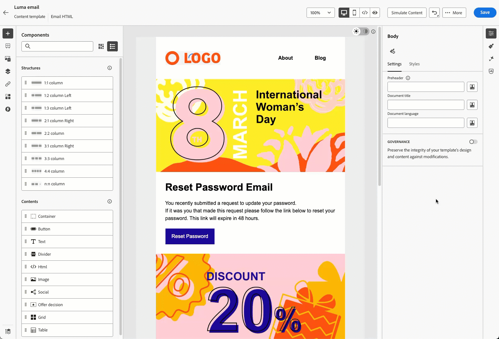

# Release notes {#release-notes}

>[!CONTEXTUALHELP]
>id="ajo_homepage_card1"
>title="What's new?"
>abstract="**Adobe Journey Optimizer** continuously delivers new features, enhancements to existing features, and bug fixes. All changes are consolidated on the last week of each month in these release notes."

[!DNL Adobe Journey Optimizer] follows a continuous delivery model, allowing Adobe to deliver new features, enhancements, and fixes on an ongoing basis. This approach enables a scalable, phased rollout of capabilities to ensure performance and stability across all environments.

Because of this model, release notes are updated between monthly releases. For full details about the release cycle and availability phases, see [Journey Optimizer release cycle](releases.md).

[!DNL Adobe Journey Optimizer] is built natively on [!DNL Adobe Experience Platform] and inherits from its latest innovations and improvements. Learn more about these changes in [Adobe Experience Platform Release Notes](https://experienceleague.adobe.com/docs/experience-platform/release-notes/latest.html){target="_blank"}.

## March '26 release notes {#march-26-rn}

The [New capabilities](#march-26-features) and [Improvements](#march-26-improv) sections cover capabilities already available. The [Coming soon](#coming-soon) section lists features and improvements scheduled for release later in March.

<!--
**The pre-release notes below are subject to change without prior notice until the release availability date**. Links, screens and updated documentation are published in the release notes, at the release date.

See also [Adobe Experience Platform pre-release notes](https://experienceleague.adobe.com/en/docs/experience-platform/release-notes/pre-release-notes){target="_blank"}.-->

**Release date**: March 24-25, 2026

### New capabilities {#march-26-features}

<table>
<thead>
<tr>
<th><strong>Test activity in Orchestrated Campaigns</strong> </th>
</tr>
</thead>
<tbody>
<tr>
<td>

A new <strong>Test</strong> activity is now available in Orchestrated Campaigns. This activity routes workflow execution to different branches based on defined conditions, enabling you to validate campaign logic and configurations before activating live deliveries.

For more information, refer to the <a href="../orchestrated/activities/test.md">detailed documentation</a>.

</td>
</tr>
</tbody>
</table>

<table>
<thead>
<tr>
<th><strong>Dataset lookup support in journeys</strong> </th>
</tr>
</thead>
<tbody>
<tr>
<td>

A new activity in journeys, Dataset lookup, allows you to dynamically retrieve data from Adobe Experience Platform record datasets during runtime. By leveraging this capability, you can access data that may not reside in the profile or event payload, ensuring your customer interactions are both relevant and timely. Previously released in Limited Availability, this capability is now available to all environments (General Availability). For more information, refer to the <a href="../building-journeys/dataset-lookup.md">detailed documentation</a>.

</td>
</tr>
</tbody>
</table>

<table>
<thead>
<tr>
<th><strong>Native channel action activities deprecated</strong> </th>
</tr>
</thead>
<tbody>
<tr>
<td>

Following the General Availability of the <strong>Action activity</strong> in February 2026, legacy native channel activities (Email, Push, SMS, In-app, Web, Code-based experience, and Content Card) in the journey canvas are now deprecated.

You now use a single <strong>Action activity</strong> to configure all channel actions, replacing the need for separate channel-specific nodes.
Existing journeys using legacy channel activities will continue to function without any changes or migration required.

For more information, refer to the <a href="../building-journeys/journey-action.md">detailed documentation</a>.

</td>
</tr>
</tbody>
</table>

<!--<table>
<thead>
<tr>
<th><strong>Decisioning support in email channel</strong> </th>
</tr>
</thead>
<tbody>
<tr>
<td>

You can now use <strong>Decisioning</strong> to personalize and optimize the content of your email messages. Leverage Priority Scores, Formulas, or AI Models to display the most relevant offers and content to each recipient.

Previously released in Limited Availability, this capability is now available to all environments (General Availability). With this General Availability release, mirror pages are now supported.

For more information, refer to the <a href="../experience-decisioning/create-decision-policy.md">detailed documentation</a>.

</td>
</tr>
</tbody>
</table>-->

<table>
<thead>
<tr>
<th><strong>Advanced HTML editor for email templates</strong> </th>
</tr>
</thead>
<tbody>
<tr>
<td>

Advanced HTML mode for email content templates lets you edit the HTML source of your content in the Email Designer, add advanced expressions (such as conditions) in the source, and toggle between HTML view and Desktop view without losing your changes.

This capability is available in content templates for the Email channel only. It is currently in Limited Availability—contact your Adobe representative to gain access.

For more information, refer to the <a href="../content-management/email-template-expert-mode.md">detailed documentation</a>.

Availability date: March 10, 2026

</td>
</tr>
</tbody>
</table>

<table>
<thead>
<tr>
<th><strong>Integration of custom Firefly models and third-party image generation models</strong> </th>
</tr>
</thead>
<tbody>
<tr>
<td>

Enable seamless integration of standard and custom Firefly models, along with approved third-party image models, to provide greater flexibility, control, and brand alignment when generating images.

Choose the right model for your needs:

<ul><li> <strong>Adobe model</strong> (powered by Firefly Image Model 4) for immediate image generation without additional setup</li><li> <strong>Partner model</strong> (powered by Gemini 2.5 Flash) for specialized capabilities</li><li><strong>Custom models</strong> (brand-specific models trained on your own assets) for on-brand generation that aligns precisely with your brand identity, style, and visual guidelines.</li></ul>

For more information, refer to the <a href="../content-management/generative-models.md">detailed documentation</a>.

Availability date: March 2, 2026

</td>
</tr>
</tbody>
</table>

<table>
<thead>
<tr>
<th><strong>Live Activity for iOS</strong> </th>
</tr>
</thead>
<tbody>
<tr>
<td>

Bring real-time experiences directly to your customers' Lock Screens and Dynamic Island with iOS Live Activity in Adobe Journey Optimizer. Deliver live updates, from order tracking and flight status to event countdowns, live scores and delivery progress, without requiring users to open your app. Keep your audience informed and engaged at exactly the right moment, right where they are.

Previously released in beta, this capability is now available to all environments (General Availability).

For more information, refer to the <a href="../mobile-live/get-started-mobile-live.md">detailed documentation</a>.

Availability date: March 3, 2026

</td>
</tr>
</tbody>
</table>

<table>
<thead>
<tr>
<th><strong>Journey Agent: Channel content create</strong> </th>
</tr>
</thead>
<tbody>
<tr>
<td>

Powered by <strong>Adobe Experience Platform Agent Orchestrator</strong>, <strong>Journey Agent</strong> is available in Journey Optimizer and enables you to analyze journeys through a natural language interface. You can now also generate and manage channel-specific content directly in Journey Agent, creating content for channels such as email and push, applying and previewing templates, refining tone and style through prompts, and opening content in <strong>Content Designer</strong> for in-context editing.

This capability is only available for a set of organizations (Limited Availability). To gain access, contact your Adobe representative.

For more information, refer to the <a href="https://experienceleague.adobe.com/docs/experience-cloud-ai/experience-cloud-ai/agents/ajo-agent.html">detailed documentation</a>.

Availability date: March 4, 2026

</td>
</tr>
</tbody>
</table>

<table>
<thead>
<tr>
<th><strong>AI model monitoring</strong> </th>
</tr>
</thead>
<tbody>
<tr>
<td>

Journey Optimizer now allows you to monitor the health, training status, and performance of your Decisioning AI models. This allows you to verify training success, troubleshoot failures, and understand impact on your outcomes in order to select the best offers for each customer using AI. Note that this capability is available for <strong>Decisioning</strong> only (not for legacy Decision Management models).

This capability is currently available for <strong>personalized optimization</strong> models only (not auto-optimization).

For more information, refer to the <a href="../experience-decisioning/ranking/ai-model-observability.md">detailed documentation</a>.

Availability date: March 9, 2026

</td>
</tr>
</tbody>
</table>

### Improvements {#march-26-improv}

Improvements coming with this release are listed below.

<!--
#### Reporting

* **Send-Time Optimization: updated controls location and new lift report** - Send-Time Optimization (STO) controls have been relocated to the Action configuration menu. Additionally, a new lift report is now available in Journeys reports to measure the impact of STO on your campaign performance metrics.

* **Exclude bot clicks for email and SMS reporting** - Email and SMS reporting now automatically filters out bot clicks from click metrics, providing more accurate engagement data and preventing automated traffic from inflating your performance figures.

#### Email Designer

* **Email Designer displayed in Unified Shell** - The Email Designer is now displayed within the Unified Shell experience, providing a consistent navigation and header experience that aligns with other Adobe applications.

* **Text mode support in fragments** - To support text-based email workflows, you can now create and manage text versions of your visual fragments for optimal use in the plain text version of emails that include that fragment.

  **Caution:** When using a fragment that was created before the current release, the fragment text version may be incorrectly rendered—both in the Email Designer and in the final email delivered to your recipients. For best results with older fragments, edit, save and republish each fragment.-->
<!--
#### Decisioning

* **Optional fragments in decision items** - When using fragments in decision items, you can now make a fragment optional so that if it is temporarily unavailable on Edge, it is skipped and the journey or campaign continues rendering instead of failing.
-->

#### Configuration

<!--* **Folders for journeys and campaigns** - You can now organize your journeys and campaigns into folders, enabling structured navigation and easier management for teams working with large volumes of content. This capability is only available for a set of organizations (Limited Availability). To gain access, contact your Adobe representative.-->

* **AJO Secondary Recipient Feedback Event Dataset rename** - The `AJO Email BCC Feedback Event` Dataset has been renamed to `AJO Secondary Recipient Feedback Event` Dataset. The impact varies depending on your situation:

  * **Existing users**: Only the display name is updated. The underlying table name remains unchanged.
  * **New users and sandboxes**: Both the display name and the table name reflect the new name.
  * **Existing users with new sandboxes**: Both the display name and the table name are updated to the new name.

  Availability date: March 2, 2026

#### Journeys

* **Update Profile action: support for multiple profile attributes** - The **Update Profile** action activity now supports updating up to five profile attributes in a single node. Previously, each action could only update one attribute at a time, requiring multiple nodes to update several attributes. Use the new **Update another field** button to add additional field/value pairs, reducing canvas complexity and improving performance. [Learn more](../building-journeys/update-profiles.md)

* **Wave sending of outbound messages in journeys** - You can now schedule messages from Journey Optimizer journeys to be delivered in controlled batches over time. [Learn more](../building-journeys/send-using-waves.md)

  Previously released in Limited Availability for use in journeys, this capability is now available to all environments (General Availability).

  Availability date: March 16, 2026

* **Pause and resume details in journey technical details** - The journey **technical details** now include additional pause and resume information: the date and time of the last pause and resume, the display name and internal identifier of the user who performed each action, and a full set of paused journey settings such as pause behavior, maximum pause duration, and auto-resume state. [Learn more](../building-journeys/journey-properties.md)

  Availability date: March 2, 2026

## Coming soon {#coming-soon}

The features and improvements below are planned for release later in March/early April. Release dates and scope are subject to change without prior notice.

<table>
<thead>
<tr>
<th><strong>Trigger Orchestrated campaigns using a signal</strong> </th>
</tr>
</thead>
<tbody>
<tr>
<td>

You can now trigger an orchestrated campaign via a signal sent via APIs. Configure the target campaign as "Triggered by a signal" and publish it. Then use an API call to fire the campaign. The API call can include parameters that will be available as variables in the triggered campaign. Note: An orchestrated campaign started by a signal is still a **batch** campaign and is not the same as API-triggered campaigns.

Availability date: April, 1 2026

</td>
</tr>
</tbody>
</table>

<table>
<thead>
<tr>
<th><strong>Convert images to email content templates</strong> </th>
</tr>
</thead>
<tbody>
<tr>
<td>

You can now convert images into email content templates directly in Journey Optimizer. Use AI-powered analysis to automatically generate structured HTML templates from visual references, significantly reducing email design time.

Previously released in Limited Availability, this capability is now available to all environments (General Availability). <a href="../content-management/image-to-html.md">Learn more</a>

Availability date: March 26, 2026

</td>
</tr>
</tbody>
</table>

<table>
<thead>
<tr>
<th><strong>URL parameter encryption</strong> </th>
</tr>
</thead>
<tbody>
<tr>
<td>

URL parameters in tracking links and landing pages can now be encrypted, providing an additional layer of security for sensitive parameter data.

<ul>
<li>Register and manage encryption keys in a dedicated <strong>Administration</strong> registry.</li>
<li>Use the new encryption helper in expressions to encrypt sensitive data in tracking links and landing page URLs for the query parameters you want to protect at render time.</li>
</ul>

This capability is only available for a set of organizations (Limited Availability). To gain access, contact your Adobe representative.

Availability date: March 31, 2026

</td>
</tr>
</tbody>
</table>

<table>
<thead>
<tr>
<th><strong>Transactional category in Orchestrated campaigns</strong> </th>
</tr>
</thead>
<tbody>
<tr>
<td>

In Orchestrated campaigns, you can now set a channel activity to the <strong>Transactional</strong> category. This applies transactional channel configurations to that activity and is useful when business rules should not apply or when customers' opt-in is not required.

Availability date: March 26, 2026 - This capability will be gradually rolled out to all regions over the next few days.

</td>
</tr>
</tbody>
</table>

<table>
<thead>
<tr>
<th><strong>Inbox</strong> </th>
</tr>
</thead>
<tbody>
<tr>
<td>

<strong>Inbox</strong> is a mobile functionality, available with Content Cards, that enables customers to create a centralized location within their app or website to display messages sent to their users. This extends the lifetime of marketing communications by ensuring messages remain accessible even after they are dismissed.

Availability date: March 31, 2026

</td>
</tr>
</tbody>
</table>

<table>
<thead>
<tr>
<th><strong>Journey path optimization</strong> </th>
</tr>
</thead>
<tbody>
<tr>
<td>

Use the new Optimize node to target specific audiences or run A/B tests to determine the best path to meet your business-centric KPIs.
This tool allows you to test and vary, and customize communications, sequencing, and timing to best reach your customers.

Previously released in Limited Availability, this capability is now available to all environments (General Availability). <a href="../building-journeys/optimize.md">Learn more</a>

Availability date: April 3, 2026

</td>
</tr>
</tbody>
</table>

### Improvements 

* **Global variables in Orchestrated Campaigns** - Orchestrated Campaigns now support global variables that can be defined once and reused across all activities within a workflow, simplifying configuration and ensuring consistency in dynamic values and expressions.  Availability date: April 1, 2026

<!--WAITING RELEASE DATE CONFIRMATION * **Target dimension simplification in Orchestrated Campaigns** - The active targeting dimension is now shown on the workflow canvas, so you can see which dimension is used by a channel activity. The multi-entity segmentation flow is simpler as you no longer need a separate "Change dimension" activity. Moreover, you can now choose explicitly whether messages are sent at the profile level or at a secondary dimension level.-->
