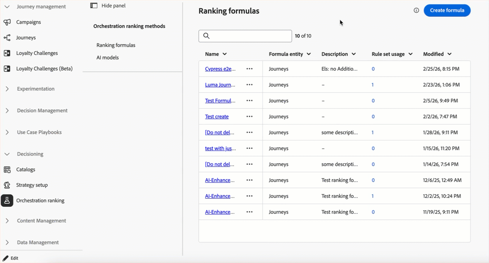
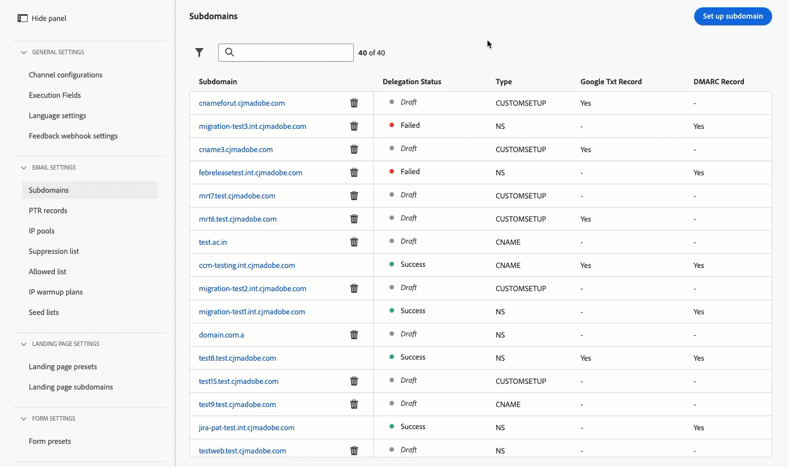

# Release notes {#release-notes}

>[!CONTEXTUALHELP]
>id="ajo_homepage_card1"
>title="What's new?"
>abstract="**Adobe Journey Optimizer** continuously delivers new features, enhancements to existing features, and bug fixes. All changes are consolidated on the last week of each month in these release notes."

[!DNL Adobe Journey Optimizer] follows a continuous delivery model, allowing Adobe to deliver new features, enhancements, and fixes on an ongoing basis. This approach enables a scalable, phased rollout of capabilities to ensure performance and stability across all environments.

Because of this model, release notes are updated between monthly releases. For full details about the release cycle and availability phases, see [Journey Optimizer release cycle](releases.md).

[!DNL Adobe Journey Optimizer] is built natively on [!DNL Adobe Experience Platform] and inherits from its latest innovations and improvements. Learn more about these changes in [Adobe Experience Platform Release Notes](https://experienceleague.adobe.com/docs/experience-platform/release-notes/latest.html){target="_blank"}.

## March '26 pre-release notes {#march-26-rn}

**The pre-release notes below are subject to change without prior notice until the release availability date**. Links, screens and updated documentation are published in the release notes, at the release date.

See also [Adobe Experience Platform Pre-release notes](https://experienceleague.adobe.com/en/docs/experience-platform/release-notes/pre-release-notes){target="_blank"}.

**Release date**: March 24-25, 2026

### New capabilities {#march-26-features}

<!--
<table>
<thead>
<tr>
<th><strong>LLM email optimizer</strong> </th>
</tr>
</thead>
<tbody>
<tr>
<td>

You can now optimize your email content for deliverability using large language model (LLM) technology. The LLM email optimizer analyzes your email content and provides actionable recommendations to improve sender reputation, avoid spam filters, and enhance overall deliverability performance.

</td>
</tr>
</tbody>
</table>
-->

<table>
<thead>
<tr>
<th><strong>Journey Agent: Create Orchestrated Campaign use case</strong> </th>
</tr>
</thead>
<tbody>
<tr>
<td>

<strong>Journey Agent</strong>, powered by Adobe Experience Platform Agent Orchestrator, can now create complete <strong>Orchestrated Campaign</strong> use cases through a natural language interface. Describe your campaign goal and requirements in plain language, and Journey Agent configures the campaign structure, activities, and targeting for you.

</td>
</tr>
</tbody>
</table>

<table>
<thead>
<tr>
<th><strong>Journey Agent: Channel content create</strong> </th>
</tr>
</thead>
<tbody>
<tr>
<td>

Powered by <strong>Adobe Experience Platform Agent Orchestrator</strong>, <strong>Journey Agent</strong> is available in Journey Optimizer and enables you to analyze journeys through a natural language interface. You can now also generate and manage channel-specific content directly in Journey Agent, creating content for channels such as email and push, applying and previewing templates, refining tone and style through prompts, and opening content in <strong>Content Designer</strong> for in-context editing.

This capability is only available for a set of organizations (Limited Availability). To gain access, contact your Adobe representative.

For more information, refer to the <a href="https://experienceleague.adobe.com/docs/experience-cloud-ai/experience-cloud-ai/agents/ajo-agent.html">detailed documentation</a>.

Availability date: March 4, 2026

</td>
</tr>
</tbody>
</table>

<table>
<thead>
<tr>
<th><strong>Journey Arbitration - AI Models</strong> </th>
</tr>
</thead>
<tbody>
<tr>
<td>

You can now use AI models in your ranking formulas to automatically boost journey priority scores based on customer profile attributes and contextual factors, ensuring customers enter the most relevant journeys.

This capability is only available for a set of organizations (Limited Availability). To gain access, contact your Adobe representative.

</td>
</tr>
</tbody>
</table>

<table>
<thead>
<tr>
<th><strong>Transactional messages in Orchestrated Campaigns</strong> </th>
</tr>
</thead>
<tbody>
<tr>
<td>

Orchestrated Campaigns now support <strong>transactional messaging</strong>, enabling you to trigger real-time, event-driven messages—such as order confirmations, booking notifications, and account updates—directly within your campaign workflow.

</td>
</tr>
</tbody>
</table>

<table>
<thead>
<tr>
<th><strong>Trigger orchestrated campaigns using API</strong> </th>
</tr>
</thead>
<tbody>
<tr>
<td>

You can now trigger an orchestrated campaign via API. Configure the target campaign as "Triggered by a signal" and publish it. Then use an API call to fire the campaign. The API call can include parameters that will be available as variables in the triggered campaign.

</td>
</tr>
</tbody>
</table>

<table>
<thead>
<tr>
<th><strong>Incremental query activity in Orchestrated Campaigns</strong> </th>
</tr>
</thead>
<tbody>
<tr>
<td>

A new <strong>Incremental query</strong> activity is now available in Orchestrated Campaigns. This activity queries only new or updated records since the last workflow execution, significantly reducing processing time and improving efficiency for recurring campaigns targeting large datasets.

</td>
</tr>
</tbody>
</table>

<table>
<thead>
<tr>
<th><strong>Test activity in Orchestrated Campaigns</strong> </th>
</tr>
</thead>
<tbody>
<tr>
<td>

A new <strong>Test</strong> activity is now available in Orchestrated Campaigns. This activity routes workflow execution to different branches based on defined conditions, enabling you to validate campaign logic and configurations before activating live deliveries.

</td>
</tr>
</tbody>
</table>

<table>
<thead>
<tr>
<th><strong>URL parameters encryption</strong> </th>
</tr>
</thead>
<tbody>
<tr>
<td>

URL parameters in tracking links and landing pages can now be encrypted, providing an additional layer of security for sensitive parameter data.

<ul>
<li>Register and manage encryption keys in a dedicated <strong>Administration</strong> registry.</li>
<li>Use the new encryption helper in expressions to encrypt sensitive data in tracking links and landing page URLs for the query parameters you want to protect at render time.</li>
</ul>

This capability is only available for a set of organizations (Limited Availability). To gain access, contact your Adobe representative.

</td>
</tr>
</tbody>
</table>

<table>
<thead>
<tr>
<th><strong>Journey path optimization</strong> </th>
</tr>
</thead>
<tbody>
<tr>
<td>

Use the new Optimize node to target specific audiences or run A/B tests to determine the best path to meet your business-centric KPIs.
This tool allows you to test and vary, and customize communications, sequencing, and timing to best reach your customers.

Previously released in Limited Availability, this capability is now available to all environments (General Availability).

</td>
</tr>
</tbody>
</table>

<table>
<thead>
<tr>
<th><strong>Dataset lookup support in journeys</strong> </th>
</tr>
</thead>
<tbody>
<tr>
<td>

A new activity in journeys, Dataset lookup, allows you to dynamically retrieve data from Adobe Experience Platform record datasets during runtime. By leveraging this capability, you can access data that may not reside in the profile or event payload, ensuring your customer interactions are both relevant and timely. Previously released in Limited Availability, this capability is now available to all environments (General Availability). For more information, refer to the <a href="../building-journeys/dataset-lookup.md">detailed documentation</a>.

</td>
</tr>
</tbody>
</table>

<table>
<thead>
<tr>
<th><strong>Native channel action activities deprecated</strong> </th>
</tr>
</thead>
<tbody>
<tr>
<td>

Following the General Availability of the <strong>Action activity</strong> in February 2026, legacy native channel activities (Email, Push, SMS, In-app, Web, Code-based experience, and Content Card) in the journey canvas are now deprecated.

You now use a single <strong>Action activity</strong> to configure all channel actions, replacing the need for separate channel-specific nodes.

Existing journeys using legacy channel activities will continue to function without any changes or migration required.

For more information, refer to the <a href="../building-journeys/journey-action.md">detailed documentation</a>.

</td>
</tr>
</tbody>
</table>

<table>
<thead>
<tr>
<th><strong>Decisioning support in email channel</strong> </th>
</tr>
</thead>
<tbody>
<tr>
<td>

You can now use <strong>Decisioning</strong> to personalize and optimize the content of your email messages. Leverage Priority Scores, Formulas, or AI Models to display the most relevant offers and content to each recipient.

Previously released in Limited Availability, this capability is now available to all environments (General Availability). With this General Availability release, mirror pages are now supported.

For more information, refer to the <a href="../experience-decisioning/create-decision-policy.md">detailed documentation</a>.

</td>
</tr>
</tbody>
</table>

<table>
<thead>
<tr>
<th><strong>AI model monitoring</strong> </th>
</tr>
</thead>
<tbody>
<tr>
<td>

Journey Optimizer now allows you to monitor the health, training status, and performance of your Decisioning AI models. This allows you to verify training success, troubleshoot failures, and understand impact on your outcomes in order to select the best offers for each customer using AI. Note that this capability is available for <strong>Decisioning</strong> only (not for legacy Decision Management models).

This capability is currently available for <strong>personalized optimization</strong> models only (not auto-optimization).

For more information, refer to the <a href="../experience-decisioning/ranking/ai-model-observability.md">detailed documentation</a>.

Availability date: March 9, 2026

</td>
</tr>
</tbody>
</table>

<table>
<thead>
<tr>
<th><strong>Custom forms in landing pages</strong> </th>
</tr>
</thead>
<tbody>
<tr>
<td>

You can now create <strong>custom forms</strong> in landing pages to collect specific subscriber data beyond standard opt-in fields. Define your own form fields, validation rules, and submission behaviors to support a wider range of subscription and profile enrichment use cases.

Previously released in Limited Availability, this capability is now available to all environments (General Availability).

</td>
</tr>
</tbody>
</table>

<table>
<thead>
<tr>
<th><strong>Message inbox</strong> </th>
</tr>
</thead>
<tbody>
<tr>
<td>

A new <strong>Message Inbox</strong> is now available in Adobe Journey Optimizer, providing a centralized view of received in-app, push, and SMS messages. Recipients can access and interact with all their messages in one place, enabling richer engagement and re-engagement scenarios.

</td>
</tr>
</tbody>
</table>

<table>
<thead>
<tr>
<th><strong>Convert images to email content templates</strong> </th>
</tr>
</thead>
<tbody>
<tr>
<td>

You can now convert images into email content templates directly in Journey Optimizer. Use AI-powered analysis to automatically generate structured HTML templates from visual references, significantly reducing email design time.

Previously released in Limited Availability, this capability is now available to all environments (General Availability).

</td>
</tr>
</tbody>
</table>

<table>
<thead>
<tr>
<th><strong>Advanced HTML editor for email templates</strong> </th>
</tr>
</thead>
<tbody>
<tr>
<td>

Advanced HTML mode for email content templates lets you edit the HTML source of your content in the Email Designer, add advanced expressions (such as conditions) in the source, and toggle between HTML view and Desktop view without losing your changes.

This capability is available in content templates for the Email channel only. It is currently in Limited Availability—contact your Adobe representative to gain access.

For more information, refer to the <a href="../content-management/email-template-expert-mode.md">detailed documentation</a>.

Availability date: March 10, 2026

</td>
</tr>
</tbody>
</table>

<table>
<thead>
<tr>
<th><strong>Integration of custom Firefly models and third-party image generation models</strong> </th>
</tr>
</thead>
<tbody>
<tr>
<td>

Enable seamless integration of standard and custom Firefly models, along with approved third-party image models, to provide greater flexibility, control, and brand alignment when generating images.

Choose the right model for your needs:

<ul><li> <strong>Adobe model</strong> (powered by Firefly Image Model 4) for immediate image generation without additional setup</li><li> <strong>Partner model</strong> (powered by Gemini 2.5 Flash) for specialized capabilities</li><li><strong>Custom models</strong> (brand-specific models trained on your own assets) for on-brand generation that aligns precisely with your brand identity, style, and visual guidelines.</li></ul>

For more information, refer to the <a href="../content-management/generative-models.md">detailed documentation</a>.

Availability date: March 2, 2026

</td>
</tr>
</tbody>
</table>

<table>
<thead>
<tr>
<th><strong>Live Activity for iOS</strong> </th>
</tr>
</thead>
<tbody>
<tr>
<td>

Bring real-time experiences directly to your customers' Lock Screens and Dynamic Island with iOS Live Activity in Adobe Journey Optimizer. Deliver live updates, from order tracking and flight status to event countdowns, live scores and delivery progress, without requiring users to open your app. Keep your audience informed and engaged at exactly the right moment, right where they are.

Previously released in beta, this capability is now available to all environments (General Availability).

For more information, refer to the <a href="../mobile-live/get-started-mobile-live.md">detailed documentation</a>.

Availability date: March 3, 2026

</td>
</tr>
</tbody>
</table>

### Improvements {#march-26-improv}

Improvements coming with this release are listed below.

#### Journeys

* **Wave sending of outbound messages in journeys** - You can now schedule messages from Journey Optimizer journeys to be delivered in controlled batches over time. [Learn more](../building-journeys/send-using-waves.md)

  Previously released in Limited Availability for use in journeys, this capability is now available to all environments (General Availability).

  Availability date: March 16, 2026

* **Pause and resume details in journey technical details** - The journey **technical details** now include additional pause and resume information: the date and time of the last pause and resume, the display name and internal identifier of the user who performed each action, and a full set of paused journey settings such as pause behavior, maximum pause duration, and auto-resume state. [Learn more](../building-journeys/journey-properties.md)

  Availability date: March 2, 2026

#### Reporting

* **Exclude bot clicks for email and SMS reporting** - Email and SMS reporting now automatically filters out bot clicks from click metrics, providing more accurate engagement data and preventing automated traffic from inflating your performance figures.

* **Send-Time Optimization: updated controls location and new lift report** - Send-Time Optimization (STO) controls have been relocated to the Action configuration menu. Additionally, a new lift report is now available in Journeys reports to measure the impact of STO on your campaign performance metrics.

#### Email Designer

* **Open-time personalization using Dynamic Media (Beta)** - You can now personalize email content at open time using Adobe Dynamic Media assets, enabling real-time, recipient-specific images and visuals that are generated dynamically based on each recipient's attributes at the moment of email opening. This capability is currently in Beta.

* **Email Designer displayed in Unified Shell** - The Email Designer is now displayed within the Unified Shell experience, providing a consistent navigation and header experience that aligns with other Adobe applications.

* **Text mode support in fragments** - To support text-based email workflows, you can now create and manage text versions of your visual fragments for optimal use in the plain text version of emails that include that fragment.

  **Caution:** When using a fragment that was created before the current release, the fragment text version may be incorrectly rendered—both in the Email Designer and in the final email delivered to your recipients. For best results with older fragments, edit, save and republish each fragment.

#### Decisioning

* **Expression fragment reference change feed in Edge Decisioning** - This enhancement allows changes in fragment references to automatically be reflected in all items that reference fragments, without needing to refresh anything manually (republishing the campaign or decision policy).

* **Optional fragments in decision items** - When using fragments in decision items, you can now make a fragment optional so that if it is temporarily unavailable on Edge, it is skipped and the journey or campaign continues rendering instead of failing.

#### Configuration

* **Folders for journeys and campaigns** - You can now organize your journeys and campaigns into folders, enabling structured navigation and easier management for teams working with large volumes of content. This capability is only available for a set of organizations (Limited Availability). To gain access, contact your Adobe representative.

* **Change in AJO Secondary Recipient Feedback Event Dataset** - The AJO Email BCC Feedback Event Dataset is being renamed to AJO Secondary Recipient Feedback Event Dataset.
  * **Existing users**: Only the display name changes. The underlying table name remains unchanged.
  * **New users and new sandboxes**: Both the display name and table name use the new name.
  * **Existing users/organizations with new sandboxes**: Both the display name and table name change to the new name.

  Availability date: March 2, 2026

#### Orchestrated campaigns

* **Global variables in Orchestrated Campaigns** - Orchestrated Campaigns now support global variables that can be defined once and reused across all activities within a workflow, simplifying configuration and ensuring consistency in dynamic values, expressions, and content personalization.

* **Target dimension simplification in Orchestrated Campaigns** - You can now easily select or automatically deduce the right targeting and secondary dimensions in Orchestrated campaigns for accurate, efficient audience activation.

## February '26 release notes {#feb-26-01-rn}

The [New capabilities](#feb-26-01-features) and [Improvements](#feb-26-01-improv) sections cover capabilities already available. The [Coming soon](#coming-soon) section lists features and improvements scheduled for release later in February.

<!--**The pre-release notes below are subject to change without prior notice until the release availability date**. Links, screens and updated documentation are published in the release notes, at the release date.

See also [Adobe Experience Platform Pre-release notes](https://experienceleague.adobe.com/en/docs/experience-platform/release-notes/pre-release-notes){target="_blank"}.-->

<!--**Release date**: February 17-18, 2026-->

### New capabilities {#feb-26-01-features}

<table>
<thead>
<tr>
<th><strong>Journey arbitration</strong> </th>
</tr>
</thead>
<tbody>
<tr>
<td>

You can now use <strong>ranking formulas</strong> to automatically boost journey priority scores based on customer profile attributes and contextual factors, ensuring customers enter the most relevant journeys.

This capability is only available for a set of organizations (Limited Availability). To gain access, contact your Adobe representative.

For more information, refer to the <a href="../conflict-prioritization/journey-ranking-formulas.md">detailed documentation</a>.

Availability date: February 24, 2026

</td>
</tr>
</tbody>
</table>

<table>
<thead>
<tr>
<th><strong>Action activity in journeys</strong> </th>
</tr>
</thead>
<tbody>
<tr>
<td>

Journey Optimizer supports a new generic <strong>Action activity</strong> that enables you to configure both single actions and multi-action inbound action groups, allowing for streamlined action configuration within the journey canvas. In particular, this new feature allows for:

<ul>
<li>A simplified native action configuration within the journey canvas.</li>
<li>The capacity to create multi-action inbound action groups.</li>
<li>The ability to add optimization to any built-in channel action.</li>
<li>The ability to add both experimentation and multilingual options to any action.</li>
</ul>

Previously released in Limited Availability, this capability is now available to all environments (General Availability).

For more information, refer to the <a href="../building-journeys/journey-action.md">detailed documentation</a>.

Availability date: February 20, 2026

<strong>Note:</strong> All native channels are now accessible through the Action journey activity. Legacy native channel activities will be deprecated with the March release. Existing journeys that include legacy actions will continue to function as is—no migration is required.

</td>
</tr>
</tbody>
</table>

<table>
<thead>
<tr>
<th><strong>Wave sending of outbound messages</strong> </th>
</tr>
</thead>
<tbody>
<tr>
<td>

You can now schedule messages from Journey Optimizer campaigns or journeys to be delivered in controlled batches over time.

Wave sending offers the following benefits:

<ul>
<li>Better deliverability – Spread sends over time to help maintain a strong sender reputation and reduce the risk of being flagged as spam.</li>
<li>Load control – Avoid overwhelming downstream systems (e.g. call centers, landing pages) by limiting how many messages go out at once.</li>
<li>High-volume and time-sensitive use cases – Suited to large audiences or when you need to control timing (e.g. call center capacity, ramp-up, or time-bound offers).</li>
</ul>

In <strong>campaigns</strong>, this capability is available to all environments (General Availability). For more information, refer to the <a href="../campaigns/send-using-waves.md">detailed documentation</a>.

In <strong>journeys</strong>, this capability is only available for a set of organizations (Limited Availability) – To gain access, contact your Adobe representative. For more information, refer to the <a href="../building-journeys/send-using-waves.md">detailed documentation</a>.

Availability date: February 19, 2026

</td>
</tr>
</tbody>
</table>

<table>
<thead>
<tr>
<th><strong>Migrate subdomains to custom delegation</strong> </th>
</tr>
</thead>
<tbody>
<tr>
<td>

You can now migrate subdomains using the CNAME delegation mode to custom delegation directly from the interface, so you can meet stricter security policies in line with your company's guidelines without re-creating channel configurations.

This capability is only available for a set of organizations (Limited Availability). To gain access, contact your Adobe representative.

For more information, refer to the <a href="../configuration/custom-subdomain-migration.md">detailed documentation</a>.

Availability date: February 19, 2026

</td>
</tr>
</tbody>
</table>

<table>
<thead>
<tr>
<th><strong>Web push notifications channel</strong> </th>
</tr>
</thead>
<tbody>
<tr>
<td>

Adobe Journey Optimizer now supports <strong>Web push notifications</strong>, expanding the push channel beyond mobile. You can seamlessly deliver notifications to both <strong>mobile and desktop browsers</strong>, enabling you to reach customers directly on their devices without requiring an app. This enhancement allows you to engage users with timely, personalized messages in real time, leveraging the same authoring workflows and targeting capabilities already available for mobile push.

Previously released in Beta, this capability will be available to all environments (General Availability).

For more information, refer to the <a href="../push/push-configuration-web.md">detailed documentation</a>.

Availability date: February 13, 2026

</td>
</tr>
</tbody>
</table>

<table>
<thead>
<tr>
<th><strong>Content decision activity</strong> </th>
</tr>
</thead>
<tbody>
<tr>
<td>

A new <strong>Content decision activity</strong> is now available in the journey canvas for integrating personalized offers directly into your customer journeys. This activity enables you to deliver decision-based content and reference those offers throughout your journey—in conditions for creating eligibility-based branching, in custom actions for passing offer data to external systems, and in other activities for building fully personalized customer experiences.

Previously released in Limited Availability, this capability is now available to all environments (General Availability).

For more information, refer to the <a href="../building-journeys/content-decision.md">detailed documentation</a>.

Availability date: February 10, 2026

</td>
</tr>
</tbody>
</table>

<table>
<thead>
<tr>
<th><strong>Self-service migration tooling APIs</strong> </th>
</tr>
</thead>
<tbody>
<tr>
<td>

Migration tooling APIs are now available to programmatically migrate <strong>Decision management</strong> entities to <strong>Decisioning</strong>, featuring:

<ul>
<li>Flexible migration scopes (sandbox, offer, or decision level)</li>
<li>Automated dependency analysis and validation</li>
<li>Rollback support for completed migrations</li>
<li>Detailed migration reports with object mappings</li>
</ul>

For more information, refer to the <a href="../experience-decisioning/decisioning-migration-api.md">detailed documentation</a>.

Availability date: February 3, 2026

</td>
</tr>
</tbody>
</table>

<table>
<thead>
<tr>
<th><strong>Custom action monitoring</strong> </th>
</tr>
</thead>
<tbody>
<tr>
<td>

Gain deeper insight into the health and performance of your custom action endpoints with a new monitoring dashboard and enriched journey step event data. Track successful calls, errors, throughput, response times, and queue wait times to quickly understand when, where, and why anomalies occur.

Previously released in Limited Availability, this capability is now available to all environments (General Availability).

For more information, refer to the <a href="../action/reporting.md">detailed documentation</a>.

Availability date: February 3, 2026

</td>
</tr>
</tbody>
</table>

<table>
<thead>
<tr>
<th><strong>Decisioning support in SMS channel</strong> </th>
</tr>
</thead>
<tbody>
<tr>
<td>

You can now personalize and optimize the content of your SMS messages with Decisioning. Use Priority Scores, Formulas, or AI Models to display the best content to your customers.

For more information, refer to the <a href="../experience-decisioning/create-decision.md">detailed documentation</a>.

Availability date: February 2, 2026

</td>
</tr>
</tbody>
</table>

### Improvements {#feb-26-01-improv}

Improvements coming with this release are listed below.

#### Configuration

* **Experience event usage in journey expressions** - Starting April 1, 2026, the use of experience event attributes in journey expressions will no longer be supported for organizations that have not used this capability in the last 90 days. This capability has already been unavailable for new customer organizations since July 8, 2025. For alternatives, see [Experience event lookup in journeys](../building-journeys/exp-event-lookup.md).

#### Content Management

<!--
* **Update brands with new color tab** - Brand guidelines help ensure your brand is presented consistently across all touchpoints. The new <strong>Colors</strong> section defines the standards for your brand's color system, outlining how colors are selected, organized, and applied across experiences. It ensures consistent use of primary, secondary, accent, and neutral colors to support a cohesive, accessible, and recognizable brand identity. [Read more](../content-management/brands.md)
-->

* **Use themes to convert images to email templates** - When converting an image to an email template in Journey Optimizer, you can now use a theme as input so the generated HTML follows your brand parameters. Styling such as background color, button color, fonts, line spacing, margins, and padding is applied automatically, reducing manual design work and delivering a template that is ready to use with minimal edits. [Read more](../content-management/image-to-html.md)

  Availability date: February 17, 2026.

<!--* **Text mode for fragments** - You can now create and manage text versions of your fragments, supporting workflows that rely on plain text content and providing the same flexibility as in email content. [Read more](../content-management/create-fragments.md)-->

#### Email Designer

* **Text indentation** - You can now apply customizable left indentation to the first line of paragraphs in text components directly from the properties panel. <!--The new **Indentation** control lets you define indentation in pixels or percentage via a numeric input or slider, with live preview on the canvas. -->This improves readability for long-form content such as editorials and articles. [Read more](../email/get-started-email-style.md)

  Availability date: February 18, 2026.

#### Decisioning

* **Edge inbound support for using Adobe Experience Platform data in Decisioning** - Using Adobe Experience Platform data in Decisioning now supports edge inbound use cases, in addition to email and custom actions in journeys. [Read more](../experience-decisioning/aep-data-exd.md)

  This capability is only available for a set of organizations (Limited Availability). To gain access, contact your Adobe representative.

* **Attach fragments to decision items** - Journey Optimizer now provides the ability to attach fragments to decision items which can be leveraged in code-based experience campaigns through decision policies. [Read more](../experience-decisioning/fragments-decision-policies.md)

  Previously released in Limited Availability, this capability is now available to all environments (General Availability).

  Availability date: February 12, 2026.

#### Personalization

* **Execution Metadata helper** - The `executionMetadata` helper function is now available to all Journey Optimizer customers. Use it to dynamically append contextual information to any native action and capture it in a dataset for export to external systems. [Read more](../personalization/functions/helpers.md#execution-metadata)

  Previously released in Limited Availability, this capability is now available to all environments (General Availability).

  Availability date: February 20, 2026.

#### SMS

* **SMS Webhooks** - Webhooks are now supported across all SMS providers. You can configure each webhook based on its intended purpose: Inbound webhooks to capture incoming messages and Feedback webhooks to receive delivery receipts, status updates, and other message-related events. [Read more](../sms/sms-webhook.md)

  Availability date: February 2, 2026.

<!--## Coming soon {#coming-soon}

The features and improvements below are planned for release later in February. Release dates and scope may change without prior notice.

### Improvements {#coming-soon-improv}

* **Decisioning preview in Code-based Experience channel** - You can now preview decision items when configuring Decisioning with the Code-based Experience channel. Preview is available directly in the authoring interface before going live.

  Availability date: February 18, 2026
-->

