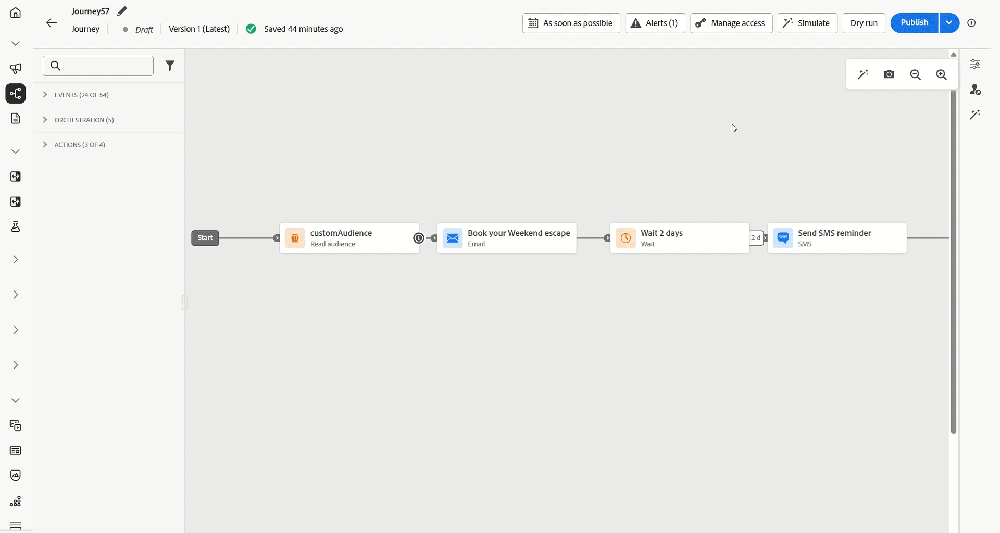

# Release notes {#release-notes}

>[!CONTEXTUALHELP]
>id="ajo_homepage_card1"
>title="What's new?"
>abstract="**Adobe Journey Optimizer** continuously delivers new capabilities, enhancements to existing capabilities, and bug fixes. All changes are consolidated on the last week of each month in these release notes."

[!DNL Adobe Journey Optimizer] follows a continuous delivery model, allowing Adobe to deliver new capabilities, enhancements, and fixes on an ongoing basis. This approach enables a scalable, phased rollout of capabilities to ensure performance and stability across all environments.

Because of this model, release notes are updated between monthly releases. For full details about the release cycle and availability phases, see [Journey Optimizer release cycle](releases.md).

[!DNL Adobe Journey Optimizer] is built natively on [!DNL Adobe Experience Platform] and inherits from its latest innovations and improvements. Learn more about these changes in [Adobe Experience Platform Release Notes](https://experienceleague.adobe.com/docs/experience-platform/release-notes/latest.html){target="_blank"}.

## April '26 release notes {#april-26-rn}

<!--
**The pre-release notes below are subject to change without prior notice until the release availability date**. Links, screens and updated documentation are published in the release notes, at the release date.

See also [Adobe Experience Platform Pre-release notes](https://experienceleague.adobe.com/en/docs/experience-platform/release-notes/pre-release-notes){target="_blank"}.
-->

New capabilities and improvements released earlier in April are announced with their availability date.

**Release date**: April 28-29, 2026

### New capabilities {#april-26-features}

<table>
<thead>
<tr>
<th><strong>Integrations</strong> </th>
</tr>
</thead>
<tbody>
<tr>
<td>

The <b>Integrations</b> feature allows you to connect third-party data sources directly to Adobe Journey Optimizer. By simplifying how you pull in external data and <b>composable content</b>, this feature makes it easier to deliver personalized, dynamic messaging across all your channels.

Previously released in beta, this capability is now available to all environments (General Availability).

For more information, refer to the <a href="../integrations/integrations.md">detailed documentation</a>.

Availability date: May 4, 2026

</td>
</tr>
</tbody>
</table>

<table>
<thead>
<tr>
<th><strong>Incremental query activity in Orchestrated campaigns</strong> </th>
</tr>
</thead>
<tbody>
<tr>
<td>

<strong>Orchestrated campaigns</strong> now support an <strong>Incremental query</strong> activity that targets only profiles or events that are newly eligible since the last execution.

This keeps recurring campaigns focused on net-new audiences (new sign-ups, newly qualified loyalty members, and similar segments) while reducing query workloads and avoiding redundant sends over time.

For more information, refer to the <a href="../orchestrated/activities/incremental-query.md">detailed documentation</a>.

</td>
</tr>
</tbody>
</table>

<table>
<thead>
<tr>
<th><strong>Sender parameters in email header</strong> </th>
</tr>
</thead>
<tbody>
<tr>
<td>

With Journey Optimizer, you can now send emails where the transmitting entity (Sender) differs from the authoring entity (From). Email clients that support this will typically render it as "Sender on behalf of From" or show a "via" indicator. Fill in the optional <strong>Sender headers</strong> fields in the email channel settings to configure this capability.

This capability is only available for a set of organizations (Limited Availability). To gain access, contact your Adobe representative.

For more information, refer to the <a href="../email/header-parameters.md#sender-header">detailed documentation</a>.

</td>
</tr>
</tbody>
</table>

<table>
<thead>
<tr>
<th><strong>CC field in email channel settings</strong> </th>
</tr>
</thead>
<tbody>
<tr>
<td>

You can now configure an optional CC (carbon copy) field in your email channel settings. Unlike BCC, CC recipients are visible to the primary recipient, enabling transparent communication and clearer ownership.

This allows you to automatically copy the right stakeholder on each message—such as a relationship manager or account owner—while ensuring the customer knows who to contact for follow-up.

The CC field supports personalization, so a single configuration can dynamically route copies based on profile data, making it scalable across multiple use cases without additional setup.

For more information, refer to the <a href="../configuration/cc-email-field.md">detailed documentation</a>.

</td>
</tr>
</tbody>
</table>

<table>
<thead>
<tr>
<th><strong>Copy orchestrated campaigns across sandboxes</strong> </th>
</tr>
</thead>
<tbody>
<tr>
<td>

Sandbox Tooling now supports packaging and copying orchestrated campaigns from one sandbox to another. This eliminates the need to manually rebuild campaigns in each environment. When a campaign is packaged, its core dependent objects such as merge policies, messages, are automatically included, so the imported campaign arrives ready to configure and validate. To protect production environments, all imported campaigns land in draft status in the target sandbox, giving teams a review and approval step before any campaign goes live.

For more information, refer to the <a href="../configuration/copy-objects-to-sandbox.md">detailed documentation</a>.

</td>
</tr>
</tbody>
</table>

<table>
<thead>
<tr>
<th><strong>Journey Optimizer AI Agent Integration via MCP</strong> </th>
</tr>
</thead>
<tbody>
<tr>
<td>

Adobe Journey Optimizer now provides an <strong>MCP (Model Context Protocol) server</strong> that surfaces campaign, channel configuration, and sandbox operations directly inside any MCP-compatible application. With this integration, different personas can collaborate around the same orchestration data. Instead of writing queries against the Adobe Journey Optimizer REST API or navigating multiple UI screens, you can describe your intent conversationally and let the LLM invoke the appropriate MCP tools. This capability is currently available in Claude Web and Desktop.

This capability is available to all customers in Public Beta.

For more information, refer to the <a href="../integrations/ajo-mcp.md">detailed documentation</a>.

</td>
</tr>
</tbody>
</table>

<table>
<thead>
<tr>
<th><strong>Journey Arbitration – AI Models</strong> </th>
</tr>
</thead>
<tbody>
<tr>
<td>

You can now use <strong>AI models</strong> in your ranking formulas to automatically boost journey priority scores based on customer profile attributes and contextual factors, ensuring customers enter the most relevant journeys.

This capability is only available for a set of organizations (Limited Availability). To gain access, contact your Adobe representative.

For more information, refer to the <a href="../conflict-prioritization/journey-ai-models.md">detailed documentation</a>.

</td>
</tr>
</tbody>
</table>

<table>
<thead>
<tr>
<th><strong>Adobe Express integration</strong> </th>
</tr>
</thead>
<tbody>
<tr>
<td>

The <b>Adobe Express integration</b> in Adobe Journey Optimizer lets you use Adobe Express's editing tools directly during content creation, enabling you to resize, remove backgrounds, crop, and convert assets to JPEG or PNG.

Previously released in Limited Availability, this capability is now available to all environments (General Availability).

For more information, refer to the <a href="../integrations/express.md">detailed documentation</a>.

Availability date: April 23, 2026

</td>
</tr>
</tbody>
</table>

<table>
<thead>
<tr>
<th><strong>Optimize email for AI inboxes</strong> </th>
</tr>
</thead>
<tbody>
<tr>
<td>

Adobe Journey Optimizer now includes a new capability that ensures your emails are optimally structured for AI-powered inboxes such as Apple Intelligence and Google Gemini in Gmail.

As AI assistants increasingly control how recipients read and act on email, this feature helps you generate and author content that performs well across downstream AI tasks including summarization, triage, prioritization, and intent extraction.

For more information, refer to <a href="../email/llm-email-optimizer.md">Optimize email for AI inboxes</a>.

Availability date: April 17, 2026

</td>
</tr>
</tbody>
</table>

<table>
<thead>
<tr>
<th><strong>AI Assistant for Personalization Expressions</strong> </th>
</tr>
</thead>
<tbody>
<tr>
<td>

[!DNL Adobe Journey Optimizer] now includes <strong>AI Assistant</strong> directly in the personalization editor and the Email Designer that converts natural-language prompts into valid personalization expressions and conditional logic, no syntax expertise required. Describe the personalization you want to achieve, and AI generates ready-to-use code you can apply immediately or refine through follow-up prompts.

The assistant also works in reverse. Select any existing expression and ask it to explain the logic, identify issues, or suggest improvements. This makes it useful not just for authoring new expressions, but for reviewing and debugging existing ones across your team.

For more information, refer to <a href="../content-management/generative-personalization-expressions.md">AI Assistant for Personalization Expressions</a>.

Availability date: April 13, 2026

</td>
</tr>
</tbody>
</table>

<table>
<thead>
<tr>
<th><strong>Journey path experimentation</strong> </th>
</tr>
</thead>
<tbody>
<tr>
<td>

Use the new <strong>Optimize</strong> node to run A/B tests or multi-armed bandit experiments to determine the best path to meet your business-centric KPIs. This tool allows you to test and vary, and customize communications, sequencing, and timing to best reach your customers.

Previously released in Limited Availability, this capability is now available to all environments (General Availability).

As part of the General Availability, this release introduces <strong>experiment type</strong> selection (A/B or multi-armed bandit) and <strong>Scale the winner</strong> for unitary journeys.

For more information, refer to the <a href="../building-journeys/path-experimentation.md">detailed documentation</a>.

Availability date: April 7, 2026

</td>
</tr>
</tbody>
</table>

<table>
<thead>
<tr>
<th><strong>Inbox</strong> </th>
</tr>
</thead>
<tbody>
<tr>
<td>

<strong>Inbox</strong> is a mobile functionality, available with Content Cards, that enables customers to create a centralized location within their app or website to display messages sent to their users. This extends the lifetime of marketing communications by ensuring messages remain accessible even after they are dismissed.

For more information, refer to the <a href="../inbox/inbox-gs.md">detailed documentation</a>.

Availability date: April 7, 2026

</td>
</tr>
</tbody>
</table>

<table>
<thead>
<tr>
<th><strong>Decisioning support in email channel</strong> </th>
</tr>
</thead>
<tbody>
<tr>
<td>

You can now use <strong>Decisioning</strong> to personalize and optimize the content of your email messages. Leverage Priority Scores, Formulas, or AI Models to display the most relevant offers and content to each recipient.

Previously released in Limited Availability, this capability is now available to all environments (General Availability). With this General Availability release, mirror pages are now supported.

For more information, refer to the <a href="../experience-decisioning/create-decision-policy.md">detailed documentation</a>.

Availability date: April 6, 2026

</td>
</tr>
</tbody>
</table>

### Improvements {#april-26-improv}

<!--
#### AI

* **Brand alignment score in Campaign dashboard** - You can now assess your brand alignment score directly within your Campaign dashboard to ensure content stays on-brand. This allows you to verify guidelines at a glance without having to open the content designer.

* **Prompt Assistant enhancement** - Prompt Assistant enhances AI content generation by analyzing user prompts in real time and identifying gaps in clarity, completeness, and context. It suggests improved rewrites and provides actionable guidance to enrich prompts with key details like audience, tone, and intent. The feature also asks targeted clarifying questions to help users refine their inputs before generation. This results in more accurate, high-quality outputs with fewer iterations. [Learn more](../content-management/ai-assistant-prompting-guide.md)
-->

#### Push

* **Personalize App id in channel settings** - In the Push channel configuration settings, you can now personalize the **App id** field so that each recipient can receive a push notification from the appropriate brand based on their profile information. [Read more](../push/push-configuration.md#app-id-personalization)

  This capability is only available for a set of organizations (Limited Availability). To gain access, contact your Adobe representative.

#### Decisioning

* **Attach fragments to decision items** - Journey Optimizer now provides the ability to attach fragments to decision items which can be leveraged in code-based experience and email campaigns through decision policies. [Read more](../experience-decisioning/fragments-decision-policies.md)

  Previously released in Limited Availability, this capability is now available to all environments (General Availability).

* **Temporarily unavailable fragments are skipped** - When using fragments in decision items, if a fragment is temporarily unavailable on Edge, it is skipped and the journey or campaign continues rendering instead of failing. [Read more](../experience-decisioning/fragments-decision-policies.md#temporary-unavailable-fragments)

  Availability date: April 14, 2026

<!--
#### SMS

* **Character Count** - In Adobe Journey Optimizer, you can now use the Character Count to monitor the length of your SMS messages in real time. It helps you see when a message will be split into multiple segments to better manage formatting and avoid unexpected increases in sending costs. [Read more](../sms/create-sms.md)

* **Opt-out and consent at phone number and sender** - For SMS, Journey Optimizer now records marketing consent and opt-out at the level of both the profile's phone number and short code. 

  This capability is currently only available for Sinch SMS configurations. [Read more](../sms/sms-configuration-sinch.md)

* **SMS inbounds to a custom dataset** - In **SMS API credentials**, route **inbound SMS** to a **custom, profile-enabled Experience Event dataset** you select instead of only the default tracking dataset. [Read more](../sms/sms-webhook.md)

* **Webhook interface enhancement** - When configuring SMS webhooks, the user interface now includes a built-in setup guide with practical examples, making it easier to align provider payloads and troubleshoot issues without leaving the configuration flow. [Read more](../sms/sms-webhook.md)

#### WhatsApp

* **WhatsApp interactive buttons and tracking** - WhatsApp in Journey Optimizer now supports interactive buttons required by your templates and use cases, along with built-in interaction tracking so you can measure engagement and analyze performance alongside your other channel reporting.
-->

#### Adobe Experience Manager Integrations

* **Adobe Experience Manager Content fragment Varition Support** - You can select **Content Fragment variations** (for example language or channel variants) when inserting Adobe Experience Manager Content Fragments, with improved handling for locale and multilingual scenarios. [Read more](../integrations/aem-fragments.md#aem-variations)

  Previously released in Limited Availability, this capability is now available to all environments (General Availability).

* **Adobe Experience Manager Content Fragment context while authoring** - Your Content Fragment selection stays active as you move between text fields and content blocks, so you can add more fragment fields without reopening **Open AEM Content advisor** each time. [Read more](../integrations/aem-fragments.md)

  Previously released in Limited Availability, this capability is now available to all environments (General Availability).

#### Email design

* **Advanced HTML editor for email content** - Advanced HTML mode lets you edit the HTML source of your content in the Email Designer, add advanced expressions (such as conditions) in the source, and toggle between HTML view and Desktop view without losing your changes.

  Previously available for email content templates only, this capability is now deployed to **email** content in the Email Designer (for example, emails authored in journeys and campaigns), in addition to email content templates. It is currently in Limited Availability — contact your Adobe representative to gain access. [Read more](../email/email-expert-mode.md)

  Availability date: April 9, 2026

#### Journey Path Optimization

* **Experiment type** - You can now choose between A/B experiment (fixed split at the start) or Multi-armed bandit (automatic split with weekly weight updates) when configuring a path experiment. [Read more](../building-journeys/path-experimentation.md)

  Availability date: April 7, 2026

* **Path experimentation: Scale the Winner** - You can now automatically or manually roll out the winning path of an experiment to your full audience. Once a winner is determined, you can amplify its reach and effectiveness without constantly monitoring the experiment. [Read more](../building-journeys/path-experimentation.md#scale-winner)

  This capability is available only in unitary journeys (event-triggered and Audience qualifications). It is not available for Read audience journeys.

  Availability date: April 7, 2026

* **Conditions** - The [Optimize](../building-journeys/optimize.md) activity is the new vehicle for creating conditional paths in journeys. It replaces the former **Condition** activity, which has been removed from the UI. All conditional logic is retained and is now handled through the **Optimize** activity's conditions. [Read more](../building-journeys/conditions.md)

  Previously released in Limited Availability, this capability is now available to all environments (General Availability).

  Availability date: April 7, 2026

#### Orchestrated campaigns

* **Global variables in Orchestrated Campaigns** - Orchestrated Campaigns now support global variables that can be defined once and reused across all activities within a workflow, simplifying configuration and ensuring consistency in dynamic values, expressions, and content personalization. [Read more](../orchestrated/global-variables.md)
* **Data Modeler enhancements** - Orchestrated relational schemas now support composite keys spanning multiple fields. Loading a schema from a DDL file also brings in enumerations, and loading from either a DDL or Excel file automatically creates composite relationships between tables. In the entity relationship view, composite links now display the full set of field pairings between tables after a file is uploaded. [Read more](../orchestrated/gs-schemas.md)

## Coming soon {#coming-soon}

The following capabilities and enhancements are scheduled for release in the next few days. **Information is subject to change**. Updated links, screens, and documentation will be shared once these updates are live in production.

### New capabilities {#comming-soon-features}

<table>
<thead>
<tr>
<th><strong>Journey simulation</strong> </th>
</tr>
</thead>
<tbody>
<tr>
<td>

You can now set your journey to <strong>Simulation</strong>. This mode allows you to validate your logic using <strong>simulated users</strong>. These are temporary profiles created specifically for the simulation, allowing you to test freely without needing to manage persistent test profiles in Adobe Experience Platform.

This capability is available to all customers as a Limited Availability with essential capabilities.

<!--p></p-->
</td>
</tr>
</tbody>
</table>

<table>
<thead>
<tr>
<th><strong>Deeplinks in the Email Designer</strong> </th>
</tr>
</thead>
<tbody>
<tr>
<td>

It is now possible to add deeplinks to your email contents through a dedicated option in the Email Designer.

This ensures users are taken directly to the right in-app content instead of being redirected to browsers or app stores, preserving context and engagement.

<!--

-->

For more information, refer to the <a href="../email/message-tracking.md">detailed documentation</a>.

</td>
</tr>
</tbody>
</table>

### Improvements {#comming-soon-improv}

#### Configuration

* **Specific permissions for URL parameter encryption keys** - To access and manage keys for URL parameter encryption, new permissions have been created. You must now have the **View Key Registry** and **Manage Key Registry** permissions granted. <!--[Read more](../personalization/url-parameter-encryption.md#create-keys)-->
