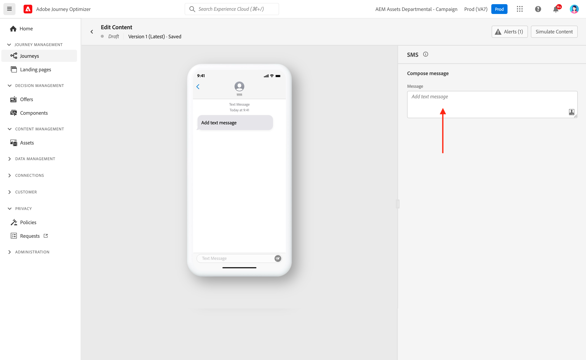
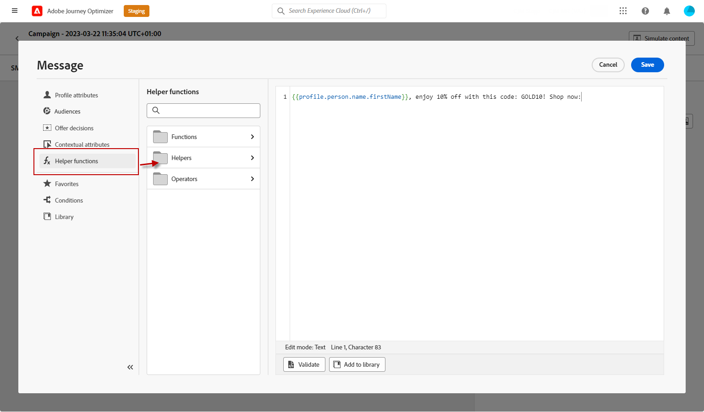
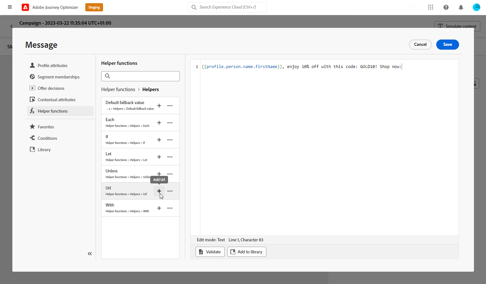
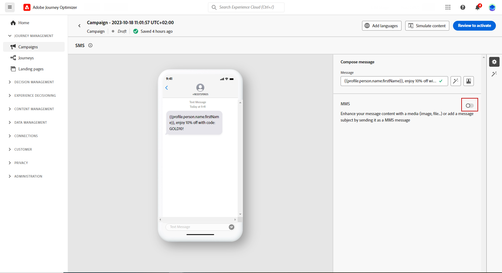
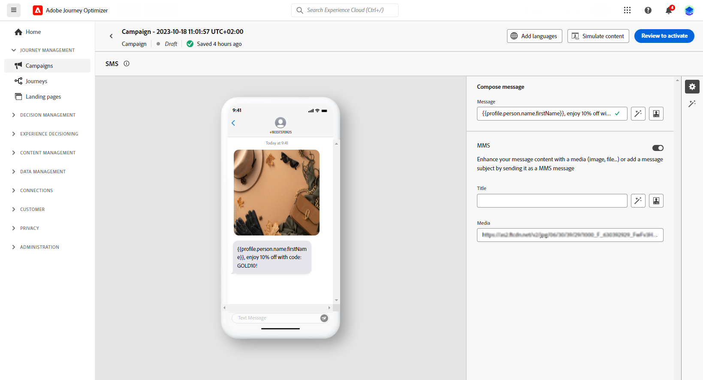
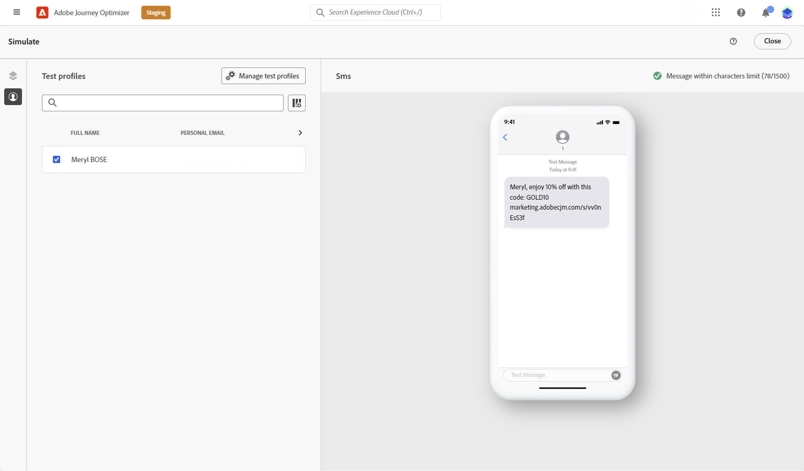

# Create a SMS/MMS/RCS message {#create-sms}

>[!CONTEXTUALHELP]
>id="ajo_message_sms"
>title="Create a text message"
>abstract="To create a text message (SMS/MMS/RCS), add an SMS action in a journey or a campaign and start personalizing it with the personalization editor."

>[!AVAILABILITY]
>
>RCS is not a HIPAA-Ready Service and must not be used to collect, store, or process any sensitive personal data, including permitted health data, e.g. personal health information, that your organization may otherwise be permitted to process in Journey Optimizer.

You can design and send text (SMS), rich communication (RCS) and multimedia (MMS) messages with Adobe Journey Optimizer. You first need to add an SMS action in a journey or a campaign, and then define the content of the text message, as detailed below. Adobe Journey Optimizer also offers capabilities to test your text messages before sending, so that you can check the rendering, personalization attributes, and all other settings. 

In accordance with the industry standards and regulations, all SMS/MMS marketing messages must contain a way for the recipients to easily unsubscribe. To do this, SMS recipients can reply with opt-in and opt-out keywords. [Learn how to manage opt-out](../privacy/opt-out.md#opt-out-decision-management)

## Add a text message {#create-sms-journey-campaign}

>[!CONTEXTUALHELP]
>id="ajo_journey_action_sms"
>title="SMS action"
>abstract="Configure an SMS or MMS channel action for your journey. Add a label to identify the activity, then click **Configure action** to select the SMS configuration and define your content. Use the **Optimization** section to run content experiments or apply targeting rules, the **Multilingual** section to deliver content in multiple languages, and the **Timeout or error** section to add an alternative path if the action fails."
>additional-url="https://experienceleague.adobe.com/en/docs/journey-optimizer/using/orchestrate-journeys/about-journey-building/journey-action#add-action" text="Get started with channel actions"

Browse the tabs below to learn how to add a text message (SMS/MMS/RCS) in a campaign or a journey.

>[!BEGINTABS]

>[!TAB Add a text message to a Journey]

1. Open your journey then drag and drop an **[!UICONTROL Action]** activity from the **[!UICONTROL Actions]** section of the palette. Learn more about the [Action activity](../building-journeys/journey-action.md).

    >[!IMPORTANT]
    >
    >Legacy native channel activities (Email, Push, SMS, In-app, Web, Code-based experience, and Content Card) are deprecated as of the March 2026 release. Existing journeys using these activities continue to work without any changes—no migration is required.

1. Select **[!UICONTROL SMS]** as the action type.

    

1. Enter a **[!UICONTROL Label]** to identify your action in the journey canvas.

1. Click the **[!UICONTROL Configure action]** button.

1. You are directed to the **[!UICONTROL Actions]** tab. From there, select or create the SMS configuration to use. [Learn more](sms-configuration.md)

    

1. Additionally, you can apply capping rules to your SMS action by selecting a rule set in the **[!UICONTROL Business rules]** drop-down list. [Learn more](../conflict-prioritization/channel-capping.md)

1. Select the **[!UICONTROL Edit content]** button and create your content as desired. [Learn more](#sms-content)

1. Go back to the journey canvas. If necessary, complete your journey flow by dragging and dropping additional actions or events. [Learn more](../building-journeys/about-journey-activities.md)

For more information on how to create, configure and publish a journey, refer to [this page](../building-journeys/journey-gs.md).

>[!TAB Add a text message to a Campaign]

1. Access the **[!UICONTROL Campaigns]** menu, then click **[!UICONTROL Create campaign]**.

1. Select the type of campaign that you want to execute

    * **Scheduled - Marketing**: execute the campaign immediately or on a specified date. Scheduled campaigns are aimed at sending marketing messages. They are configured and executed from the user interface.

    * **API-triggered - Marketing/Transactional**: execute the campaign using an API call. API-triggered campaigns are aimed at sending either marketing or transactional messages, i.e., messages sent out following an action performed by an individual: password reset, cart purchase, etc.

1. From the **[!UICONTROL Properties]** section, edit your Campaign's **[!UICONTROL Title]** and **[!UICONTROL Description]**.

1. Click the **[!UICONTROL Select audience]** button to define the audience to target from the list of available Adobe Experience Platform audiences. [Learn more](../audience/about-audiences.md).

1. In the **[!UICONTROL Identity namespace]** field, choose the namespace to use in order to identify the individuals from the selected audience. [Learn more](../event/about-creating.md#select-the-namespace).

1. In the **[!UICONTROL Actions]** section, choose the **[!UICONTROL SMS]** and select or create a new configuration.

    Learn more about SMS configuration on [this page](sms-configuration.md).

    

1. Click **[!UICONTROL Create experiment]** to start configuring your content experiment and create treatments to measure their performance and identify the best option for your target audience. [Learn more](../content-management/content-experiment.md)

1. In the **[!UICONTROL Actions tracking]** section, specify if you want to track clicks on links in your SMS message.

1. Campaigns are designed to be executed on a specific date or on a recurring frequency. Learn how to configure the **[!UICONTROL Schedule]** of your campaign in [this section](../campaigns/campaign-schedule.md#action-campaign-schedule). 

1. From the **[!UICONTROL Action triggers]** menu, choose the **[!UICONTROL Frequency]** of your SMS message:

    * Once
    * Daily
    * Weekly
    * Month
    
You can now start designing the content of your text message from the **[!UICONTROL Edit content]** button, as detailed below.

For more information on how to create, configure and activate a campaign, refer to [this page](../campaigns/get-started-with-campaigns.md).

>[!ENDTABS]

## Define your SMS/RCS content{#sms-content}

>[!CONTEXTUALHELP]
>id="ajo_message_sms_content"
>title="Define your SMS content"
>abstract="Customize and personalize your text messages (SMS/MMS/RCS) by using the personalization editor to define the content and incorporate dynamic elements."

To configure your message content, follow the steps below. Settings for MMS are detailed in [this section](#mms-content).

1. From the journey or campaign configuration screen, click the **[!UICONTROL Edit content]** button to configure the text message content.

1. Click the **[!UICONTROL Message]** field to open the personalization editor.

    For RCS messaging with Infobip, Twilio, or other third-party providers, paste the required JSON payload into your [custom SMS configuration](sms-configuration-custom.md#api-credential).

    

1. Generate engaging text messages tailored to your audience using [AI Assistant for text generation](../content-management/generative-text.md).

1. Use the personalization editor to define content, add personalization and dynamic content. You can use any attribute, such as the profile name or city for example. You can also define conditional rules. Browse to the following pages to learn more about [personalization](../personalization/personalize.md) and [dynamic content](../personalization/get-started-dynamic-content.md) in the personalization editor.

1. After defining your content, you can add tracked URLs to your message. To do this, access the **[!UICONTROL Helper functions]** menu and select **[!UICONTROL Helpers]**.

    To use the URL shortening function, you must first configure a subdomain that will then be linked to your configuration. [Learn more](sms-subdomains.md)
    
    >[!NOTE]
    >
    > To access and edit SMS subdomains, you must have the **[!UICONTROL Manage SMS Subdomains]** permission on the production sandbox. Learn more about permissions in [this section](../administration/high-low-permissions.md).

    

1. Within the **[!UICONTROL Helper functions]** menu, click **[!UICONTROL URL function]** and then select **[!UICONTROL Add URL]**.

    

    <!--The URL shortening function cannot be used within a fragment. TBC-->

1. In the `originalUrl` field, paste the URL that you want to shorten and click **[!UICONTROL Save]**.

    >[!CAUTION]
    >
    > The lifespan of short URLs is set to 30 days. After this period, these short URLs will no longer be accessible and will display the message: `404 short-code not found`.

1. Click **[!UICONTROL Save]** and check your message in the preview. You can now test and check your message content as detailed in [this section](#sms-mms-test).

## Personalize with Decisioning {#decisioning-sms}

You can personalize and optimize the content of your SMS messages with **Decisioning**. This capability allows you to use Priority Scores, Formulas, or AI Models to dynamically select and display the best content to your customers.

For more information on how to create and use decision policies in SMS messages, refer to [this section](../experience-decisioning/create-decision.md).

## Define your MMS content{#mms-content}

You can enhance your communication by sending Multimedia Message Service (MMS) messages, enabling the sharing of media such as videos, pictures, audio clips and GIFs, and more. Additionally, MMS allows for up to 1600 characters of text in your message.

>[!NOTE]
>
> MMS channel comes with a few limitations listed on [this page](../start/guardrails.md#sms-guardrails).

To create MMS content, follow these steps:

1. Create a SMS as described in [this section](#create-sms-journey-campaign).

1. Edit your SMS content as detailed in [this section](#sms-content).

1. Enable the MMS option to add media to your SMS content.

    

1. Add a **[!UICONTROL Title]** to your media.

1. Enter the URL of your media in the **[!UICONTROL Media]** field.

    

1. Click **[!UICONTROL Save]** and check your message in the preview. You can now test and check your message content as detailed below.

## Test and send your messages {#sms-mms-test}

Use the **[!UICONTROL Simulate content]** button to preview your text message content, shortened URLs, and personalized content.

Once you have performed your tests and validated the content, you can send your text message to your audience. These steps are detailed on [this page](send-sms.md)

Once sent, you can measure the impact of your SMS within the Campaign or Journey reports. For more on reporting, refer to [this section](../reports/campaign-global-report-cja-sms.md).

**Related topics**

* [Preview, test and send your text message](send-sms.md)
* [Configure SMS channel](sms-configuration.md)
* [SMS/MMS reports](../reports/journey-global-report-cja-sms.md)
* [Add a message in a journey](../building-journeys/journey-action.md)
* [Add a message in a campaign](../campaigns/create-campaign.md)
