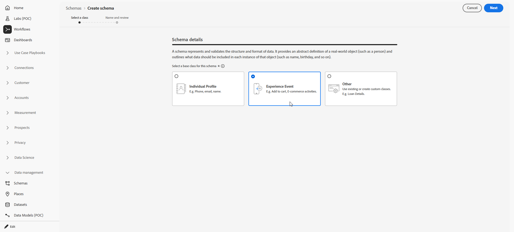

# Use a custom dataset for inbound keywords {#custom-dataset-inbound-keywords}

Inbound SMS keywords can be stored in a profile-enabled custom dataset. The configuration consists of an Adobe Experience Platform schema, a dataset created from that schema, and Journey Optimizer SMS API credentials that reference the dataset for inbound messages.

For background on schemas, field groups, and datasets, refer to the following Adobe Experience Platform documentation:

* [XDM System overview](https://experienceleague.adobe.com/docs/experience-platform/xdm/home.html){target="_blank"}
* [Basics of schema composition](https://experienceleague.adobe.com/docs/experience-platform/xdm/schema/composition.html){target="_blank"}
* [Datasets overview](https://experienceleague.adobe.com/docs/experience-platform/catalog/datasets/overview.html){target="_blank"}

To use a custom dataset for inbound keyword, you need to:

1. [Create a schema](#create-schema)
1. [Create a dataset](#create-dataset)
1. [Configure API credentials](#configure-api-credentials)

## Create a schema {#create-schema}

A schema defines the structure and validation rules that apply to ingested data. Compose an Experience Event schema for inbound keyword collection by adding the existing field groups listed below.

➡️ [Learn more about schema creation in Adobe Experience Platform documentation](https://experienceleague.adobe.com/en/docs/experience-platform/xdm/schema/composition)

1. In Adobe Experience Platform, from **[!UICONTROL Data management]**, access **[!UICONTROL Schemas]** and select **[!UICONTROL Create schema]**.

    

1. Choose **[!UICONTROL Standard schema]**.

1. Select **[!UICONTROL Experience Event]**.

    

1. Enter a **[!UICONTROL Display name]** for the schema and click **[!UICONTROL Finish]**.

   The schema is saved and the schema editor opens.

1. Open **[!UICONTROL Schema properties]** and enable the schema for **[!UICONTROL Profile]**.

    

1. In **[!UICONTROL Field groups]**, add these existing field groups:

    * [!DNL Adobe CJM ExperienceEvent - Message interaction details]
    * [!DNL Adobe CJM ExperienceEvent - Message Execution Details]
    * [!DNL Adobe CJM ExperienceEvent - Message Profile Details]

1. Click **[!UICONTROL Save]**.

## Create a dataset {#create-dataset}

A dataset is the storage container for ingested data. Each dataset is associated with exactly one schema, and records written to the dataset must conform to that schema.

1. In Adobe Experience Platform, from **[!UICONTROL Data management]**, access **[!UICONTROL Datasets]** and select **[!UICONTROL Create dataset]**.

    

1. Choose **[!UICONTROL Create dataset from schema]**.

1. Select the schema created in the previous section and click **[!UICONTROL Next]**.

    

1. Enter a **[!UICONTROL Name]** and click **[!UICONTROL Finish]**.

1. From the **[!UICONTROL Data activity]** tab, enable data for **[!UICONTROL Profile]**.
    
    Select the **[!UICONTROL Data retention]** policy appropriate to organizational governance requirements.

    

1. Click **[!UICONTROL Save]**.

## Configure API credentials {#configure-api-credentials}

Configure credentials according to your SMS provider using [Get started with SMS / MMS / RCS configuration](sms-configuration.md). Then complete the steps below to select the custom inbound dataset.

1. In the left rail, browse to **[!UICONTROL Administration]** > **[!UICONTROL Channels]** `>` **[!UICONTROL SMS Settings]** and select the **[!UICONTROL API Credentials]** menu. Click the **[!UICONTROL Create new API credentials]** button.

1. Create or edit credentials depending on your provider.

1. Enable the **[!UICONTROL Use custom dataset for inbound]** option.

1. Select the **[!UICONTROL Dataset]** created in the previous section.

    

1. Complete any remaining required fields and click **[!UICONTROL Save]**.

    >[!NOTE]
    >
    >Upon saving API credentials, Journey Optimizer validates that the inbound keyword dataset is configured correctly. If validation fails, an error message indicates the required correction.

After the credentials are saved, outbound and inbound messaging behavior is unchanged; inbound keywords for that credential are recorded in the selected custom dataset.
