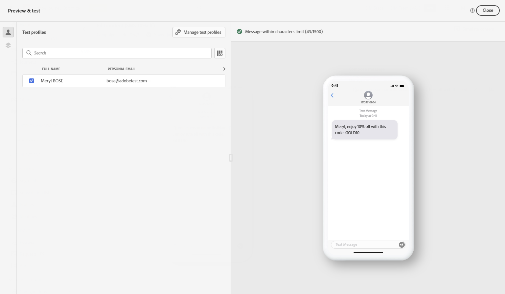
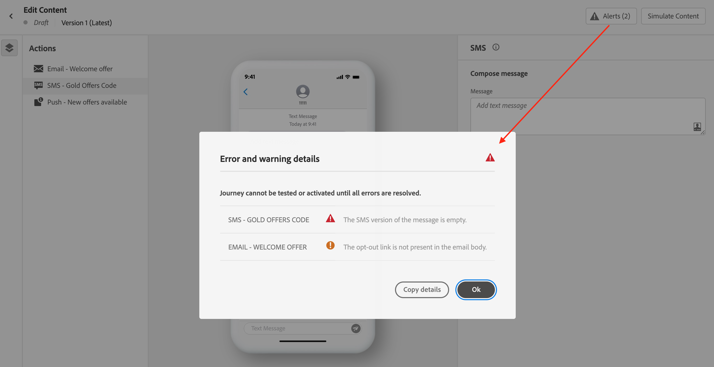

# Check & send your text message (SMS/MMS){#send-sms}

## Preview your text message {#preview-sms}

Once your message content has been defined, you can use test profiles or sample input data (uploaded from a CSV/JSON file or added manually) to preview its content. If you inserted personalized content, you can check how this content is displayed in the message. 

To do this, click **[!UICONTROL Simulate content]** then check your message using the test profile data.

Detailed information on how to preview & test content is available in the [Content Management](../content-management/preview-test.md) section.

### Character encoding and limits {#sms-character-limits}

A character count is displayed when accessing **[!UICONTROL Simulate content]** menu to assist in planning and managing your SMS messages.

Journey Optimizer uses UTF-8 encoding in its SMS editor, allowing you to type or paste double-byte or Unicode characters. These characters are then transmitted to the service provider for delivery. Most SMS providers use GSM 7-bit encoding for standard messages with a 160-character limit and switch to UTF-16 (UCS-2) when non-GSM characters are detected with a 70-character limit.

Note that the character count does not reflect variations introduced by dynamic personalization or non-GSM 7-bit special characters.

>[!IMPORTANT]
>
>Journey Optimizer SMS delivery reporting does not account for concatenated messages and dynamic personalization, thus may not reflect the actual number of messages sent from the provider. For detailed usage and billing information, please contact your Adobe representative.
>
>To learn best practices for minimizing SMS billing overages, refer to [SMS Best Practices for Character Optimization](sms-cost-optimization.md).

## Validate your content {#sms-validate}

You must check alerts in the upper section of the editor. Some of them are simple warnings, but others can prevent you from sending the message. Two types of alerts can happen: warnings and errors.

* **Warnings** refer to recommendations and best practices. For example, a warning message is displayed if your text message is empty.

* **Errors** prevent you from testing or activating the journey, or publishing the campaign, as long as they are not resolved. For example, an error message warns you when the subject line is missing.

>[!NOTE]
>
> To improve your deliverability, use the phone numbers in the formats supported by the provider. For example, Twilio and Sinch only support phone numbers in E.164 format.

## Send your text messages {#sms-send}

>[!IMPORTANT]
>
> If your campaign is subject to an approval policy, you will need to request approval in order to be able to send your text messages. [Learn more](../test-approve/gs-approval.md)

When your text message is ready, complete the configuration of your [journey](../building-journeys/journey-gs.md) or [campaign](../campaigns/create-campaign.md) to send it.

**Related topics**

* [Configure SMS channel](sms-configuration.md)
* [SMS/MMS reports](../reports/journey-global-report-cja-sms.md)
* [Create a text message](create-sms.md)
* [Add a message in a journey](../building-journeys/journeys-message.md)
