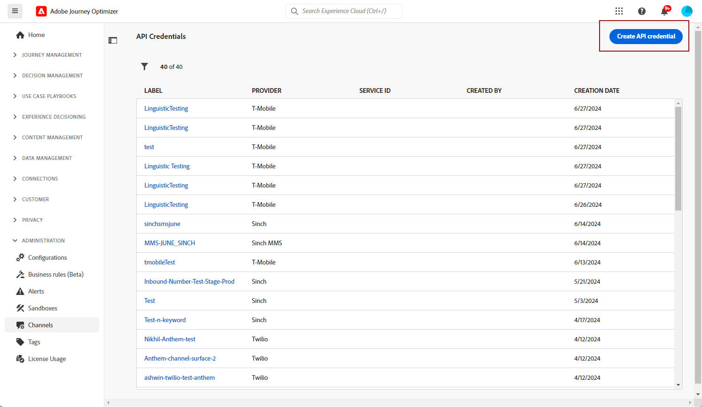

# Configure a custom provider {#sms-configuration-custom}

>[!AVAILABILITY]
>
>Custom providers are currently available as a beta to selected users only. Please reach out to your Adobe representative to be included in the Beta.
>
>Note that this Beta does not support inbound messages for opt-in/opt-out consent management and delivery reporting.

To send messages in Journey Optimizer using a custom provider not available out of the box by Adobe (e.g., Sinch, Infobip, Twilio), follow these steps:

1. In the left rail, browse to **[!UICONTROL Administration]** > **[!UICONTROL Channels]** and select the **[!UICONTROL API Credentials]** menu.

1. Click the **[!UICONTROL Create new API credentials]** button.

    

1. Configure your SMS API credentials, as detailed below:

    * **[!UICONTROL SMS vendor]**: Custom.

    * **[!UICONTROL Name]**: enter a name for your API Credential.

    * **[!UICONTROL Provider AppId]**: enter the application ID provided by your SMS provider.

    * **[!UICONTROL Provider Name]**: enter the name of your SMS provider.

    * **[!UICONTROL Provider URL]**: enter the URL of your SMS provider.

    * **[!UICONTROL Auth Type​]**: select your Authorization type. Supported Authorization types are **Bearer App** or **Basic**. 

    * **[!UICONTROL API Token]**: enter the API Token provided by your SMS provider.

    * **[!UICONTROL Provider Payload]**: add your provider payload, e.g., `{"from": "+1234XXXXXX", "to": "+1374XXXXXX", "content": "This is a test message", "contentType": "TEXT"}`.

        Make sure the payload includes `{{toNumber}}`, `{{fromNumber}}`, `{{message}}`.

1. Click **[!UICONTROL Submit]** when you finished the configuration of your API credentials.

1. In the **[!UICONTROL API Credentials]** menu, click the bin icon to delete your API credentials.

1. To modify existing credentials, locate the desired API credentials and click the **[!UICONTROL Edit]** option to make the necessary changes.

After creating and configuring your API credential, you now need to create a channel surface for SMS messages. [Learn more](sms-configuration-surface.md)

Once configured, you can leverage all out-of-the-box channel capabilities such as message authoring, personalization, link tracking, and reporting.

## How-to video {#video}

>[!VIDEO](https://video.tv.adobe.com/v/3431625)
