# Configure a custom provider {#sms-configuration-custom}

>[!CONTEXTUALHELP]
>id="ajo_admin_sms_api_byop_provider_url"
>title="Provider URL"
>abstract="Specify the URL of the external API you plan to connect to. This URL serves as the endpoint for accessing the API's features and functionalities."

>[!CONTEXTUALHELP]
>id="ajo_admin_sms_api_byop_header_parameters"
>title="Header parameters"
>abstract="Specify the label, type, and value of additional headers to enable proper authentication, content formatting, and effective API communication. "

>[!CONTEXTUALHELP]
>id="ajo_admin_sms_api_byop_provider_payload"
>title="Provider payload"
>abstract="Provide the request payload to ensure the correct data is sent for processing and response generation."

This feature empowers you to integrate and configure your own messaging providers, offering flexibility beyond the default options (Sinch, Twilio, and Infobip). This enables seamless authoring, delivery, reporting, and consent management for both SMS and RCS messages.

With custom provider configuration, you can connect third-party messaging services directly within Journey Optimizer, customize message payloads for dynamic content, and manage opt-in/opt-out preferences to ensure compliance across both SMS and RCS channels.

To configure your custom provider, follow the steps below:

1. [Create API Credential](#api-credential)
1. [Create Webhook](#webhook)
1. [Create Channel configuration](sms-configuration-surface.md)
1. [Create Journey or Campaign with SMS channel action](create-sms.md)

## Create your API credential {#api-credential}

To send SMS and RCS messages in Journey Optimizer using a custom provider not available out of the box by Adobe (e.g., Sinch, Infobip, Twilio), follow these steps:

1. In the left rail, navigate to **[!UICONTROL Administration]** `>` **[!UICONTROL Channels]**, select the **[!UICONTROL API Credentials]** menu under **[!UICONTROL SMS settings]**, and click the **[!UICONTROL Create new API credentials]** button.

    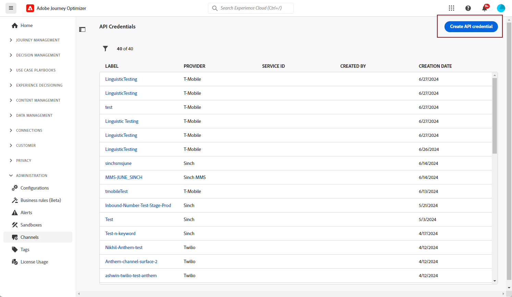

1. Configure your SMS API credentials, as detailed below:

    * **[!UICONTROL SMS vendor]**: Custom.

    * **[!UICONTROL Name]**: Enter a name for your API Credential.

    * **[!UICONTROL Provider AppId]**: Enter the application ID provided by your SMS provider.

    * **[!UICONTROL Provider Name]**: Enter the name of your SMS provider.

    * **[!UICONTROL Provider URL]**: Enter the URL of your SMS provider.

    * **[!UICONTROL Auth Type​]**: Select your authorization type and [complete the corresponding fields](#auth-options) based on the chosen authentication method.

        

1. Enable the **[!UICONTROL mTLS support]** option, which ensures that both the client and server authenticate each other before establishing a secure connection.

    To use mTLS only, select **[!UICONTROL No Authentication]** from the **[!UICONTROL Auth Type]** drop-down and then enable **[!UICONTROL mTLS support]**.

1. In the **[!UICONTROL Headers]** section, click **[!UICONTROL Add new parameter]** to specify the HTTP headers for the request message that will be sent to the external service.

    The **Content-Type** and **Charset** header fields are set by default and cannot be deleted.

    

1. Add your **[!UICONTROL Provider Payload]** to validate and customize your request payloads. 
   
   For RCS messages, this payload is later used during [content design](create-sms.md#sms-content).

1. Click **[!UICONTROL Submit]** when you finished the configuration of your API credentials.

1. In the **[!UICONTROL API Credentials]** menu,  click the  to delete your API credentials.

    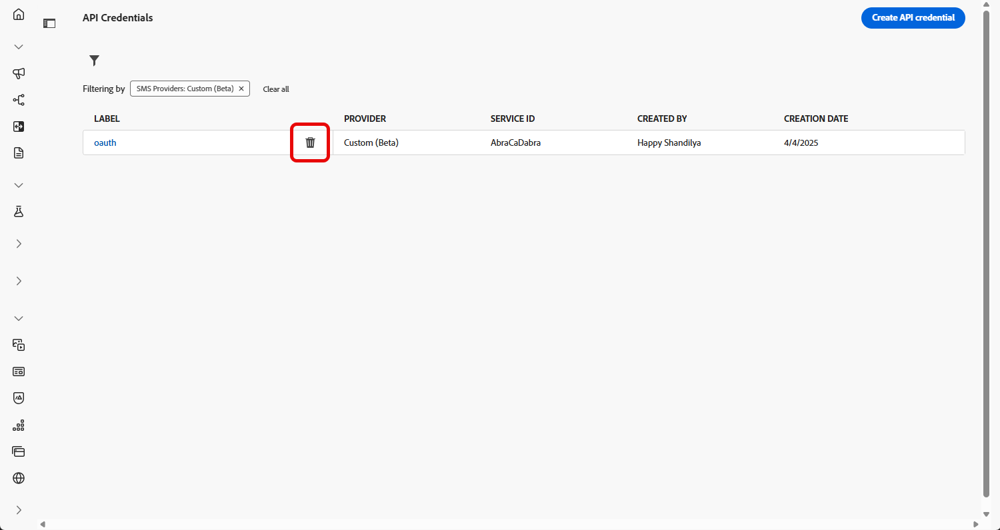

1. To modify existing credentials, locate the desired API credentials and click the **[!UICONTROL Edit]** option to make the necessary changes.

    

1. Click **[!UICONTROL Verify SMS connection]**, from your existing API credentials, to test and verify your SMS API credentials by sending a sample message to a designated device.

1. Fill in the **Number** and **Message** fields and click **[!UICONTROL Verify connection]**.

    >[!IMPORTANT]
    >
    >The message must be structured to align with the provider's payload format.

    

After creating and configuring your API credential, you now need to set up [the inbound settings for the Webhook](#webhook) for SMS messages. 

### Authentication options for custom SMS Providers {#auth-options}

>[!CONTEXTUALHELP]
>id="ajo_admin_sms_api_byop_auth_type"
>title="Authentication type"
>abstract="Specify the authentication method needed to access the API, this ensures secure and authorized communication with the external service."

>[!BEGINTABS]

>[!TAB API key]

Once your API credential is created, complete the fields required for API key authentication:

* **[!UICONTROL Name]**​: Enter a name for your API key configuration.
* **[!UICONTROL API Token]**​: Enter the API Token provided by your SMS provider.

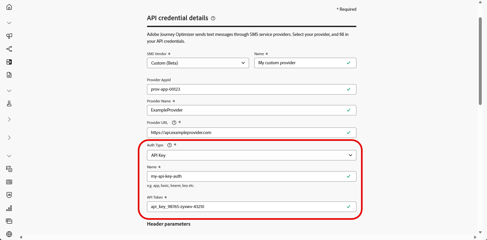

>[!TAB MAC authentication]

Once your API credential is created, complete the fields required for MAC authentication:

* **[!UICONTROL Name]**​: Enter a name for your MAC authentication configuration.
* **[!UICONTROL API Token]**​: Enter the API Token provided by your SMS provider.
* **[!UICONTROL API Secret Key]**: Enter the API Secret Key provided by your SMS provider. This key is used to generate the MAC (Message Authentication Code) for secure communication.
* **[!UICONTROL Mac Authorization Hash Format]**: Choose the hash format for the MAC authentication.

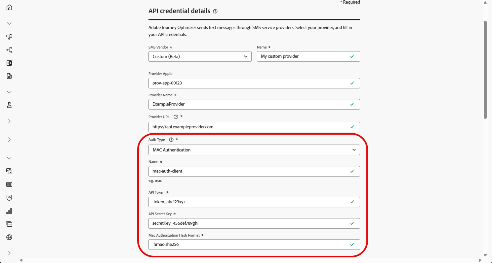

>[!TAB OAuth authentication]

Once your API credential is created, complete the fields required for OAuth authentication:

* **[!UICONTROL Name]**​: Enter a name for your OAuth authentication configuration.

* **[!UICONTROL API Token]**​: Enter the API Token provided by your SMS provider.

* **[!UICONTROL OAuth URL]**​: Enter the URL for obtaining the OAuth token.

* **[!UICONTROL OAuth Body]**​: Provide the OAuth request body in JSON format, including parameters such as `grant_type`, `client_id`, and `client_secret`.

>[!TAB JWT authentication]

Once your API credential is created, complete the fields required for JWT authentication:

* **[!UICONTROL Name]**​: Enter a name for your JWT authentication configuration.

* **[!UICONTROL API Token]**​: Enter the API Token provided by your SMS provider.

* **[!UICONTROL JWT Payload]**​: Enter the JSON payload containing the claims required for JWT, such as the issuer, subject, audience, and expiration.

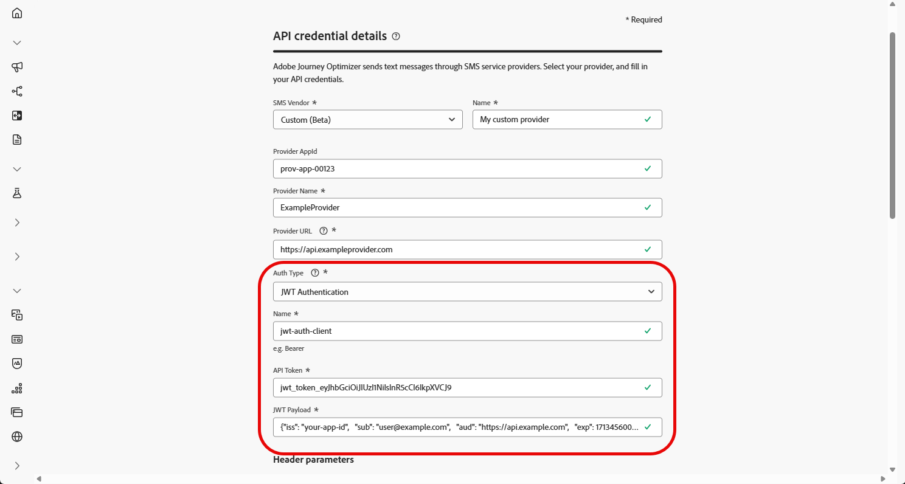

>[!ENDTABS]

## Create Webhook {#webhook}

>[!BEGINSHADEBOX]

If opt-in or opt-out keywords are not provided, standard consent messages are used to honor user privacy. Adding custom keywords automatically overrides the defaults.

**Default keywords:**

* **Opt-In**: SUBSCRIBE, YES, UNSTOP, START, CONTINUE, RESUME, BEGIN
* **Opt-Out**: STOP, QUIT, CANCEL, END, UNSUBSCRIBE, NO
* **Help**: HELP

>[!ENDSHADEBOX]

Once your API credentials have been successfully created, the next step is to create a webhook and configure your inbound settings. This configuration ensures that your system can properly receive and process incoming data or messages.

When setting up a webhook, you can define its purpose based on the type of data you want to capture:

* **[!UICONTROL Inbound]**: Use this option if you want to capture consent responses, such as opt-ins or opt-outs, and collect user preferences.

* **[!UICONTROL Feedback]**: Choose this option to track delivery and engagement events, including read receipts and user interactions, to support reporting and analysis.

>[!BEGINTABS]

>[!TAB Inbound]

1. In the left rail, navigate to **[!UICONTROL Administration]** `>` **[!UICONTROL Channels]**, select the **[!UICONTROL SMS Webhooks]** menu under **[!UICONTROL SMS settings]**, and click the **[!UICONTROL Create Webhook]** button.

    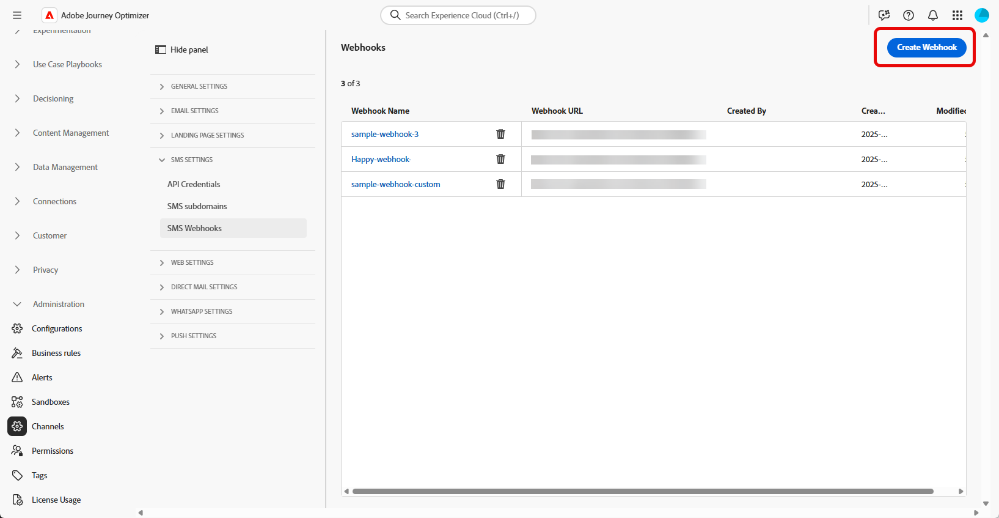

1. Configure your Webhook Settings, as detailed below:

    * **[!UICONTROL Name]**: Enter a name for your Webhook.

    * **[!UICONTROL Select SMS vendor]**: Custom.

    * **[!UICONTROL Type]**: Inbound.

    * **[!UICONTROL API credentials]**: Choose from the drop-down you [previously configured API credentials](#api-credential).

    * **[!UICONTROL Sender Phone Number ​]**: Enter the Sender phone number ​you want to use for your communications.
        
        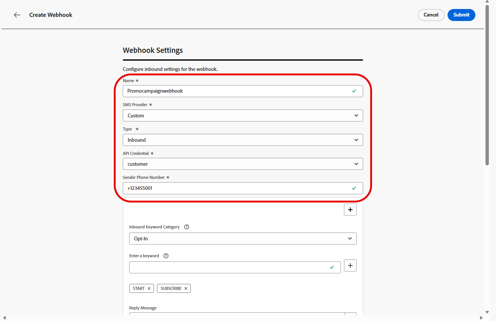

1. Click  to add your keywords categories, then, configure them as follows:

    * **[!UICONTROL Inbound Keyword Category]**: Choose your keyword categories either **[!UICONTROL Opt-In]**, **[!UICONTROL Opt-Out]**, **[!UICONTROL Help]** or **[!UICONTROL Default]**.

    * **[!UICONTROL Enter a keyword]**: Enter the default or custom keywords that will automatically trigger your message. Click  to add multiple keywords.

    * **[!UICONTROL Reply Message]**: Select from the drop-down the custom response that is automatically sent.

    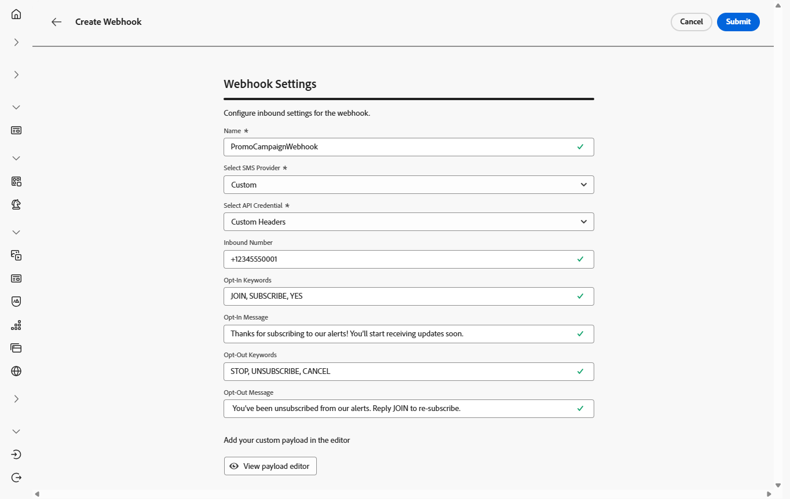

1. Click **[!UICONTROL View payload editor]** to validate and customize your request payloads. 
    
    You can dynamically personalize your payload using profile attributes, and ensure accurate data is sent for processing and response generation with the help of built-in helper functions.

1. Click **[!UICONTROL Submit]** when you finished the configuration of your Webhook.

1. In the **[!UICONTROL Webhooks]** menu, click the  to delete your Webhook.

1. To modify existing configuration, locate the desired Webhook and click the **[!UICONTROL Edit]** option to make the necessary changes.

1. Access and copy your new **[!UICONTROL Webhook URL]** from your previously submitted **[!UICONTROL Webhook]**.

    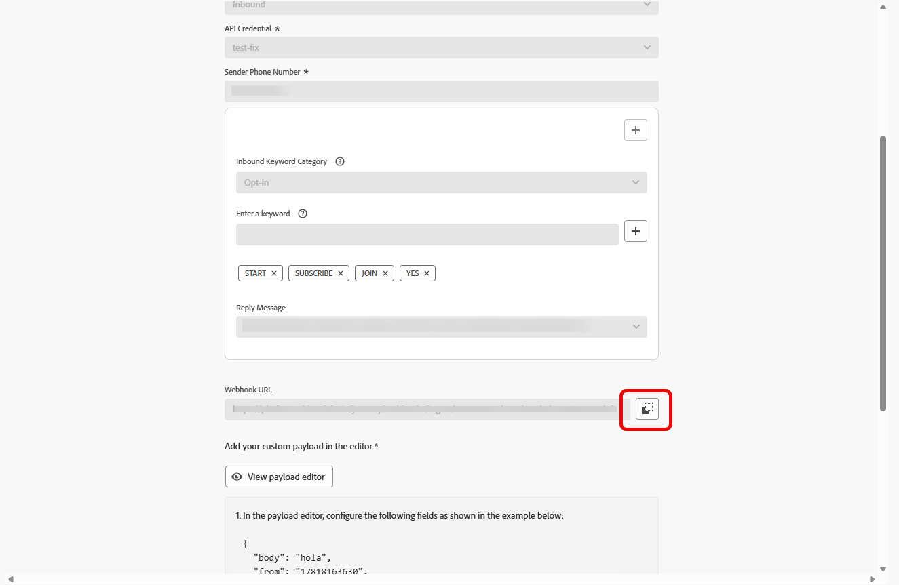

After creating and configuring the inbound settings for the Webhook, you now need to create a [channel configuration](sms-configuration-surface.md) for SMS messages. 

Once configured, you can leverage all out-of-the-box channel capabilities such as message authoring, personalization, link tracking, and reporting.

>[!TAB Feedback]

1. In the left rail, navigate to **[!UICONTROL Administration]** `>` **[!UICONTROL Channels]**, select the **[!UICONTROL SMS Webhooks]** menu under **[!UICONTROL SMS settings]**, and click the **[!UICONTROL Create Webhook]** button.

    

1. Configure your Webhook Settings, as detailed below:

    * **[!UICONTROL Name]**: Enter a name for your Webhook.

    * **[!UICONTROL Select SMS vendor]**: Custom.

    * **[!UICONTROL Type]**: Feedback.

    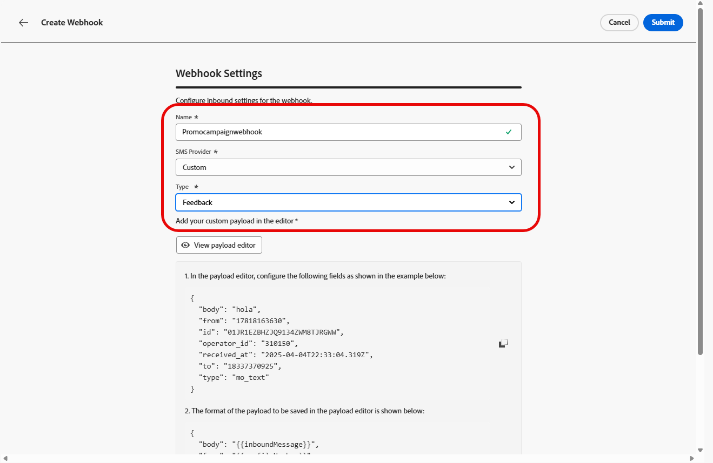

1. Click **[!UICONTROL View payload editor]** to validate and customize your request payloads. 
    
    You can dynamically personalize your payload using profile attributes, and ensure accurate data is sent for processing and response generation with the help of built-in helper functions.

1. Click **[!UICONTROL Submit]** when you finished the configuration of your Webhook.

1. In the **[!UICONTROL Webhooks]** menu, click the  to delete your Webhook.

1. To modify existing configuration, locate the desired Webhook and click the **[!UICONTROL Edit]** option to make the necessary changes.

1. Access and copy your new **[!UICONTROL Webhook URL]** from your previously submitted **[!UICONTROL Webhook]**.

    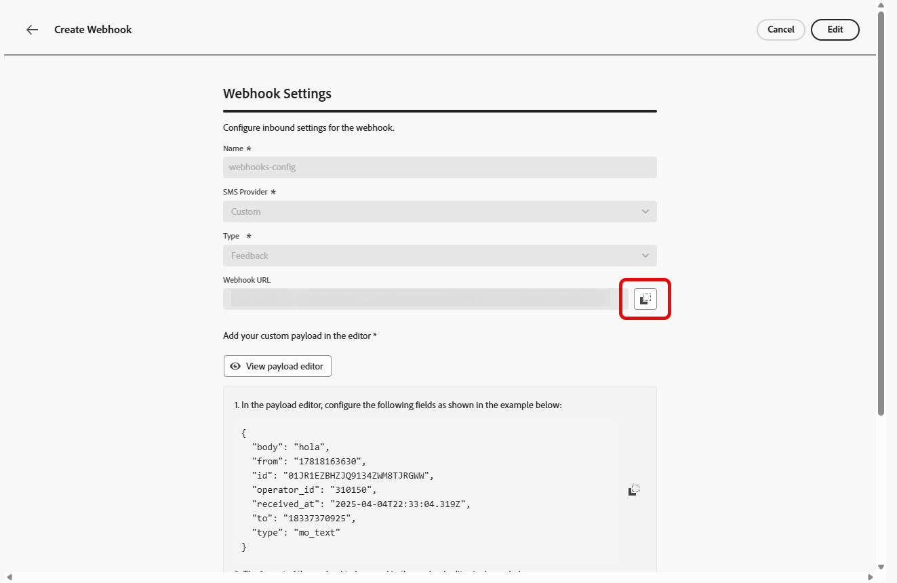

After creating and configuring the inbound settings for the Webhook, you now need to create a [channel configuration](sms-configuration-surface.md) for SMS messages. 

Once configured, you can leverage all out-of-the-box channel capabilities such as message authoring, personalization, link tracking, and reporting.

>[!ENDTABS]

## How-to video {#video}

>[!VIDEO](https://video.tv.adobe.com/v/3431625)

