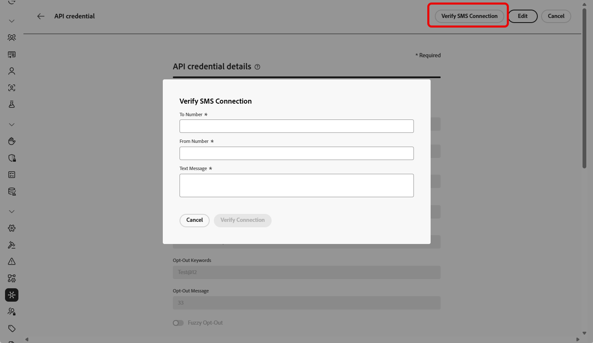

# Configure Sinch provider {#sms-configuration-sinch}

When using the Sinch provider with Journey Optimizer, you can find three distinct options:

* **SMS Configuration**: Set up your Sinch API credentials to send SMS messages seamlessly.

* **MMS Configuration**: For multimedia messaging (MMS), configure your Sinch MMS API credentials. Note that tracking and responding to inbound messages, are handled by the SMS configuration. MMS setup is only for outbound delivery of the MMS message.

* **RCS Configuration**: Set up your Sinch API credentials to send RCS messages seamlessly.

## Configure API credentials for SMS{#create-api}

>[!BEGINSHADEBOX]

If opt-in or opt-out keywords are not provided, standard consent messages are used to honor user privacy. Adding custom keywords automatically overrides the defaults.

**Default keywords:**

* **Opt-In**: SUBSCRIBE, YES, UNSTOP, START, CONTINUE, RESUME, BEGIN
* **Opt-Out**: STOP, QUIT, CANCEL, END, UNSUBSCRIBE, NO
* **Help**: HELP

>[!ENDSHADEBOX]

To configure your Sinch provider to send SMS messages and MMS with Journey Optimizer, follow these steps:

1. In the left rail, browse to **[!UICONTROL Administration]** > **[!UICONTROL Channels]** `>` **[!UICONTROL SMS Settings]** and select the **[!UICONTROL API Credentials]** menu. Click the **[!UICONTROL Create new API credentials]** button.

1. Configure your SMS API credentials, as detailed below:

    +++ List of SMS credentials for configuration

    |Configuration fields|Description|
    |---|---|    
    |SMS vendor|Sinch|
    |Name|Choose a name for your API Credential.|
    |Service ID and API Token|Access the APIs page, you can find your credentials under the SMS tab. Learn more in [Sinch Documentation](https://developers.sinch.com/docs/sms/getting-started/){target="_blank"}.|
    |Opt-In Keywords|Enter the default or custom keywords that will automatically trigger your Opt-In Message. For multiple keywords, use comma-separated values.|
    |Opt-In Message| Enter the custom response that is automatically sent as your Opt-In Message.|
    |Opt-Out Keywords| Enter the default or custom keywords that will automatically trigger your Opt-Out Message. For multiple keywords, use comma-separated values.|
    |Opt-Out Message|Enter the custom response that is automatically sent as your Opt-Out Message.|
    |Help Keywords| Enter the default or custom keywords that will automatically trigger your **Help Message**. For multiple keywords, use comma-separated values.|
    |Help Message|Enter the custom response that is automatically sent as your **Help Message**.|
    |Double Opt-In Keywords|Enter the keywords which trigger the double opt-in process. If a user profile does not exist, it is created upon successful confirmation. For multiple keywords, use comma-separated values. [Learn more about the SMS Double Opt-in](https://video.tv.adobe.com/v/3427129/?learn=on).|
    |Double Opt-In Message|Enter the custom response that is automatically sent in response to the double opt-in confirmation.|
    |Inbound Number|Add your unique inbound number or short code. This allows you to use the same API credentials across different sandboxes, each with its own inbound number or short code.|
    |Custom Inbound Keywords|Define unique keywords for specific actions, e.g. DISCOUNT, OFFERS, ENROLL. These keywords are captured and stored as attributes in the profile, allowing you to trigger a streaming segment qualification within the journey and deliver a customized response or action.|
    |Default Inbound Reply Message|Enter the default reply that is sent when a end user sends an inbound SMS that does not match any of the defined keywords.|
    |Override URL| Enter your custom URL to replace the default endpoints for SMS delivery reports, feedback data, inbound messages or event notifications. Sinch will send all relevant updates to this URL instead of the predefined ones.|

    +++

1. Enable the **[!UICONTROL Fuzzy Opt-out]** option to detect messages resembling opt-out keywords (e.g., 'CANCIL') and customize the confirmation reply in the **[!UICONTROL Fuzzy Auto Reply]** field. 

    **[!UICONTROL Fuzzy Opt-out]** identifies SMS messages that indicate a user wants to unsubscribe, even if the message does not exactly match a defined opt-out keyword. It can detect common opt-out phrases and certain offensive terms, helping ensure your campaigns respect user preferences and remain compliant.

1. Click **[!UICONTROL Submit]** when you finished the configuration of your API credentials.

1. In the **[!UICONTROL API Credentials]** menu, click the bin icon to delete your API credentials.

1. To modify existing credentials, locate the desired API credentials and click the **[!UICONTROL Edit]** option to make the necessary changes.

1. Click **[!UICONTROL Verify SMS connection]**, from your existing API credentials, to test and verify your SMS API credentials by sending a sample message to a designated device.

1. Fill in the **Number** and **Message** fields and click **[!UICONTROL Verify connection]**.

    >[!IMPORTANT]
    >
    >The message must be structured to align with the provider's payload format.

    

After creating and configuring your API credential, you now need to create a channel configuration for SMS messages. [Learn more](sms-configuration-surface.md)

## Configure API credentials for MMS{#sinch-mms}

>[!IMPORTANT]
>
> Along with MMS setup, you also need to create Sinch API credentials specifically for tracking inbound messages and managing consent requests.

To configure Sinch MMS to send MMS with Journey Optimizer, follow these steps:

1. In the left rail, browse to **[!UICONTROL Administration]** > **[!UICONTROL Channels]** `>` **[!UICONTROL SMS Settings]** and select the **[!UICONTROL API Credentials]** menu. Click the **[!UICONTROL Create new API credentials]** button.

1. Configure your MMS API credentials, as detailed below:

    * **[!UICONTROL SMS vendor]**: Sinch MMS.

    * **[!UICONTROL Name]**: choose a name for your API Credential.

    * **[!UICONTROL Project ID]**, **[!UICONTROL App ID]** and **[!UICONTROL API Token]**: follow the steps below to gather your MMS API credentials.

        * For **[!UICONTROL Project ID]** and **[!UICONTROL App ID]**: Access the [Conversation API Overview](https://dashboard.sinch.com/convapi/overview) page of your Sinch project on your Sinch Dashboard.
        * For **[!UICONTROL API Token]**: Obtain the [Access keys](https://community.sinch.com/t5/Customer-Dashboard/Sinch-Access-Keys/ta-p/12638) for your Sinch Project and generate a **Base64 API Token** out of your Sinch Project **Access keys**.

1. Click **[!UICONTROL Submit]** when you finished the configuration of your API credentials.

1. In the **[!UICONTROL API Credentials]** menu, click the bin icon to delete your API credentials.

1. To modify existing credentials, locate the desired API credentials and click the **[!UICONTROL Edit]** option to make the necessary changes.

After creating and configuring your API credential, you now need to create a channel configuration for MMS messages. [Learn more](sms-configuration-surface.md)

## Configure API credential for RCS

<!---->

RCS (Rich Communication Services) messaging is supported in Journey Optimizer through Sinch, allowing the sending of basic messages using verified business profiles with branding elements such as logos and sender names. 

Note that messages automatically fall back to SMS when the profile's device does not support RCS or is temporarily unreachable via RCS.

➡️ [Explore how Sinch supports RCS in Sinch documentation](https://sinch.com/blog/rcs-api-guide/)

To configure RCS with Sinch:

1. **Set up your branded RCS agent**

    Contact your Adobe representative to set up a branded RCS agent. [Learn more on branded RCS agent](https://community.sinch.com/t5/RCS/Getting-Started-with-RCS-using-Conversation-API/ta-p/17844)

1. **Set up your [Sinch API credentials](#create-api)**
    
    Once your RCS agent is approved, you need to set up your Sinch  API credentials, which include your access key, secret, and service plan ID. These credentials will be used by Journey Optimizer to authenticate and send messages through Sinch's platform.

1. **Create a [channel configuration](sms-configuration-surface.md) for your RCS messages**

    Configure a channel surface in Journey Optimizer by linking your Sinch credentials and defining the messaging parameters. This setup enables you to compose and send RCS messages from Journey Optimizer.

