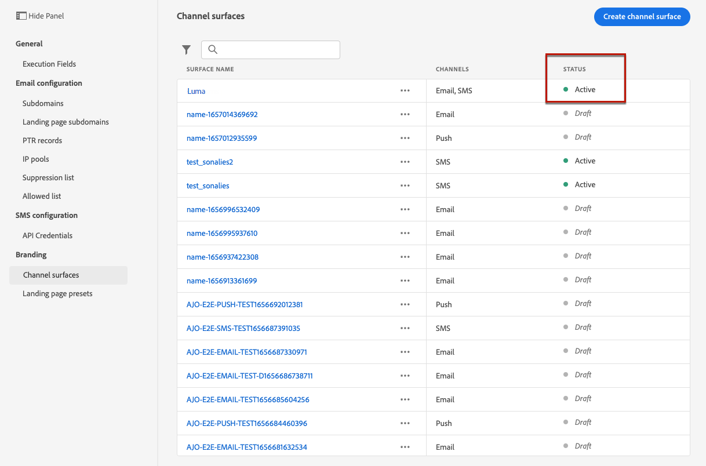

# Create a SMS/MMS configuration {#message-preset-sms}

>[!CONTEXTUALHELP]
>id="ajo_admin_surface_sms_type"
>title="Define the message category"
>abstract="Select the type of text messages using this configuration: Marketing for promotional messages, which require user consent, or Transactional for non-commercial messages, such as password reset."
>additional-url="https://experienceleague.adobe.com/docs/journey-optimizer/using/privacy/consent/opt-out.html#sms-opt-out-management" text="Opt-out in marketing text messages"

Once your SMS/MMS channel has been configured, you must create a channel configuration to be able to send SMS and MMS messages from **[!DNL Journey Optimizer]**. 

To create a channel configuration, follow these steps:

1. In the left rail, browse to **[!UICONTROL Administration]** > **[!UICONTROL Channels]** and select **[!UICONTROL General settings]** > **[!UICONTROL Channel configurations]**. Click the **[!UICONTROL Create channel configuration]** button.

    

1. Enter a name and a description (optional) for the configuration, then select the SMS channel.

    

    >[!NOTE]
    >
    > Names must begin with a letter (A-Z). It can only contain alpha-numeric characters. You can also use underscore `_`, dot`.` and hyphen `-` characters.

1. Define the **SMS settings**.

    

    Start by selecting the **[!UICONTROL SMS Type]** that will be sent with the configuration: **[!UICONTROL Transactional]** or **[!UICONTROL Marketing]**.

    * Choose **Marketing** for promotional text messages: these messages require user consent.
    * Choose **Transactional** for non-commercial messages such as order confirmation, password reset notifications, or delivery information for example.

    When creating a SMS/MMS, you must choose a valid channel configuration matching the category you selected for your message.

    >[!CAUTION]
    >
    >**Transactional** messages can be sent to profiles who unsubscribed from marketing communications. These messages can only be sent in specific contexts.
    
1. Select the **[!UICONTROL SMS configuration]** to associate with the configuration.
        
    For more on how to configure your environment to send SMS messages, refer to [this section](#create-api).

1. Enter the **[!UICONTROL Sender number]** ​you want to use for your communications.

1. Select your **[!UICONTROL SMS Execution Field]** to select the **[!UICONTROL Profile attribute]** associated with the profiles' phone numbers.

1. If you want to use the URL shortening function in your SMS messages, select an item from the **[!UICONTROL Subdomain]** list.

    >[!NOTE]
    >
    >To be able to select a subdomain, make sure you have previously configured at least one SMS/MMS subdomain. [Learn how](sms-subdomains.md)

1. Once all the parameters have been configured, click **[!UICONTROL Submit]** to confirm. You can also save the channel configuration as draft and resume its configuration later on.

    

1. Once the channel configuration has been created, it displays in the list with the **[!UICONTROL Processing]** status.

    >[!NOTE]
    >
    >If the checks are not successful, learn more on the possible failure reasons in [this section](#monitor-channel-surfaces).  

1. Once the checks are successful, the channel configuration gets the **[!UICONTROL Active]** status. It is ready to be used to deliver messages.

    

You are now ready to send text messages with Journey Optimizer.
