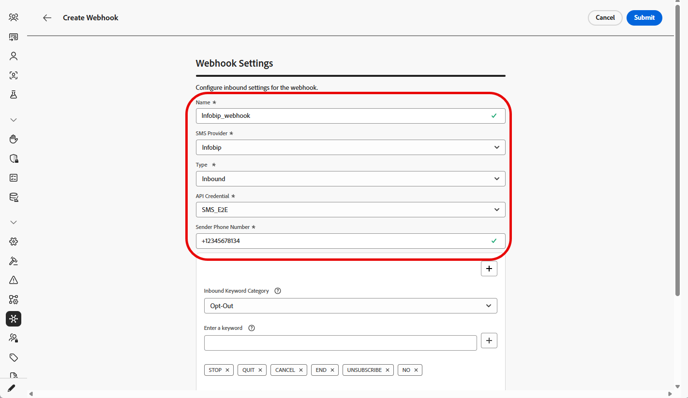
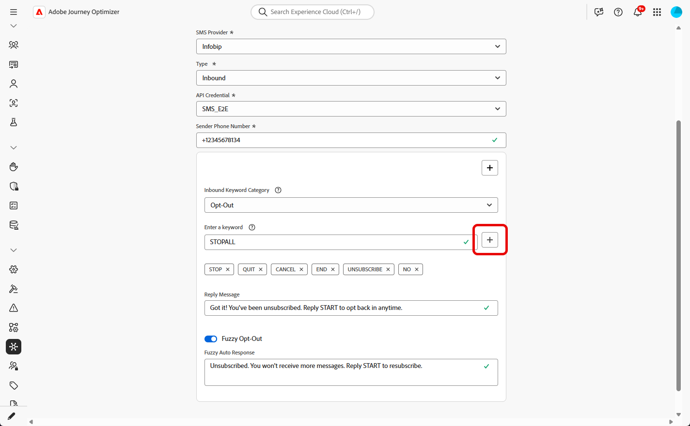
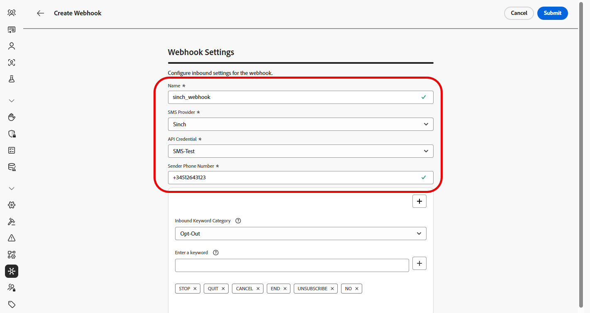
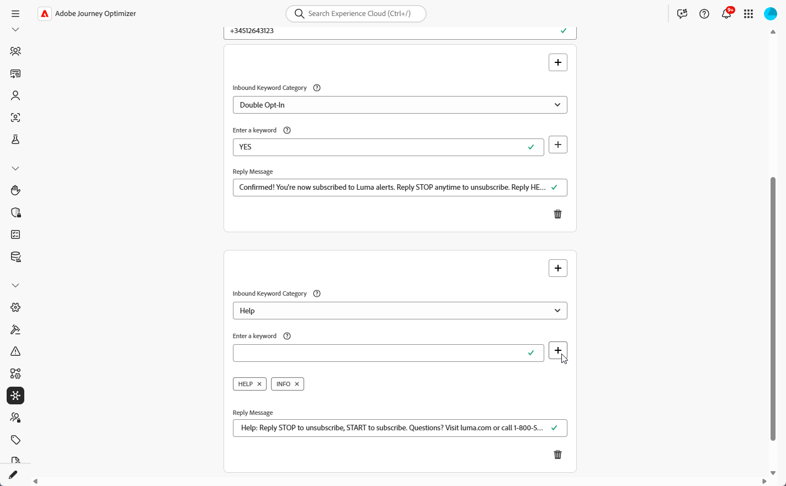

# Create Webhook {#webhook}

>[!BEGINSHADEBOX]

If opt-in or opt-out keywords are not provided, standard consent messages are used to honor user privacy. Adding custom keywords automatically overrides the defaults.

**Default keywords:**

* **Opt-In**: SUBSCRIBE, YES, UNSTOP, START, CONTINUE, RESUME, BEGIN
* **Opt-Out**: STOP, QUIT, CANCEL, END, UNSUBSCRIBE, NO
* **Help**: HELP

>[!ENDSHADEBOX]

Once your API credentials have been successfully created, you can now configure Webhooks to capture inbound responses for managing opt-in and opt-out consent, and to receive delivery reports such including read receipts where available.

When setting up a webhook, you can define its purpose based on the type of data you want to capture:

* **[!UICONTROL Inbound]**: Use this option if you want to capture consent responses, such as opt-ins or opt-outs, and collect user preferences.

* **[!UICONTROL Feedback]**: Choose this option to track delivery and engagement events, including read receipts and user interactions, to support reporting and analysis.

Browse through the tabs below depending on your SMS providers:

>[!BEGINTABS]

>[!TAB Custom]

1. In the left rail, navigate to **[!UICONTROL Administration]** `>` **[!UICONTROL Channels]**, select the **[!UICONTROL SMS Webhooks]** menu under **[!UICONTROL SMS settings]**, and click the **[!UICONTROL Create Webhook]** button.

    {zoomable="yes"}

1. Configure your Webhook Settings, as detailed below:

    * **[!UICONTROL Name]**: Enter a name for your Webhook.

    * **[!UICONTROL Select SMS vendor]**: Custom.

    * **[!UICONTROL Type]**: Inbound.

    * **[!UICONTROL API credentials]**: Choose from the drop-down you [previously configured API credentials](sms-configuration-custom.md#api-credential).

    * **[!UICONTROL Sender Phone Number ​]**: Enter the Sender phone number ​you want to use for your communications.
        
        {zoomable="yes"}

1. Click  to add your keywords categories, then, configure them depending on your SMS provider:

    * **[!UICONTROL Inbound Keyword Category]**: Choose your keyword categories either **[!UICONTROL Opt-In]**, **[!UICONTROL Opt-Out]**, **[!UICONTROL Double Opt-In]**, **[!UICONTROL Help]** or **[!UICONTROL Custom]**. 

    * **[!UICONTROL Enter a keyword]**: Enter the default or custom keywords that will automatically trigger your message. Click  to add multiple keywords.

        For **[!UICONTROL Custom keyword]**, use non-consent–related keywords for batch-based actions within a journey.

    * **[!UICONTROL Reply Message]**: Select from the drop-down the custom response that is automatically sent.

    * **[!UICONTROL Fuzzy Opt-out]**: Enable this option to send an automatic reply when a near-match opt-out keyword is detected.

    {zoomable="yes"}

1. Enter a **[!UICONTROL Default Reply Message]** automatically sent when an inbound message does not match any configured keyword or category.

1. Click **[!UICONTROL View payload editor]** to validate and customize your request payloads. 
    
    You can dynamically personalize your payload using profile attributes, and ensure accurate data is sent for processing and response generation with the help of built-in helper functions.

1. Click **[!UICONTROL Submit]** when you finished the configuration of your Webhook.

1. To create a **[!UICONTROL Feedback]** webhook, follow the same steps as above, selecting **[!UICONTROL Feedback]** as your webhook **[!UICONTROL Type]**.

1. From the **[!UICONTROL Webhooks]** menu, you can edit or delete existing webhooks, or access and copy the **[!UICONTROL Webhook URL]** for integration with your SMS provider.

    {zoomable="yes"}

After creating and configuring the settings for the Webhook, you now need to create a [channel configuration](sms-configuration-surface.md) for SMS messages. 

Once configured, you can leverage all out-of-the-box channel capabilities such as message authoring, personalization, link tracking, and reporting.

>[!TAB Infobip]

1. In the left rail, navigate to **[!UICONTROL Administration]** `>` **[!UICONTROL Channels]**, select the **[!UICONTROL SMS Webhooks]** menu under **[!UICONTROL SMS settings]**, and click the **[!UICONTROL Create Webhook]** button.

    {zoomable="yes"}

1. Configure your Webhook Settings, as detailed below:

    * **[!UICONTROL Name]**: Enter a name for your Webhook.

    * **[!UICONTROL Select SMS vendor]**: Infobip.

    * **[!UICONTROL Type]**: Inbound.

    * **[!UICONTROL API credentials]**: Choose from the drop-down you [previously configured API credentials](sms-configuration-infobip.md#api-credential).

    * **[!UICONTROL Sender Phone Number ​]**: Enter the Sender phone number ​you want to use for your communications.
        
        {zoomable="yes"}

1. Click  to add your keywords categories, then, configure them depending on your SMS provider:

    * **[!UICONTROL Inbound Keyword Category]**: Choose your keyword categories either **[!UICONTROL Opt-In]**, **[!UICONTROL Opt-Out]**, **[!UICONTROL Double Opt-In]**, **[!UICONTROL Help]** or **[!UICONTROL Custom]**. 

    * **[!UICONTROL Enter a keyword]**: Enter the default or custom keywords that will automatically trigger your message. Click  to add multiple keywords.

        For **[!UICONTROL Custom keyword]**, use non-consent–related keywords for batch-based actions within a journey.

    * **[!UICONTROL Reply Message]**: Select from the drop-down the custom response that is automatically sent.

    * **[!UICONTROL Fuzzy Opt-out]**: Enable this option to send an automatic reply when a near-match opt-out keyword is detected.

    {zoomable="yes"}

1. Enter a **[!UICONTROL Default Reply Message]** automatically sent when an inbound message does not match any configured keyword or category.

1. Click **[!UICONTROL Submit]** when you finished the configuration of your Webhook.

1. To create a **[!UICONTROL Feedback]** webhook, follow the same steps as above, selecting **[!UICONTROL Feedback]** as your webhook **[!UICONTROL Type]**.

1. From the **[!UICONTROL Webhooks]** menu, you can edit or delete existing webhooks, or access and copy the **[!UICONTROL Webhook URL]** for integration with your SMS provider.

    {zoomable="yes"}

After creating and configuring the inbound settings for the Webhook, you now need to create a [channel configuration](sms-configuration-surface.md) for SMS messages. 

Once configured, you can leverage all out-of-the-box channel capabilities such as message authoring, personalization, link tracking, and reporting.

>[!TAB Sinch]

1. In the left rail, navigate to **[!UICONTROL Administration]** `>` **[!UICONTROL Channels]**, select the **[!UICONTROL SMS Webhooks]** menu under **[!UICONTROL SMS settings]**, and click the **[!UICONTROL Create Webhook]** button.

    {zoomable="yes"}

1. Configure your Webhook Settings, as detailed below:

    * **[!UICONTROL Name]**: Enter a name for your Webhook.

    * **[!UICONTROL Select SMS vendor]**: Sinch.

    * **[!UICONTROL Type]**: Inbound.

    * **[!UICONTROL API credentials]**: Choose from the drop-down you [previously configured API credentials](sms-configuration-sinch.md#create-api).

    * **[!UICONTROL Sender Phone Number ​]**: Enter the Sender phone number ​you want to use for your communications.
        
        {zoomable="yes"}

1. Click  to add your keywords categories, then, configure them depending on your SMS provider:

    * **[!UICONTROL Inbound Keyword Category]**: Choose your keyword categories either **[!UICONTROL Opt-In]**, **[!UICONTROL Opt-Out]**, **[!UICONTROL Double Opt-In]**, **[!UICONTROL Help]** or **[!UICONTROL Custom]**. 

    * **[!UICONTROL Enter a keyword]**: Enter the default or custom keywords that will automatically trigger your message. Click  to add multiple keywords.

        For **[!UICONTROL Custom keyword]**, use non-consent–related keywords for batch-based actions within a journey.

    * **[!UICONTROL Reply Message]**: Select from the drop-down the custom response that is automatically sent.

    * **[!UICONTROL Fuzzy Opt-out]**: Enable this option to send an automatic reply when a near-match opt-out keyword is detected.

    {zoomable="yes"}

1. Enter a **[!UICONTROL Default Reply Message]** automatically sent when an inbound message does not match any configured keyword or category.

1. Click **[!UICONTROL Submit]** when you finished the configuration of your Webhook.

1. In the **[!UICONTROL Webhooks]** menu, click the  to delete your Webhook.

1. To modify existing configuration, locate the desired Webhook and click the **[!UICONTROL Edit]** option to make the necessary changes.

1. Access and copy your new **[!UICONTROL Webhook URL]** from your previously submitted **[!UICONTROL Webhook]**.

    {zoomable="yes"}

After creating and configuring the inbound settings for the Webhook, you now need to create a [channel configuration](sms-configuration-surface.md) for SMS messages. 

Once configured, you can leverage all out-of-the-box channel capabilities such as message authoring, personalization, link tracking, and reporting.

<!--
>[!TAB Twilio]

1. In the left rail, navigate to **[!UICONTROL Administration]** `>` **[!UICONTROL Channels]**, select the **[!UICONTROL SMS Webhooks]** menu under **[!UICONTROL SMS settings]**, and click the **[!UICONTROL Create Webhook]** button.

    {zoomable="yes"}

1. Configure your Webhook Settings, as detailed below:

    * **[!UICONTROL Name]**: Enter a name for your Webhook.

    * **[!UICONTROL Select SMS vendor]**: Twilio.

    * **[!UICONTROL Type]**: Inbound.

    * **[!UICONTROL API credentials]**: Choose from the drop-down you [previously configured API credentials](sms-configuration-twilio.md#create-api).

    * **[!UICONTROL Sender Phone Number ​]**: Enter the Sender phone number ​you want to use for your communications.
        
1. Click  to add your keywords categories, then, configure them depending on your SMS provider:

    * **[!UICONTROL Inbound Keyword Category]**: Choose your keyword categories either **[!UICONTROL Opt-In]**, **[!UICONTROL Opt-Out]**, **[!UICONTROL Double Opt-In]**, **[!UICONTROL Help]** or **[!UICONTROL Custom]**. 

    * **[!UICONTROL Enter a keyword]**: Enter the default or custom keywords that will automatically trigger your message. Click  to add multiple keywords.

        For **[!UICONTROL Custom keyword]**, use non-consent–related keywords for batch-based actions within a journey.

    * **[!UICONTROL Reply Message]**: Select from the drop-down the custom response that is automatically sent.

    * **[!UICONTROL Fuzzy Opt-out]**: Enable this option to send an automatic reply when a near-match opt-out keyword is detected.

1. Enter a **[!UICONTROL Default Reply Message]** automatically sent when an inbound message does not match any configured keyword or category.

1. Click **[!UICONTROL Submit]** when you finished the configuration of your Webhook.

1. In the **[!UICONTROL Webhooks]** menu, click the  to delete your Webhook.

1. To modify existing configuration, locate the desired Webhook and click the **[!UICONTROL Edit]** option to make the necessary changes.

1. Access and copy your new **[!UICONTROL Webhook URL]** from your previously submitted **[!UICONTROL Webhook]**.

After creating and configuring the inbound settings for the Webhook, you now need to create a [channel configuration](sms-configuration-surface.md) for SMS messages. 

Once configured, you can leverage all out-of-the-box channel capabilities such as message authoring, personalization, link tracking, and reporting.
-->

>[!ENDTABS]

## How-to video {#video}

>[!VIDEO](https://video.tv.adobe.com/v/3431625)
