# Create Webhook {#webhook}

>[!CONTEXTUALHELP]
>id="ajo_channels_sms_webhook_settings_create"
>title="Create an SMS Webhook"
>abstract="You can configure Webhooks to capture inbound responses for managing opt-in and opt-out consent, and to receive delivery reports including read receipts where available."


>[!CONTEXTUALHELP]
>id="ajo_admin_sms_webhook_flow_type"
>title="Choose your Webhook Type"
>abstract="When setting up a webhook, choose **Inbound** to capture consent responses and user preferences, or **[!UICONTROL Feedback]** to track delivery and engagement events for reporting and analysis."

>[!BEGINSHADEBOX]

When new API credentials are created in Journey Optimizer, SMS webhooks are now the way to capture both inbound keywords and feedback events like deliveries and errors. Because each provider has different capabilities, there are separate instructions to enable webhooks.
With webhooks now supporting Custom provider, it is now possible to gather feedback and inbound keyword collection from any provider to be reported and acted upon in Journey Optimizer.

* **New customers:** The instructions here can be followed to configure SMS webhooks correctly.

* **Existing customers:** You can migrate from information stored in API Credentials to Webhooks and there is no timeline for customers to migrate. For existing customers that do want to migrate to SMS Webhooks, the migration steps need to be performed as documented in the migration guide.

>[!ENDSHADEBOX]

## Overview {#overview}

Once your API credentials have been successfully created, you can now configure webhooks to capture inbound responses for managing opt-in and opt-out consent, and to receive delivery reports including read receipts where available.

When setting up a webhook, you can define its purpose based on the type of data you want to capture:

* **Inbound**: Use this option if you want to capture consent responses, such as opt-ins or opt-outs, and collect user preferences.

* **Feedback**: Choose this option to track delivery and engagement events, including deliveries, outbound errors, read receipts (if applicable) to support reporting and analysis.

Depending on your provider, there will be different expectations on what needs to be set up to have a successful SMS implementation:

* **Sinch and Sinch Conversational**: Create one webhook that handles both inbound and feedback events. No payload configuration is required.

* **Infobip**: Create two separate webhooks, one for inbound events and one for feedback events. No payload configuration is required for either webhook.

* **Twilio**: Webhooks are not available. Inbound and feedback data collection is not supported.

* **Custom provider**: Create two separate webhooks, one for inbound events and one for feedback events. Payload configuration is required for both webhooks to function properly.

### Provider support {#provider-support}

>[!NOTE]
>
>The only webhook format supported is JSON. Form-data for webhooks is not supported.

The following table shows which providers support inbound and feedback webhooks, and whether payload creation is required:

| Provider | Inbound Webhook | Feedback Webhook | Keywords | Payload Creation Needed | Webhook Needed | Payload Creation |
| --- | --- | --- | --- | --- | --- | --- |
| Infobip | Configurable | Configurable | Configurable | Not Required | Required | Not Required |
| Sinch | Configurable | Configurable | Configurable | Not Required | No. Integrated | N/A |
| Sinch Conversational | Configurable | Configurable | Configurable | Not Required | No. Integrated | N/A |
| Twilio | Not Available | Not Available | Not Available | Not Available | Not Available | N/A |
| Custom | Configurable | Configurable | Configurable | Required | Required | Required |

For customers moving from API credentials to SMS webhooks, information about the migration path is found in the migration guide.

## Create webhook 

### For Sinch and Sinch Conversational {#create-webhook-sinch}

For Sinch and Sinch Conversational, create a single webhook that handles both inbound and feedback events. No custom payload configuration is required.

1. In the left rail, navigate to **[!UICONTROL Administration]** `>` **[!UICONTROL Channels]**, select the **[!UICONTROL SMS Webhooks]** menu under **[!UICONTROL SMS settings]**, and click the **[!UICONTROL Create Webhook]** button.

    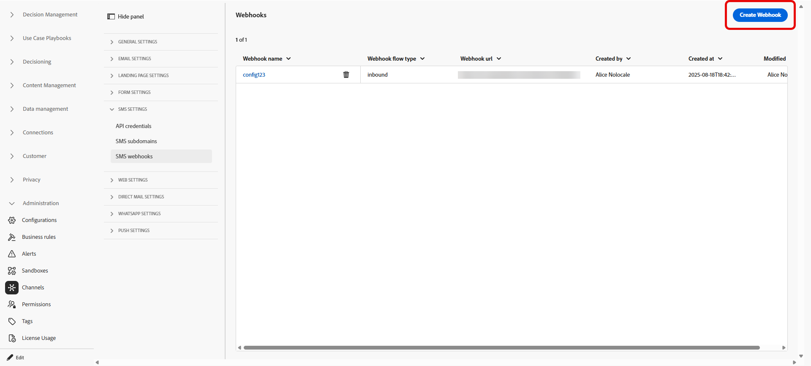

1. Configure your webhook settings, as detailed below:

    * **[!UICONTROL Name]**: Enter a name for your webhook.

    * **[!UICONTROL Select SMS vendor]**: Sinch or Sinch Conversational.

    * **[!UICONTROL API credentials]**: Choose from the drop-down you [previously configured API credentials](sms-configuration-sinch.md).

    * **[!UICONTROL Sender Phone Number]**: Enter the sender phone number you want to use for your communications.

    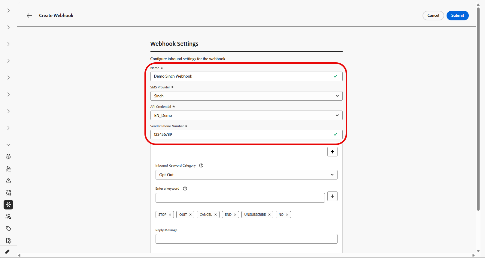

1. Start setting up the inbound keywords by entering keywords in the **[!UICONTROL Enter a Keyword]** field. Multiple keywords can be added and removed. Note that keywords are not case sensitive.

    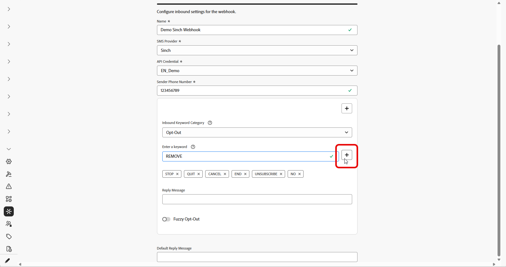

1. Select a keyword category from the **[!UICONTROL Inbound Keyword Category]** drop-down to configure:

    +++ Opt-In

    * Enable keywords that opt in users with their consent. When a user's message matches a configured keyword, their phone number is opted in to receive SMS messages.

    * By default, the following keywords are enabled: Subscribe, Yes, Unstop, Continue, Resume, and Begin. Remove any default keywords by clicking .

    * Use the **[!UICONTROL Reply Message]** field to create a message that is automatically sent when a user's inbound message matches an Opt-In keyword.

    +++

    +++ Opt-Out

    * Enable keywords that opt out users and remove consent to send text messages. When a user's message matches a configured keyword, their phone number is opted out from receiving SMS messages.

    * By default, the following keywords are enabled: Stop, Quit, Cancel, End, Unsubscribe, No. Remove any default keywords by clicking .

    * Use the **[!UICONTROL Reply Message]** field to create a message that is automatically sent when a user's inbound message matches an Opt-Out keyword.

    * Enable **[!UICONTROL Fuzzy Logic]** to detect similar keywords to configured Opt-Out keywords. If a user's response is close but not exact, the message entered in the **[!UICONTROL Fuzzy Auto Response]** field is sent. Typically, this message indicates the opt-out did not occur and specifies the exact keyword needed to unsubscribe.

    +++

    +++ Double Opt-In

    * Enable keywords for the double opt-in requirement. When a user's message matches a configured keyword, they are not fully opted-in at this stage. This two-step consent workflow requires users to confirm their opt-in with a second keyword.

    * Use the **[!UICONTROL Reply Message]** field to create a message that is automatically sent when a double opt-in keyword is matched. This message instructs the user to enter an Opt-In keyword to complete the opt-in process.

    +++

    +++ Help

    * Enable keywords that provide a standard response when help is requested. When a user's message matches a configured keyword, they receive the Help reply message.

    * By default, the following keywords are enabled: Help, Info, Information. Remove any default keywords by clicking .

    * Use the **[!UICONTROL Reply Message]** field to create a message that is automatically sent when a user's inbound message matches a Help keyword.

    +++

    +++ Custom

    * Configure a single custom keyword. When a user's message matches this keyword, the keyword is written to the **[!UICONTROL Message Feedback tracking]** dataset for reporting and audience building.

    * Build an Audience (streaming or batch) that references this keyword for use in your journeys and campaigns.

    +++

1. Enter a **[!UICONTROL Default Reply Message]**. This message is automatically sent when a user's response does not match any configured keyword.

    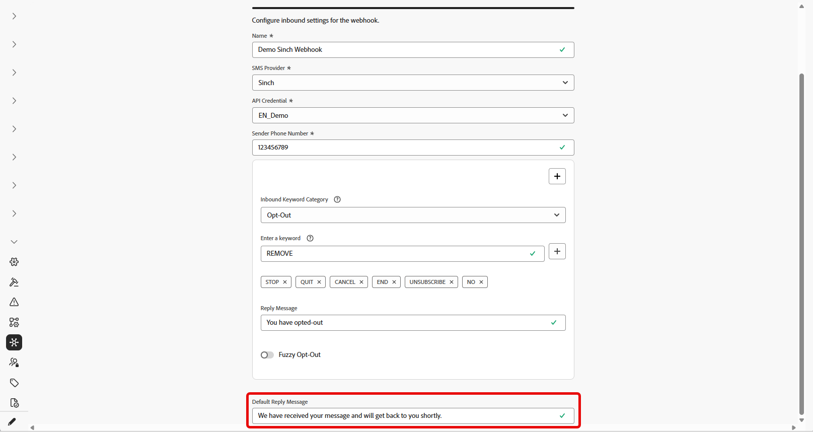

1. Click **[!UICONTROL Submit]** to save your webhook configuration.

1. From the **[!UICONTROL Webhooks]** menu, you can edit or delete existing webhooks.

1. Access your newly created Webhook and copy the **[!UICONTROL Webhook URL]**.

    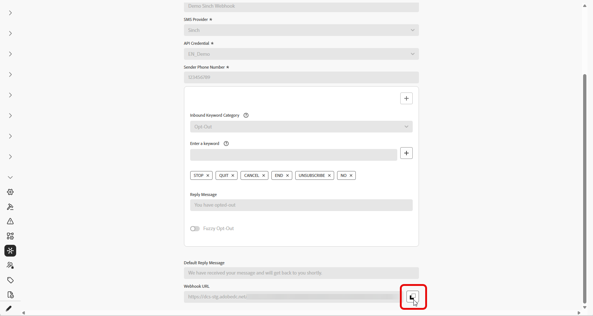

1. Use your **[!UICONTROL Webhook URL]** to enable the **Feedback** and **Inbound** events to come into Journey Optimizer.

    * For the SMS channel, [learn more in Sinch documentation](https://community.sinch.com/t5/SMS/How-do-I-assign-a-callback-URL-to-an-SMS-service/ta-p/8414)

    * For the MMS channel, [learn more in Sinch documentation](https://developers.sinch.com/docs/conversation/getting-started#5-handle-incoming-messages)

    * For customers who purchased SMS directly via Journey Optimizer, file a Support ticket with Adobe support. The Adobe account team will configure the webhook URL for you.
    

If your webhook uses API credentials attached to an existing channel configuration, the webhook takes effect immediately. Otherwise, create a new channel configuration.

➡️[Learn more on channel configuration](sms-configuration-surface.md)

### For Infobip {#create-webhook-infobip}

For Infobip, create two separate webhooks: one for Feedback events and one for Inbound events.

1. In the left rail, navigate to **[!UICONTROL Administration]** `>` **[!UICONTROL Channels]**, select the **[!UICONTROL SMS Webhooks]** menu under **[!UICONTROL SMS settings]**, and click the **[!UICONTROL Create Webhook]** button.

    

1. Configure your webhook settings, as detailed below:

    * **[!UICONTROL Name]**: Enter a name for your webhook.

    * **[!UICONTROL Select SMS vendor]**: Infobip.

    * **[!UICONTROL Type]**: Choose either Feedback or Inbound. You need to create both separately, here, we start with Inbound.

    * **[!UICONTROL API credentials]**: Choose from the drop-down you [previously configured API credentials](sms-configuration-infobip.md#api-credential).

    * **[!UICONTROL Sender Phone Number]**: Enter the sender phone number you want to use for your communications.

    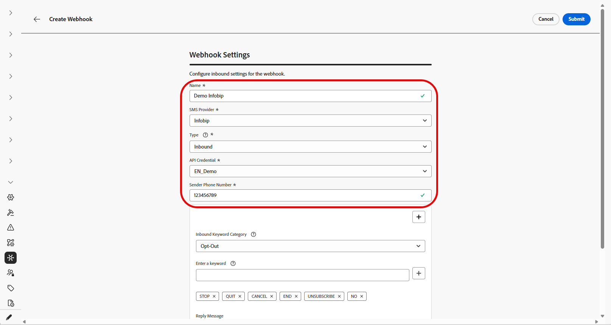

1. Start setting up the inbound keywords by entering keywords in the **[!UICONTROL Enter a Keyword]** field. Multiple keywords can be added and removed. Note that keywords are not case sensitive.

    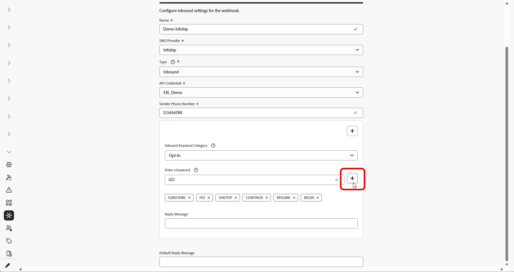

1. Select a keyword category from the **[!UICONTROL Inbound Keyword Category]** drop-down to configure:

    +++ Opt-In

    * Enable keywords that opt in users with their consent. When a user's message matches a configured keyword, their phone number is opted in to receive SMS messages.

    * By default, the following keywords are enabled: Subscribe, Yes, Unstop, Continue, Resume, and Begin. Remove any default keywords by clicking .

    * Use the **[!UICONTROL Reply Message]** field to create a message that is automatically sent when a user's inbound message matches an Opt-In keyword.

    +++

    +++ Opt-Out

    * Enable keywords that opt out users and remove consent to send text messages. When a user's message matches a configured keyword, their phone number is opted out from receiving SMS messages.

    * By default, the following keywords are enabled: Stop, Quit, Cancel, End, Unsubscribe, No. Remove any default keywords by clicking .

    * Use the **[!UICONTROL Reply Message]** field to create a message that is automatically sent when a user's inbound message matches an Opt-Out keyword.

    * Enable **[!UICONTROL Fuzzy Logic]** to detect similar keywords to configured Opt-Out keywords. If a user's response is close but not exact, the message entered in the **[!UICONTROL Fuzzy Auto Response]** field is sent. Typically, this message indicates the opt-out did not occur and specifies the exact keyword needed to unsubscribe.

    +++

    +++ Double Opt-In

    * Enable keywords for the double opt-in requirement. When a user's message matches a configured keyword, they are not fully opted-in at this stage. This two-step consent workflow requires users to confirm their opt-in with a second keyword.

    * Use the **[!UICONTROL Reply Message]** field to create a message that is automatically sent when a double opt-in keyword is matched. This message instructs the user to enter an Opt-In keyword to complete the opt-in process.

    +++

    +++ Help

    * Enable keywords that provide a standard response when help is requested. When a user's message matches a configured keyword, they receive the Help reply message.

    * By default, the following keywords are enabled: Help, Info, Information. Remove any default keywords by clicking .

    * Use the **[!UICONTROL Reply Message]** field to create a message that is automatically sent when a user's inbound message matches a Help keyword.

    +++

    +++ Custom

    * Configure a single custom keyword. When a user's message matches this keyword, the keyword is written to the **[!UICONTROL Message Feedback tracking]** dataset for reporting and audience building.

    * Build an Audience (streaming or batch) that references this keyword for use in your journeys and campaigns.

    +++

1. Enter a **[!UICONTROL Default Reply Message]**. This message is automatically sent when a user's response does not match any configured keyword.

    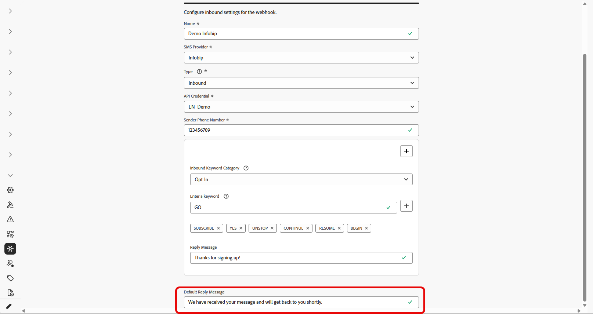

1. Click **[!UICONTROL Submit]** to save your webhook configuration.

1. In the **[!UICONTROL Webhooks]** menu, you now need to create a **Feedback** webhook for Infobip.

1. Configure your webhook settings, as detailed below:

    * **[!UICONTROL Name]**: Enter a name for your webhook.

    * **[!UICONTROL Select SMS vendor]**: Infobip.

    * **[!UICONTROL Type]**: Choose Feedback.

    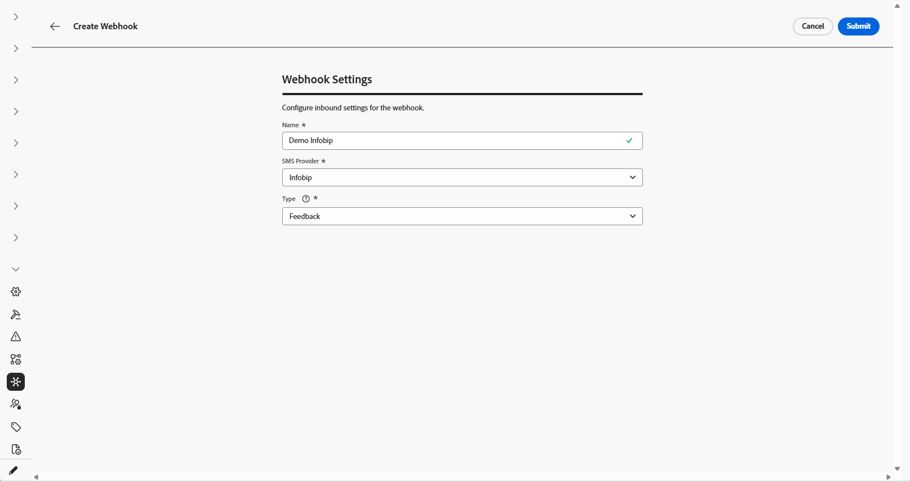

1. Click **[!UICONTROL Submit]** to save your Feedback webhook configuration.

1. From the **[!UICONTROL Webhooks]** menu, you can edit or delete existing webhooks.

1. Access your newly created Webhooks and copy the **[!UICONTROL Webhook URL]** from each of your Webhooks.

    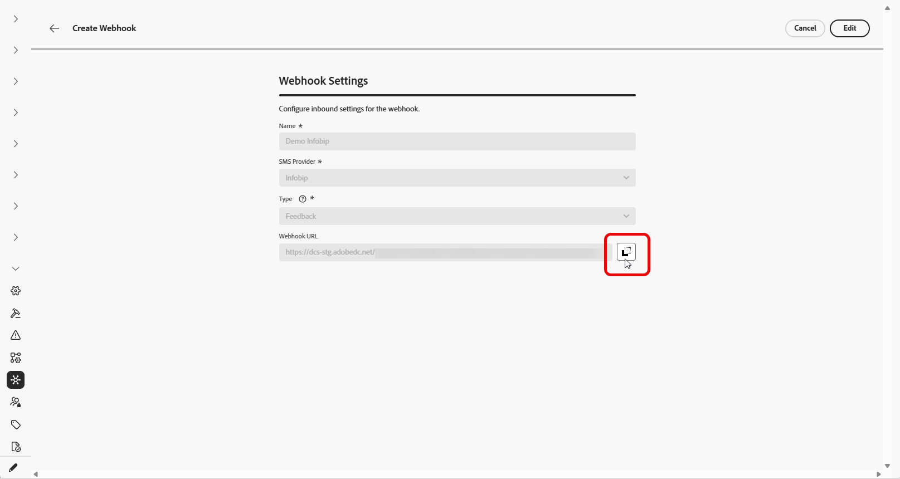

1. You can now use those URLs to enable both Callback URLs to bring Feedback and Inbound events into Journey Optimizer.

If your webhook uses API credentials attached to an existing channel configuration, the webhook takes effect immediately. Otherwise, create a new channel configuration.

➡️[Learn more on channel configuration](sms-configuration-surface.md)

### For custom provider {#create-webhook-custom}

For Custom SMS providers, create two separate webhooks: one for Feedback events and one for Inbound events.

1. In the left rail, navigate to **[!UICONTROL Administration]** `>` **[!UICONTROL Channels]**, select the **[!UICONTROL SMS Webhooks]** menu under **[!UICONTROL SMS settings]**, and click the **[!UICONTROL Create Webhook]** button.

    

1. Configure your webhook settings, as detailed below:

    * **[!UICONTROL Name]**: Enter a name for your webhook.

    * **[!UICONTROL Select SMS vendor]**: Custom.

    * **[!UICONTROL Type]**: Choose either Feedback or Inbound. You need to create both separately, here, we start with Inbound.

    * **[!UICONTROL API credentials]**: Choose from the drop-down you [previously configured API credentials](sms-configuration-custom.md).

    * **[!UICONTROL Sender Phone Number]**: Enter the sender phone number you want to use for your communications.

    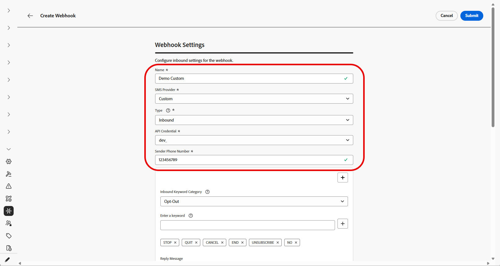

1. Start setting up the inbound keywords by entering keywords in the **[!UICONTROL Enter a Keyword]** field. Multiple keywords can be added and removed. Note that keywords are not case sensitive.

    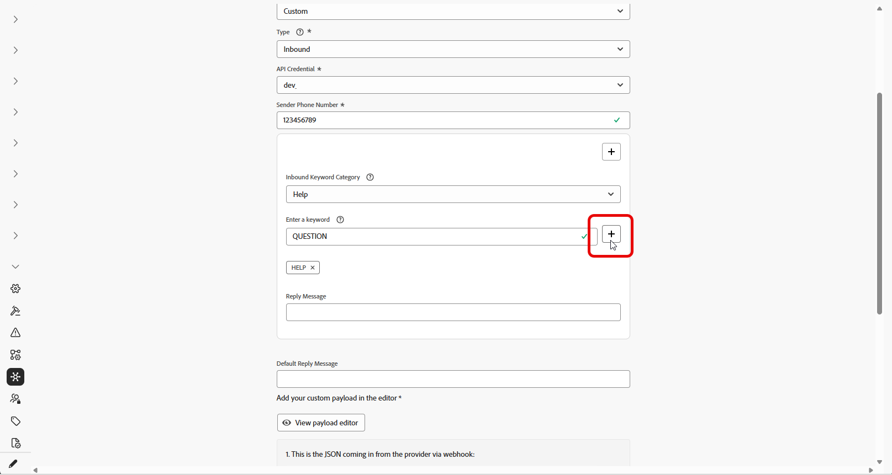

1. Select a keyword category from the **[!UICONTROL Inbound Keyword Category]** drop-down to configure:

    +++ Opt-In

    * Enable keywords that opt in users with their consent. When a user's message matches a configured keyword, their phone number is opted in to receive SMS messages.

    * By default, the following keywords are enabled: Subscribe, Yes, Unstop, Continue, Resume, and Begin. Remove any default keywords by clicking .

    * Use the **[!UICONTROL Reply Message]** field to create a message that is automatically sent when a user's inbound message matches an Opt-In keyword.

    +++

    +++ Opt-Out

    * Enable keywords that opt out users and remove consent to send text messages. When a user's message matches a configured keyword, their phone number is opted out from receiving SMS messages.

    * By default, the following keywords are enabled: Stop, Quit, Cancel, End, Unsubscribe, No. Remove any default keywords by clicking .

    * Use the **[!UICONTROL Reply Message]** field to create a message that is automatically sent when a user's inbound message matches an Opt-Out keyword.

    * Enable **[!UICONTROL Fuzzy Logic]** to detect similar keywords to configured Opt-Out keywords. If a user's response is close but not exact, the message entered in the **[!UICONTROL Fuzzy Auto Response]** field is sent. Typically, this message indicates the opt-out did not occur and specifies the exact keyword needed to unsubscribe.

    +++

    +++ Double Opt-In

    * Enable keywords for the double opt-in requirement. When a user's message matches a configured keyword, they are not fully opted-in at this stage. This two-step consent workflow requires users to confirm their opt-in with a second keyword.

    * Use the **[!UICONTROL Reply Message]** field to create a message that is automatically sent when a double opt-in keyword is matched. This message instructs the user to enter an Opt-In keyword to complete the opt-in process.

    +++

    +++ Help

    * Enable keywords that provide a standard response when help is requested. When a user's message matches a configured keyword, they receive the Help reply message.

    * By default, the following keywords are enabled: Help, Info, Information. Remove any default keywords by clicking .

    * Use the **[!UICONTROL Reply Message]** field to create a message that is automatically sent when a user's inbound message matches a Help keyword.

    +++

    +++ Custom

    * Configure a single custom keyword. When a user's message matches this keyword, the keyword is written to the **[!UICONTROL Message Feedback tracking]** dataset for reporting and audience building.

    * Build an Audience (streaming or batch) that references this keyword for use in your journeys and campaigns.

    +++

1. Enter a **[!UICONTROL Default Reply Message]**. This message is automatically sent when a user's response does not match any configured keyword.

    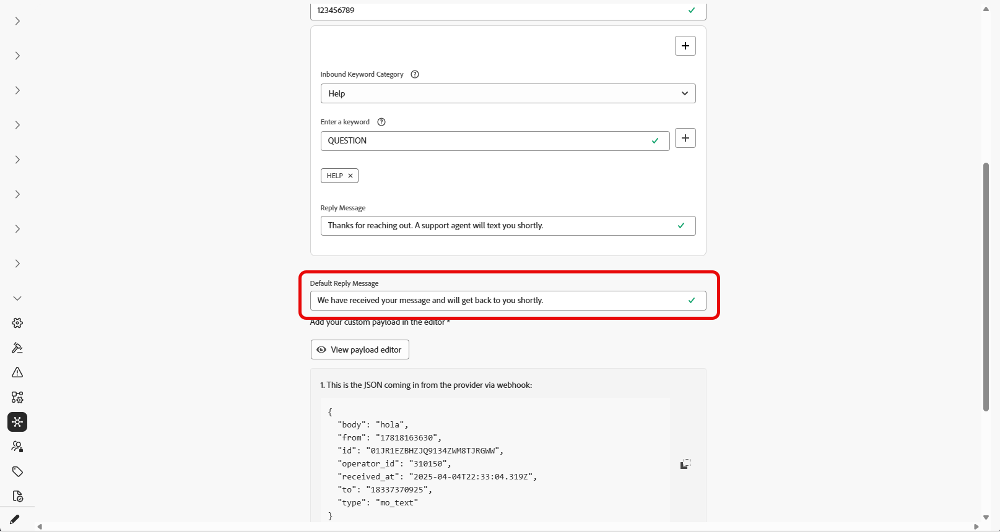

1. Create a custom payload that matches the JSON coming from the provider. Note that the only webhook format supported is JSON. Form-data for webhooks is not supported.

    The inbound webhook requires the following fields to receive values from your provider's webhook:

    * **InboundMessage**: The inbound message or keyword received from the user.
    * **ProfileNumber**: The phone number of the user who sent the message.
    * **RequestID**: A unique identifier provided by your SMS provider to identify a specific transaction.
    * **OriginTimestamp**: The timestamp when the message was received, in UTC format.
    * **InboundNumber**: The phone number used for this webhook configuration.

    +++Payload example

    ```json
    {
    "inboundMessage": "{{inboundMessage}}",
    "profileNumber": "{{profileNumber}}",
    "requestId": "{{requestId}}",
    "originTimestamp": "{{originTimestamp}}",
    "inboundNumber": "{{inboundNumber}}"
    }
    ```
    +++

1. When your JSON file is created, click **[!UICONTROL View payload editor]**, then copy and paste your JSON payload into the editor and save it.

    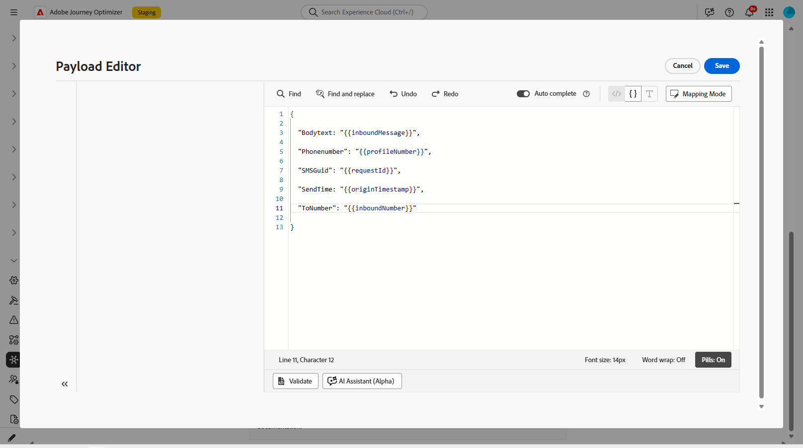

1. Click **[!UICONTROL Submit]** to save your webhook configuration.

1. In the **[!UICONTROL Webhooks]** menu, you now need to create a **Feedback** webhook for the custom provider.

1. Configure your webhook settings, as detailed below:

    * **[!UICONTROL Name]**: Enter a name for your webhook.

    * **[!UICONTROL Select SMS vendor]**: Custom.

    * **[!UICONTROL Type]**: Choose Feedback.

    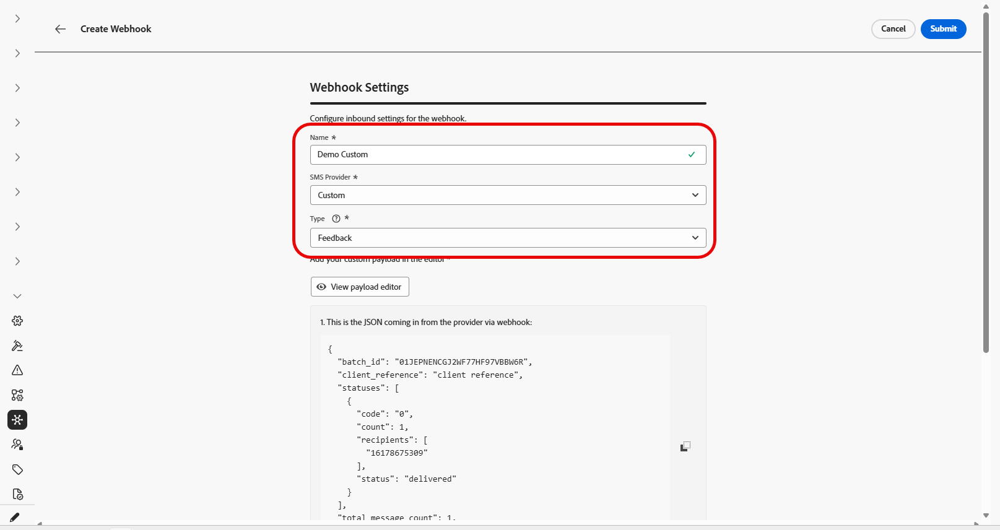

1. Create a custom payload that matches the JSON format from your provider. Note that the only webhook format supported is JSON. Form-data for webhooks is not supported.

    The feedback webhook requires the following fields to receive values from your provider's webhook:

    * **Client Reference**: A unique identifier returned in the payload for logging purposes.
    * **Code**: The failure code provided by your SMS provider.
    * **Status**: The failure status provided by your SMS provider.

    +++Payload example

    ```json
    {
    "clientReference": "{{client_reference}}",
    "statuses": [
        {
            "code": "{{failureCode}}",
            "status": "{{feedbackStatus}}"
        }
    ]
    }
    ```

    +++

1. Click **[!UICONTROL View payload editor]**, then copy and paste your JSON payload into the editor and save it.

    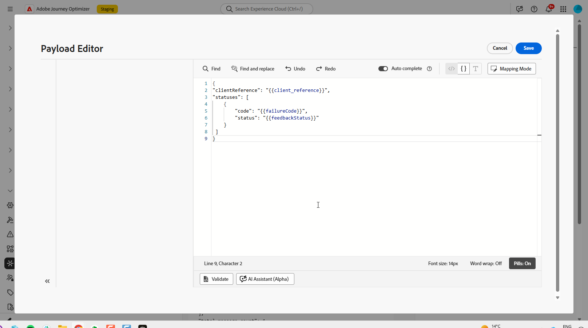

1. Click **[!UICONTROL Submit]** to save your Feedback webhook configuration.

1. From the **[!UICONTROL Webhooks]** menu, you can edit or delete existing webhooks.

1. Access your newly created Webhooks and copy the **[!UICONTROL Webhook URL]** from each of your Webhooks.

1. Configure your SMS provider to send **Feedback** and **Inbound** events to these webhook URLs in Journey Optimizer.

    Configuration instructions vary by SMS provider. Refer to your provider's documentation for details on setting up callback URLs.

If your webhook uses API credentials attached to an existing channel configuration, the webhook takes effect immediately. Otherwise, create a new channel configuration.

➡️[Learn more on channel configuration](sms-configuration-surface.md)
