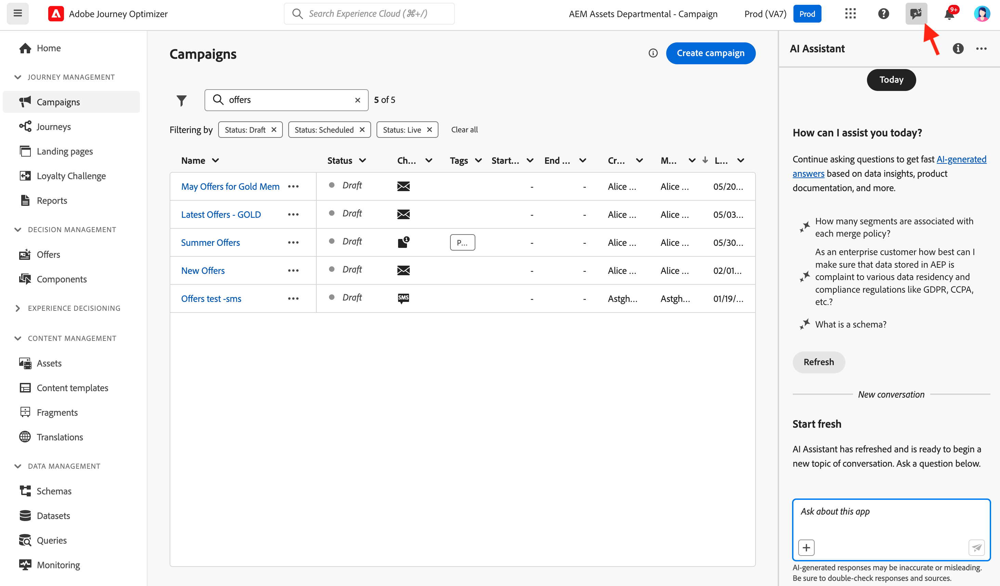
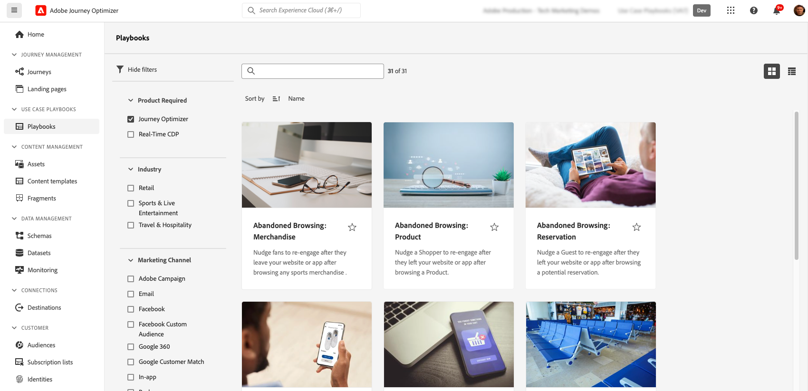

# AI & Intelligent Features {#ai-features}

Adobe Journey Optimizer harnesses the power of artificial intelligence and machine learning to help you create, optimize, and deliver exceptional customer experiences. From generating personalized content to predicting optimal send times, AI capabilities streamline your workflow and maximize impact.

## AI Assistant {#ai-assistant}

AI Assistant is your conversational guide to Adobe Journey Optimizer. Use it to get instant answers about product features, operational insights about your journeys, and help navigating the platform.

### Access AI Assistant

Click the AI Assistant icon in the top bar to open the assistant panel on the right side of your screen.

>[!IMPORTANT]
>
>You must agree to the [Adobe Experience Cloud Generative AI User Guidelines](https://experienceleague.adobe.com/en/docs/experience-platform/ai-assistant/home){target="_blank"} before using AI Assistant.

### What AI Assistant Can Do

**Product Knowledge** - Ask questions about Adobe Journey Optimizer features and concepts:

* "How do I set up a campaign in Adobe Journey Optimizer?"
* "How do I create a custom action to use in journeys?"
* "How many live activities can I have in one sandbox?"

**Operational Insights (Beta)** - Get real-time information about your journeys:

* "How many live journeys do I have?"
* "Give me a list of all scheduled journeys"
* "How many journeys have been created in the last 7 days?"

>[!NOTE]
>
>Operational insights are currently only available for **Journeys** and reflect data from your current sandbox.

### How to Use AI Assistant

1. Enter your question in the text field at the bottom of the panel
2. Press Enter to submit your query
3. Review the AI-generated response
4. Click **Show sources** to access related documentation
5. Use thumbs up/down to rate the response quality

{width="50%" align="center"}

[Learn more about AI Assistant in Experience Platform](https://experienceleague.adobe.com/en/docs/experience-platform/ai-assistant/home){target="_blank"}

## AI-Powered Content Generation {#content-generation}

Use generative AI to create and personalize content across multiple channels, accelerating your content creation process while maintaining brand consistency.

### Supported Channels

AI Assistant for content generation is available for:

* **Email** - Generate subject lines, body text, and images
* **Push Notifications** - Create engaging notification messages
* **SMS** - Write concise, compelling text messages  
* **Web** - Generate web page content and experiences

### Key Features

* **Text Generation** - Create compelling copy based on your brand voice and objectives
* **Image Generation** - Generate custom images using Adobe Firefly
* **Content Variations** - Produce multiple variations for A/B testing
* **Brand Alignment** - Ensure generated content matches your brand guidelines
* **Template Support** - Leverage your existing email templates

### Best Practices

* **Be specific** - Provide clear, detailed prompts for better results
* **Upload brand assets** - Use PDFs, images, or ZIP files (max 50MB) to maintain brand consistency
* **Use custom templates** - Leverage brand-specific templates with up to 8-10 images
* **Provide feedback** - Rate outputs to help improve the AI models
* **Review all content** - Always review AI-generated content for accuracy before publishing

[Learn more about AI content generation](../content-management/gs-generative.md)

## Send-Time Optimization {#send-time-optimization}

Use AI to predict the optimal time to send each message based on individual customer behavior patterns, maximizing engagement.

### How It Works

Send-Time Optimization analyzes historical engagement data (opens and clicks) to predict when each customer is most likely to engage with your messages. The system automatically schedules delivery within your specified time window.

### When to Use It

**Best for:**

* Marketing campaigns and newsletters
* Promotional messages
* Educational content
* Engagement campaigns

**Not recommended for:**

* Time-sensitive operational messages (order confirmations, password resets)
* Urgent notifications (flight delays, emergency alerts)
* Event-based messages with specific timing requirements

### Configuration Tips

* **Wait 30 days** - Collect at least 30 days of historical email or push data before enabling
* **Set optimal wait times** - Use 6-24 hours for best results (shorter limits optimization; longer may result in outdated content)
* **Choose the right metric** - Optimize for Clicks (action-driving messages) or Opens (awareness messages)
* **Schedule morning sends** - For push notifications, start early in the day to avoid nighttime delivery

[Learn more about Send-Time Optimization](../building-journeys/send-time-optimization.md)

## AI Models for Decisioning {#ai-decisioning}

Create intelligent ranking models that automatically optimize which offers to show to each customer, maximizing business objectives.

### Model Types

**Auto-optimization** - Learns from customer interactions to automatically improve offer performance over time

**Personalized optimization** - Uses customer profile attributes and behavior to predict the best offer for each individual

### Requirements

* At least 2 offers with sufficient interaction data:
  * 100+ display events
  * 5+ click events  
  * Within the last 14 days
* Maximum 5 AI ranking models per organization

[Learn more about AI models for decisioning](../experience-decisioning/ranking/ai-models.md)

## Content Experimentation with AI {#experimentation}

**Experiment Accelerator** helps you run experiments faster with AI-driven insights and recommendations, identifying winning content variations more quickly.

Key capabilities:

* Generate multiple content variations automatically
* Receive AI recommendations for experiment design
* Get early indicators of performance trends
* Accelerate time to statistical significance

[Learn more about Experiment Accelerator](../content-management/experiment-accelerator-gs.md)

## Use Case Playbooks {#playbooks}

Use Case Playbooks are pre-built workflows that help you implement common marketing scenarios quickly. Each playbook includes ready-to-use journeys, messages, schemas, and segments.

### How Playbooks Work

1. **Browse** the playbook library to find use cases matching your goals
2. **Enable** a playbook to automatically generate all required resources
3. **Customize** the generated assets to match your brand and requirements
4. **Deploy** to production or test in a development sandbox

### Available Playbooks

Browse Journey Optimizer playbooks for common scenarios like:

* Abandoned cart recovery
* Welcome series for new customers
* Post-purchase engagement
* Birthday messages
* Re-engagement campaigns

### Prerequisites

* Sandbox with appropriate permissions
* Channel configurations for email, push, and/or SMS
* User permissions to create journeys and messages

[View all available playbooks](https://experienceleague.adobe.com/docs/experience-platform/use-case-playbooks/playbooks/playbooks-list.html){target="_blank"} | [Learn more in Experience Platform documentation](https://experienceleague.adobe.com/docs/experience-platform/use-case-playbooks/playbooks/overview.html){target="_blank"}

## Additional AI Capabilities {#additional-capabilities}

### Image to HTML Converter

Transform static image designs (JPEG, PNG) into editable HTML email templates using AI-powered conversion technology.

[Learn more about Image to HTML](../email/image-to-html.md)

### Brand Alignment Scoring

Evaluate how well your content aligns with your brand guidelines using AI-powered scoring that measures tone, voice, and messaging consistency.

[Learn more about Brand Alignment](../content-management/brands-score.md)

## AI Agents in Adobe Experience Cloud {#ai-agents}

For advanced analytics and automation, Adobe Experience Cloud offers specialized AI Agents:

* **Journey Analyze Agent** - Analyze journey fallout, detect audience overlaps, identify scheduling conflicts
* **Experimentation Agent** - Analyze experiment results, identify winning patterns, discover testing opportunities
* **Audience Agent** - Create and manage audience segments through conversational AI
* **Agent Orchestrator** - Coordinate multiple agents to solve complex, multi-step challenges

These agents require separate access and permissions. [Learn more about AI Agents](https://experienceleague.adobe.com/en/docs/experience-cloud-ai/experience-cloud-ai/agents/agent-orchestrator){target="_blank"}

## Frequently Asked Questions {#faq}

+++**What permissions do I need for AI features?**

* **AI Assistant for content generation** - Requires the "Generate Content" permission
* **AI Assistant product knowledge** - Requires agreement to Adobe Generative AI User Guidelines
* **AI Agents** - Permissions vary by agent; see documentation for details

[Learn more about permissions](../administration/ootb-permissions.md)

+++

+++**Is AI-generated content always accurate?**

No. Always review AI-generated content for accuracy and brand appropriateness. Use the feedback tools (thumbs up/down) to help improve the models.

+++

+++**What are the main limitations?**

* **Send-Time Optimization** - Only available for email and push in journeys; requires 30-day training period
* **AI Content Generation** - Not available for Direct Mail, Content Cards, LINE, or WhatsApp
* **AI Ranking Models** - Maximum 5 models per organization; requires minimum interaction data

+++

+++**How do I get access to these features?**

Most AI features are included with Adobe Journey Optimizer. Some capabilities like Send-Time Optimization or AI Agents may require enablement by Adobe. Contact your Adobe representative for details about your specific license and available features.

+++

>[!MORELIKETHIS]
>
>* [Get started with AI Assistant for content generation](../content-management/gs-generative.md)
>* [AI Assistant in Experience Platform](https://experienceleague.adobe.com/en/docs/experience-platform/ai-assistant/home){target="_blank"}
>* [Send-Time Optimization guide](../building-journeys/send-time-optimization.md)
>* [Create AI ranking models](../experience-decisioning/ranking/create-ai-models.md)
>* [Use Case Playbooks documentation](https://experienceleague.adobe.com/docs/experience-platform/use-case-playbooks/playbooks/overview.html){target="_blank"}

