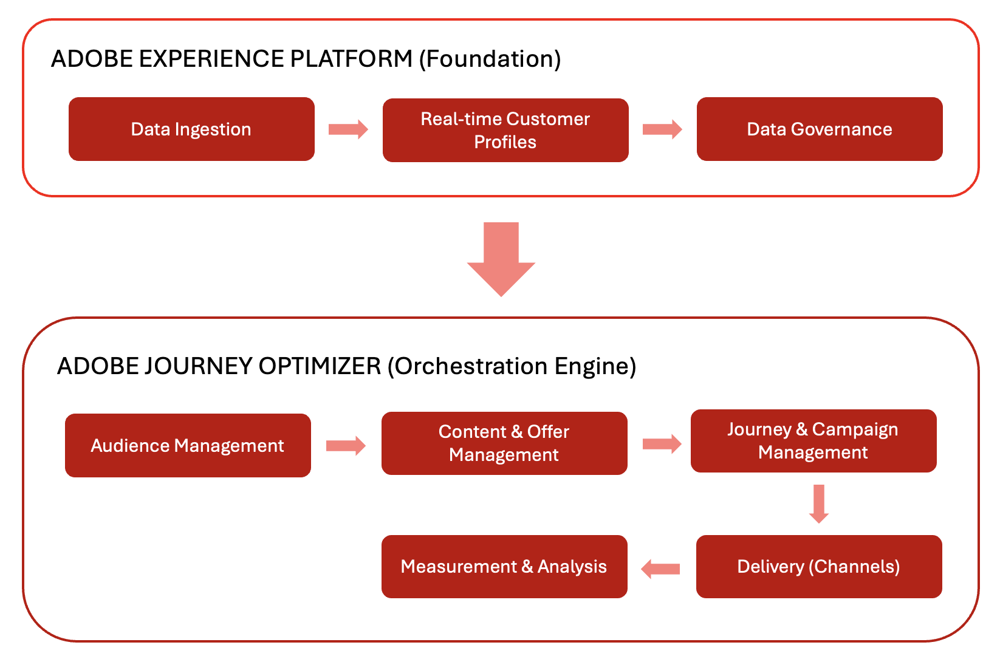
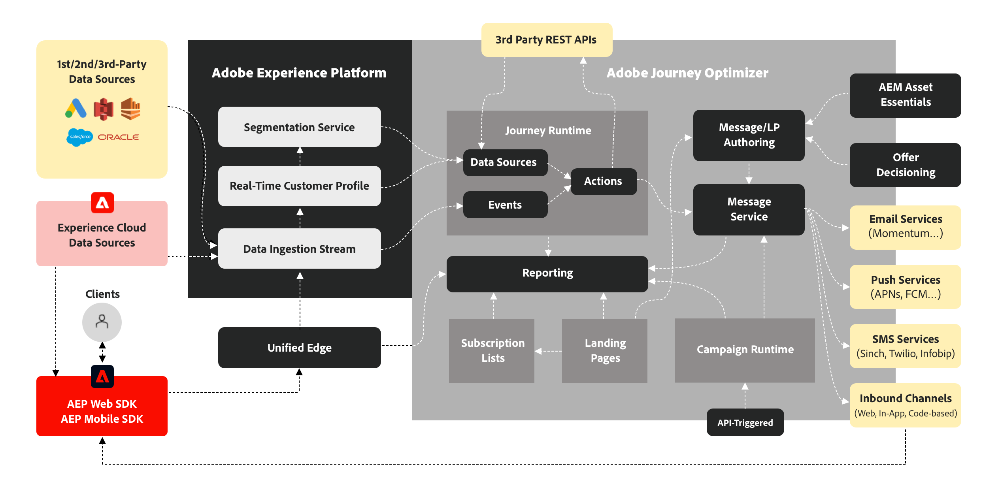

# Architecture

## The Big Picture: How Adobe Journey Optimizer Fits Together

Adobe Journey Optimizer (AJO) and Adobe Experience Platform (AEP) work together to enable data-driven personalization at scale. This ecosystem operates as a continuous flow where data is collected, analyzed, and applied to create personalized customer journeys.

### Foundation: Adobe Experience Platform (AEP)

Adobe Experience Platform serves as the backbone, enabling brands to centralize customer data and activate it for personalized experiences.

- **Data Platform**: AEP operates as the central hub for collecting, managing, and structuring customer data to ensure consistency across systems.
- **Data Ingestion (Sources)**: Brands import data from various systems, such as CRM platforms, websites, mobile apps, and cloud storage, using pre-built connectors. For example, a Source Connector ingests purchase data from an e-commerce platform.
- **Real-time Customer Profile**: This feature creates unified profiles by merging data from multiple sources. For instance, a profile combines email interactions and in-store purchases to provide a complete view of a customer.
- **Governance Layer**: This layer governs data access, privacy compliance, and security. It ensures that brands safely utilize customer data while adhering to regulations.

### Orchestration Engine: Adobe Journey Optimizer (AJO)

Adobe Journey Optimizer applies the data and insights from AEP to deliver intelligent, personalized customer experiences across various channels.

- **Customer Understanding**: Real-time Customer Profiles enable segmentation into Audiences for targeted messaging. For example, an Audience includes frequent shoppers identified through purchase history.
- **Content & Offers**:
  - **Content Management**: This feature provides tools for creating, managing, and personalizing content across channels. For instance, you can build a reusable Content Fragment for a promotional email header.
  - **Decision Management**: This system uses real-time logic to select the best offer or message for each individual. For example, an eligible customer might receive a discount offer based on their browsing history.
- **Journey & Campaign Management**: This feature automates sequences of interactions (Journeys) or schedules one-time targeted messages (Campaigns). For example, a Journey triggers follow-up emails after a product view.
- **Delivery (Connections)**:
  - **Channels**: This feature delivers messages and offers through communication platforms like email, SMS, push notifications, and direct mail.
  - **Destinations**: This feature exports profile and audience data to external systems for activation or analysis. For instance, audience data is sent to a social media platform for ad targeting.
- **Measurement & Analysis**: This feature tracks customer engagement and campaign performance with reports. These insights enable continuous improvement.

## Continuous Optimization Cycle

This ecosystem operates as a continuous optimization cycle. Data drives customer understanding, which informs personalized content and decisions. These are orchestrated into journeys, delivered across channels, measured for effectiveness, and refined over time.

## Detailed Architecture

## Privacy and Security

Adobe Experience Cloud's privacy and security practices apply to Adobe Journey Optimizer. These measures ensure compliance with privacy regulations, enabling brands to deliver personalized experiences while maintaining customer trust.
