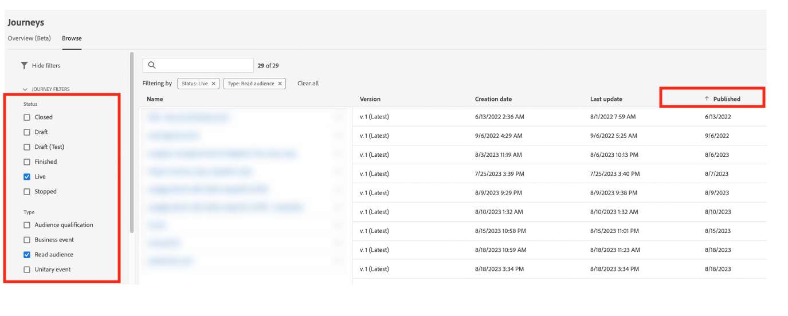

# Best practices {#best-practices}

## Real-time use case and omnichannel personalization guidance {#real-time-guidance}

Following the Identity Service 2.0 update, real-time identity stitching has evolved. 

Adobe Journey Optimizer leverages the Identity Service to merge profiles and personalize experiences for the user. As a result, there are some important aspects to the service to be aware of as you build out your use cases. As a brand, you look to deliver an experience to a person. The identity graph allows marketers to understand which devices a person is associated with across various channels. The graph can contain identities that represent a person (CRMID) or a web browser (ECID). The Identity Service stitches this information together, which enables the creation of a '360-degree view' of a person, or a merged profile. Meaning when someone browses your site, then logs in, all prior data from that session can be associated to the login user. This action happens in a few different steps:

1. Initial stitching of identities - when a person logs in, the login identifier (CRMID) is associated to the web browser identifier (web or mobile app session):

   * This can take 30 min - 4 hours to complete.
   * Usually, this login event will generate an identity graph that links CRMID with ECID.

1. After the initial stitching, any data sent in with either of the two identities will be associated to the merged profile and available for personalization in Journey Optimizer in real-time. Updating the profile with the latest behavioral data can take up to 1 minute to complete. Refer to this [page](https://experienceleague.adobe.com/docs/experience-platform/ingestion/streaming/overview.html).

When building use cases consider the following:

1. The brand wants to re-engage a site visitor 30 minutes after abandoning (ex. abandoned cart email): 

   Use the identity with the data - ECID. If you'd like to capture 100% of visitors who gave their email address/app install within the last 30 mins, you should use the cookie-based identity to launch this journey (ECID). This assumes that your email address or push token or other address for the experience is associated to the ECID.

1. Omnichannel engagement on web, email, push, etc.: 

   * You must have the addresses for communication available on the profile at time of engagement. To ensure this happens consistently and timely, make sure your data is associated to the identity you'd like to use.
   * If you need to use information from a newly installed app or browser session combined with known or logged in information, this communication needs to be sent out after the stitching of these identities has occurred. This can vary per customer and we encourage waiting at a minimum 30 minutes to get highest volume of profiles. 

## Scale with Journey guardrails {#scale}

This section will guide you on how to scale with the following two limitations: 

* Journey Optimizer has a guardrail of 50 activities in a journey canvas. This guardrail is designed to help in readability, QA and troubleshooting. The number of activities in a journey will appear in the upper left section of the journey canvas when you come within 10 activities of this limit. 

* As you publish journeys, Journey Optimizer automatically scales and adjusts to ensure maximum throughput and stability. As you near the milestone of 100 live journeys at one time in a sandbox, you will see an orange overlay and warning sign appear in the interface on this achievement. If you see this notification and have a need to extend your journeys beyond 100 live journeys at a time, please create a ticket for customer care and we will help you reach your goals.

There are a number of best practices that you can adopt, that will help you stay within the guardrails and use the system efficiently.

* If you're nearing your limit of live journeys, the first step that you can take is go to the **Overview** tab under **Journeys** to see how many journeys were active within the last 24 hrs (journeys which had active profiles. You can check the number of profiles entering and exiting the journey in this section to determine that.

   

* Next, in the Journey inventory section, you can filter all journeys by Status = "Live" and Type = "Read audience". Then sort by Publication date (oldest to newest). Click into the journey and go to the schedule. Stop all live journeys that had a schedule to run **Once** or **As soon as Possible** that are older than a day and only have one action. 

   

* If your **Read audience** journey has just one action, no waits/decisions, or send time optimization, consider moving them to Journey Optimizer Campaigns. Campaigns are better suited for single step engagement. One of the key differences between Campaign and Journeys is whether you feel it is important to actively listen to user engagement to determine the next step and engage with another action. 
* To lower the number of activities within a journey, check the condition steps. There will be many instances where you can move the conditions into segment definition or audience composition. 
* If the same conditions are repeated across multiple journeys (consent checks, suppressions), consider moving them as part of segment definition. For example, if you have a condition to check "email address is not empty" across multiple journeys, have that condition included as part of segment definition.
* If your journey has several conditions splitting the audience to see the numbers at each step, consider using Customer Journey Analytics or other reporting solution that are better suited for analysis.
* If you are nearing the limit of nodes on the canvas, consider consolidation of actions with dynamic parameters or content to serve the right content instead of explicit nodes. 

