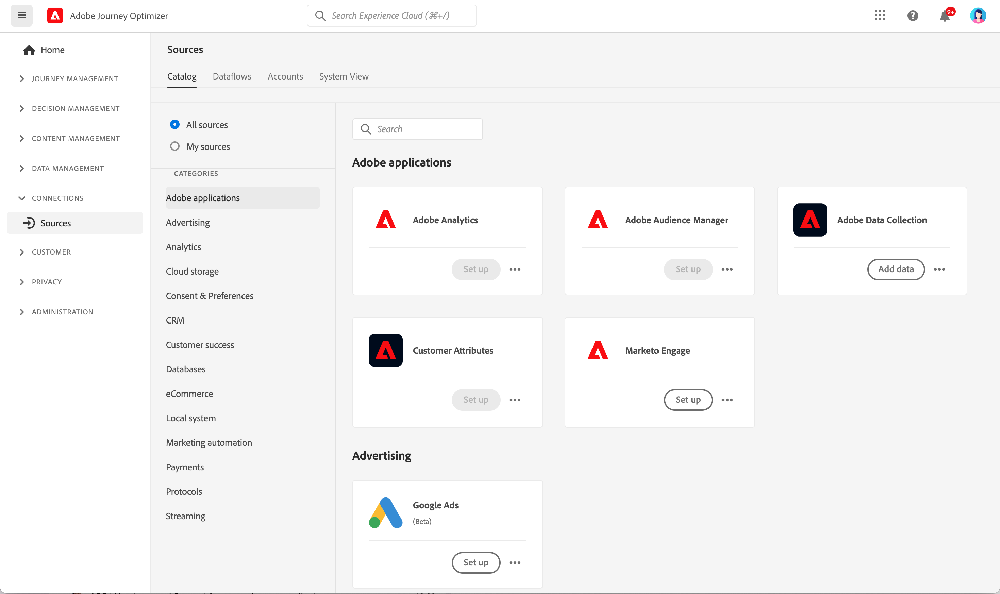

# Get Started with Sources connectors {#sources-gs}

## What is a source? {#what-is-source}

A **source** is a connector that brings external data into Adobe Journey Optimizer. Sources allow you to import customer information from systems you already use, such as CRM platforms, cloud storage, or databases, and make that data available for creating personalized customer journeys.

Think of sources as bridges between Journey Optimizer and your external data systems. They automatically sync data so you always have up-to-date customer information to power your marketing campaigns.

## Why sources matter {#why-sources-matter}

Sources are essential for creating personalized, data-driven customer experiences in Journey Optimizer. Here's why:

* **Unified customer view** - Combine data from multiple systems to see the complete picture of each customer
* **Real-time personalization** - Use fresh data to deliver timely, relevant messages in your journeys
* **Automated data sync** - Keep customer information current without manual data imports
* **Efficient workflows** - Connect once, then data flows automatically into your journeys

For example, you can use sources to import purchase history from your ecommerce platform, then create journeys that send personalized product recommendations based on what customers have bought.

## What you can do with sources {#sources-use-cases}

Common use cases for sources in Journey Optimizer include:

* **Import customer data from CRM systems** - Sync contact information, preferences, and engagement history from platforms like Salesforce or Microsoft Dynamics
* **Connect purchase data** - Bring in order history and product preferences from ecommerce platforms to personalize offers
* **Integrate loyalty program data** - Access points balances and tier information to reward your most engaged customers
* **Sync behavioral data** - Import website interactions and app usage patterns to trigger relevant journeys
* **Update profile attributes** - Keep customer profiles current with data from cloud storage or databases

## Common source types {#source-types}

Journey Optimizer supports various types of sources to connect with your existing systems:

**Adobe applications:**
* Adobe Analytics
* Adobe Audience Manager
* Adobe Campaign
* Adobe Commerce

**Cloud storage:**
* Amazon S3
* Azure Blob Storage
* Google Cloud Storage
* SFTP

**Databases:**
* Amazon Redshift
* Google BigQuery
* Microsoft SQL Server
* MySQL
* PostgreSQL

**CRM and marketing automation:**
* Microsoft Dynamics
* Salesforce
* Salesforce Marketing Cloud

➡️ See the complete list in the [Experience Platform sources catalog](https://experienceleague.adobe.com/docs/experience-platform/sources/home.html#sources-catalog){target="_blank"}

## Before you begin {#prerequisites}

Before configuring sources, ensure you have:

* **Appropriate permissions** - Access to manage sources in Adobe Experience Platform
* **Source system credentials** - Authentication details for the external system you want to connect
* **Understanding of your data** - Know which data fields you need and how they map to Journey Optimizer profiles

➡️ Learn about [access control and permissions](../../administration/permissions.md)

## How sources work {#how-sources-work}

Adobe Journey Optimizer uses the sources framework from Adobe Experience Platform. Here's the basic workflow:

1. **Connect** - Set up authentication to your external data system
2. **Select data** - Choose which data to import and how often to sync
3. **Map fields** - Define how external data fields correspond to Journey Optimizer profile attributes
4. **Schedule** - Set up automatic data refresh intervals
5. **Monitor** - Track data flow and resolve any sync issues

Once configured, sources run automatically in the background, keeping your customer data fresh and ready for use in journeys.

## Learn more {#learn-more}

Watch this video to understand source connectors and how to configure them in Journey Optimizer:

>[!VIDEO](https://video.tv.adobe.com/v/335919?quality=12)

For detailed information about configuring and managing sources, refer to the [Adobe Experience Platform sources documentation](https://experienceleague.adobe.com/docs/experience-platform/sources/home.html){target="_blank"}.

## Next steps {#next-steps}

Now that you understand what sources are and why they're important:

* Explore the [sources catalog](https://experienceleague.adobe.com/docs/experience-platform/sources/home.html#sources-catalog){target="_blank"} to find connectors for your systems
* Learn how to [create a source connection](https://experienceleague.adobe.com/docs/experience-platform/sources/ui-tutorials/create/overview.html){target="_blank"}
* Understand [data mapping and transformation](https://experienceleague.adobe.com/docs/experience-platform/sources/ui-tutorials/dataflow/overview.html){target="_blank"}
* See how to [use imported data in journeys](../building-journeys/journey-gs.md)
