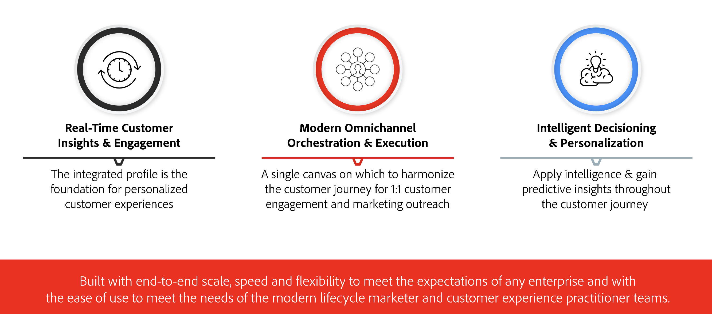

# Get Started with Journey Optimizer {#ajo-gs}

>[!BEGINSHADEBOX]

**On this page:** Understand what Adobe Journey Optimizer is, its core capabilities, and concrete use cases so you can decide how it fits your customer engagement goals.

>[!ENDSHADEBOX]

This page introduces Adobe Journey Optimizer: what it is, who it's for, its key capabilities, and how it fits into the Adobe Experience Platform architecture. It is the recommended starting point for new users.

## What is [!DNL Adobe Journey Optimizer]?{#about-ajo}

[!DNL Adobe Journey Optimizer] is an enterprise application for creating and delivering connected, contextual, and personalized customer experiences across all channels and touchpoints. It is built natively on [!DNL Adobe Experience Platform] and leverages a unified real-time customer profile, an API-first open framework, centralized offer decisioning, and AI/ML capabilities. Journey Optimizer enables brands to orchestrate both scheduled marketing campaigns and real-time, event-triggered communications — from a single application, at scale. The result is meaningful brand experiences that boost customer loyalty and lifetime value.

This guide applies to marketing practitioners, operations teams, and administrators new to Journey Optimizer.

➡️ [Discover Journey Optimizer](https://experienceleague.adobe.com/docs/journey-optimizer-learn/tutorials/introduction-to-journey-optimizer/introduction.html){target="_blank"} (video)

<!--
 Use [!DNL Adobe Journey Optimizer] to build multi-step customer journeys that initiate a sequence of interactions, offers, and messages across channels in real time. This approach ensures customers are engaged at the optimal moments based on their actions and relevant business signals. Learn how to build journeys in [this section](../building-journeys/journey-gs.md).

You can also create audience-based campaigns to send messages.
-->

## Key capabilities {#key-capabilities}

[!DNL Adobe Journey Optimizer] is an agile and scalable application for creating and delivering personalized, connected, and timely customer experiences across any app, device, or channel. 

Key capabilities include:

### Real-time Customer Insights & Engagement

An integrated profile fuses live data from all sources across customer touchpoints, including behavioral, transactional, financial, and operational data to optimize personal and contextual experiences for customers in their time. [Learn about profiles and audiences](../audience/get-started-profiles.md)

### Modern Omnichannel Orchestration & Execution

A single canvas on which to harmonize and optimize the customer journey for 1:1 customer engagement and marketing outreach — to help brands deliver more value across the customer lifecycle. Customer journeys designed in [!DNL Adobe Journey Optimizer] can be dynamic and event-based to help brands react to real-time signals as well as connect those interactions with scheduled campaigns so the right decisions can be made about what communications to send a customer, when, and through what channels. Embedded content creation tools — including a drag-and-drop visual designer, reusable templates, content fragments, and a personalization editor — allow teams to author, personalize, and manage messages for every channel directly within the same workflow. [Build your first journey](../building-journeys/journey-gs.md) | [Design your content](../../rp_landing_pages/content-management-landing-page.md)

### Intelligent Decisioning & Personalization

Brands can apply centralized decisioning and incorporate artificial intelligence and machine learning to configure predictive insights throughout the customer experience, making it easier to automate decisions and optimize the experience at scale. Decisioning powers centralized offers across channels at scale through [!DNL Adobe Journey Optimizer]. [Explore offer decisioning](../offers/get-started/starting-offer-decisioning.md) | [Discover AI features](ai-features.md)

## Common use cases {#use-cases}

Journey Optimizer supports a wide range of scenarios — from real-time triggered journeys and abandoned-cart recovery to scheduled campaigns, decisioning, and operational notifications.

To find the capability that fits your goal, see the [Journey Optimizer use cases overview](ajo-use-case-guide.md). For end-to-end, worked examples, browse the [journey use cases library](../building-journeys/jo-use-cases.md).

Not sure whether to use Journeys or Campaigns for your goal? See [Journeys vs Campaigns: choose the right approach](journeys-vs-campaigns.md).

## Availability & Licensing {#availability}

This documentation covers the current release of Journey Optimizer and applies to both B2C and B2B edition users unless otherwise noted. Components and capabilities available in your environment depend on your [permissions](../administration/permissions.md) and on your [licensing package](https://helpx.adobe.com/legal/product-descriptions/adobe-journey-optimizer.html){target="_blank"}. For any question, reach out to your Adobe Customer Success Manager or your Adobe representative.

[!DNL Adobe CX Enterprise] general privacy guidelines and procedures apply to [!DNL Journey Optimizer]. [Learn more about [!DNL Adobe CX Enterprise] privacy](https://www.adobe.com/privacy/experience-cloud.html){target="_blank"}.

## Architecture {#architecture}

Journey Optimizer is built natively on Adobe Experience Platform, sharing its data foundation, identity graph, and governance services — for a detailed walkthrough of how these systems work together, see [Understanding Journey Optimizer](understanding-ajo.md).

## Related resources {#related-resources}

* [Key steps to start](quick-start.md) — Role-based quickstart guides for admins, marketers, and data engineers.
* [Get started with data management](../data/gs-data.md) — Learn how data is ingested, unified, and activated in Journey Optimizer.
* [Design journeys and send messages](../building-journeys/journey-gs.md) — Build your first customer journey and configure channel actions.
* [Live reports](../reports/live-report.md) — Monitor campaign and journey performance in real time.
* [Introduction to Journey Optimizer tutorial](https://experienceleague.adobe.com/en/docs/journey-optimizer-learn/tutorials/introduction-to-journey-optimizer/introduction){target="_blank"} — A guided video walkthrough of core Journey Optimizer concepts.
* [Journey Optimizer Security Overview](https://www.adobe.com/content/dam/cc/en/security/pdfs/AJO_SecurityOverview.pdf) (PDF) — Security architecture, data protection, and compliance details.
* [Journey Optimizer Product Description](https://helpx.adobe.com/legal/product-descriptions/adobe-journey-optimizer.html){target="_blank"} — Official licensing terms and edition feature breakdown.

## Where to go next {#where-next}

| I want to… | Go to… |
|------------|--------|
| Understand how Journey Optimizer integrates with Adobe Experience Platform | [Understanding Journey Optimizer](understanding-ajo.md) |
| Get started for my specific role | [Roles and responsibilities](quick-start.md) |
| Explore use cases | [Journey Optimizer use cases overview](ajo-use-case-guide.md) |
| Decide between Journeys and Campaigns | [Journeys vs Campaigns](journeys-vs-campaigns.md) |
| See key terminology | [Terminology](terminology.md) |
