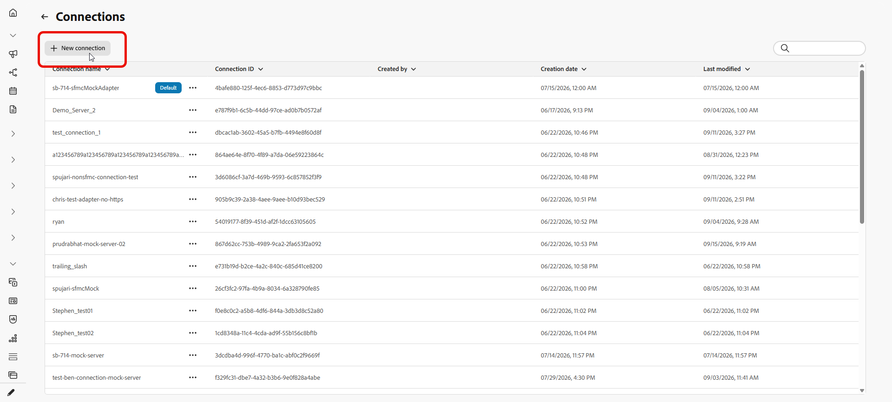

# Migrate content and journeys {#migrate-content-and-journeys}

If you are moving to [!DNL Journey Optimizer] from another marketing platform, you do not have to start from a blank slate. Journey Optimizer includes a migration workspace that imports your existing email content and journeys. It converts them into [!DNL Journey Optimizer] content templates and journeys, so you can pick up where you left off instead of rebuilding everything from scratch.

## Set up a connection {#set-up-a-connection}

>[!CONTEXTUALHELP]
>id="ajo_migration_connection_name"
>title="Connection Name"
>abstract="A descriptive name identifying the source system (e.g. 'Marketing-Automation-Prod'). Must start with a letter and contain only alphanumerics, underscores, or hyphens (4-50 characters)."

>[!CONTEXTUALHELP]
>id="ajo_migration_base_api_url"
>title="Base API URL"
>abstract="The root URL of the API, without resource paths or query strings, e.g. https://api.example.com."

>[!CONTEXTUALHELP]
>id="ajo_migration_authentication_method"
>title="Choosing an authentication method"
>abstract="API Key sends a single credential with each request, while OAuth 2.0 uses a token-based protocol better suited for enterprise and third-party APIs."

>[!CONTEXTUALHELP]
>id="ajo_migration_client_id"
>title="Client ID"
>abstract="The public identifier for your application, issued when you register with the authorization server."

>[!CONTEXTUALHELP]
>id="ajo_migration_client_secret"
>title="Client Secret"
>abstract="A confidential credential known only to your app and the authorization server. Never expose it in client-side code."

>[!CONTEXTUALHELP]
>id="ajo_migration_token_url"
>title="Token URL"
>abstract="The authorization server endpoint that issues access tokens for the client credentials flow, typically ending in /oauth/token or /token."

>[!NOTE]
>
>A connection is not required if you upload HTML files or screenshots instead of importing through an API.

To import content or journeys through an API, first connect [!DNL Journey Optimizer] to your source platform:

1. In the Migration workspace, select **[!UICONTROL Manage connections]**.

1. Click **[!UICONTROL New connection]**.

    

1. Fill in the details below:

    * **[!UICONTROL Connection Name]**: A name that identifies the source system, such as `Marketing-Automation-Prod`. Names must start with a letter and can only contain letters, numbers, underscores, or hyphens, between 4 and 50 characters long.
    * **[!UICONTROL Base API URL]**: The root URL of the source system's API, without any resource path or query string, such as `https://api.example.com`.
    * **[!UICONTROL Description]**: Optional context to help you and other users identify the purpose of this connection.
    * **[!UICONTROL Authentication Method]**: How [!DNL Journey Optimizer] authenticates to the source system. Choose **API Key** to send a single credential with each request. Choose **OAuth 2.0** to use a token-based protocol that is better suited to enterprise and third-party APIs.
    * **[!UICONTROL Client ID]**: The public identifier assigned to your application when you registered it with the authorization server. Required for OAuth 2.0 connections.
    * **[!UICONTROL Client Secret]**: The confidential credential associated with your client ID. Keep it private, as it is known only to your application and the authorization server. Required for OAuth 2.0 connections.
    * **[!UICONTROL Token URL]**: The authorization server endpoint that issues access tokens for the client credentials flow, typically ending in `/oauth/token` or `/token`. Required for OAuth 2.0 connections.

        

1. Select **[!UICONTROL Create]**.

1. Once your connection is set up, use the advanced menu to delete it, or to mark it as default so it is pre-selected the next time you import content or journeys.

    

## Import Email content {#import-email-content}

Once you have a source for your content, either an HTML file or a connection to your source platform, import it into the migration workspace to convert it into a [!DNL Journey Optimizer] content template.

1. From the **[!UICONTROL Email content]** tab, choose how you want to import your email content:

    * **[!UICONTROL Upload HTML]**: Select one or more HTML email files from your computer.

    * **[!UICONTROL Browse from connection]**: Browse and select emails directly from your connected marketing platform, without needing to export and upload files manually.

    

1. For an HTML upload, browse for your file or drag and drop it into the upload area. Click **[!UICONTROL Upload]** once done.
    
     Files must be in `.html` or `.htm` format and no larger than 10 MB.

    

1. For import from connection, choose from the Emails list and click **[!UICONTROL Import]**.

1. Access your imported email and review the imported HTML.

1. Add your **[!UICONTROL Subject line]** and map each personalization placeholder to the corresponding profile attribute. 
    
    The migration workspace converts the source scripting syntax to Handlebars syntax automatically.

    

1. Select a folder to upload the email's images to [!DNL Experience Manager Assets] and click **[!UICONTROL Upload assets]**.

    

1. Once your email is ready, select **[!UICONTROL Migrate]**, then select **View in [!DNL Journey Optimizer]** to open the new content template.

    

Your content template is now available in [!DNL Journey Optimizer] and ready to use in your journeys.

➡️ [Learn more on Content template](../content-management/use-content-templates.md)

## Import journeys {#import-journeys}

Recreate your journeys by importing a screenshot of the journey flow, or by connecting to your source platform.

1. From the **[!UICONTROL Journeys]** tab, choose how you want to import your journeys:

    * **[!UICONTROL Upload screenshots]**: Select one or more journeys screenshots from your computer.

    * **[!UICONTROL Browse from connection]**: Browse and select journeys directly from your connected marketing platform, without needing to export and upload screenshots manually.

    

1. For an HTML upload, browse for your file or drag and drop it into the upload area. Click **[!UICONTROL Upload]** once done.
    
    Files must be in .png, .jpg, .gif, .webp format and no larger than 5 MB.

    

1. For import from connection, choose from the journeys list and click **[!UICONTROL Import]**.

1. Preview the journey that the migration workspace generates from your source.

1. From the **[!UICONTROL Action items]** pane, resolve each item based on the type of activity it belongs to:

    * For each message step, select a channel configuration and content template.
    * For each **[!UICONTROL Audience]** activity, select the audience.

1. Select **[!UICONTROL Apply changes]**, then select **View in [!DNL Journey Optimizer]** to open the journey canvas.

    

Your journey is now available in [!DNL Journey Optimizer], where you can review the canvas, make any final adjustments, and activate it when you are ready to go live.

➡️ [Learn more on Journey creation](../building-journeys/journey-gs.md)

## Track migration {#track-migration-progress}

The migration workspace overview helps you keep track of every email you have imported and quickly find the ones still awaiting action. Each imported email shows a status of needs review, migrated, or failed, so you can see where it stands at a glance. A set of KPIs at the top of the screen gives you an at-a-glance count of items in each status:

* **Total emails** (or **Total journeys**): The overall number of items imported into the migration workspace.
* **In Progress**: Items that are still being reviewed or mapped before they can be migrated.
* **Migrated**: Items that were successfully converted and are available in [!DNL Journey Optimizer].
* **Failed**: Items that could not be migrated and need attention.

A set of filters lets you narrow down the list of imported email content so you can focus on a specific subset instead of scrolling through every item. Combine one or more of the following filters to find what you are looking for:

* **[!UICONTROL Status]**: Show only emails with a specific status, such as **[!UICONTROL Needs review]**, **[!UICONTROL Migrated]**, or **[!UICONTROL Failed]**.
* **[!UICONTROL Created]**: Show emails imported within a specific date range.
* **[!UICONTROL Updated]**: Show emails last modified within a specific date range.

