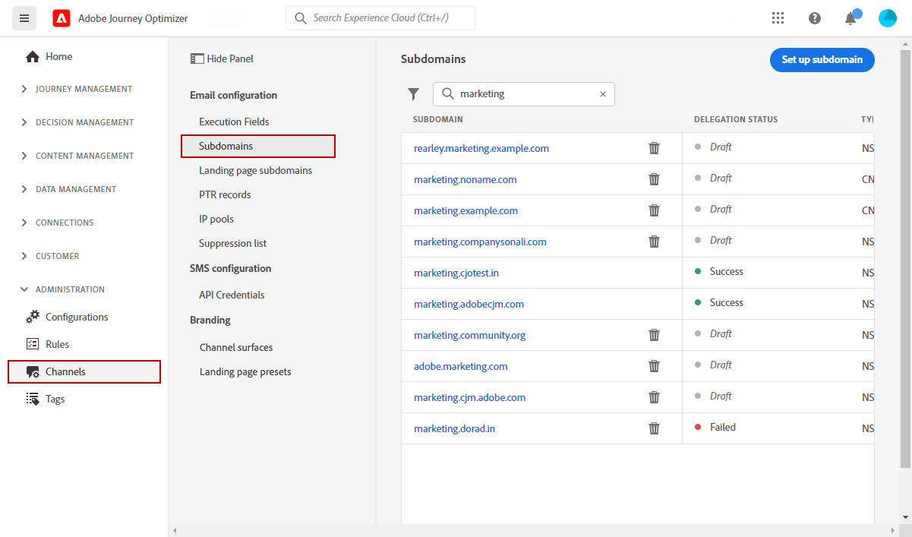
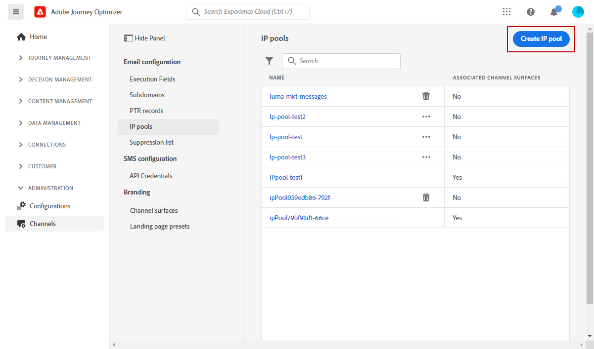
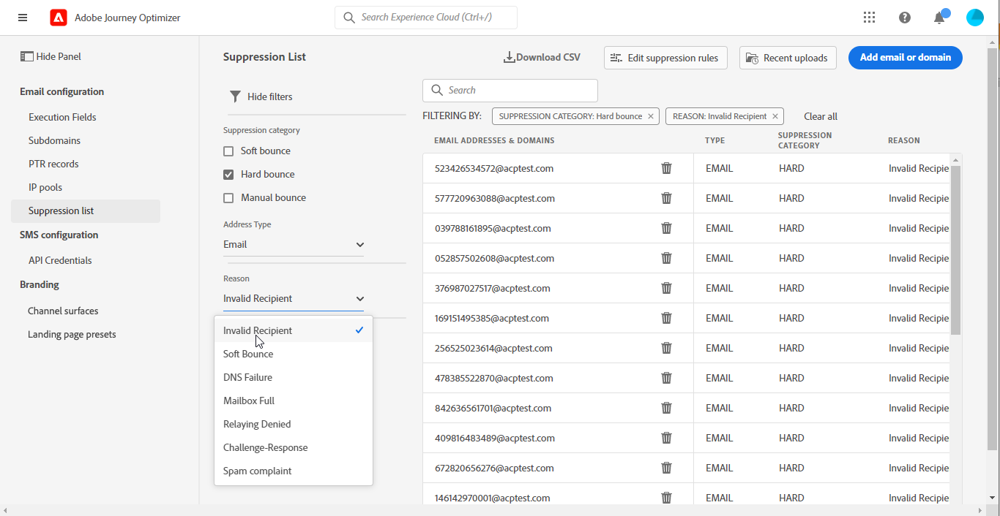

# Get Started for System Administrators {#get-started-sys-admins}

As a **System Administrator**, you set up the Journey Optimizer environment and manage access to enable your teams to work efficiently and securely. You perform essential configuration steps so that the [Data Engineer](data-engineer.md), [Developer](developer.md), and [Marketer](marketer.md) can start working with [!DNL Adobe Journey Optimizer].

Your primary responsibilities include setting up user groups and permissions, creating and managing sandboxes for partitioning data and journeys for different user groups, and configuring delivery channels and message presets to ensure consistent branding across the various messages and assets delivered through Journey Optimizer. You ensure the right people have access to the right capabilities while maintaining security and governance.

These capabilities can be managed by **[!UICONTROL Product administrators]** that have access to the Permissions product. [Learn more about Permissions](../../administration/permissions.md){target="_blank"}.

## Set up access and permissions

Follow these steps to configure access management:

1. **Create sandboxes** to partition your instances into separate, isolated virtual environments. **Sandboxes** are created in [!DNL Journey Optimizer]. Learn more in the [Sandboxes](../../administration/sandboxes.md) section.
    
    >[!NOTE]
    >As a **System Administrator**, if you cannot see the **[!UICONTROL Sandboxes]** menu in [!DNL Journey Optimizer], you need to update your permissions. Learn how to update your role on [this page](../../administration/permissions.md#edit-product-profile).
    
1. **Understand roles**. Roles are a set of unitary rights which allows users access to certain functionalities or objects in the interface. Learn more in the [out-of-the-box roles](../../administration/ootb-product-profiles.md) section.

1. **Set permissions** for roles, including **Sandboxes**, and give access to your team members by assigning them to different roles. Permissions are unitary rights that allow you to define the authorizations assigned to **[!UICONTROL Role]**. Each permission is gathered under capabilities, e.g. Journey or Offers, which represents the different functionalities or objects in [!DNL Journey Optimizer]. Learn more in the [Permission levels](../../administration/high-low-permissions.md) section.

1. **Use object-level access control** (optional). Apply access labels to objects like journeys, campaigns, and channel configurations to control which users can access specific resources. Learn more about [Object-level access control (OLAC)](../../administration/object-based-access.md).

In addition, you must add users who need access to Assets Essentials to the **Assets Essentials Consumer Users** or/and **Assets Essentials Users** roles. [Read more in Assets Essentials documentation](https://experienceleague.adobe.com/docs/experience-manager-assets-essentials/help/deploy-administer.html){target="_blank"}.

When accessing [!DNL Journey Optimizer] for the first time, you are provisioned a production sandbox and allocated a certain number of IPs depending on your contract.

## Configure channels and messages

To enable [Marketers](marketer.md) to create and send messages, access the **ADMINISTRATION** menu. Browse the **[!UICONTROL Channels]** menu to configure channel settings.

>[!NOTE]
>As a **System Administrator**, if you cannot see the **[!UICONTROL Channels]** menu in [!DNL Journey Optimizer], update your permissions in the [Permissions](../../administration/permissions.md){target="_blank"} product.

Follow these steps:

1. **Set up channel configurations**. Define all the technical parameters required for email, SMS, push notifications, web push, direct mail, and other channels:

    * Define **push notification settings** in both [!DNL Adobe Experience Platform] and Adobe Experience Platform Data Collection. [Learn more](../../push/push-gs.md)

    * Configure **web push notifications** to deliver notifications to mobile and desktop browsers. [Learn more](../../push/push-configuration-web.md)

    * Create **channel configurations** to configure all the technical parameters required for email, SMS, push, in-app, web, and other channels. [Learn more](../../configuration/channel-surfaces.md)

    * Configure the **SMS channel** to set up all the technical parameters required for SMS. [Learn more](../../sms/sms-configuration.md)

    * Manage the number of days during which **retries** are performed before sending email addresses to the suppression list. [Learn more](../../configuration/manage-suppression-list.md)

    * Enable **message export** at the channel configuration level to archive sent email and SMS content when required (add-on offering). [Learn more](../../configuration/message-export.md)

1. **Delegate subdomains**: for any new subdomain to be used in Journey Optimizer, the first step will be to delegate it. [Learn more](../../configuration/about-subdomain-delegation.md). You can migrate subdomains from CNAME to custom delegation when needed. [Learn more](../../configuration/custom-subdomain-migration.md)

    

1. **Create IP pools**: improve your email deliverability and reputation by grouping together IP addresses provisioned with your instance. [Learn more](../../configuration/ip-pools.md)

    

1. **Manage the suppression and allowed lists**: improve your deliverability with suppression and allowed lists
    
    * A [suppression list](../../reports/suppression-list.md) consists of email addresses that you want to exclude from your deliveries, because sending to these contacts could hurt your sending reputation and delivery rates. You can monitor all the email addresses that are automatically excluded from sending in a journey, such as invalid addresses, addresses that consistently soft-bounce, and could adversely affect your email reputation, and recipients who issue a spam complaint of some kind against one of your email messages. Learn how to manage the [suppression list](../../configuration/manage-suppression-list.md) and [retries](../../configuration/retries.md).

    

    * The [allowed list](../../configuration/allow-list.md) enables you to specify individual email addresses or domains that will be the only recipients or domains authorized to receive the emails you are sending from a specific sandbox. This can prevent you from sending emails accidentally to real customer addresses when you are in a testing environment. Learn how to [enable the allowed list](../../configuration/allow-list.md).

    Learn more about deliverability management in [!DNL Adobe Journey Optimizer] [on this page](../../reports/deliverability.md).

## Additional capabilities

As your organization's needs grow, consider these advanced capabilities:

* **Consent policies**: If your organization has purchased Healthcare Shield or Privacy and Security Shield, create consent policies to respect customer preferences across channels. [Learn more](../../action/consent.md)

* **Data governance policies**: Apply data usage labels and policies to control how data is used in marketing actions. [Learn more](../../action/action-privacy.md)

* **IP warmup plans**: Gradually increase email sending volumes to build sender reputation with email providers. [Learn more](../../configuration/ip-warmup-gs.md)

* **Quiet hours**: Configure rule sets for time-based exclusions when messages should not be sent during specific periods. [Learn more](../../conflict-prioritization/quiet-hours.md)

## Collaborate across roles

Your administrative work enables all teams to succeed:

>[!BEGINTABS]

>[!TAB Support Data Engineers]

Collaborate with [Data Engineers](data-engineer.md) on data management and access. Review the [Get started with data management](../../data/gs-data.md) overview to understand the schemas, datasets, and data sources your data engineers need to configure.

* Grant permissions for data management and schema creation
* Approve sandbox access for development and testing
* Coordinate on data retention policies and governance rules
* Enable access to advanced features like Federated Audience Composition

>[!TAB Enable Developers]

Collaborate with [Developers](developer.md) on API access and testing:

* Provide API credentials through Adobe Developer Console
* Set up sandbox environments for development and testing
* Approve channel configurations (push certificates, SMS providers)
* Coordinate on testing environments and deployment strategy

>[!TAB Empower Marketers]

Collaborate with [Marketers](marketer.md) on permissions and channel setup:

* Assign appropriate permissions to create journeys and campaigns
* Configure channels they'll use (email, push, SMS, etc.)
* Support testing environments and approval workflows
* Enable access to new features and capabilities

>[!ENDTABS]

## Next steps

Once the environment is configured:

1. **Verify setup**: Confirm that all team members can access their required features
2. **Monitor usage**: Use the administration dashboards to track system usage and identify issues
3. **Maintain permissions**: Regularly review and update permissions as team roles evolve
