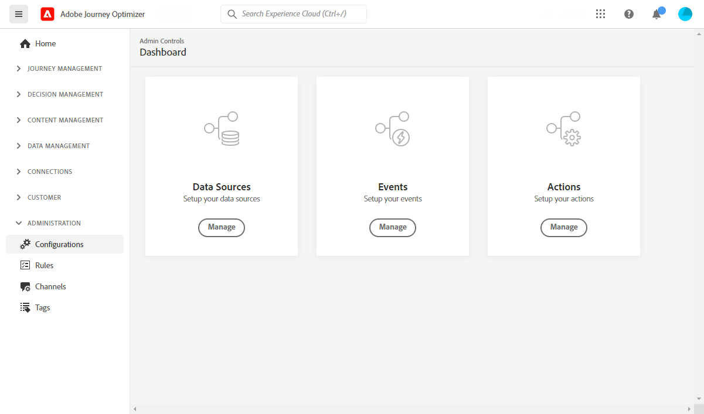

# Get Started for Data Engineer {#data-engineer}

As a **Data Architect** or **Data Engineer**, you set up and maintain the customer profile data and other data sources that power the experiences orchestrated by [!DNL Journey Optimizer]. This includes integrating all your customer and business data—whether from web, CRM, or offline sources—into a unified 360-degree view of the customer. You model customer profile data and business data into schemas, configure source connectors for ingesting data, and ensure data flows smoothly to enable real-time customer insights and engagement. You can start working with [!DNL Adobe Journey Optimizer] once the [System Administrator](administrator.md) granted you access and prepared your environment.

>[!NOTE]
>
>Learn more about **data ingestion** in [Adobe Experience Platform documentation](https://experienceleague.adobe.com/docs/experience-platform/ingestion/home.html){target="_blank"}.

## Essential data configuration steps

Follow these steps to set up the data foundation for Journey Optimizer:

1. **Create identity namespaces**. In Adobe [!DNL Journey Optimizer], **Identities** link consumers across devices and channels, the result is an identity graph. The linked identity graph is used to personalize experiences based on interactions across all of your business touchpoints. Learn more about identities and identity namespaces [on this page](../../audience/get-started-identity.md).

   In addition, configure **supplemental identifiers** to enable the same profile to enter multiple journey instances based on secondary identifiers like order IDs or booking IDs. Learn about [supplemental identifiers](../../building-journeys/supplemental-identifier.md).

1. **Create schemas** and enable them for profiles. A schema is a set of rules that represent and validate the structure and format of data. At a high-level, schemas provide an abstract definition of a real-world object (such as a person) and outline what data should be included in each instance of that object (such as first name, last name, birthday, and so on).

   * For standard journeys and campaigns: Use [XDM schemas](../../data/get-started-schemas.md)
   * For Orchestrated campaigns: Create [relational schemas](../../orchestrated/gs-schemas.md) to enable multi-entity segmentation

1. **Create datasets** and enable them for profiles. A dataset is a storage and management construct for a collection of data, typically a table, that contains a schema (columns) and fields (rows). Datasets also contain metadata that describes various aspects of the data they store. Once a dataset is created, you can map it to an existing schema and add data into it. Learn more about datasets [on this page](../../data/get-started-datasets.md).

   For advanced scenarios, prepare **datasets for runtime lookups** to enrich journey execution with real-time data from record datasets. Learn about [dataset lookup](../../building-journeys/dataset-lookup.md).

1. **Configure source connectors**. Adobe Journey Optimizer allows data to be ingested from external sources while providing you with the ability to structure, label, and enhance incoming data using Platform services. You can ingest data from a variety of sources such as Adobe applications, cloud-based storages, databases, and many others. Learn more about Source connectors [on this page](../get-started-sources.md).

1. **Create test profiles**. Test profiles are required when using the [test mode](../../building-journeys/testing-the-journey.md) in a journey, and to [preview and test your messages](../../content-management/preview-test.md) before sending. Steps to create test profiles are detailed [on this page](../../audience/creating-test-profiles.md).

1. **Configure computed attributes** (optional). Create derived attributes from profile data to simplify segmentation and personalization. Computed attributes automatically calculate complex metrics like "total purchases in last 90 days" or "average order value". Learn about [computed attributes](../../audience/computed-attributes.md).

1. **Message export datasets** (optional). When message export is enabled at the channel configuration level, sent email and SMS content is automatically exported to a dedicated Experience Platform dataset for compliance, archiving, or downstream analysis. Learn about [message export](../../configuration/message-export.md).

In addition, to be able to send messages in journeys, you must configure **[!UICONTROL Data Sources]**, **[!UICONTROL Events]** and **[!UICONTROL Actions]**. Learn more [in this section](../../configuration/about-data-sources-events-actions.md).

* The **Data Source** configuration allows you to define a connection to a system to retrieve additional information that will be used in your journeys. Learn more about Data Sources [in this section](../../datasource/about-data-sources.md).

* **Events** allow you to trigger your journeys unitarily to send messages, in real-time, to the individual flowing into the journey. In the event configuration, you configure the events expected in the journeys. The incoming events' data is normalized following the Adobe Experience Data Model (XDM). Events come from Streaming Ingestion APIs for authenticated and unauthenticated events (such as Adobe Mobile SDK events). Learn more about events [in this section](../../event/about-events.md).
    
* [!DNL Journey Optimizer] comes with built-in message capabilities: you can create your messages within a journey and design your content. If you are using a third-party system to send your messages, for example Adobe Campaign, create a **custom action**. Learn more about actions [in this section](../../action/action.md).

## Monitor and analyze journey data

Once journeys are running, you can query journey step events in the Data Lake to monitor performance, troubleshoot issues, and analyze customer behavior. Use SQL queries to analyze:

* Profile entry and exit patterns
* Error rates and discard reasons
* Read Audience export job performance
* Custom action performance metrics
* Journey instance states and bottlenecks

Explore ready-to-use [query examples for journey analysis](../../reports/query-examples.md) to get started with data analysis and troubleshooting.

## Collaborate across roles

Your data configuration work is essential for other teams:

>[!BEGINTABS]

>[!TAB Work with Administrators]

Collaborate with [Administrators](administrator.md) on access and governance:

* Request necessary permissions for data management and schema creation
* Coordinate on sandbox access for development and testing
* Align on data governance policies and consent management
* Discuss data retention policies and storage requirements

>[!TAB Work with Developers]

Collaborate with [Developers](developer.md) on data structure and events:

* Provide XDM schemas and event structures they need to implement
* Define which events need to be sent and their required payload format
* Align on data collection requirements and data quality standards
* Test event delivery and data ingestion together

>[!TAB Work with Marketers]

Collaborate with [Marketers](marketer.md) on audiences and data:

* Create computed attributes for personalization and segmentation
* Build audiences based on their campaign and journey requirements
* Configure relational schemas for Orchestrated campaigns
* Support multi-entity segmentation for advanced use cases

>[!ENDTABS]
