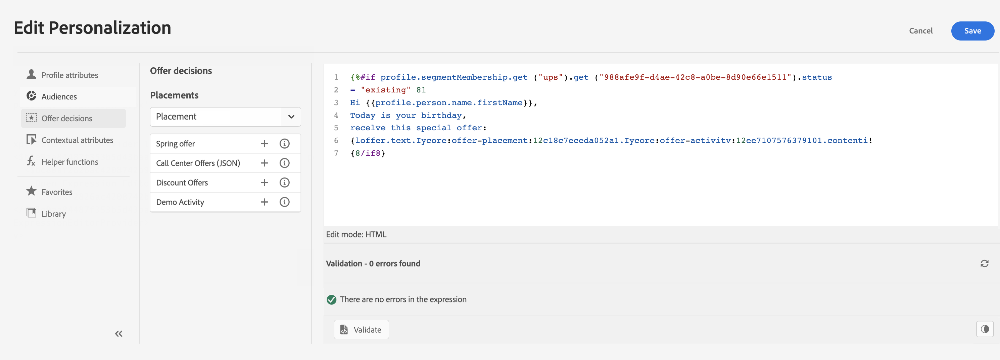
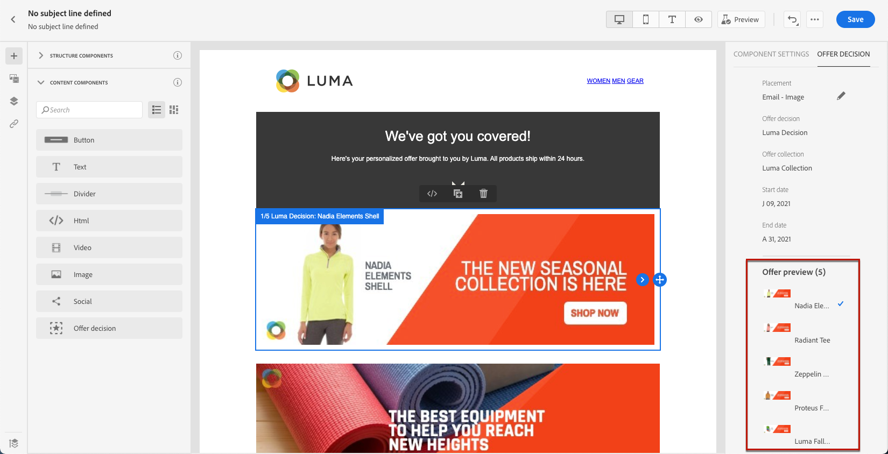
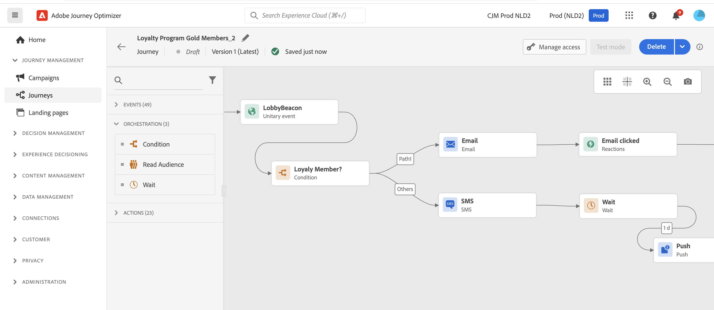

# Get started for Marketers {#get-started-marketers}

As a **Marketer** or **Business Practitioner**, you design customer journeys to deliver personal, contextual experiences to customers. You create and manage all the various components of these personalized journeys, including email and push messages, offers, and decision components to intelligently personalize message content. Journey Optimizer provides a unified user experience where you can implement entire end-to-end use cases in one place. You can start working with [!DNL Adobe Journey Optimizer] once the [System Administrator](administrator.md) and the [Data Engineer](data-engineer.md) granted you access and prepared your environment.

## Get started with the essentials

Journey Optimizer brings together real-time customer insights, modern omnichannel orchestration, and intelligent decisioning in a single application. Create personalized, connected customer experiences across email, SMS, push, in-app, web, content cards, and more.

Journey Optimizer offers two powerful orchestration approaches:

* **Journeys**: Real-time, one-to-one engagement where each customer moves through at their own pace, triggered by behavior or events
* **Orchestrated Campaigns**: Complex, multi-step batch campaigns at scale where audiences progress together through workflows—perfect for brand-initiated campaigns like seasonal promotions, product launches, or account-based communications

Work with your [Administrators](administrator.md) to gain access and with [Data Engineers](data-engineer.md) to set up audiences, data, and relational schemas for advanced segmentation.

Follow these core steps to start building experiences:

1. **Create audiences**. Build audiences through segment definitions, upload CSV files, or use audience composition. Journey Optimizer offers multiple ways to target the right customers. Learn more about [audiences](../../audience/about-audiences.md) and [creating segment definitions](../../audience/creating-a-segment-definition.md).

1. **Design content**. Create compelling messages across all channels including email, SMS, push, in-app, web, and content cards:
   * Use the **AI Assistant** to generate email content, subject lines, and images based on your brand guidelines. [Learn about AI content generation](../../content-management/gs-generative.md)
   * **Personalize messages** with customer data, dynamic content, and conditional logic. [Learn about personalization](../../personalization/personalize.md)
   * **Iterate over contextual data** to display dynamic lists from events, custom actions, and dataset lookups. [Learn about iterating contextual data](../../personalization/iterate-contextual-data.md)
   * Create reusable **content templates** and **fragments** to maintain brand consistency. [Work with templates](../../content-management/content-templates.md)
   * Deliver persistent, non-intrusive **content cards** within mobile apps and websites. Unlike push notifications, content cards remain visible until dismissed. [Learn about content cards](../../content-card/create-content-card.md)
   * Manage assets with **Adobe Experience Manager Assets** integration. [Learn about assets](../../integrations/assets.md)

    
    
1. **Add offers and decisioning**. Deliver the best offer to each customer at the right time using AI-powered decisioning. Learn about [Decision Management](../../offers/get-started/starting-offer-decisioning.md) and [Experience Decisioning](../../experience-decisioning/gs-experience-decisioning.md).

    
    
1. **Test and validate**. Preview and test content before sending:
   * Use **test profiles** to preview personalization and check rendering across devices
   * Test with **sample data** from CSV/JSON files
   * Preview **email rendering** across popular email clients
   * Run **A/B tests and experiments** to optimize content variations. Use multi-armed bandit experimentation to automatically allocate more traffic to winning variations in real-time. [Learn about experimentation](../../content-management/content-experiment.md)
   * Set up **approval workflows** for campaigns and journeys (requires additional license). [Learn about approvals](../../test-approve/gs-approval.md)
   
   Learn how to [test and validate messages](../../content-management/preview-test.md).

1. **Build customer journeys**. Create real-time, personalized experiences using the journey canvas:

    * Trigger journeys with **events** (customer actions) or **audiences** (batch sends)
    * Add **conditions** to create personalized paths based on customer data
    * Use **wait activities** to create perfect timing between messages
    * Send messages across **multiple channels** within one journey
    * Apply **A/B testing** and optimize send times to maximize engagement
    * Use **dataset lookup** to enrich journeys with real-time data from Adobe Experience Platform. [Learn about dataset lookup](../../building-journeys/dataset-lookup.md)
    * Leverage **supplemental identifiers** to allow the same profile to enter multiple journey instances (e.g., different orders or bookings). [Learn about supplemental identifiers](../../building-journeys/supplemental-identifier.md)

    

    Learn how to [design and execute journeys](../../building-journeys/journey-gs.md) and explore [journey use cases](../../building-journeys/jo-use-cases.md). Understand [entry/exit criteria](../../building-journeys/entry-exit-criteria-guide.md) to control profile flow.

1. **Launch orchestrated campaigns**. Design complex, multi-step batch campaigns at scale using a visual canvas:

    * Build **on-demand audiences** instantly using relational queries to connect customer data with accounts, purchases, subscriptions, and other entities
    * Create **multi-entity segmentation** for precise targeting (e.g., "customers with subscriptions expiring in 30 days" or "accounts with recent high-value purchases")
    * Get **pre-send visibility** with accurate audience counts before launching
    * Design **multi-step workflows** for seasonal promotions, product launches, loyalty offers, or account-based marketing
    * Schedule campaigns to run immediately, at specific times, or on recurring schedules (daily, weekly, monthly)
    * Process audiences in **batch mode** where all profiles progress together through the workflow

    Learn how to [get started with Orchestrated campaigns](../../orchestrated/gs-orchestrated-campaigns.md) and understand when to [use campaigns vs journeys](../../orchestrated/orchestrated-campaigns-faq.md).

1. **Monitor and optimize**. Track performance and improve results over time:
   * Monitor **live journey** performance and identify bottlenecks
   * Analyze **message delivery** rates and engagement metrics
   * Use **reporting dashboards** with Customer Journey Analytics integration
   * Track **conversion** and business impact
   * Manage **message frequency and prioritization** with conflict management rules to prevent over-communication. [Learn about conflict management](../../conflict-prioritization/gs-conflict-prioritization.md)
   
   Learn how to [monitor performance](../../reports/report-gs-cja.md).

## Best practices for success

### Content creation

* **Start with templates**: Use pre-built templates and content fragments to speed up creation and maintain consistency
* **Test early, test often**: Always preview content across devices and use test profiles to validate personalization
* **Leverage AI wisely**: Use AI Assistant for initial drafts and variations, but always review and refine for your brand voice
* **Keep it simple**: Clear, concise messages with strong calls-to-action perform better than complex layouts

### Journey design

* **Define clear goals**: Establish success metrics before building your journey
* **Map the customer experience**: Visualize the entire journey before implementation
* **Use wait activities strategically**: Give customers time to engage before sending follow-ups
* **Plan exit strategies**: Define when and why customers should exit the journey
* **Test in draft mode**: Validate journey logic with dry run before activating

[Learn journey best practices](../../building-journeys/entry-exit-criteria-guide.md#best-practices)

### Campaign orchestration

* **Choose the right approach**: Use Journeys for real-time, behavior-triggered experiences; use Orchestrated campaigns for scheduled, batch campaigns
* **Define clear campaign objectives**: Establish goals before designing multi-step workflows
* **Start with pilot audiences**: Validate counts and segmentation logic before scaling
* **Leverage relational data**: Use multi-entity segmentation to connect customer data with accounts, purchases, subscriptions for precise targeting
* **Keep segmentation simple**: Optimize performance and transparency with clear, maintainable rules
* **Use consistent naming**: Make campaign management easier with clear naming conventions

### Audience targeting

* **Segment thoughtfully**: Create specific, actionable audience segments based on clear criteria
* **Refresh regularly**: Ensure audiences stay current by setting appropriate evaluation schedules
* **Balance size and precision**: Target audiences large enough for statistical significance but specific enough for relevance
* **Use enrichment attributes**: Leverage computed attributes and enrichment data for deeper personalization

### Frequency management

* **Respect customer preferences**: Honor opt-outs and communication preferences
* **Set frequency caps**: Use rule sets to prevent message fatigue across channels
* **Coordinate campaigns**: Use conflict management to ensure customers receive the right message at the right time
* **Monitor engagement**: Watch for signs of fatigue (declining open rates, increasing unsubscribes)

[Learn about frequency capping](../../conflict-prioritization/channel-capping.md)

## Explore use cases

Learn from practical examples that demonstrate Journey Optimizer capabilities:

**Journey use cases** (real-time, one-to-one):

* **Welcome series**: Onboard new customers with personalized, multi-step journeys. [View use case](https://experienceleague.adobe.com/en/docs/journey-optimizer-learn/tutorials/use-cases/customer-onboarding)
* **Abandoned cart recovery**: Re-engage customers who left items in their cart. [View use case](https://experienceleague.adobe.com/en/docs/journey-optimizer-learn/tutorials/use-cases/abandoned-cart)
* **Event-driven messaging**: Respond to customer actions in real-time
* **Birthday campaigns**: Send personalized birthday messages triggered by profile dates
* **Product recommendations**: Suggest relevant products based on browsing and purchase history

**Orchestrated campaign use cases** (batch, one-to-many):

* **Seasonal promotions**: Launch coordinated campaigns across customer segments (e.g., holiday sales, back-to-school)
* **Product launches**: Announce new products to targeted audiences with sequenced messaging
* **Loyalty program offers**: Reward high-value customers with tiered offers based on purchase history
* **Account-based marketing**: Target accounts with specific characteristics and related contacts
* **Subscription renewals**: Reach customers with subscriptions expiring soon using multi-entity queries
* **Re-engagement campaigns**: Win back inactive customers with targeted offers in batch mode. [View use case](https://experienceleague.adobe.com/en/docs/experience-platform/rtcdp/use-cases/personalization-insights-engagement/use-cases-luma)

**Journey patterns:**

* [Send messages to subscribers](../../building-journeys/message-to-subscribers-uc.md): Target subscription lists with personalized content
* [Multi-channel messaging](../../building-journeys/journeys-uc.md): Combine email and push with reaction events
* [Weekday-only emails](../../building-journeys/weekday-email-uc.md): Schedule communications using time-based conditions

Browse the complete [journey use cases library](../../building-journeys/jo-use-cases.md) and learn more about [Orchestrated campaigns](../../orchestrated/gs-orchestrated-campaigns.md).

## Collaborate across roles

Your marketing work connects with other teams:

>[!BEGINTABS]

>[!TAB Work with Data Engineers]

Collaborate with [Data Engineers](data-engineer.md) on data and audience configurations:

* Request new computed attributes for personalization and segmentation
* Coordinate on relational schemas for Orchestrated campaigns
* Provide feedback on audience quality and data accuracy
* Align on multi-entity data requirements for advanced segmentation

>[!TAB Work with Developers]

Collaborate with [Developers](developer.md) on event tracking and implementation:

* Align on which user interactions should trigger journey events
* Test mobile and web implementations before launch
* Validate tracking for content performance and user engagement
* Troubleshoot issues with message delivery or personalization

>[!TAB Work with Administrators]

Collaborate with [Administrators](administrator.md) on access and configurations:

* Request channel configurations for your campaigns and journeys
* Confirm license access for Orchestrated campaigns and other features
* Report issues with permissions or access
* Coordinate on new feature enablement and testing environments

>[!ENDTABS]

## Next steps

1. **Start small**: Create a simple welcome journey or single-message campaign to learn the platform
2. **Leverage AI**: Use AI Assistant to ask questions and accelerate content creation
3. **Join the community**: Connect with other Journey Optimizer users in the [Experience League Community](https://experienceleaguecommunities.adobe.com/t5/journey-optimizer/ct-p/journey-optimizer){target="_blank"}
4. **Explore tutorials**: Watch step-by-step videos on [Experience League](https://experienceleague.adobe.com/docs/journey-optimizer-learn/tutorials/overview.html){target="_blank"}
