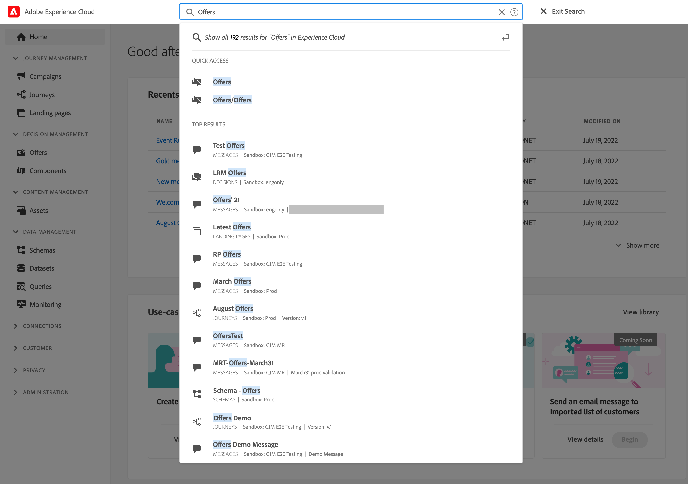
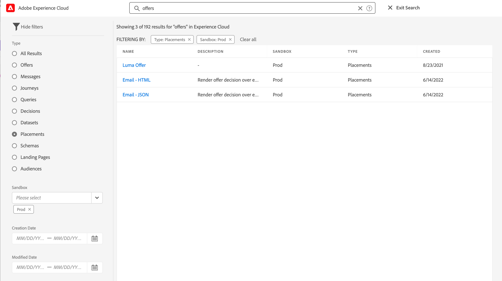
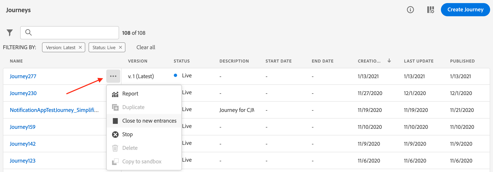
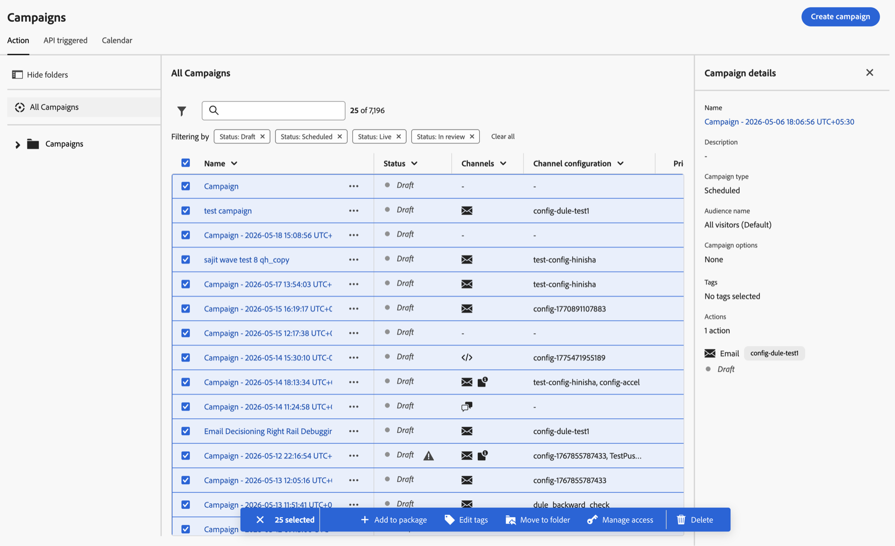
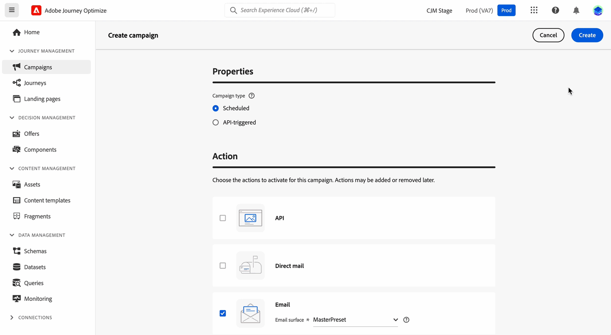
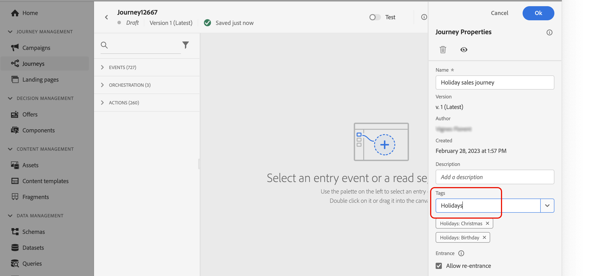
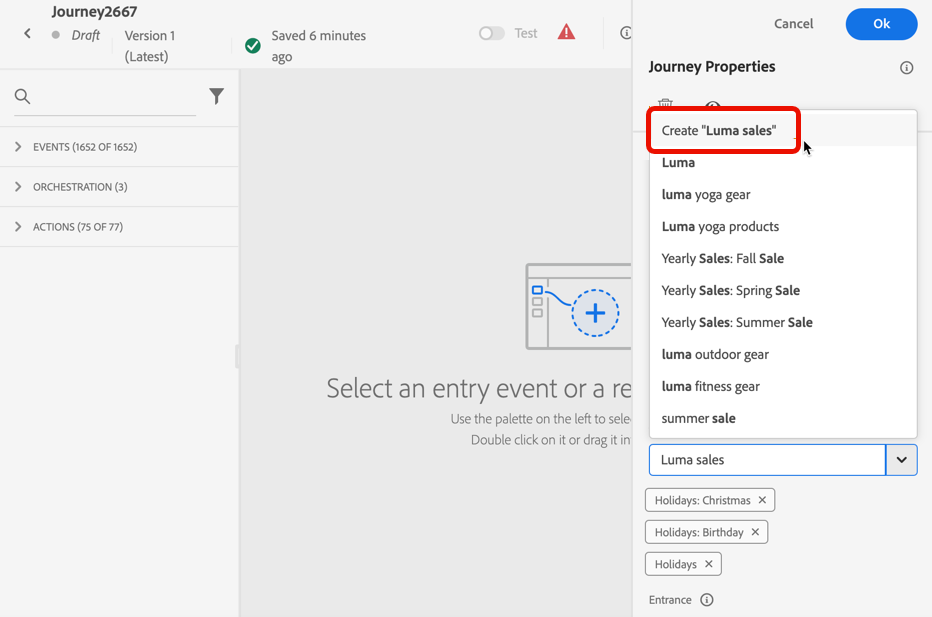
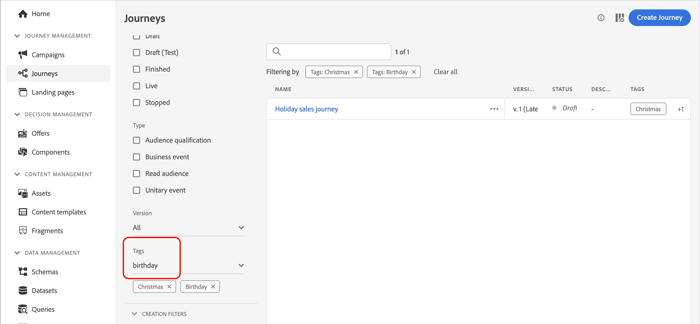
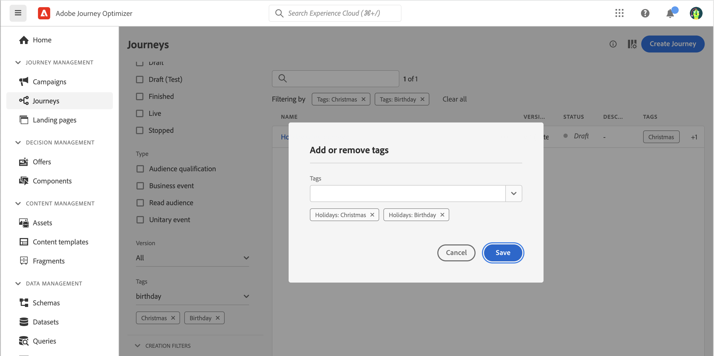

# Search, filter, organize {#search-filter-organize}

>[!BEGINSHADEBOX]

**On this page:** Quickly locate and organize journeys, campaigns, and assets with universal search, list filters, and tags so you can stay productive as your Journey Optimizer projects grow.

>[!ENDSHADEBOX]

As your Adobe Journey Optimizer projects grow, finding and organizing content becomes essential for efficient work. This page shows you how to quickly locate journeys, campaigns, and assets using universal search; filter lists to focus on specific items; and organize your work with tags and categories. These tools help you navigate large volumes of content, maintain consistency across teams, and streamline your daily workflows.

## Search {#unified-search}

From Adobe Journey Optimizer interface, use the unified [!DNL Adobe CX Enterprise] search capability on the center of the top bar to find assets, journeys, datasets, and more across your sandboxes. 

Start entering content to display top results. Help articles about the entered keywords also show up in the results.

Press **Enter** to access all results and filter by business object.

## Filter lists {#filter-lists}

In most of the lists, use the search bar to find specific items, and define filtering criteria. You can also sort any list by clicking a column header. In the Campaigns folders view, sorting by **[!UICONTROL Priority]** and **[!UICONTROL Channel configuration]** is also supported.

Filters can be accessed by clicking on the filter icon on the top left of a list. The filter menu allows you to filter the displayed elements according to different criteria: you can choose to display only elements of a certain type or status, the ones you created, or the ones modified in the last 30 days. Options differ depending on the context.

Additionally, you can use Unified tags to filter a list depending on the tags assigned to an object. For now, tags are available for journeys and campaigns. [Learn how to work with tags](#tags)

>[!NOTE]
>
>Note that columns displayed can be personalized using the configuration button on the top right of the lists. Personalization is saved for each user.

In the lists, you can perform basic actions on each element. For example, you can duplicate or delete an item.

## Bulk actions {#bulk-actions}

In the **Campaigns**, **Fragments**, **Journeys**, and **Templates** lists, you can select multiple items at once using the checkboxes and apply operations to all of them from a bulk action bar that appears at the bottom of the screen.

The following operations are available:

* **[!UICONTROL Add to package]** - Export selected items to another sandbox. [Learn how to export objects →](../configuration/copy-objects-to-sandbox.md)
* **[!UICONTROL Move to folder]** - Move selected items into a folder.
* **[!UICONTROL Edit tags]** - Edit the tags assigned to selected items. [Learn how to use tags →](#add-tags)
* **[!UICONTROL Manage access]** - Apply access labels to selected items. [Learn more about object-level access control →](../administration/object-based-access.md)
* **[!UICONTROL Archive]** - Archive selected items. Available for Fragments, Journeys, and Templates.
* **[!UICONTROL Delete]** - Permanently delete selected items. Available for Campaigns and Journeys.

For journeys specifically, you can also bulk **[!UICONTROL Pause]** or **[!UICONTROL Resume]** selected items. [Learn more about bulk pause and resume →](../building-journeys/journey-ui.md#bulk-operations)

## Work with Unified tags {#tags}

>[!CONTEXTUALHELP]
>id="ajo_campaigns_tags"
>title="Tags"
>abstract="This field allows you to assign Adobe Experience Platform Unified Tags to your campaign. This allows you to easily classify them and improve search from the campaigns list."

With Adobe Experience Platform [Unified Tags](https://experienceleague.adobe.com/docs/experience-platform/administrative-tags/overview.html), you can easily classify your Journey Optimizer objects to improve search from the lists.

Adding meaningful tags to audiences in Journey Optimizer lets you later filter and search on to more easily find audiences. Tags can additionally be used to organize audiences in relevant, searchable folders, create personalized offers and experiences, and use in experience decision rules.

### Add tags to an object {#add-tags}

The **[!UICONTROL Tags]** field allows you to define tags for your object. Tags are available for the following objects:

* [Campaigns](../campaigns/create-campaign.md)
* [Decision items](../experience-decisioning/items.md)
* [Fragments](../content-management/fragments.md)
* [Journey Fragments](../building-journeys/journey-fragments.md)
* [Journeys](../building-journeys/journey-properties.md)
* [Landing pages](../landing-pages/create-lp.md)
* [Subscription lists](../landing-pages/subscription-list.md)
* [Templates](../content-management/content-templates.md)
* [Channel configurations](../configuration/channel-surfaces.md#channel-config-tags)

You can either select an existing tag, or create a new one. To do so, follow the steps below.

1. Start typing the name of the desired tag and/or select it from the list.

    

    >[!NOTE]
    >
    > Tags are not case-sensitive.

1. If the tag you are searching is not available, click **[!UICONTROL Create ""]** to define a new one - it is automatically added to the current object and becomes available for all other objects.

    

1. The list of the selected or created tags is displayed below the **[!UICONTROL Tags]** field. You can define as many tags as needed.

>[!NOTE]
> 
> If you duplicate or create a new version of an object, tags are preserved.

### Filter on tags {#filter-on-tags}

Each object list displays a dedicated column so you can easily visualize your tags. 

A filter is also available to only display objects with certain tags.

You can add or remove tags from any type of journey or campaign (live, draft, etc). To do this, click the **[!UICONTROL More actions]** icon next to the object, and select **[!UICONTROL Edit tags]**. 

### Manage tags {#manage-tags}

Administrators can delete tags and organize them by categories using the **[!UICONTROL Tags]** menu, under **[!UICONTROL ADMINISTRATION]**. Learn more about tags management in the [Unified Tags documentation](https://experienceleague.adobe.com/docs/experience-platform/administrative-tags/ui/managing-tags.html). 

>[!NOTE]
>
> Tags created directly from the **[!UICONTROL Tags]** field in Journey Optimizer are automatically added to the built-in "Uncategorized" category.
