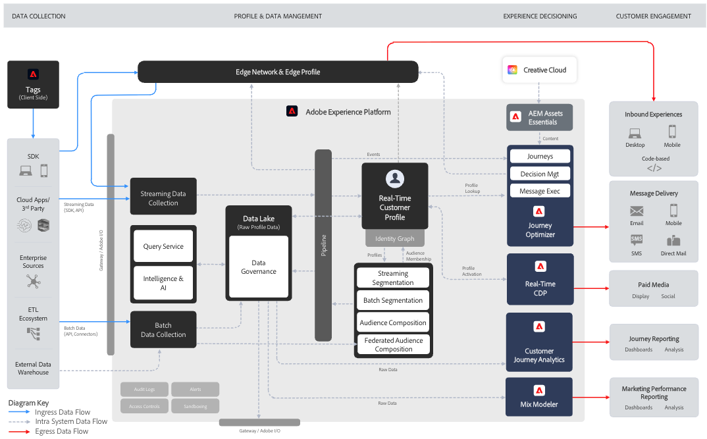

# Understanding Journey Optimizer {#understanding-ajo}

Adobe Journey Optimizer (AJO) and Adobe Experience Platform (AEP) work together to enable data-driven personalization at scale. This page explains how these systems operate and how their key functional areas combine to deliver exceptional customer experiences.

## How Journey Optimizer Works {#how-it-works}

Adobe Journey Optimizer operates as a continuous flow where data is collected, analyzed, and applied to create personalized customer journeys.

### Adobe Experience Platform: The Foundation {#aep-foundation}

Adobe Experience Platform serves as the backbone, enabling brands to centralize customer data and activate it for personalized experiences:

* **Data Platform** - Central hub for collecting, managing, and structuring customer data to ensure consistency across systems
* **Data Ingestion (Sources)** - Import data from CRM platforms, websites, mobile apps, and cloud storage using pre-built connectors
* **Real-time Customer Profile** - Creates unified profiles by merging data from multiple sources (email interactions, in-store purchases, web behavior)
* **Governance Layer** - Governs data access, privacy compliance, and security while adhering to regulations

### Adobe Journey Optimizer: The Orchestration Engine {#ajo-orchestration}

Adobe Journey Optimizer applies the data and insights from AEP to deliver intelligent, personalized customer experiences:

* **Customer Understanding** - Real-time Customer Profiles enable segmentation into audiences for targeted messaging
* **Content & Offers** - Tools for creating, managing, and personalizing content; real-time logic to select the best offer for each individual
* **Journey & Campaign Management** - Automates sequences of interactions (journeys) or schedules one-time targeted messages (campaigns)
* **Delivery (Connections)** - Delivers messages through channels like email, SMS, push notifications, and direct mail; exports data to external systems
* **Measurement & Analysis** - Tracks customer engagement and campaign performance with reports for continuous improvement

### The Continuous Optimization Cycle {#optimization-cycle}

This ecosystem operates as a continuous optimization cycle. Data drives customer understanding, which informs personalized content and decisions. These are orchestrated into journeys, delivered across channels, measured for effectiveness, and refined over time.

## Key Functional Areas {#functional-areas}

Journey Optimizer includes seven key functional areas that work together seamlessly:

| Functional Area | Purpose | Key Activities |
|-----------------|---------|----------------|
| **Data Management** | Organize customer data | Define schemas, create datasets, import data from various systems |
| **Customer Management** | Understand who your customers are | Build unified profiles, resolve identities, create audiences |
| **Content Management** | Create personalized messages | Design emails, manage assets, build templates and fragments, personalize content |
| **Decision Management** | Select the best offer in real time | Manage offer library, define rules, apply constraints, establish ranking logic |
| **Journey Management** | Design automated customer experiences | Create journeys with visual designer, set triggers, add conditions and wait steps |
| **Connections** | Connect data sources and channels | Configure source connectors, set up channels, connect to external platforms |
| **Administration & Privacy** | Control setup and compliance | Manage users, configure sandboxes, set up channels, handle privacy requests |

### How These Areas Work Together {#working-together}

These functional areas operate in a continuous cycle:

1. **Data Ingestion** - Data flows into AEP, structured by Data Management
2. **Customer Understanding** - Real-time Customer Profiles unify data; Customer Management creates audiences  
3. **Content & Offer Strategy** - Content Management creates messages; Decision Management defines offer logic
4. **Orchestration** - Journey Management maps interactions across channels using customer data, content, and decisions
5. **Delivery** - Connections facilitate message delivery via channels or share data with external systems
6. **Measurement** - Performance data feeds insights back to refine audiences, content, decisions, and journeys
7. **Governance** - Administration and Privacy controls ensure compliance throughout

## Architecture Details {#architecture-details}

For technical teams, here's the detailed architecture diagram showing how Journey Optimizer integrates with Adobe Experience Platform:

Four applications are natively built on Experience Platform: Adobe Real-Time Customer Data Platform, Journey Optimizer, Customer Journey Analytics, and Adobe Mix Modeler. Journey Optimizer works seamlessly with these applications but can also function independently.

### Integration Points {#integration-points}

Journey Optimizer integrates with Adobe Experience Platform at multiple levels:

* **Data Layer** - Shares the same Real-time Customer Profile, Identity Graph, and datasets
* **Service Layer** - Leverages AEP's governance, privacy, and query services
* **Application Layer** - Provides journey orchestration, decision management, and content management on top of AEP

Learn more about [Adobe Journey Optimizer blueprints](https://experienceleague.adobe.com/en/docs/blueprints-learn/architecture/customer-journeys/journey-optimizer/journey-optimizer-overview){target="_blank"}.

## Privacy and Security {#privacy-security}

Adobe Experience Cloud's privacy and security practices apply to Adobe Journey Optimizer. These measures ensure compliance with privacy regulations like GDPR, enabling you to deliver personalized experiences while maintaining customer trust.

[Learn more about privacy in Journey Optimizer](../privacy/get-started-privacy.md)

>[!MORELIKETHIS]
>
>* [Get started with Journey Optimizer](get-started.md)
>* [Key terminology](terminology.md)
>* [User interface guide](user-interface.md)
>* [Guardrails and limitations](guardrails.md)

