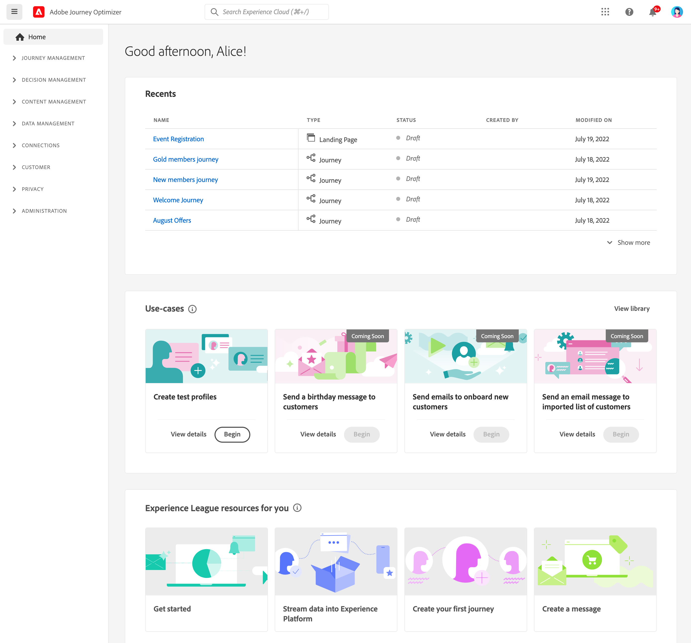
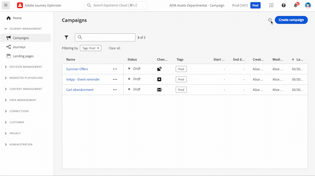

# Navigate the interface {#user-interface}

To access Adobe Journey Optimizer, sign in to [Adobe Experience Cloud](https://experience.adobe.com) with your Adobe ID, then select [!DNL Journey Optimizer].

>[!NOTE]
>
>* Components and capabilities available in your environment depend on your [permissions](../administration/permissions.md) and [licensing package](https://helpx.adobe.com/legal/product-descriptions/adobe-journey-optimizer.html){target="_blank"}.
>* This documentation is updated frequently. Some screenshots may differ slightly from your interface.

## Quick tour {#quick-tour}

The Journey Optimizer interface consists of four main areas:

1. **Left navigation** - Access all capabilities and features organized by function
2. **Top bar** - Universal search, help, notifications, and settings
3. **Home page** - Quick access to recent items and helpful resources
4. **Main workspace** - Where you create and manage your content

**Tip:** New users can start from the **Home** page to access recent items and use cases, or use the **Help** icon in the top bar for contextual guidance.

## Top bar features {#top-bar}

### Universal search {#search}

Use the search icon to quickly find journeys, campaigns, assets, and other objects across Journey Optimizer. Type keywords to see relevant results from all areas of the platform.

### Help & support {#help}

Click the **Help** icon to:

* Search help articles and videos
* Access contextual help for the current page
* Contact Adobe support
* Share feedback

Contextual help displays guidance relevant to the screen you are viewing and links directly to the corresponding documentation, so you can get the right information without leaving your workflow.

#### Support ticket guidelines {#support-ticket-guidelines}

When contacting Adobe support, include the following to help expedite root cause analysis and resolution:

* **Environment details** – Sandbox name, organization ID, and product area (e.g., Journeys, Campaigns, Decisioning)
* **Impact level** – Severity of the issue (e.g., production blocked, limited functionality, cosmetic)
* **Replication steps** – Clear, step-by-step instructions to reproduce the issue
* **Logs or screenshots** – Relevant error messages, request IDs, or screenshots that illustrate the problem
* **Relevant IDs** – Journey ID, campaign ID, audience ID, or other object identifiers related to the issue

### Notifications {#in-product-uc}

Enable in-product and email notifications to stay informed about:

* **Alerts** - System failures and performance issues
* **Approvals** - Requests requiring your review
* **New releases** - Product updates and new features

To configure notifications:

1. Click your profile icon and select **[!UICONTROL Preferences]**
2. Under **[!UICONTROL Notifications]**, find **[!UICONTROL Journey Optimizer]**
3. Enable the notification types you want to receive

{width="60%" align="center"}

### Language preferences {#language}

The interface is available in English, French, German, Italian, Spanish, Portuguese (Brazilian), Japanese, Korean, Traditional Chinese, and Simplified Chinese.

To change your language:

1. Click **[!UICONTROL Preferences]** in your profile menu
2. Select your preferred language
3. Optionally select a second language as fallback
4. Click **Save**

Keyboard shortcuts and accessibility features are available. [Learn more](accessibility.md)

## Home page {#home-page}

The home page provides:

* **Recents** - Shortcuts to recently created events, journeys, campaigns, and other objects
* **Use cases** - Pre-built scenarios to help you get started quickly (create test profiles, send birthday messages, etc.)
* **Resources** - Links to documentation, tutorials, and support

### Use cases and quick-start workflows {#use-cases}

Quick-start workflows help you accomplish common tasks:

* **Create test profiles** - Generate test profiles using CSV templates
* **Send birthday messages** - Automatically send birthday emails (coming soon)
* **Onboard new customers** - Welcome series for new customers (coming soon)
* **Send push to imported lists** - Quick push notifications from CSV data (coming soon)

Click **[!UICONTROL View details]** to learn more about each use case, or **[!UICONTROL Begin]** to start.

## Left navigation {#left-nav}

The left navigation organizes Journey Optimizer capabilities into functional categories. Available menu items depend on your permissions and license.

| Section | Purpose |
|---------|---------|
| Journey Management | Campaigns, journeys, reports |
| Decision Management | Offers and personalization |
| Content Management | Assets, templates, fragments, landing pages |
| Data Management | Schemas, datasets, queries |
| Connections | Sources and destinations |
| Customer | Audiences, profiles, identities |
| Privacy | Policies, requests, audit |
| Administration | Configurations, channels, sandboxes |

### Main sections {#main-sections}

**Home** - Your starting point with quick access to recently created items and helpful resources

**Journey Management** - Create and manage customer experiences

* **Campaigns** - Create one-time or scheduled messages to specific audiences. [Get started with campaigns](../campaigns/get-started-with-campaigns.md)
* **Journeys** - Build multi-step, cross-channel customer experiences. [Create your first journey](../building-journeys/journey-gs.md)
* **Reports** - Analyze performance with integrated Customer Journey Analytics reporting. [View reporting documentation](../reports/campaign-global-report-cja.md)

**Decision Management** - Manage personalized offers. [Learn about decision management](../offers/get-started/starting-offer-decisioning.md)

* **Offers** - Create and manage personalized offers
* **Components** - Set up placements, rules, and tags for offers

**Content Management** - Create and organize content

* **Assets** - Centralized repository for images and media. [Manage assets](../integrations/assets.md)
* **Content templates** - Reusable message templates for campaigns and journeys. [Create templates](../content-management/content-templates.md)
* **Fragments** - Content blocks that can be used across multiple messages. [Work with fragments](../content-management/fragments.md)
* **Landing pages** - Web forms for subscriptions and preferences. [Design landing pages](../landing-pages/get-started-lp.md)
* **Use Case Playbooks** - Pre-built workflows for common marketing scenarios. [Explore playbooks](ai-features.md#playbooks)

**Data Management** - Manage your data foundation. [Learn about schemas and datasets](../data/get-started-schemas.md)

* **Schemas** - Define data structure
* **Datasets** - Store and manage data collections
* **Queries** - Write and execute queries
* **Monitoring** - Track data ingestion

**Connections** - Integrate with other systems

* **Sources** - Ingest data from external systems. [Configure sources](get-started-sources.md)
* **Destinations** - Export data to cloud storage. [Set up destinations](../data/export-datasets.md)

**Customer** - Manage audiences and profiles

* **Audiences** - Create and manage customer segments. [Work with audiences](../audience/about-audiences.md)
* **Subscription lists** - Manage opt-in lists. [Manage subscriptions](../landing-pages/subscription-list.md)
* **Profiles** - View unified customer profiles. [Explore profiles](../audience/get-started-profiles.md)
* **Identities** - Manage identity resolution. [Learn about identities](../audience/get-started-identity.md)

**Privacy** - Control privacy and compliance. [Privacy overview](../privacy/get-started-privacy.md)

* **Policies** - Define data governance policies
* **Requests** - Handle privacy requests (GDPR, CCPA)
* **Audit** - Review activity logs. [View audit logs](../privacy/audit-logs.md)
* **Data Lifecycle** - Configure data retention

**Administration** - Configure system settings. [Access control overview](../administration/permissions-overview.md)

* **Configurations** - Set up events, data sources, and actions. [Configure channels](../configuration/get-started-configuration.md)
* **Business rules** - Control message frequency and journey entry. [Set up business rules](../conflict-prioritization/rule-sets.md)
* **Alerts** - View and manage system alerts. [Monitor alerts](../reports/alerts.md)
* **Sandboxes** - Manage environments and copy objects between sandboxes. [Work with sandboxes](../administration/sandboxes.md)
* **Channels** - Configure channel settings and deliverability. [Set up channel configurations](../configuration/channel-surfaces.md) | [Get started with configuration](../configuration/get-started-configuration.md)
* **Tags** - Organize and categorize content. [Work with unified tags](search-filter-categorize.md#tags)

## AI assistant {#ai-assistant}

AI Assistant provides instant help and operational insights. Click the AI Assistant icon in the top bar to:

* Get answers about product features
* Receive operational insights about your journeys
* Navigate concepts and best practices

[Learn more about AI Assistant](ai-features.md#ai-assistant)

## Related topics {#related-topics}

* [Choose your learning path by role](quick-start.md)
* [Search, filter, and categorize content](search-filter-categorize.md)
* [Understanding how Journey Optimizer works](understanding-ajo.md)
* [Accessibility features](accessibility.md)

<!--CONTEXTUAL HELP TO DISPATCH IN DOCS ONCE FEATURE LIVE-->

<!--ORCHESTRATED CAMPAIGNS - Overview page-->

<!--OVERVIEW TAB ORCHESTRATED CAMPAIGNS SKU only-->

>[!CONTEXTUALHELP]
>id="ajo_oc_campaign_ovv_1"
>title="Campaign orchestration"
>abstract="Split, combine, enrich and manipulate relational datasets to define your audience"

>[!CONTEXTUALHELP]
>id="ajo_oc_campaign_ovv_2"
>title="Leverage multi-entity data"
>abstract="Learn how Orchestrated campaigns can take advantage of relational datasets to enrich data for segmentation & personalization"

>[!CONTEXTUALHELP]
>id="ajo_oc_campaign_ovv_3"
>title="Ad-hoc segmentation & exact counts"
>abstract="Build your segment step by step with exact counts"

>[!CONTEXTUALHELP]
>id="ajo_oc_campaign_ovv_4"
>title="Available channels"
>abstract="Email, SMS, Push notifications, Direct mail"

<!--OVERVIEW TAB ORCHESTRATED CAMPAIGNS + JOURNEYS SKU -->

>[!CONTEXTUALHELP]
>id="ajo_oc_jo_campaign_ovv_1"
>title="Guided UI to create and send a campaign"
>abstract="Set one or multiple actions with a channel, choose an audience, set the content, define a schedule and you are ready to send"

>[!CONTEXTUALHELP]
>id="ajo_oc_jo_campaign_ovv_2"
>title="Available channels"
>abstract="Email, SMS, Push notifications, In-app, Web, Code-based experiences"

<!--OVERVIEW TAB ORCHESTRATED CAMPAIGNS - API triggered tab -->

>[!CONTEXTUALHELP]
>id="ajo_oc_api_campaign_ovv_1"
>title="Transactional API triggered campaigns"
>abstract="Trigger real-time messages through API calls"

>[!CONTEXTUALHELP]
>id="ajo_oc_api_campaign_ovv_2"
>title="Marketing messages"
>abstract="Promotional content (requires opt-in, subject to business rules)"

>[!CONTEXTUALHELP]
>id="ajo_oc_api_campaign_ovv_3"
>title="Transactional messages"
>abstract="Service-related content (confirmation, alerts, not subject to marketing consent)"

>[!CONTEXTUALHELP]
>id="ajo_oc_api_campaign_ovv_4"
>title="Available channels"
>abstract="Email, SMS, Push notifications"

<!--APPROVAL POLICIES-->

>[!CONTEXTUALHELP]
>id="ajo_campaigns_edit_disabled"
>title="Edit disabled"
>abstract="Edit disabled (campaigns)"

>[!CONTEXTUALHELP]
>id="ajo_journey_edit_disabled"
>title="Edit disabled"
>abstract="Edit disabled (journeys)"

>[!CONTEXTUALHELP]
>id="ajo_approval_policy_approval_status"
>title="Approval status"
>abstract="Approval status"

>[!CONTEXTUALHELP]
>id="ajo_campaigns_approve"
>title="Approve"
>abstract="Approve (campaigns)"

>[!CONTEXTUALHELP]
>id="ajo_journey_approve"
>title="Approve"
>abstract="Approve (journeys)"

>[!CONTEXTUALHELP]
>id="ajo_journey_simulation"
>title="Simulate your journey"
>abstract="Journey Simulation allows you to validate your journeys and see how they perform before they are activated. It uses data from a trained model to provide numbers across the whole journey to see how the journey will behave in a real world scenario."

<!-- WEBHOOKS -->

>[!CONTEXTUALHELP]
>id="ajo_channels_feedback_webhook_settings"
>title="Enable webhooks"
>abstract="Enable webhooks to receive real-time feedback on the execution status of your messages. Before activating this option, make sure you have configured a webhook in the **Administration** / **Channels** / **Feedback Webhook** menu."

>[!CONTEXTUALHELP]
>id="ajo_channels_feedback_webhook_settings_create"
>title="Feedback Webhooks"
>abstract="Feedback webhooks allows you to receive real-time feedback on the execution status of messages sent with transactional API triggered campaigns. Only one webhook configuration per Organization + sandbox combination is allowed."

>[!CONTEXTUALHELP]
>id="ajo_channels_feedback_webhook_settings_configuration"
>title="Basic Configuration"
>abstract="In this section, enter a descriptive name to identify the webhook and select the channel(s) for which this webhook should receive feedback (Email and/or SMS). In the Webhook URL field, provide the HTTPS endpoint where feedback events must be delivered."

>[!CONTEXTUALHELP]
>id="ajo_channels_feedback_webhook_settings_authentication"
>title="Authentication"
>abstract="If your endpoint requires JWT authentication, select **JWT Authentication** from the list and provide the required details."

>[!CONTEXTUALHELP]
>id="ajo_channels_feedback_webhook_settings_header_parameters"
>title="Header Parameters"
>abstract="In this section, you can configure additional custom headers to be sent with each webhook request."
