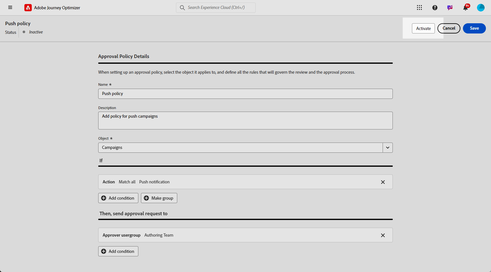
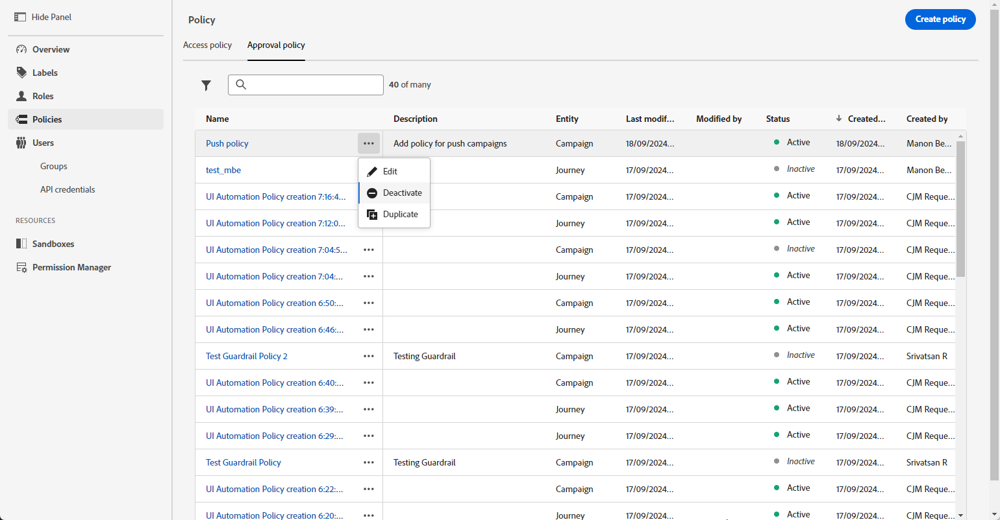

# Create & manage approval policies {#approval-policies}

>[!CONTEXTUALHELP]
>id="ajo_approval_policy_request_approval"
>title="Request approval"
>abstract="Request approval"

>[!CONTEXTUALHELP]
>id="ajo_approval_policy_request_change"
>title="Request change"
>abstract="Request change"

>[!NOTE]
>
>To create approval policies, you must have system or product administrator privileges in Adobe Experience Platform. [Learn more](https://experienceleague.adobe.com/en/docs/experience-platform/access-control/home)

Approval policies allow administrators to establish a validation process for journeys and campaigns. This system outlines specific conditions that determine whether a journey or campaign requires approval. These policies can vary in complexity, from simply requiring all campaigns to be reviewed by a particular user or team, to establishing criteria based on who created the campaign.

## Create approval policies {#create-policies}

>[!CONTEXTUALHELP]
>id="ajo_permissions_approval_policy"
>title="New approval policy"
>abstract="In this screen, enter the name and select the context for the approval policy, then build the conditions to determine who can initiate the approval request and who can validate it."

To create an approval policy, follow these steps:

1. From the **[!UICONTROL Administration]** menu in Journey Optimizer, access **[!UICONTROL Permissions]** then **[!UICONTROL Policies]**.

    

1. Click **[!UICONTROL Create]** in the **[!UICONTROL Approval Policy]** tab, choose **[!UICONTROL Approval Policy]**, and click **[!UICONTROL Confirm]**.

1. Enter a **[!UICONTROL Name]** and **[!UICONTROL Description]** for the policy.

1. Select whether the policy will apply to **[!UICONTROL Journeys]** or **[!UICONTROL Campaigns]**.

    

You can now refine the conditions to specify who can initiate the approval request and who can validate it.

## Set conditions for approval policies {#conditions}

To define the conditions associated to an approval policy, follow these steps:

1. Access your **[!UICONTROL Approval policy]**.

1. Under the **[!UICONTROL If]** menu, click **[!UICONTROL Add condition]** to define which object or user will trigger an approval request.

1. Choose the appropriate **[!UICONTROL Category]**, **[!UICONTROL Matching Rule]**, and **[!UICONTROL Options]**. 

    For example, "if Action match any Direct Mail" or "If Requestor Username match John Doe."
  
    

    +++ Learn more on available categories and options
    <table>
    <tr>
      <th>Category</th>
      <th>Option</th>
    </tr>
    <tr>
      <td rowspan="3">Campaign type</td>
      <td>Scheduled (Marketing)</td>
    </tr>
    <tr>
    <td>API-triggered (Marketing)</td>
    </tr>
    <tr>
    <td>API-triggered (Transactional)</td>
    </tr>
    <tr>
    <td rowspan="8">Action</td>
    <td>In-app</td>
    </tr>
    <tr>
    <td>Push notification</td>
   </tr>
    <tr>
    <td>SMS</td>
    </tr>
    <tr>
    <td>Email</td>
    </tr>
    <tr>
    <td>Direct mail</td>
    </tr>
    <tr>
    <td>Web</td>
    </tr>
    <tr>
    <td>Code-based</td>
    </tr>
    <tr>
    <td>Content card</td>
    </tr>
    <tr>
    <td>Requestor username</td>
    <td>Name and email address of designed requestor</td>
    </tr>
    <tr>
    <td>Requestor user group</td>
    <td>Name of the user group of designed requestors</td>
    </tr>
    </table>

1. To add more criteria, click **[!UICONTROL Add condition]** to define additional rules and select either **[!UICONTROL And]** or **[!UICONTROL Or]** to specify how the conditions are connected.

1. Under the **[!UICONTROL Then, send approval request to]** menu, click **[!UICONTROL Add condition]** to define which user can accept the approval request.

1. From the **[!UICONTROL Category]** drop-down, select whether you want to choose a User Group or an individual User. 

1. Then, from the **[!UICONTROL Option]** drop-down, select the specific user group or user.

    The selected user or user group will be responsible for validating the approval request.

    

1. To add more criteria, click **[!UICONTROL Add condition]** to define additional rules and select either **[!UICONTROL And]** or **[!UICONTROL Or]** to specify how the conditions are connected.

1. Once your policy is fully configured, click **[!UICONTROL Save]**.

You can now activate your approval policy to apply it.

## Activate and manage approval policies {#activate-policies}

1. Access your **[!UICONTROL Approval policy]**.

1. Then, click **[!UICONTROL Activate]** to apply the configured conditions to your environment.

    >[!NOTE]
    >
    >Once activated, policies cannot be edited. To modify conditions, deactivate the policy first.

    

1. From the **[!UICONTROL Policy]** menu, open the advanced options to **[!UICONTROL Edit]**, **[!UICONTROL Deactivate]**, or **[!UICONTROL Duplicate]** the policy as needed.

    
