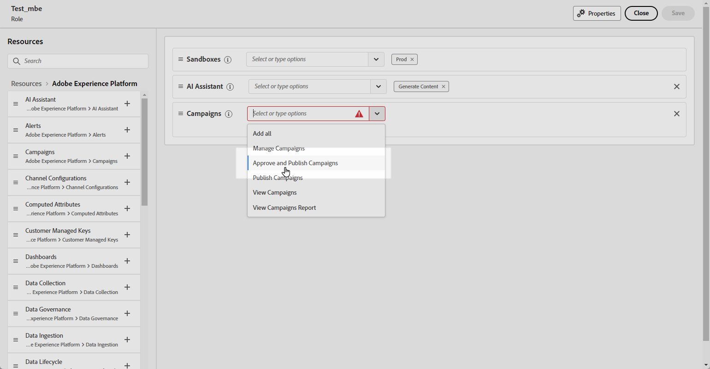
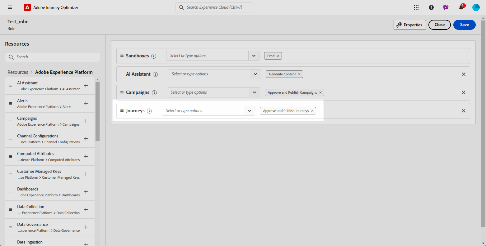
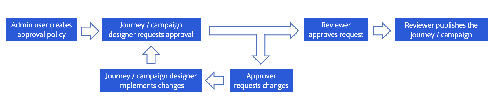
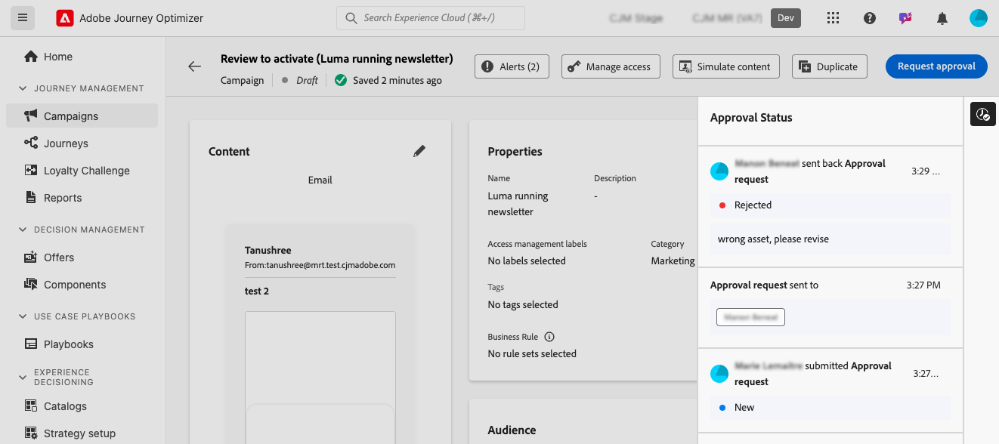

# Get started with journeys & campaigns approval {#send-proofs}

## Get started with approval policies {#gs}

[!DNL Journey Optimizer] allows you to set up an approval process that enables marketing teams to ensure campaigns and journeys are reviewed and signed off by the appropriate stakeholders before they go live.

Approval policies introduce a structured workflow directly within the user interface, eliminating the need for external mediums such as email or task management tools, and ensuring all approvals are centrally managed and tracked.

In addition, this feature provides enhanced control on the publication of your journeys and campaigns: With the approval process embedded within Journey Optimizer, campaigns and journeys remain in a "locked" state during review, ensuring that no changes or unintended activations occur before all necessary approvals are in place.

## Prerequisites {#prerequisites}

Before starting, make sure the permissions below have been configured.

To approve and publish journeys and campaigns, users need to be granted the **Approve & publish Campaigns** and **Approve & publish Journeys** permissions. [Learn more](../administration/permissions.md)

+++  Learn how to assign approval-related permissions

1. In the **Permissions** product, go to the **Roles** tab and select the desired **Role**.
    
1. Click **Edit** to modify the permissions.

1. Add the **Campaigns** resource, then select **Approve & publish Campaigns** from the drop-down menu.

    {zoomable="yes"}

1. Add the **Journeys** resource, then select **Approve & publish Journeys** from the drop-down menu.

    {zoomable="yes"}

1. Click **Save** to apply changes.

Any users already assigned to this role will have their permissions automatically updated.

1. To assign this role to new users, navigate to the **Users** tab within the **Roles** dashboard and click **Add User**.

1. Enter the user's name, email address, or choose from the list, then click **Save**.

1. If the user was not previously created, refer to [this documentation](https://experienceleague.adobe.com/en/docs/experience-platform/access-control/abac/permissions-ui/users).

The user will receive an email with instructions to access your instance.

+++

## Approval process overview {#process}

The global approval process is as follows:

{zoomable="yes"}

1. **Approval policies setup**

    An admin user creates an approval policy, defining conditions under which the policy should apply to journeys or campaigns. For example, you can create an approval policy that requires all scheduled campaigns created by a given user to be approved before activation. [Learn how to create approval policies](approval-policies.md)

1. **Campaign/journey submission for approval**

    The campaign/journey creators build a journey or campaign and submit it for approval. The campaign/journey enters an "In Review" state, during which no edits can be made unless the request is canceled. [Learn how to request approval](request-approval.md)

    >[!NOTE]
    >
    >Campaigns and journeys only need to be submitted for approval if an approval policy is in place. If no such policy applies, the creator can directly publish the campaign or journey without requiring approval.

1. **Review and approval**

    The approver(s) defined in the approval policy that applies to the journey or campaign receive(s) a notification. They can review the journey or campaign content, audience, and settings. If changes are needed, the approver requests them, returning the campaign to "Draft" for revisions. If ready, they can activate and launch the journey or campaign. [Learn how to review and approve a request](review-approve-request.md)

## Monitor approval requests {#monitor}

You can monitor all the approval and change requests that have been submitted for a given journey or campaign. To do this, click the **[!UICONTROL Show Audit Trail]** icon located in the upper-right section of the journey canvas or the campaign review screen.

## Frequently asked questions {#faq}

+++Do I need to create an approval policy for every campaign or journey?

No. Approval policies are conditional. You only need to create a policy if you want to enforce review for a specific set of campaigns or journeys (e.g., all scheduled campaigns created by a specific team). If no policy applies to a campaign or journey, the creator can publish directly without requesting approval.

+++

+++What happens if the approver is unavailable?

The request stays "In Review" until an approver acts on it. You can cancel the request (returning the item to "Draft") and resubmit once the right approver is available. Admins can also update the approval policy to add additional approvers.

+++

+++Can I edit a campaign or journey while it is pending approval?

No. Once submitted for approval, the campaign or journey is in a locked "In Review" state. To make changes, the creator or an approver must cancel the request first. The item returns to "Draft" and can be edited before resubmitting.

+++

+++I don't see the Approve & publish permission in the drop-down — what should I check?

Ensure you are adding the correct resource first. The **Approve & publish Campaigns** permission requires the **Campaigns** resource to be added to the role, and **Approve & publish Journeys** requires the **Journeys** resource. Both must be added separately. [Learn how to assign approval-related permissions](#prerequisites)

+++

+++How does [!DNL Journey Optimizer] determine which approval policy applies if more than one policy could match?

When several active approval policies could apply to the same journey or campaign, the policy that was **activated most recently** takes precedence. The approver user groups defined in that policy are the ones that are notified and that govern the request.

[Learn more](approval-policies.md#multiple-policies)

+++

+++If a requestor belongs to multiple user groups, can they choose which group the approval request is sent to?

No. Requestors cannot manually select which user group receives or routes the approval request. The user groups specified in the approval policy that applies—according to [policy precedence](approval-policies.md#multiple-policies)—are notified automatically.

+++

## Additional resources

* **[Create approval policies](approval-policies.md)** - Learn how to set up approval policies to enforce review workflows for campaigns and journeys.
* **[Request approval](request-approval.md)** - Understand how to submit content for approval and track approval status.
* **[Review and approve requests](review-approve-request.md)** - Discover how to review, approve, or reject approval requests as an approver.
* **[Simulate with sample inputs](simulate-sample-input.md)** - Learn how to test and validate content using sample profile data.
