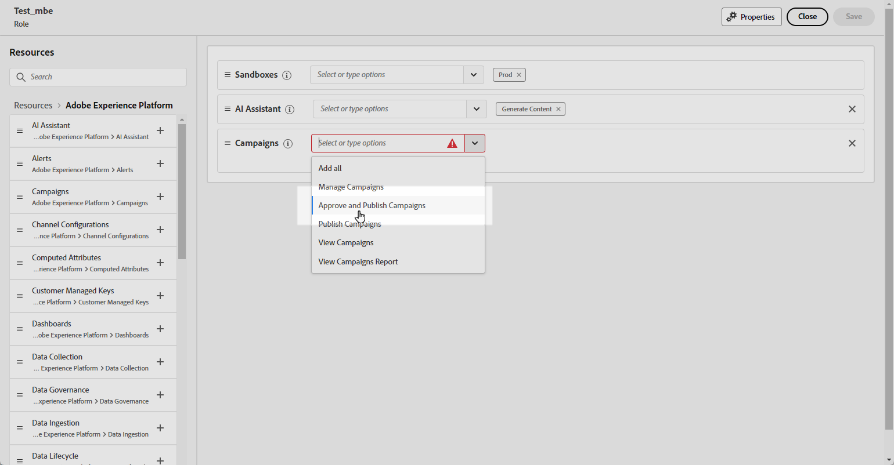

# Get started with journeys & campaigns approval {#send-proofs}

## Get started with approval policies {#gs}

Journey Optimizer allows you to set up an approval process that allows marketing teams to ensure campaigns and journeys are reviewed and signed off by the appropriate stakeholders before they go live.

Approval policies introduce a structured workflow directly within the user interface, eliminating the need for external mediums such as email or task management tools, and ensuring all approvals are centrally managed and tracked.

In addition, this feature provides enhanced control on the publication of your journeys and campaigns: With the approval process embedded within Journey Optimizer, campaigns and journeys remain in a "locked" state during review, ensuring that no changes or unintended activations occur before all necessary approvals are in place.

## Prerequites {#prerequisites}

Before starting, make sure the permissions below have been configured.

To access approve and publish journeys and campaigns, users need to be granted the **Approve & publish Campaigns** and **Approve & publish Journeys** permissions. [Learn more](../administration/permissions.md)

+++  Learn how to assign Approval related permissions

1. In the **Permissions** product, go to the **Roles** tab and select the desired **Role**.
    
1. Click **Edit** to modify the permissions.

1. Add the **Campaigns** resource, then select **Approve & publish Campaigns** from the drop-down menu.

    {zoomable="yes"}

1. Add the **Journeys** resource, then select **Approve & publish Journeys** from the drop-down menu.

    {zoomable="yes"}

1. Click **Save** to apply changes.

Any users already assigned to this role will have their permissions automatically updated.

1. To assign this role to new users, navigate to the **Users** tab within the **Roles** dashboard and click **Add User**.

1. Enter the user's name, email address, or choose from the list, then click **Save**.

1. If the user was not previously created, refer to the [this documentation](https://experienceleague.adobe.com/en/docs/experience-platform/access-control/abac/permissions-ui/users).

The user will receive an email with instructions to access your instance.

+++

## Approval process overview {#process}

The global approval process is as follows:

{zoomable="yes"}

1. **Approval policies setup**

    An admin users creates an approval policy, defining conditions under which the policy should apply to journeys or campaigns. For example, you can create an approval policy that requires that all scheduled campaigns created by a given user should be approved before being activated. [Learn how to create approval policies](approval-policies.md)

1. **Campaign/journey submission for approval**

    The campaign/journey creators build a journey or campaign and submits it for approval. The campaign/journey enters an "In Review" state, during which no edits can be made unless the request is canceled. [Learn how to request approval](request-approval.md)

    >[!NOTE]
    >
    >Campaigns and journeys only need to be submitted for approval if an approval policy is in place. If no such policy applies, the creator can directly publish the campaign or journey without requiring approval.

1. **Review and approval**

    The approver(s) defined in the approval policy that applies to the journey or campaign receive(s) a notification. They can review the journey or campaign content, audience, and settings. If changes are needed, the approver requests them, returning the campaign to "Draft" for revisions. If ready, they can activate and launch the journey or campaign. [Learn how to review and approve a request](review-approve-request.md)

## Monitor approval requests {#monitor}

You can monitor all the approval and change requests that have been submitted for a given journey or campaign. To do this, click the **[!UICONTROL Show Audit Trail]** icon located in the upper-right section of the journey canvas or the campaign review screen.

