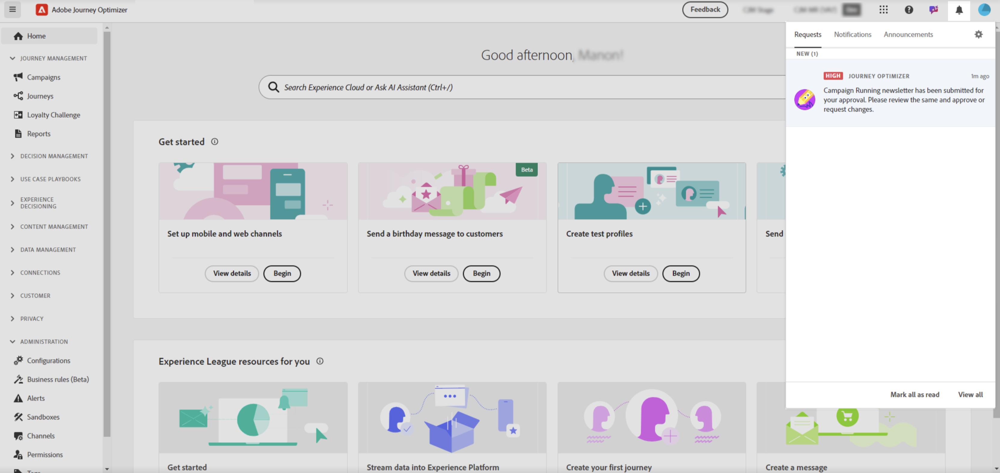
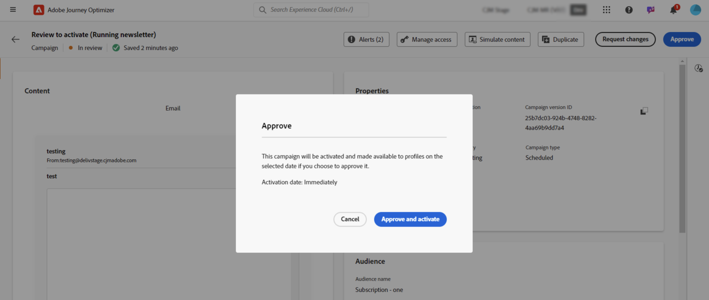
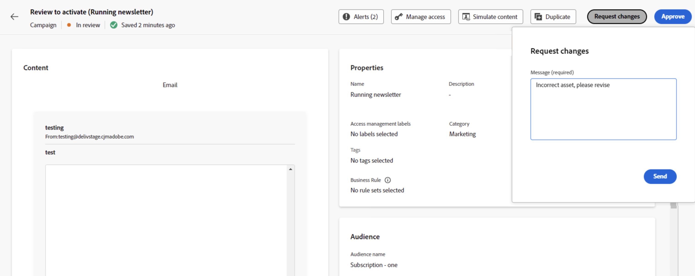

# Review & approve a request {#approve-requests}

If an approval policy applies to a journey or campaign, it needs to be submitted for approval in order to be published. To do this, the journey/campaign creator sends a request to the approver(s) defined in the approval policy and the journey/campaign gets an **[!UICONTROL In review]** status.

If you have been selected as approver, you are notified through an email and a Journey Optimizer alert, which is accessible when clicking the bell icon on top right of the screen, in the **[!UICONTROL Requests]** tab.

To review the journey/campaign, open it from the email or alert, and check its settings such as its audience, content, or settings. 
Once done, you can either [approve and publish the journey/campaign](#approve), or [request changes before activating it](#changes).

>[!NOTE]
>
>Reviewing a campaign is a read-only step: you can visualize all its settings but cannot perform any action on it.
>
>Before reviewing a journey or campaign, make sure you have the required permissions.

## Approve & publish a journey/campaign {#approve}

If a journey or campaign is ready to go live, you can approve it by clicking the **[!UICONTROL Approve]** button.

In the window that displays, click **[!UICONTROL Approve and activate]** to make the journey/campaign live.

## Request changes to a journey/campaign {#changes}

If changes are needed in a journey or campaign that has been sent for approval, you can send a request to the creator so that they make the necessary changes.

To do this, click the **[!UICONTROL Request changes]** button. In the pane that opens, provide a message detailing your request and click **[!UICONTROL Send]** to submit your request.

After sending the request, the journey/campaign creator is notified through an email and a Journey Optimizer alert. The campaign returns to the "Draft" status. Once changes have been integrated, the journey/campaign creator can resubmit it for approval.

>[!NOTE]
>
> If you are not receiving approval notification through an email, you need to update your subscription preferences in your Experience Cloud profiles. [Learn more](https://experienceleague.adobe.com/en/docs/core-services/interface/features/account-preferences)
