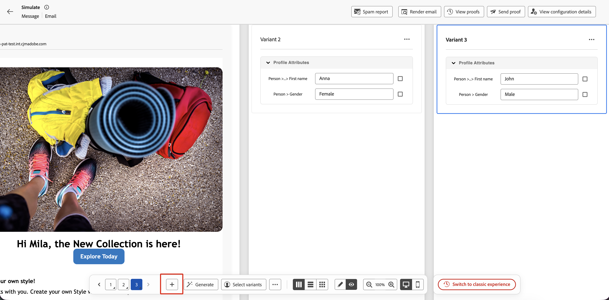
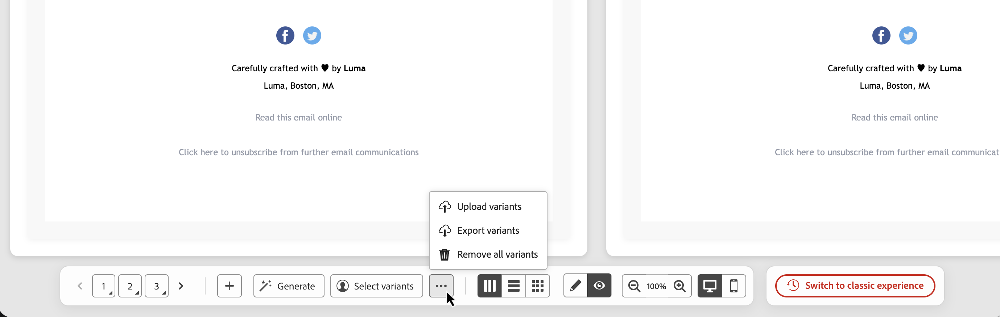
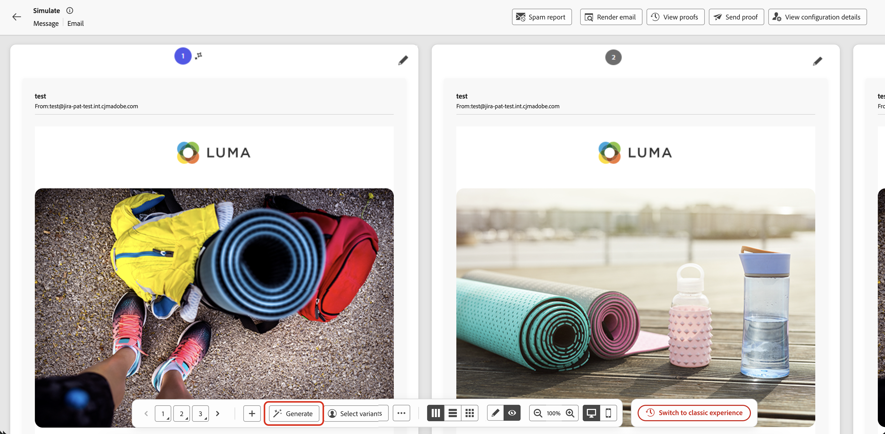
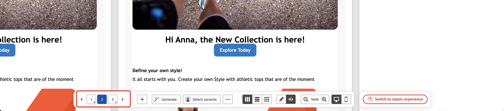
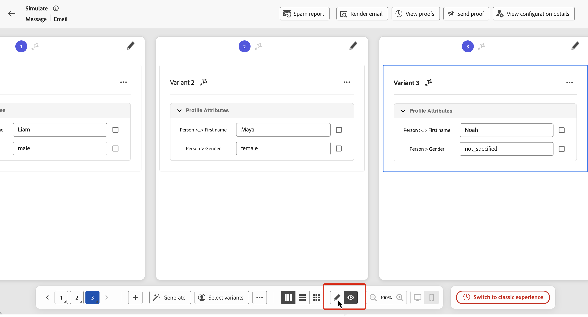
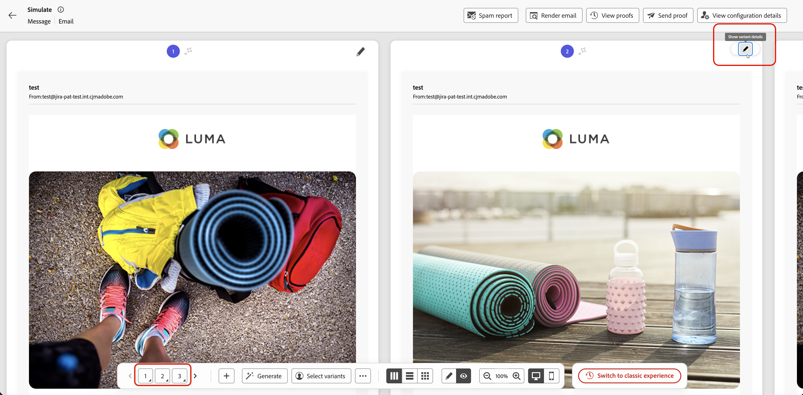
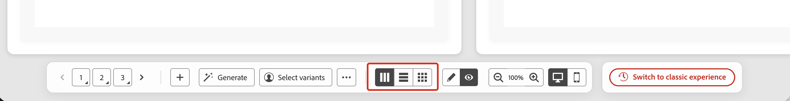
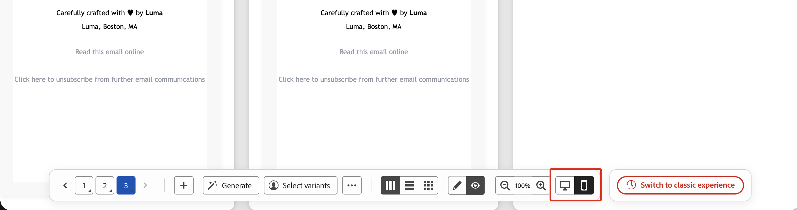
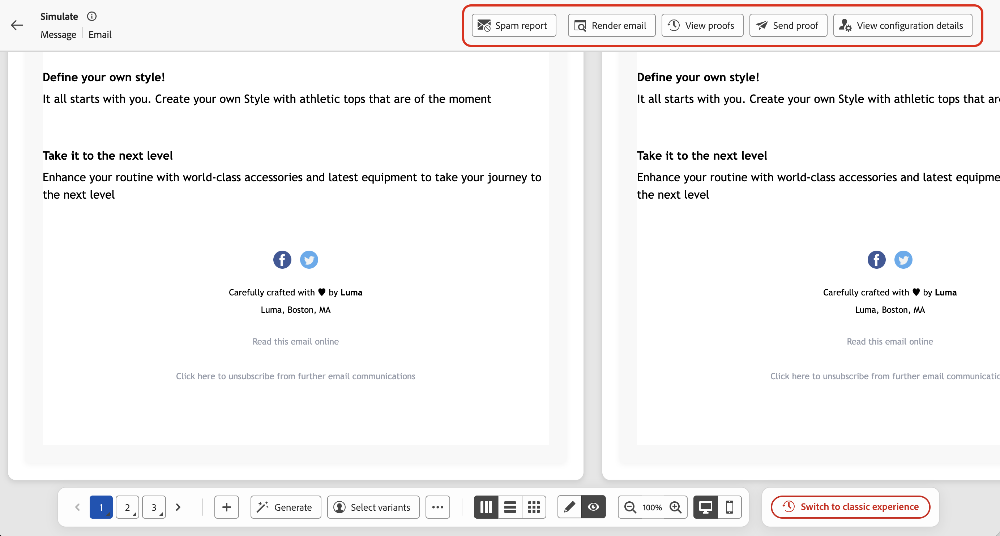

# Simulate content variations {#simulate-content-variations}

>[!BEGINSHADEBOX]

**On this page:** Preview all your content variants at a glance in a side-by-side grid, manage them from a consolidated bottom action bar, and switch back to the classic experience at any time.

>[!ENDSHADEBOX]

The **[!UICONTROL Simulate content variations]** experience has been redesigned to make testing and comparing your variants faster and easier. All variants now render together in a single scrollable grid, and every control you need is available from a single bottom action bar.

To access the new experience, from your content, click **[!UICONTROL Simulate content]** to open the content simulation screen. If variants are already available, the preview grid is shown immediately. If none exist yet, a blank variant is displayed and you can start creating them using any of the methods described below.

If you prefer the previous layout, click **[!UICONTROL Switch to classic experience]** in the bottom action bar at any time. The classic experience documentation is available at [Simulate content variations (classic experience)](simulate-sample-input.md).

## Create and manage variants {#manage-variants}

Variants can be created in different ways: manually one by one or by importing a file, by generating them with AI, or by selecting existing simulated users. You can add up to 30 variants manually or via file upload. When using AI generation, up to 40 variants can be created depending on your content's complexity.

### Add variants manually {#add-variants}

To add a blank variant manually, click **[!UICONTROL +]** in the bottom action bar. A new blank variant is added and you can enter the attribute values directly.

You can also use **[!UICONTROL ...]** > **Upload variants** to import a CSV, JSON, or JSONLINES file where each row or entry becomes a variant. Download the file template from the upload dialog to use the correct format.

### Auto-generate variants {#auto-generate}

To auto-generate variants using AI, click the **[!UICONTROL Generate]** button in the bottom action bar. The system analyzes your content, identifies personalization fields and conditional branches, and generates as many variants as needed to cover them with realistic values. AI-generated variants can be identified by the sparkle icon displayed on their card.

>[!CAUTION]
>
>Clicking **[!UICONTROL Generate]** replaces all existing variants, including any added manually or from a file.

### Select variants from simulated users {#simulated-users}

You can base your variants on **simulated users** which are reusable, profile-like test entities that are saved across sessions and can be shared with other users. Unlike manually entered variants, simulated users persist beyond the current browser session.

Simulated users are created and managed from the journey **[!UICONTROL Simulation]** feature. For the full procedure, see [Create and manage simulated users](../building-journeys/simulate-journey.md#test-users).

To use simulated users as variants:

1. Click **[!UICONTROL Select variants]** in the bottom action bar.
1. Select the simulated users you want to use from the list, then click **[!UICONTROL Select]**.

  

The selected simulated users are added as variants. You can edit a variant's attribute values locally for testing, but those changes are not saved back to the simulated user record.

### Export variants {#export-variants}

You can export all current variants, whether added manually, generated with AI, or selected from simulated users, to a CSV file. Click **[!UICONTROL ...]** in the bottom action bar, then select **[!UICONTROL Export variants]**.

## Preview variants {#preview-grid}

### Switch between variants {#switch-variants}

When in preview mode, all variants render side by side with a numbered indicator at the top. To switch between variants, click the number or use the **< >** navigation buttons in the bottom action bar.

### Display variants in preview or editing mode {#edit-variants}

You can display variants either in preview or editing mode, where you can edit the content and attribute values directly. Click **[!UICONTROL Preview]** or **[!UICONTROL Edit]** in the bottom action bar to switch all previews at once between the two modes.

To toggle a single variant individually, either click the **[!UICONTROL Show preview]** or **[!UICONTROL Show variant details]** button at the top of its card, or long-press its number in the bottom action bar (or use Alt + Up/Down).

### Change the layout {#change-layout}

To change the way variants are displayed, use the **bottom action bar** to switch between side by side, vertically stacked, or wrapped layouts.

### Switch between desktop and mobile views {#switch-views}

To display how variants will render on different devices, click the icons in the bottom action bar to switch between desktop and mobile views. The preview grid updates to show how the variants will look on the selected device.

## Additional capabilities for the Email channel {#email-capabilities}

When simulating email content, a top bar provides additional email-specific tools.

* **[!UICONTROL Spam report]** — Analyze your email content against spam filters and get a deliverability score. [Learn more](../content-management/spam-report.md)
* **[!UICONTROL Render email]** — Preview how your email renders across popular email clients and devices. [Learn more](../content-management/rendering.md)
* **[!UICONTROL Send proof]** — Send a proof of one or more variants to a set of email recipients. Click **[!UICONTROL Send proof]**, add up to 10 recipient addresses, select the variant(s) to include, then click **[!UICONTROL Send proof]** to confirm. To review previously sent proofs, click **[!UICONTROL View proofs]**. [Learn more](../content-management/proofs.md)
* **[!UICONTROL View configuration details]** — Review the channel configuration applied to this content.
