# Simulate content variations {#simulate-content-variations}

>[!BEGINSHADEBOX]

**On this page:** Create and manage named content variants, select which variants to render, compare their details and previews, and check for invalid links before sending your content.

>[!ENDSHADEBOX]

>[!CONTEXTUALHELP]
>id="ajo_simulate_content_variations"
>title="Simulate using sample input"
>abstract="In this screen, you can preview and compare content variants side by side. Create variants by entering values manually, uploading a CSV, JSON, or JSONL file, auto-generating them with AI, or selecting existing simulated users."

The **[!UICONTROL Simulate content variations]** experience has been redesigned to make testing and comparing your variants faster and easier. Variants render in a scrollable grid, with controls available directly on each card and in the bottom action bar. You can render all variants or select a subset to preview.

To access the new experience, from your content, click **[!UICONTROL Simulate content]** to open the content simulation screen. If variants are already available, the preview grid is shown immediately. If none exist yet, a blank variant is displayed and you can start creating them using any of the methods described below.

If you prefer the previous layout, click **[!UICONTROL Old experience]** in the bottom action bar at any time. The classic experience documentation is available at [Simulate content variations (classic experience)](simulate-sample-input.md).

## Create and manage variants {#manage-variants}

Variants can be created in different ways: manually one by one or by importing a file, by generating them with AI, or by selecting existing simulated users. You can add up to 30 variants manually or via file upload. When using AI generation, up to 40 variants can be created depending on your content's complexity.

### Add variants manually {#add-variants}

To add a blank variant manually, click **[!UICONTROL Add]** in the bottom action bar. A new blank variant is added and you can enter the attribute values directly.

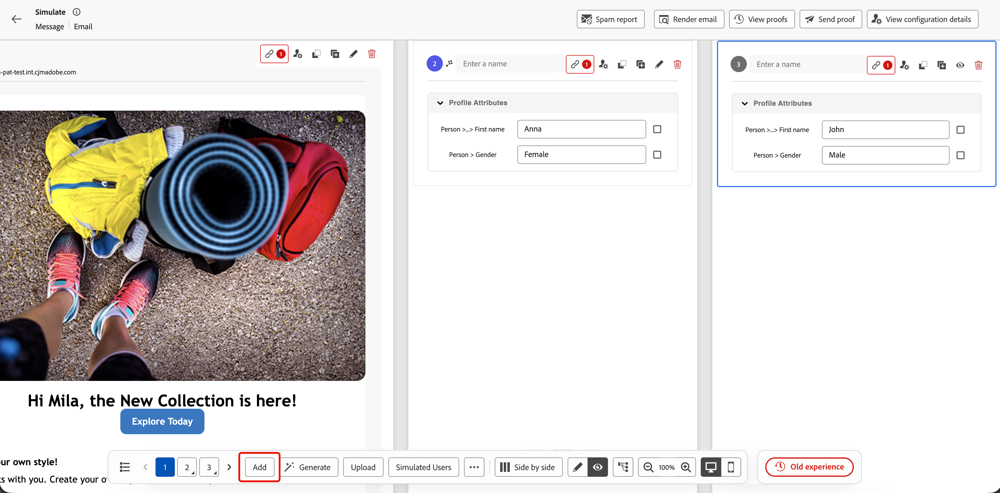

To import variants, click **[!UICONTROL Upload]** in the bottom action bar. You can upload a CSV, JSON, or JSONL (JSON Lines) file where each row or entry becomes a variant. Download the file template from the upload dialog to use the correct format. Variant names can be included in the uploaded file.

### Auto-generate variants {#auto-generate}

To auto-generate variants using AI, click the **[!UICONTROL Generate]** button in the bottom action bar. The system analyzes your content, identifies personalization fields and conditional branches, and generates as many variants as needed to cover them with realistic values. AI-generated variants can be identified by the sparkle icon displayed on their card.

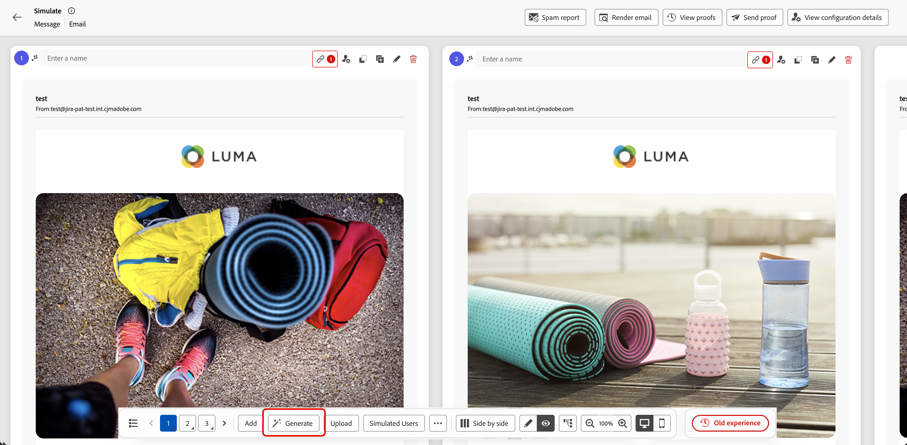

>[!CAUTION]
>
>Clicking **[!UICONTROL Generate]** replaces all existing variants, including any added manually or from a file.

### Select variants from simulated users {#simulated-users}

You can base your variants on **simulated users** which are reusable, profile-like test entities that are saved across sessions and can be shared with other users. Unlike manually entered variants, simulated users persist beyond the current browser session.

Simulated users are created and managed from the journey **[!UICONTROL Simulation]** feature. For the full procedure, see [Create and manage simulated users](../building-journeys/simulate-journey.md#test-users).

To use simulated users as variants:

1. Click the **[!UICONTROL Simulated Users]** button in the bottom action bar.
1. Select the checkboxes for the simulated users you want to use from the list.

    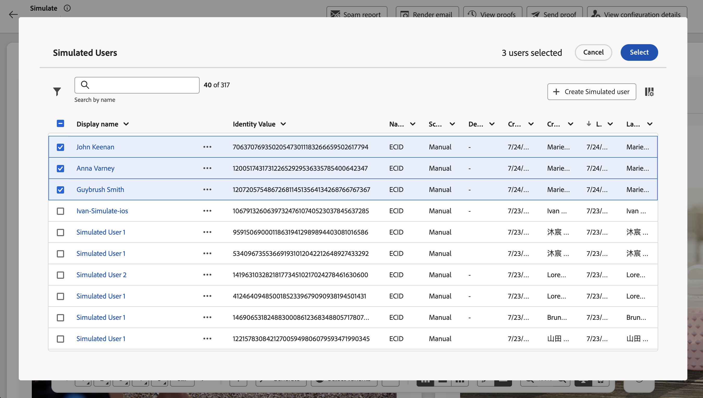

1. Click **[!UICONTROL Select]** to add the selected users as variants.

The selected simulated users are added as variants. You can edit a variant's attribute values locally for testing, but those changes are not saved back to the simulated user record.

### Manage variants from their cards {#variant-card-controls}

Each variant card provides controls to manage the variant without opening the bottom action bar's overflow menu.

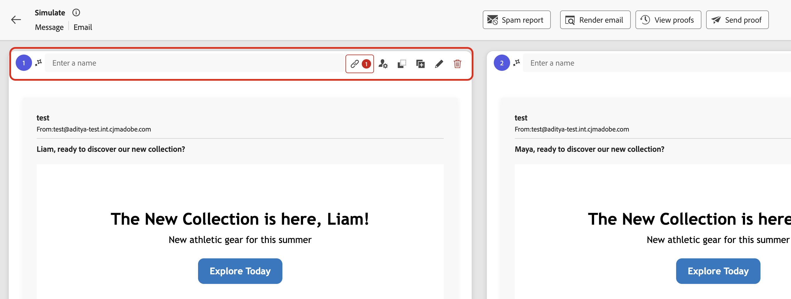

* **Name the variant** to distinguish it from other variants at a glance. Names are also displayed for variants created from simulated users or generated with AI.
* **URL check** to validate the links in the variant's content.
* **View configuration details** to see the channel and other settings associated with the variant (email only).
* **Copy attributes** directly from the card.
* **Duplicate the variant** to create a copy of an existing variant, then edit its attribute values for another test scenario.
* **Show variant details** to view and edit the attribute values for that variant.
* **Remove a variant** using control on its card.

### Export variants {#export-variants}

You can export all current variants, whether added manually, generated with AI, or selected from simulated users, to a CSV file. Click **[!UICONTROL ...]** in the bottom action bar, then select **[!UICONTROL Export variants]**.

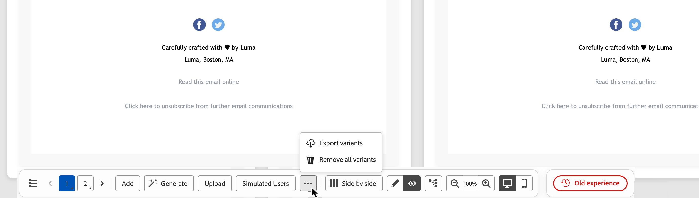

## Preview variants {#preview-grid}

### Select variants to render {#select-variants-to-render}

You can render all variants or select only the variants you want to preview from the full list. Unselected variants remain hidden until you show them again, they are not removed.

1. Click the variant list icon from the bottom action bar.
1. Select the checkboxes for the variants you want to render. Use **[!UICONTROL Select all]** to select or clear the full list.

    To find a specific variant, use the **[!UICONTROL Search variants]** field.

    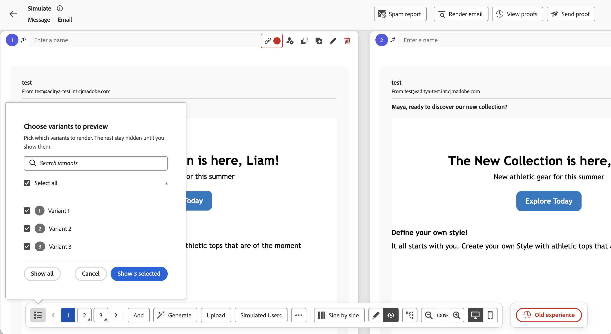

1. Click the blue button showing the number of selected variants, for example **[!UICONTROL Show 3 selected]**, to apply your selection.

To display every variant again, open the panel and click **[!UICONTROL Show all]**. Click **[!UICONTROL Cancel]** to close the panel without applying your selection.

### Switch between variants {#switch-variants}

When in preview mode, all variants render side by side with a numbered indicator at the top. To switch between variants, click the number or use the **< >** navigation buttons in the bottom action bar.

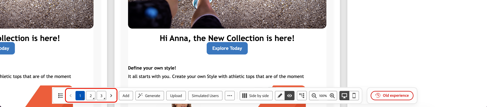

### Display variants in preview or editing mode {#edit-variants}

You can display variants either as content previews or as variant details, where you can edit their attribute values. Click the eye icon to show previews or the pencil icon to show variant details in the bottom action bar to switch all variants at once between the two modes.

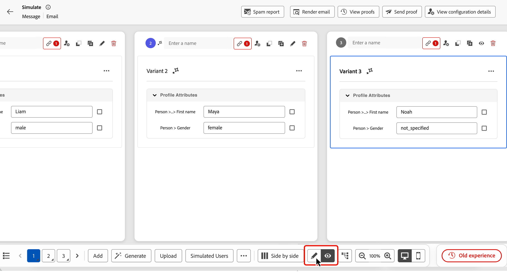

To toggle a single variant individually, click the eye icon to show its preview or the pencil icon to show its details at the top of its card. You can also long-press its number in the bottom action bar (or use Alt + Up/Down).

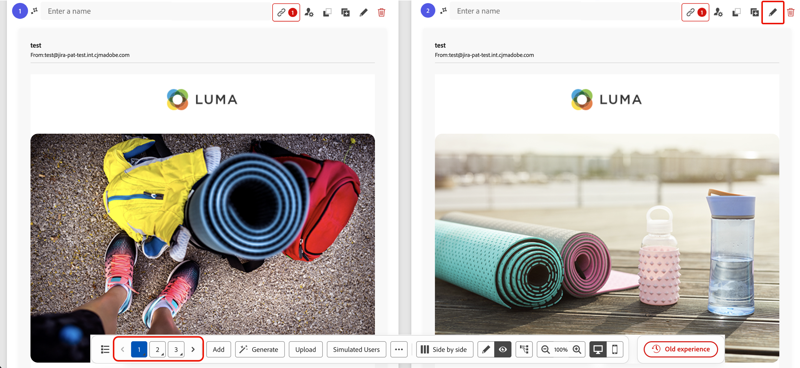

### Show full attribute paths {#attribute-paths}

Use the attribute-path toggle in the bottom action bar to show or hide full attribute paths in variant details. Show the full paths when you need to identify an attribute's location in the profile data.

 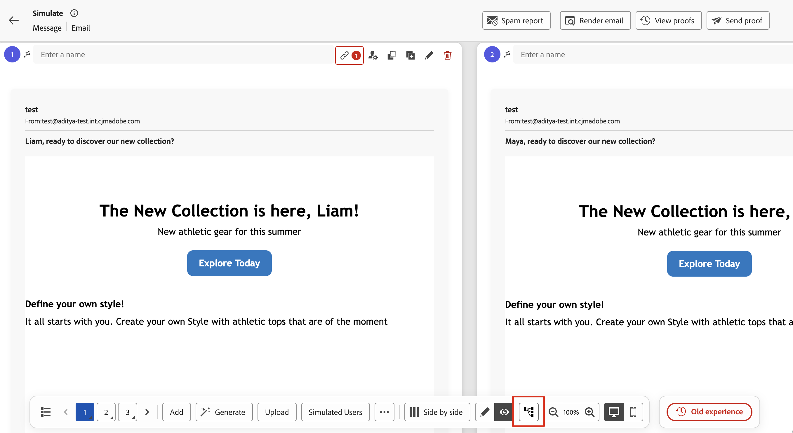

### Change the layout {#change-layout}

To change the way variants are displayed, click the layout selector in the bottom action bar, which shows the current layout, for example **[!UICONTROL Side by side]**. Select **[!UICONTROL Side by side]**, **[!UICONTROL Vertically stacked]**, or **[!UICONTROL Wrap]**.

In the **[!UICONTROL Vertically stacked]** layout, each variant's details and content preview are displayed side by side so you can compare attribute values with the rendered content.

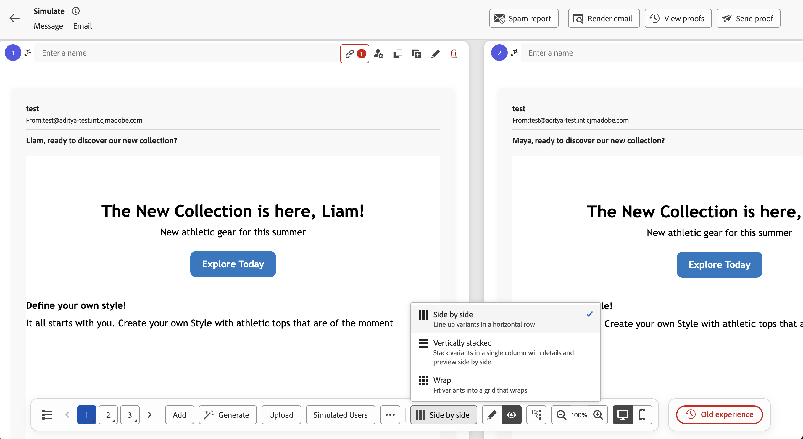

### Switch between desktop and mobile views {#switch-views}

When device-view controls are available for your content, click the desktop or mobile icon in the bottom action bar to switch between the two views. The preview grid updates to show how the variants will look on the selected device.

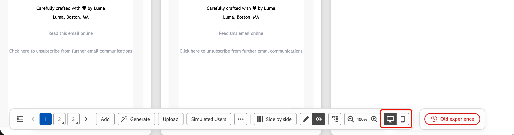

### Validate links {#validate-links}

URLs are automatically validated for each rendered variant. When invalid links are found, a red invalid-links count is displayed next to the link icon on the variant's card.

Click the count to open the **[!UICONTROL URL validation failed]** dialog that lists each invalid **[!UICONTROL URL]** and its **[!UICONTROL Reason]**, such as **[!UICONTROL Malformed URL]**. Review the reason for each link to identify what needs to be corrected in your content.

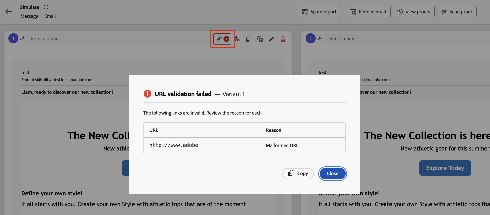

Click **[!UICONTROL Copy]** to copy the validation details, or **[!UICONTROL Close]** to return to the simulation screen.

## Additional capabilities for the Email channel {#email-capabilities}

When simulating email content, a top bar provides additional email-specific tools.

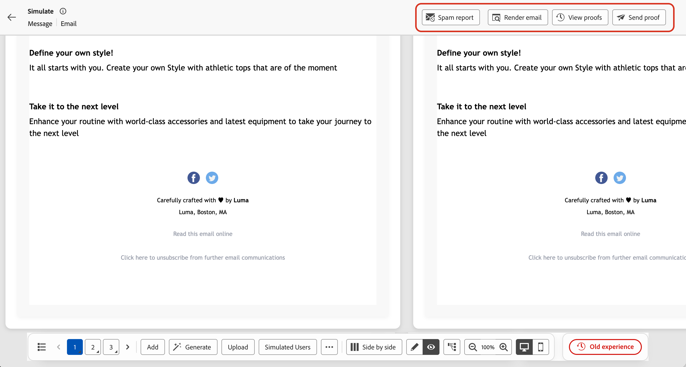

* **[!UICONTROL Spam report]** — Analyze your email content against spam filters and get a deliverability score. [Learn more](../content-management/spam-report.md)
* **[!UICONTROL Render email]** — Preview how your email renders across popular email clients and devices. [Learn more](../content-management/rendering.md)
* **[!UICONTROL Send proof]** — Send a proof of one or more variants to a set of email recipients. Click **[!UICONTROL Send proof]**, add up to 10 recipient addresses, select the variant(s) to include, then click **[!UICONTROL Send proof]** to confirm. To review previously sent proofs, click **[!UICONTROL View proofs]**. [Learn more](../content-management/proofs.md)

>[!NOTE]
>
>The mirror page link is not active in proofs sent for variants. It only activates in the final message. [Learn more](../email/message-tracking.md#mirror-page).

{{$include /help/_includes/do-not-localize/test-approve/ai-augmented-simulate-content-variations.md}}
