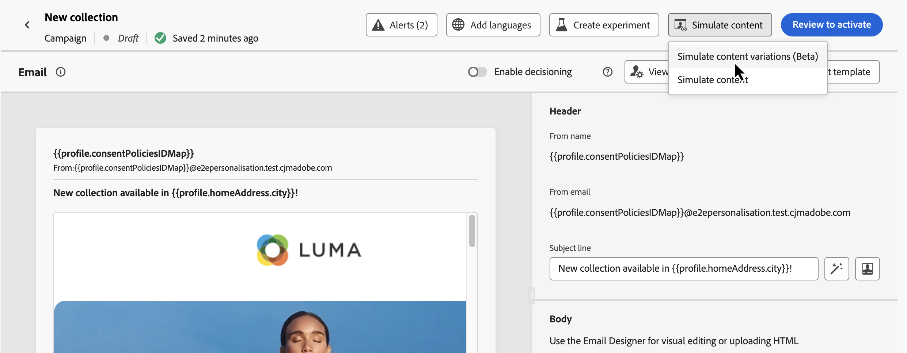
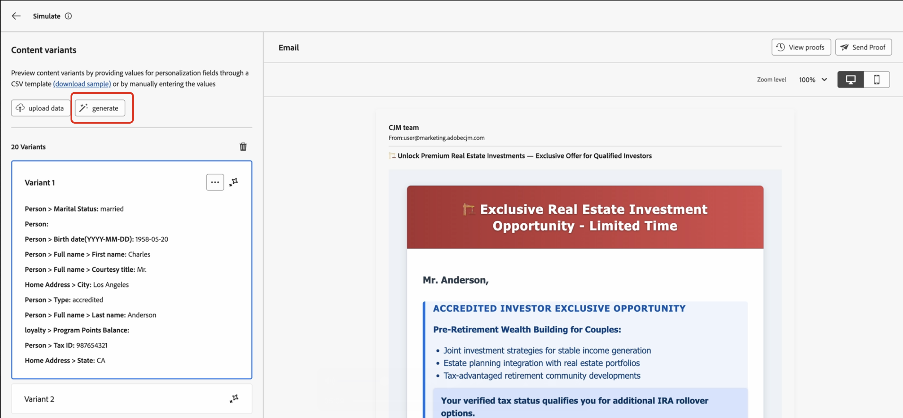

# Auto-generation of content variants (Beta){#auto-generate-variants}

>[!AVAILABILITY]
>
>This feature is currently in **private beta** and may not be available in your environment. Contact your Adobe representative to gain access.

[!DNL Journey Optimizer] introduces AI-based simulation that can automatically generate multiple variants to test your content. This feature reduces the need to manually create variants, making it easier to validate personalization logic across complex templates.

When rendering content for simulation or proofing, the system analyzes your content and identifies all personalization tokens and branching rules. It replaces personalization tokens with meaningful values that provide a near-realistic preview of the final content.

Consider a financial services email template with branching logic based on **investor type**, **age group**, **marital status**, **tax ID verification**, and **location**. Without variants generation, you would need to manually create dozens of variants to validate all paths. With auto-generated variants, the system produces representative variants that automatically cover these conditions.  Each generated variant is rendered in the preview pane, showing exactly which blocks and conditions are applied.

## Generate content variants

To generate variations for your content and preview them, follow these steps:

1. Open your content and select **[!UICONTROL Simulate content]** / **[!UICONTROL Simulate content variations]**.

    
 
2. Click the **[!UICONTROL Generate]** button.

    

3. [!DNL Journey Optimizer] automatically generates variants based on detected attributes.  

4. Review the list of generated variants in the left pane and select a variant to see its personalized rendering in the preview pane.  

>[!NOTE]
>
>This capability works the same way as the standard Simulate content variations feature. For more information on content variations simulations and the associated guardrails and limitations, refer to this section: [Simulate content variations](../test-approve/simulate-sample-input.md) 
