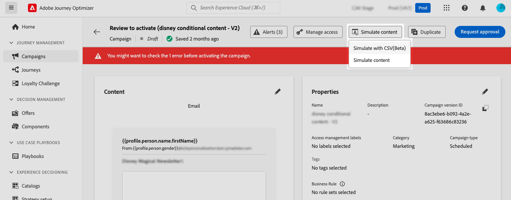
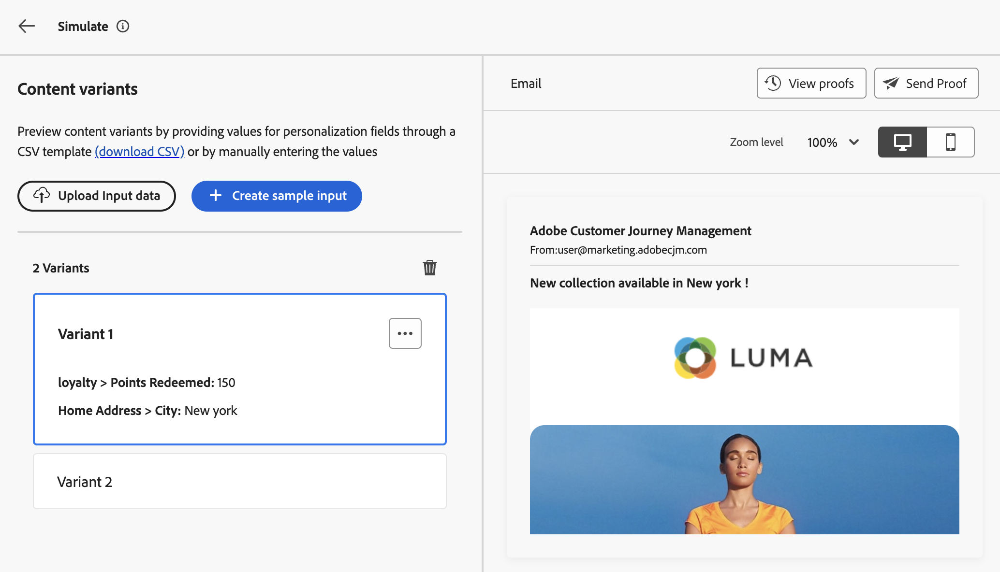

# Test your content using sample input data {#custom-profiles}

>[!CONTEXTUALHELP]
>id="ajo_simulate_sample_profiles"
>title="Simulate using sample input"
>abstract="In this screen, you can test different variants of your email content by providing values for personalization fields through a CSV template (download CSV) or by manually entering the values.

>[!AVAILABILITY]
>
>This features is currently available as a beta to selected users only.

Journey optimizer allows you to test different variants of your email content by previewing it and sending proofs using sample input data uploaded from a CSV file or added manually. All the profiles attributes used in your content for personalization are automatically detected by the system and can be used for your tests to create multiple variants.

To access this experience, click the **[!UICONTROL Simulate content]** button and choose **[!UICONTROL Simulate with CSV(Beta)]**.

The main steps to test your content are as follows:

1. Add up to 30 variants with sample input data, either by uploading a CSV file, or by adding data manually. [Learn how to add variants](#profiles)
1. Check the preview of your content using the different variants. [Learn how to preview your content](#preview)
1. Send up to 10 proofs to email addresses using the different variants. [Learn how to send proofs](#proofs)

## Guardrails & limitations {#limitations}

Before starting testing your content using sample inpuyt data, consider the following guardrails and prerequisites.

* As of now, testing using sample input data is only available for the email channel. The experience cannot be accessed from the "Simulate content" button within the Email Designer.
* The following features are not available in the current experience: Inbox rendering, spam reports, multilingual content and content experiment. To use these features, select the **[!UICONTROL Simulate content]** button from your content to access the previous user interface.
* Only profile attributes are currently supported. If contextual attributes are used in your content for personalization, you won't be able to test your content using these attributes.
* Only the following data types are supported when entering data for your variants : number (integer and decimal), string, boolean and date type. Any other data type will show an error.

not from acrite

## Add variants {#profiles}

You can add up to 30 variants to test your content, either using a CSV file, or manually:

* To upload sample input data from a CSV file, click the **[!UICONTROL download CSV]** link to retrieve a CSV file template. This templates includes a column for each profile attribute used in your content for personalization.

    Fill in the CSV file then click the **[!UICONTROL Upload Input data]** to load it to test your content.

* To add a variant manually, click the **[!UICONTROL Create sample input]** button and fill in the sample input data for the variant. One field displays for each profile attribute used in your content for personalization.

    

Once profiles have been selected, one box appears for each variant on the left side of the screen. You can use these profiles to preview your content and send proofs.

>[!NOTE]
>
>The added variants only serve as testing purposes for your current content. The are not stored within Adobe Experience Platform, but into your user browser session, meaning that they won't display when logging off, or if working from another device.

## Preview your content variants {#preview}

To preview your content using one of the variants, select the relevant box to update the content preview in the right section with the information entered for this variant.

You can remove a variant at anytime using the ellipsis button in the upper-right corner and selecting **[!UICONTROL Remove]**. To edit information for a variant, click the ellipsis button and select **[!UICONTROL Edit]**.

## Send proofs {#proofs}

Journey Optimizer allows you to send proofs to email addresses while impersonating one or multiple variants that you have added in the simulation screen. The steps are as follows:

1. Verify that variants have been added to test your content and click the **[!UICONTROL Send Proof]** button.

1. In the **[!UICONTROL Recipients]** field, enter the email address to which you want to send the proof then click **[!UICONTROL Add]**. Repeat the operation to send the proof to additional email addresses. You can add up to 10 proof recipients.

1. In the bottom section of the screen, select the variant that you want to use in the proof. You can select multiple variants, in which case the email will include as many proofs as selected variants.

    For more information on a variant, select the **[!UICONTROL View profile details]** link. This allows you to display the information entered in the previous screen for the different variants.

    

1. Click the **[!UICONTROL Send Proof]** button to start sending the proof.

1. To track the proof sending, click the **[!UICONTROL View proofs]** button in the simulate content screen.

