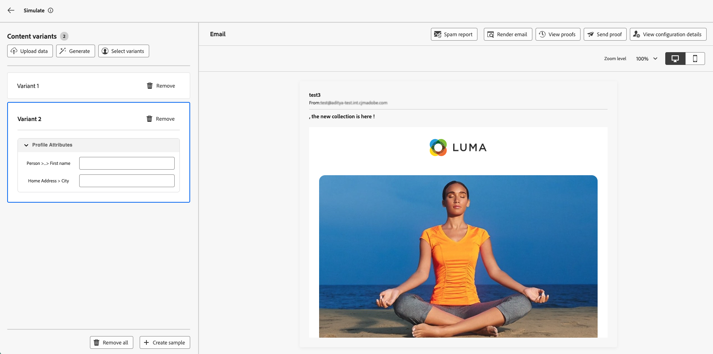
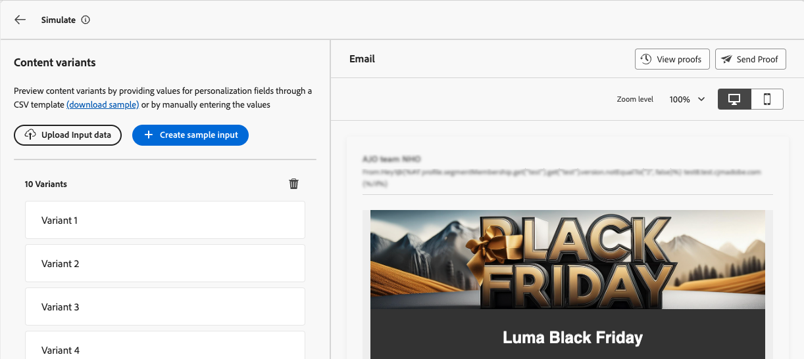
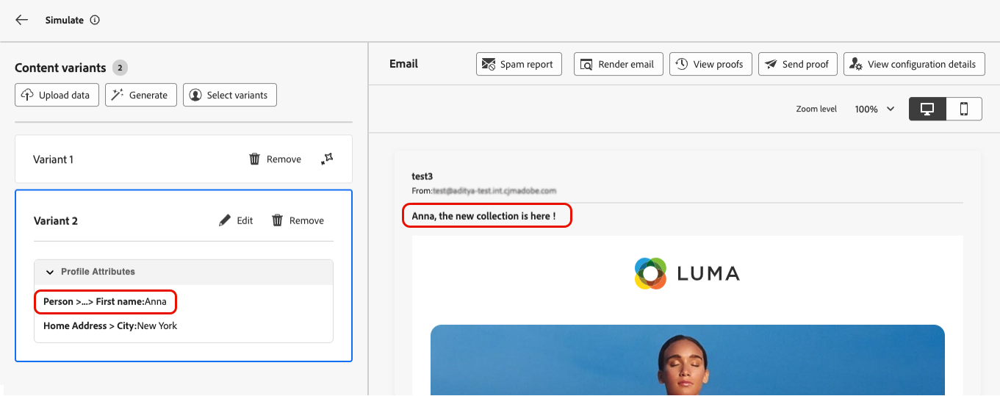
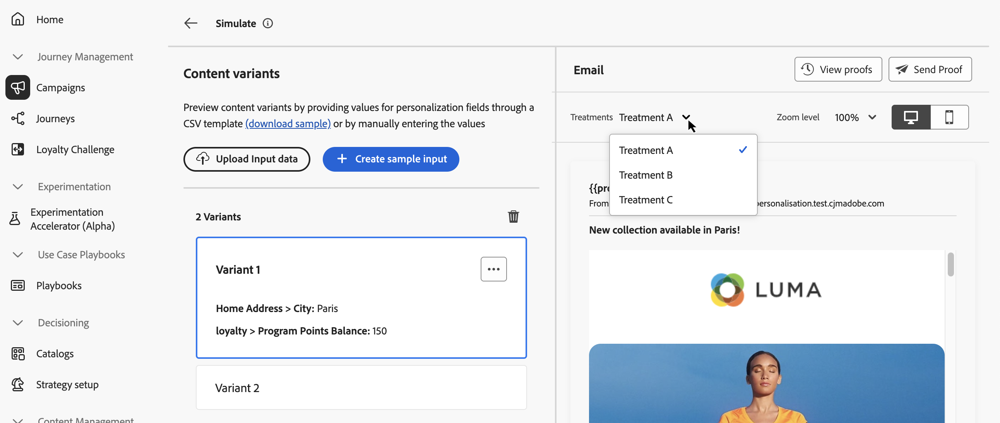
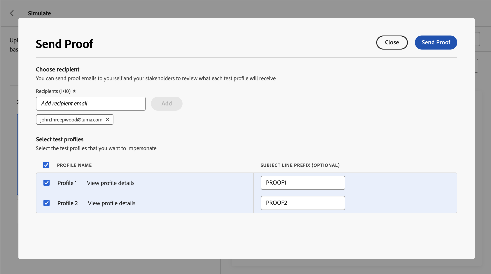
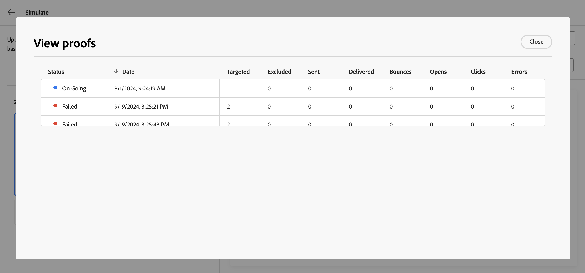

# Simulate content variations {#custom-profiles}

>[!CONTEXTUALHELP]
>id="ajo_simulate_sample_profiles"
>title="Simulate using sample input"
>abstract="In this screen, you can test different variants of your content by providing values for personalization fields through a CSV or JSON template, or by manually entering the values."

Journey optimizer allows you to preview different variations of your content using sample input data uploaded from a CSV or JSON file or added manually.

All the attributes used in your content for personalization are automatically detected by the system and can be used for your tests to create multiple variants. A variant refers to a version of the content with different values for its attributes.

>[!NOTE]
>
>Variants only serve as testing purposes for your current content. They are not stored within Adobe Experience Platform, but into your user browser session, meaning that they won't display when logging off, or when working from another device.

## Guardrails & limitations {#limitations}

Before starting testing your content using sample input data, consider the following guardrails and prerequisites.

* **Channels** - Simulating content variations is available for:

    * the Email, SMS and Push notification channels;
    * all inbound channels (Web, Code-based experience, In-app, Content cards).

* **Supported capabilities** - Content variations can be used with [!DNL Journey Optimizer] multilingual content and content experiment capabilities. This allows you to test messages in multiple languages and optimize content through experimentation.

    You can also leverage content variations to test your content templates.

    >[!NOTE]
    >
    >For now, inbox rendering and spam reports are not available in the current experience. To use these features, select the **[!UICONTROL Simulate content]** button from your content to access the previous user interface.

* **Attributes** - Both profile and contextual attributes are supported.

* **Data types** - Only the following data types are supported when entering data for your variants : number (integer and decimal), string, boolean and date type. Any other data type will show an error.

* **Number of variants** - You can add up to 30 variants to test your content, either using a file, or manually.

## Add and preview content variations

To create variations for your content and preview them, click the **[!UICONTROL Simulate content]** button and choose **[!UICONTROL Simulate content variations]**.


The main steps to test your content are as follows:

1. **Add variants** - Add up to 30 variants with sample input data, either by uploading a file, or by adding data manually. [Learn how to add variants](#profiles)
1. **Preview content variations** - Check the preview of your content using the different variants. [Learn how to preview your content](#preview)
1. **Send email proofs** - For email content, send up to 10 proofs to email addresses using the different variants. [Learn how to send proofs](#proofs)

### Add variants {#profiles}

When accessing the content variations experience, all personalization fields used in your content are automatically detected and displayed in a list of blank variants.

For example, if your email contains two personalization fields "City" and "Program Points Balance", they will appear in the list. Initially, no values are entered, and no personalized content is shown in the preview pane.


To edit the value of a variant:

1. Click the ellipsis button next to the variant.
1. Select **[!UICONTROL Edit]** to provide custom values for each personalization field.
1. The preview pane will update to show how your content renders with the entered values.

To add a new variant:

1. Click the **[!UICONTROL Create sample input]** button.
1. A new blank variant appears, containing all the detected personalization fields.
1. Edit the new variant as needed.



You can also upload a file with predefined variants and values to speed up the process. 

1. Click **[!UICONTROL Download sample]** to download a file template.
1. Choose a file format: CSV, JSON, or JSONLINES.
1. Open the template file and fill in your desired values for each profile attribute. The template includes a column for each profile attribute used in your content for personalization.

    Example JSON syntax:

    ```
    {
    "profile": {
        "attributes": {
        "person": {
            "name": {
                "lastName": "Doe",
                "firstName": "John"
                }
            }
        }
    }
    }
    ```

1. Once your file is ready, click **[!UICONTROL Upload Input Data]** to load it.
1. After uploading, a new variant is added to the list for each entry in the file.

    

Once variants have been added, you can use them to preview your content in the right pane, and to send email proofs.

### Preview content variations {#preview}

To preview your content using a variant, select the relevant variant from the list to update the content in the preview pane with the information entered for this variant.

In the example below, we have added two variants for the email subject line:

|Variant 1 selection|Variant 2 selection|
|----------|-------------|
|||

For multilingual content and experimentation, a dropdown is available to switch between the different language variants or treatments.



You can remove a variant at anytime using the ellipsis button in the upper-right corner and selecting **[!UICONTROL Remove]**. To edit information for a variant, click the ellipsis button and select **[!UICONTROL Edit]**.

### Send proofs {#proofs}

Journey Optimizer allows you to send proofs to email addresses while impersonating one or multiple variants that you have added in the simulation screen. The steps are as follows:

1. Verify that variants have been added to test your content and click the **[!UICONTROL Send Proof]** button.

1. In the **[!UICONTROL Recipients]** field, enter the email address to which you want to send the proof then click **[!UICONTROL Add]**. Repeat the operation to send the proof to additional email addresses. You can add up to 10 proof recipients.

1. In the bottom section of the screen, select the variant that you want to use in the proof. You can select multiple variants, in which case the email will include as many proofs as selected variants.

    For more information on a variant, select the **[!UICONTROL View profile details]** link. This allows you to display the information entered in the previous screen for the different variants.

    

1. Click the **[!UICONTROL Send Proof]** button to start sending the proof.

1. To track the proof sending, click the **[!UICONTROL View proofs]** button in the simulate content screen.


